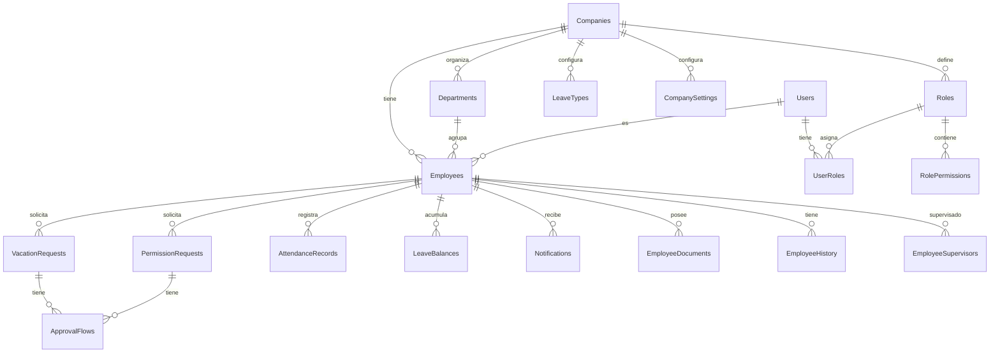
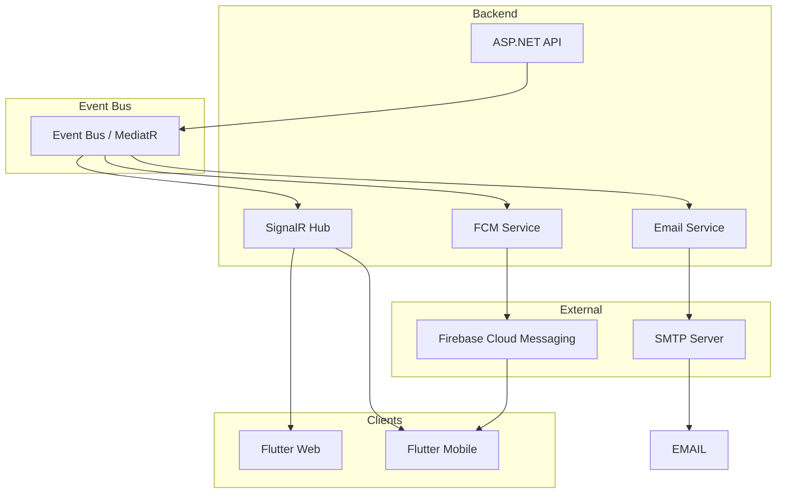
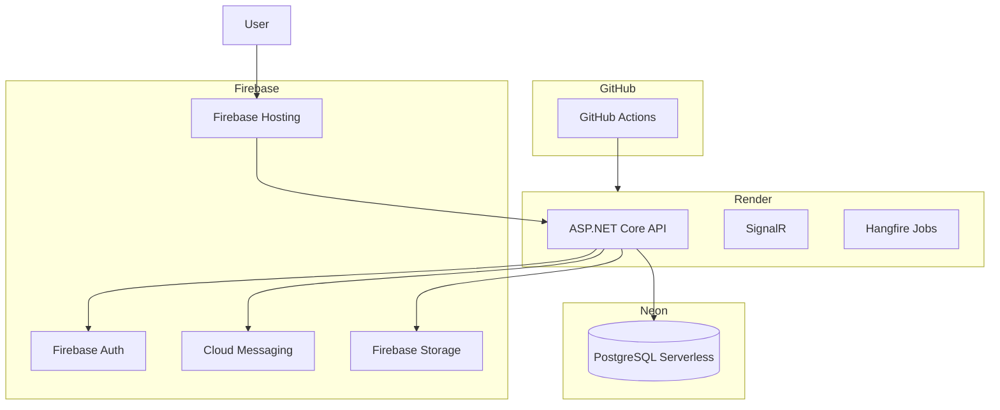

# NEXORA — Plataforma SaaS de Recursos Humanos

**Versión:** 1.0.0
**Estado:** DRAFT — Arquitectura Enterprise
**Última actualización:** Mayo 2026
**Clasificación:** Documento Técnico — Confidencial

---

## Índice

1. [Introducción](#1-introducción)
2. [Visión General del Producto](#2-visión-general-del-producto)
3. [Arquitectura Empresarial](#3-arquitectura-empresarial)
4. [Arquitectura Multiempresa (Multi-Tenant)](#4-arquitectura-multiempresa-multi-tenant)
5. [Módulos Principales](#5-módulos-principales)
6. [Gestión de Vacaciones](#6-gestión-de-vacaciones)
7. [Gestión de Permisos](#7-gestión-de-permisos)
8. [Sistema de Roles y Seguridad](#8-sistema-de-roles-y-seguridad)
9. [Diseño UX/UI](#9-diseño-uxui)
10. [Diseño de Base de Datos](#10-diseño-de-base-de-datos)
11. [APIs REST](#11-apis-rest)
12. [Realtime y Notificaciones](#12-realtime-y-notificaciones)
13. [Hosting y Despliegue](#13-hosting-y-despliegue)
14. [Reportes y Analítica](#14-reportes-y-analítica)
15. [Roadmap del Proyecto](#15-roadmap-del-proyecto)
16. [Monetización SaaS](#16-monetización-saas)
17. [IA y Automatización Futura](#17-ia-y-automatización-futura)
18. [Requisitos Funcionales](#18-requisitos-funcionales)
19. [Requisitos No Funcionales](#19-requisitos-no-funcionales)
20. [DevOps y CI/CD](#20-devops-y-cicd)
21. [Conclusión Técnica](#21-conclusión-técnica)

---

# 1. Introducción

## 1.1 Descripción General

Nexora es una plataforma SaaS moderna de Recursos Humanos (HRM/HRIS) diseñada para digitalizar, automatizar y centralizar la gestión del capital humano en empresas latinoamericanas. Construida con una arquitectura cloud-native multiempresa, Nexora ofrece un conjunto completo de herramientas que abarcan desde el control de asistencia hasta la gestión de vacaciones, permisos, reportes y un portal de autoservicio para empleados.

La plataforma está diseñada bajo los principios de **Clean Architecture**, **Domain-Driven Design (DDD)** y **Arquitectura Multi-Tenant**, garantizando escalabilidad, mantenibilidad y aislamiento de datos entre organizaciones.

## 1.2 Problema que Resuelve

| Problema | Impacto | Solución Nexora |
|---|---|---|
| Control manual en Excel | Errores, pérdida de datos, nula trazabilidad | Base de datos centralizada con auditoría completa |
| Desorden administrativo | Procesos lentos, duplicidad de esfuerzos | Flujos automatizados con aprobaciones jerárquicas |
| Gestión caótica de vacaciones | Conflictos legales, empleados sin descanso | Cálculo automático de saldos, solicitudes y aprobaciones |
| Falta de trazabilidad | Decisiones sin respaldo documental | Auditoría granular de todas las acciones del sistema |
| Aprobaciones lentas | Cuellos de botella operativos | Flujos de aprobación digitales con notificaciones push |
| Ausentismo no controlado | Pérdida de productividad | Dashboard de métricas, alertas y reportes automáticos |
| Procesos no centralizados | Información dispersa en correos, WhatsApp, papel | Portal único para empleados, supervisores y RRHH |

## 1.3 Objetivos

- **Inmediatos:** Digitalizar la gestión de empleados, vacaciones, permisos y asistencia.
- **Tácticos:** Implementar un sistema de aprobaciones jerárquicas, dashboard administrativo y reportes.
- **Estratégicos:** Evolucionar hacia nómina integrada, reclutamiento, analítica predictiva e IA empresarial.

## 1.4 Público Objetivo

- **Segmento primario:** PYMES, comercios, tiendas, distribuidoras en Nicaragua y Centroamérica (10–500 empleados).
- **Segmento secundario:** Empresas medianas en expansión (500–2000 empleados) que requieren RRHH digital.
- **Segmento terciario:** Corporaciones multi-sucursal con operaciones distribuidas.

## 1.5 Alcance

### Incluido en MVP

- Gestión de empleados (altas, bajas, modificaciones)
- Control de vacaciones (cálculo automático, solicitudes, aprobaciones)
- Gestión de permisos (enfermedad, personales, maternidad, paternidad)
- Asistencia básica (marcaje manual y registro)
- Dashboard administrativo con KPIs
- Reportes exportables (PDF, Excel)
- Portal del empleado (autoservicio)
- Roles y permisos (Super Admin, Admin Empresa, RRHH, Supervisor, Empleado)
- Notificaciones push y correo electrónico
- Autenticación con Firebase
- Multiempresa con aislamiento de datos

### Excluido del MVP (posterior)

- Nómina y cálculo de salarios
- Reclutamiento y selección
- Módulo biométrico (huella, rostro)
- OCR para documentos
- Chatbot con IA
- Analítica predictiva de ausentismo
- Integración con bancos y gobierno

---

# 2. Visión General del Producto

## 2.1 Misión

Empoderar a las empresas latinoamericanas con herramientas modernas de gestión de capital humano que eliminen el papel, automaticen procesos y liberen tiempo para lo que realmente importa: las personas.

## 2.2 Visión

Convertirse en la plataforma HRIS líder en Centroamérica, reconocida por su facilidad de uso, inteligencia integrada y capacidad de adaptación a las regulaciones laborales locales.

## 2.3 Propuesta de Valor

> **\"Tu departamento de RRHH en la nube, sin complicaciones, sin Excel, sin papel.\"**

Nexora ofrece una experiencia SaaS moderna que combina la potencia de una plataforma enterprise con la simplicidad de uso de una app consumer-grade.

## 2.4 Diferenciadores

| Diferenciador | Descripción |
|---|---|
| **Diseño moderno** | UX/UI inspirado en Notion, Linear y BambooHR — minimalista, intuitivo, responsive |
| **Multiempresa real** | Aislamiento completo de datos por tenant con escalabilidad horizontal |
| **Mobile-first** | Experiencia completa en Flutter Web, Android e iOS con diseño adaptable |
| **Sin límite de empleados** | Escalabilidad horizontal desde 5 hasta 5000+ empleados |
| **Aprobaciones jerárquicas** | Flujos de aprobación configurables por tipo de solicitud |
| **Notificaciones en tiempo real** | SignalR + FCM para actualizaciones instantáneas |
| **Preparado para IA** | Arquitectura de datos lista para modelos predictivos, OCR y procesamiento de lenguaje natural |

## 2.5 Beneficios Empresariales

- **80% menos tiempo** en gestión administrativa de vacaciones y permisos
- **100% trazabilidad** de todas las acciones del sistema
- **Reducción del ausentismo** mediante alertas tempranas y dashboards
- **Cumplimiento legal** con cálculos automáticos basados en legislación laboral
- **Portal de autoservicio** que empodera al empleado y libera a RRHH
- **Toma de decisiones basada en datos** con reportes y KPIs en tiempo real

---

# 3. Arquitectura Empresarial

## 3.1 Diagrama General de Arquitectura

\\\mermaid
graph TB
    subgraph \"Client Layer\"
        FW[Flutter Web]
        FA[Flutter Android]
        FI[Flutter iOS]
    end

    subgraph \"CDN / Hosting\"
        FH[Firebase Hosting]
    end

    subgraph \"API Gateway Layer\"
        API[ASP.NET Core Web API]
        SIG[SignalR Hub]
    end

    subgraph \"Service Layer\"
        AUTH[Auth Service]
        EMP[Employee Service]
        VAC[Vacation Service]
        PER[Permission Service]
        ATT[Attendance Service]
        DASH[Dashboard Service]
        REP[Report Service]
        NOT[Notification Service]
        AUD[Audit Service]
    end

    subgraph \"Data Access Layer\"
        EF[Entity Framework Core]
        REPO[Repository Pattern]
    end

    subgraph \"Database\"
        PG[(Neon PostgreSQL)]
        FIRE[(Firebase Auth)]
        FCM[(FCM)]
    end

    FW --> FH
    FA --> API
    FI --> API
    FH --> API

    API --> AUTH
    API --> EMP
    API --> VAC
    API --> PER
    API --> ATT
    API --> DASH
    API --> REP
    API --> NOT
    API --> AUD

    SIG --> NOT

    AUTH --> EF
    EMP --> EF
    VAC --> EF
    PER --> EF
    ATT --> EF
    DASH --> EF
    REP --> EF
    NOT --> EF
    AUD --> EF

    EF --> REPO
    REPO --> PG

    AUTH --> FIRE
    NOT --> FCM
\\\

## 3.2 Frontend — Flutter

### 3.2.1 Flutter Web

- **Framework:** Flutter 3.x estable con soporte WebAssembly (WASM)
- **Hosting:** Firebase Hosting con CDN global
- **Routing:** GoRouter con protección de rutas basada en roles
- **State Management:** Riverpod 2.x con patrón Provider
- **HTTP Client:** Dio con interceptors para JWT, retry y logging
- **Responsive:** LayoutBuilder, MediaQuery y breakpoints personalizados
- **Internacionalización:** Flutter Localizations (es-ES, es-CR, ni-NI)
- **Tema:** Soporte completo de Light/Dark mode con ThemeData dinámico

### 3.2.2 Flutter Mobile (Android / iOS)

- **Compilación nativa:** Android APK/AAB, iOS IPA
- **Push Notifications:** Firebase Cloud Messaging con flutter_local_notifications
- **Offline First:** SQLite local (drift/sqflite) con sincronización diferida
- **Biometría:** Fingerprint / FaceID para acceso rápido
- **Deep Links:** Universal Links (iOS) + App Links (Android)
- **Cámara:** Captura de documentos para permisos (image_picker)
- **Actualización forzada:** in_app_update + upgrader

### 3.2.3 Responsive Design — Breakpoints

| Breakpoint | Ancho | Dispositivo |
|---|---|---|
| xs | \< 576px | Teléfonos pequeños |
| sm | 576px–768px | Teléfonos grandes / Tablets pequeños |
| md | 768px–992px | Tablets |
| lg | 992px–1200px | Laptops / Escritorios pequeños |
| xl | \> 1200px | Escritorios grandes |

## 3.3 Backend — ASP.NET Core Web API

### 3.3.1 Versión y Configuración

- **Runtime:** .NET 9 (LTS)
- **Template:** ASP.NET Core Web API con controladores
- **Puerto:** 8080 (Render), 5000/5001 (local)
- **Formato:** JSON con System.Text.Json (camelCase)
- **OpenAPI:** Swashbuckle + Swagger UI
- **CORS:** Política restrictiva por tenant + origen
- **Rate Limiting:** FixedWindowPolicy (100 req/min por usuario)

### 3.3.2 Estructura de Clean Architecture

\\\
Nexora.sln
├── Nexora.Core                // Domain layer
│   ├── Entities
│   ├── ValueObjects
│   ├── Aggregates
│   ├── Enums
│   ├── Interfaces
│   └── Exceptions
├── Nexora.Application         // Use cases
│   ├── DTOs
│   ├── Mappings (AutoMapper)
│   ├── Interfaces
│   ├── Services
│   ├── Validators (FluentValidation)
│   └── Behaviors (MediatR)
├── Nexora.Infrastructure      // Persistence + External
│   ├── Data (DbContext, Migrations)
│   ├── Repositories
│   ├── Identity (Firebase)
│   ├── Notifications (FCM, Email)
│   ├── FileStorage
│   └── SignalR
└── Nexora.Web                 // Presentation / API
    ├── Controllers
    ├── Middleware
    ├── Hubs
    ├── Filters
    └── Extensions
\\\

### 3.3.3 Paquetes NuGet Principales

| Paquete | Versión | Propósito |
|---|---|---|
| MediatR | 12.x | CQRS + Pipeline Behaviors |
| FluentValidation | 11.x | Validación de DTOs |
| AutoMapper | 13.x | Mapeo Entity ↔ DTO |
| EF Core | 9.x | ORM con PostgreSQL |
| Npgsql.EntityFrameworkCore.PostgreSQL | 9.x | Provider PostgreSQL |
| FirebaseAdmin | 3.x | Auth + FCM |
| Microsoft.AspNetCore.SignalR | — | WebSockets en tiempo real |
| Serilog | 4.x | Logging estructurado |
| Swashbuckle.AspNetCore | 7.x | OpenAPI / Swagger |
| Microsoft.AspNetCore.Authentication.JwtBearer | — | Validación JWT |

## 3.4 Arquitectura de Seguridad

\\\mermaid
sequenceDiagram
    participant C as Flutter Client
    participant FA as Firebase Auth
    participant API as .NET API
    participant JWT as JWT Middleware
    participant DB as PostgreSQL

    C->>FA: Login (email/password)
    FA->>C: Firebase idToken
    C->>API: POST /auth/login {idToken}
    API->>FA: Verify idToken (Firebase Admin)
    FA->>API: uid, email, claims
    API->>API: Generate JWT (access + refresh)
    API->>C: {accessToken, refreshToken, user}
    Note over C,API: Subsequent requests
    C->>API: GET /employees (Bearer JWT)
    API->>JWT: Validate JWT
    JWT->>JWT: Extract tenant_id, role, permissions
    API->>DB: Query with tenant filter
    DB->>API: Scoped data
    API->>C: JSON response
\\\

### 3.4.1 Claims del JWT

\\\json
{
  \"sub\": \"firebase_uid\",
  \"email\": \"admin@empresa.com\",
  \"tenant_id\": \"ten_abc123\",
  \"role\": \"company_admin\",
  \"permissions\": [\"employee.create\", \"vacation.approve\"],
  \"iat\": 1717000000,
  \"exp\": 1717003600
}
\\\

## 3.5 Escalabilidad

| Estrategia | Descripción | Cuándo usarla |
|---|---|---|
| **Shared Database** | Una BD con tenant_id en cada tabla | MVP hasta 100 empresas |
| **Shared + Schema** | Esquemas por tenant con tablas compartidas | 100–500 empresas |
| **Database per Tenant** | BD independiente por cliente | 500+ empresas enterprise |

---

# 4. Arquitectura Multiempresa (Multi-Tenant)

## 4.1 Modelo de Aislamiento

Nexora utiliza el modelo **Shared Database + Shared Schema** para el MVP, con la columna 	enant_id en cada tabla como clave de partición lógica.

\\\
Neon PostgreSQL
│
└── nexora_db
    ├── tenant: empresa_a (tenant_id = 'ten_001')
    ├── tenant: empresa_b (tenant_id = 'ten_002')
    └── tenant: empresa_c (tenant_id = 'ten_003')
\\\

## 4.2 Implementación con Entity Framework Core

\\\csharp
public class BaseEntity
{
    public Guid Id { get; set; }
    public string TenantId { get; set; } = string.Empty;
    public DateTime CreatedAt { get; set; }
    public string CreatedBy { get; set; } = string.Empty;
    public DateTime? UpdatedAt { get; set; }
    public string? UpdatedBy { get; set; }
    public bool IsDeleted { get; set; }
}

public class NexoraDbContext : DbContext
{
    private readonly ITenantContext _tenantContext;

    protected override void OnModelCreating(ModelBuilder builder)
    {
        builder.Entity<Employee>().HasQueryFilter(e => e.TenantId == _tenantContext.TenantId);
        builder.Entity<VacationRequest>().HasQueryFilter(v => v.TenantId == _tenantContext.TenantId);
    }

    public override int SaveChanges()
    {
        foreach (var entry in ChangeTracker.Entries<BaseEntity>())
        {
            if (entry.State == EntityState.Added)
                entry.Entity.TenantId = _tenantContext.TenantId;
        }
        return base.SaveChanges();
    }
}
\\\

## 4.3 SQL — Consultas Multiempresa

\\\sql
-- Índices obligatorios para performance multiempresa
CREATE INDEX idx_employees_tenant_id ON employees (tenant_id);
CREATE INDEX idx_employees_tenant_department ON employees (tenant_id, department_id);
CREATE INDEX idx_vacations_tenant_status ON vacation_requests (tenant_id, status);

-- RLS para aislamiento extra
ALTER TABLE employees ENABLE ROW LEVEL SECURITY;
CREATE POLICY tenant_isolation ON employees
    USING (tenant_id = current_setting('app.tenant_id')::text);
\\\

## 4.4 Seguridad Multiempresa

- **Query Filters globales** en EF Core: toda consulta incluye WHERE tenant_id = @tenantId
- **Validación en API**: el JWT contiene 	enant_id inyectado por middleware
- **Prohibición de cross-tenant**: ningún endpoint accede a datos de otro tenant
- **Logs de auditoría**: cada registro incluye 	enant_id para trazabilidad forense

---

# 5. Módulos Principales

## 5.1 Gestión de Empleados

### 5.1.1 Funcionalidades

- **Alta de empleado** con datos personales, laborales, fiscales y de contacto
- **Edición masiva** (cambios de departamento, salario, supervisor)
- **Baja lógica** con fecha efectiva, motivo y documento soporte
- **Historial laboral** completo (cambios de puesto, salario, departamento)
- **Documentos** (cédula, CV, constancias) — hasta 10MB por archivo
- **Exportación** a Excel, CSV, PDF
- **Importación** masiva desde Excel/CSV con validación previa

### 5.1.2 Reglas de Negocio

- Un empleado debe tener un **correo electrónico único** dentro del mismo tenant
- El **supervisor** debe ser un empleado activo dentro del mismo tenant
- No se puede eliminar un empleado con solicitudes **pendientes**
- La **fecha de ingreso** no puede ser futura
- Un empleado no puede ser supervisor de sí mismo

### 5.1.3 Estados del Empleado

\\\mermaid
stateDiagram-v2
    [*] --> Active : Alta
    Active --> Suspended : Suspensión
    Active --> Terminated : Baja
    Suspended --> Active : Reincorporación
    Suspended --> Terminated : Baja definitiva
    Terminated --> [*]
\\\

## 5.2 Asistencia

### 5.2.1 Funcionalidades

- **Marcaje manual** desde web y móvil (geolocalizado)
- **Marcaje por código QR** en terminales físicos
- **Registro de entrada, salida, pausa y reingreso**
- **Historial diario** con edición justificada por RRHH
- **Alertas** de retardos y ausencias
- **Reporte semanal/mensual** de horas por empleado

### 5.2.2 Estados de Asistencia

| Estado | Descripción |
|---|---|
| on_time | Entrada dentro del horario + tolerancia |
| late | Entrada después de la tolerancia |
| absent | Sin registro en el día |
| justified | Ausencia justificada (permiso aprobado) |
| on_leave | Vacaciones o permiso largo |

## 5.3 Dashboard

### 5.3.1 KPIs del Dashboard

| KPI | Descripción | Fórmula |
|---|---|---|
| Headcount | Total de empleados activos | COUNT(employees WHERE active) |
| Tasa de ausentismo | % de ausencias no justificadas | (ausencias / días laborales) * 100 |
| Vacaciones pendientes | Solicitudes en estado pendiente | COUNT(vacations WHERE pending) |
| Permisos activos | Empleados actualmente de permiso | COUNT(permissions WHERE active today) |
| Rotación mensual | % de empleados que se fueron | (bajas del mes / headcount) * 100 |

## 5.4 Portal del Empleado

### 5.4.1 Funcionalidades

- **Ver perfil**: datos personales, laborales, documentos
- **Solicitar vacaciones**: con cálculo automático de días disponibles
- **Solicitar permisos**: con selección de tipo y adjunto
- **Ver historial**: solicitudes pasadas con estados
- **Calendario**: vista de vacaciones y permisos del equipo
- **Marcar asistencia**: desde web o móvil
- **Recibir notificaciones**: aprobaciones, rechazos, recordatorios
- **Descargar constancias**: carta laboral, constancia de ingresos

## 5.5 Configuración Empresarial

| Parámetro | Tipo | Descripción |
|---|---|---|
| vacation_days_per_year | int | Días de vacaciones por año (ej: 15) |
| vacation_accrual | enum | monthly, biweekly, yearly |
| late_tolerance_minutes | int | Minutos de tolerancia para retardos |
| approval_chain | json | Configuración de flujos de aprobación |
| working_hours | json | Horario laboral por defecto |
| timezone | string | Zona horaria de la empresa |
| currency | string | Moneda local |
| date_format | string | Formato de fecha regional |

---

# 6. Gestión de Vacaciones

## 6.1 Objetivo

Automatizar todo el ciclo de vida de las vacaciones: acumulación de días, solicitudes, aprobaciones, registro histórico y liquidación.

## 6.2 Funcionalidades

- **Acumulación automática** de días según reglas configurables
- **Vacaciones proporcionales** para empleados con menos de un año
- **Vacaciones adelantadas** (consumo de días futuros con aprobación especial)
- **Solicitudes** con selección de fechas, comentario y adjuntos
- **Aprobaciones jerárquicas** (supervisor → RRHH → Admin)
- **Calendario de vacaciones** interactivo por equipo y empresa
- **Historial completo** de solicitudes por empleado
- **Liquidación de vacaciones** al momento de la baja

## 6.3 Reglas de Negocio

### 6.3.1 Acumulación de Días

\\\sql
CREATE OR REPLACE FUNCTION calculate_accrued_vacation(
    p_hire_date DATE, p_target_date DATE
) RETURNS DECIMAL AS 
DECLARE
    v_months INTEGER;
    v_days_per_year INTEGER := 15;
BEGIN
    v_months := EXTRACT(YEAR FROM age(p_target_date, p_hire_date)) * 12
              + EXTRACT(MONTH FROM age(p_target_date, p_hire_date));
    IF v_months > 24 THEN v_months := 24; END IF;
    RETURN ROUND((v_days_per_year::DECIMAL / 12) * v_months, 2);
END;
 LANGUAGE plpgsql;
\\\

### 6.3.2 Validaciones

- El empleado debe tener **saldo suficiente** de días disponibles
- Las vacaciones no pueden exceder el saldo disponible
- No se pueden solicitar vacaciones en fechas pasadas
- El período mínimo de vacaciones es 1 día
- No pueden coincidir dos empleados del mismo equipo en más del 30% simultáneamente
- Las vacaciones no se pueden cancelar si ya fueron aprobadas y están a menos de 48 horas

## 6.4 Flujo de Vacaciones

\\\mermaid
sequenceDiagram
    participant E as Empleado
    participant P as Portal
    participant S as Supervisor
    participant R as RRHH
    participant DB as BD

    E->>P: Solicitar vacaciones
    P->>P: Validar saldo y fechas
    P->>DB: Guardar (status: pending)
    P->>S: Notificar

    alt Aprobar Supervisor
        S->>P: Aprobar
        P->>DB: Status: pending_rrhh
        P->>R: Notificar
    else Rechazar
        S->>P: Rechazar
        P->>DB: Status: rejected
        P->>E: Notificar rechazo
    end

    alt Aprobar RRHH
        R->>P: Aprobar
        P->>DB: Status: approved, descontar saldo
        P->>E: Notificar aprobación
    else Rechazar
        R->>P: Rechazar
        P->>DB: Status: rejected
        P->>E: Notificar rechazo
    end
\\\

## 6.5 Estados de Vacaciones

| Estado | Descripción |
|---|---|
| draft | Solicitud en borrador |
| pending | Pendiente de aprobación del supervisor |
| pending_rrhh | Aprobada por supervisor, pendiente de RRHH |
| approved | Aprobada por todos los niveles |
| rejected | Rechazada |
| cancelled | Cancelada por el empleado |
| in_progress | Empleado actualmente de vacaciones |
| taken | Vacaciones completadas |
| liquidated | Liquidada al momento de la baja |

## 6.6 Ejemplo Empresarial Real

> **Escenario:** María trabaja en \"Distribuidora XYZ\" desde el 15 de marzo de 2025. La empresa otorga 15 días de vacaciones por año (Ley Nicaragua).
>
> - Julio 2025: María ha acumulado 5.5 días. Solicita 3 días. Saldo restante: 2.5 días.
> - Diciembre 2025: María ha acumulado 11.25 días. Solicita 7 días para Navidad. El sistema verifica que ningún miembro del equipo esté de vacaciones en el mismo período. La solicitud se envía a su supervisora, quien la aprueba.

---

# 7. Gestión de Permisos

## 7.1 Tipos de Permisos

| Código | Nombre | Pagado | Adjunto | Aprobación | Límite |
|---|---|---|---|---|---|
| SICK | Enfermedad | Sí | Sí (certificado) | Sí | 3 días sin certificado |
| MATERNITY | Maternidad | Sí | Sí | No | 12 semanas |
| PATERNITY | Paternidad | Sí | No | Sí | 5 días hábiles |
| PERSONAL | Permiso personal | Sí | No | Sí | 2 días/mes |
| MARRIAGE | Matrimonio | Sí | Sí | Sí | 5 días hábiles |
| BEREAVEMENT | Fallecimiento | Sí | No | Sí | 3 días hábiles |
| STUDY | Estudio/examen | Sí | Sí | Sí | 1 día/examen |
| MEDICAL_APPT | Cita médica | Sí | No | Sí | medio día |
| UNPAID | Sin goce | No | No | Sí | 30 días/año |
| SUBSIDY | Subsidio | Sí | Sí | Sí | Según INSS |

## 7.2 Reglas de Negocio

- Hasta 3 días de enfermedad: no requiere certificado; más de 3: obligatorio
- Maternidad (Nicaragua): 12 semanas automáticas, 100% salario
- Paternidad: 5 días hábiles, dentro de 15 días posteriores al nacimiento
- Personales: máximo 2 días por mes calendario, no acumulables
- Sin goce: máximo 30 días por año, requiere aprobación Admin

## 7.3 Flujo de Permisos

\\\mermaid
flowchart TD
    A[Empleado solicita permiso] --> B{¿Requiere adjunto?}
    B -->|Sí| C[Subir documento]
    B -->|No| D[Continuar]
    C --> D
    D --> E{¿Requiere aprobación?}
    E -->|No| F[Registro automático]
    E -->|Sí| G[Notificar supervisor]
    G --> H{Supervisor aprueba?}
    H -->|Sí| I{¿Requiere RRHH?}
    H -->|No| J[Notificar rechazo]
    I -->|Sí| K[Notificar RRHH]
    I -->|No| L[Aprobado]
    K --> M{RRHH aprueba?}
    M -->|Sí| L
    M -->|No| J
    L --> N[Actualizar saldo si aplica]
    N --> O[Notificar aprobación]
\\\

## 7.4 Consideraciones Legales por País

| País | Vacaciones | Maternidad | Paternidad |
|---|---|---|---|
| Nicaragua | 15 días | 12 semanas | 5 días |
| Costa Rica | 15 días + 1 c/50 semanas | 4 meses | 5 días |
| Guatemala | 15 días | 84 días | 2 días |
| Honduras | 20 días (crece) | 12 semanas | 5 días |
| El Salvador | 15 días | 12 semanas | 5 días |

---

# 8. Sistema de Roles y Seguridad

## 8.1 Matriz de Roles y Permisos

| Permiso | Super Admin | Admin Empresa | RRHH | Supervisor | Empleado |
|---|---|---|---|---|---|
| tenant.configure | ✅ | ✅ | ❌ | ❌ | ❌ |
| employee.create | ✅ | ✅ | ✅ | ❌ | ❌ |
| employee.read | ✅ | ✅ | ✅ | ✅ (equipo) | ✅ (sí mismo) |
| employee.update | ✅ | ✅ | ✅ | ❌ | ❌ |
| employee.delete | ✅ | ✅ | ❌ | ❌ | ❌ |
| vacation.request | ✅ | ✅ | ✅ | ✅ | ✅ |
| vacation.approve | ✅ | ✅ | ✅ | ✅ (equipo) | ❌ |
| vacation.reject | ✅ | ✅ | ✅ | ✅ (equipo) | ❌ |
| permission.request | ✅ | ✅ | ✅ | ✅ | ✅ |
| permission.approve | ✅ | ✅ | ✅ | ✅ (equipo) | ❌ |
| attendance.mark | ✅ | ✅ | ✅ | ✅ | ✅ |
| attendance.edit | ✅ | ✅ | ✅ | ❌ | ❌ |
| report.view | ✅ | ✅ | ✅ | ✅ (equipo) | ❌ |
| report.export | ✅ | ✅ | ✅ | ❌ | ❌ |
| audit.view | ✅ | ✅ | ✅ | ❌ | ❌ |
| company.configure | ✅ | ✅ | ❌ | ❌ | ❌ |
| user.manage | ✅ | ✅ | ✅ | ❌ | ❌ |

## 8.2 Jerarquía de Aprobación

\\\
Super Admin → Admin Empresa → RRHH → Supervisor → Empleado
\\\

## 8.3 Seguridad API

### 8.3.1 Headers Requeridos

\\\
Authorization: Bearer \<accessToken\>
X-Tenant-Id: \<tenant_id\>
X-Request-Id: \<correlation_id\>
\\\

### 8.3.2 Rate Limiting

| Endpoint | Límite | Ventana |
|---|---|---|
| /api/auth/* | 10 requests | 1 minuto |
| /api/* (general) | 100 requests | 1 minuto |
| /api/reports/export | 5 requests | 1 hora |

### 8.3.3 Políticas de Seguridad

- HTTPS obligatorio en todos los entornos
- CORS configurado solo para el dominio de la aplicación
- SQL Injection prevenido por EF Core parameterized queries
- Password: mínimo 8 caracteres, mayúscula, número, símbolo
- Account Lockout: 5 intentos fallidos → bloqueo 15 minutos
- Session: JWT 1 hora, refresh token 7 días

---

# 9. Diseño UX/UI

## 9.1 Filosofía de Diseño

> **\"Simplicidad profesional. Cada interacción debe sentirse natural, cada pantalla debe ser obvia.\"**

Inspirado en Notion, Linear, BambooHR y Slack.

## 9.2 Paleta de Colores

| Variable | Light | Dark | Uso |
|---|---|---|---|
| --color-primary | #4F46E5 | #818CF8 | Acciones principales |
| --color-surface | #FFFFFF | #1E1E2E | Fondos de tarjetas |
| --color-background | #F8FAFC | #0F0F1A | Fondo de pantalla |
| --color-text | #1E293B | #E2E8F0 | Texto principal |
| --color-success | #10B981 | #34D399 | Aprobado |
| --color-warning | #F59E0B | #FBBF24 | Pendiente |
| --color-error | #EF4444 | #F87171 | Rechazado |

## 9.3 Tipografía

- **Principal:** Inter (sans-serif), weights 400, 500, 600, 700
- **Mono:** JetBrains Mono — datos tabulares e IDs
- h1: 32px/700, h2: 24px/600, h3: 18px/600, body: 14px/400, label: 12px/600

## 9.4 Navegación

### Desktop
- Sidebar lateral colapsable con iconos + labels
- Command Palette (Cmd+K) para búsqueda y acciones rápidas
- Top bar con búsqueda global, notificaciones y perfil

### Mobile
- Bottom Navigation Bar con 5 tabs principales
- Bottom sheets para acciones contextuales
- Gestos swipe para navegación entre pantallas

## 9.5 Dark Mode

- Detección automática del sistema operativo
- Sobrescritura manual (Light / Dark / System)
- Persistencia en SharedPreferences
- Transiciones suaves con AnimatedTheme (300ms)
---

# 10. Diseño de Base de Datos

## 10.1 Diagrama Entidad-Relación



## 10.2 Tablas Principales

### Companies

```sql
CREATE TABLE companies (
    id UUID PRIMARY KEY DEFAULT gen_random_uuid(),
    tenant_id VARCHAR(50) NOT NULL UNIQUE,
    legal_name VARCHAR(255) NOT NULL,
    commercial_name VARCHAR(255),
    tax_id VARCHAR(50),
    email VARCHAR(255),
    phone VARCHAR(50),
    country VARCHAR(100) DEFAULT 'Nicaragua',
    currency VARCHAR(3) DEFAULT 'NIO',
    timezone VARCHAR(50) DEFAULT 'America/Managua',
    is_active BOOLEAN DEFAULT true,
    subscription_plan VARCHAR(50) DEFAULT 'starter',
    max_employees INT DEFAULT 50,
    created_at TIMESTAMPTZ DEFAULT NOW()
);
```

### Employees

```sql
CREATE TABLE employees (
    id UUID PRIMARY KEY DEFAULT gen_random_uuid(),
    tenant_id VARCHAR(50) NOT NULL,
    user_id UUID REFERENCES users(id),
    employee_code VARCHAR(50),
    first_name VARCHAR(100) NOT NULL,
    last_name VARCHAR(100) NOT NULL,
    email VARCHAR(255) NOT NULL,
    phone VARCHAR(50),
    date_of_birth DATE,
    gender VARCHAR(20),
    identification_type VARCHAR(50),
    identification_number VARCHAR(100),
    department_id UUID REFERENCES departments(id),
    position VARCHAR(255),
    hire_date DATE NOT NULL,
    termination_date DATE,
    termination_reason TEXT,
    salary DECIMAL(18,2),
    salary_type VARCHAR(20) DEFAULT 'monthly',
    status VARCHAR(20) DEFAULT 'active',
    is_deleted BOOLEAN DEFAULT false,
    created_at TIMESTAMPTZ DEFAULT NOW()
);
CREATE INDEX idx_employees_tenant ON employees (tenant_id) WHERE is_deleted = false;
CREATE INDEX idx_employees_department ON employees (tenant_id, department_id);
CREATE INDEX idx_employees_email ON employees (tenant_id, email);
```

### Departments

```sql
CREATE TABLE departments (
    id UUID PRIMARY KEY DEFAULT gen_random_uuid(),
    tenant_id VARCHAR(50) NOT NULL,
    name VARCHAR(255) NOT NULL,
    code VARCHAR(50),
    description TEXT,
    manager_id UUID REFERENCES employees(id),
    parent_department_id UUID REFERENCES departments(id),
    is_active BOOLEAN DEFAULT true
);
```

### VacationRequests

```sql
CREATE TABLE vacation_requests (
    id UUID PRIMARY KEY DEFAULT gen_random_uuid(),
    tenant_id VARCHAR(50) NOT NULL,
    employee_id UUID NOT NULL REFERENCES employees(id),
    start_date DATE NOT NULL,
    end_date DATE NOT NULL,
    total_days DECIMAL(5,2) NOT NULL,
    business_days DECIMAL(5,2) NOT NULL,
    comments TEXT,
    status VARCHAR(30) DEFAULT 'pending',
    rejection_reason TEXT,
    is_advanced BOOLEAN DEFAULT false,
    created_at TIMESTAMPTZ DEFAULT NOW()
);
CREATE INDEX idx_vacation_tenant_status ON vacation_requests (tenant_id, status);
CREATE INDEX idx_vacation_employee ON vacation_requests (tenant_id, employee_id);
```

### LeaveBalances

```sql
CREATE TABLE leave_balances (
    id UUID PRIMARY KEY DEFAULT gen_random_uuid(),
    tenant_id VARCHAR(50) NOT NULL,
    employee_id UUID NOT NULL REFERENCES employees(id),
    leave_type_id UUID REFERENCES leave_types(id),
    year INT NOT NULL,
    total_days DECIMAL(6,2) DEFAULT 0,
    taken_days DECIMAL(6,2) DEFAULT 0,
    pending_days DECIMAL(6,2) DEFAULT 0,
    available_days DECIMAL(6,2) GENERATED ALWAYS AS (total_days - taken_days - pending_days) STORED,
    UNIQUE(tenant_id, employee_id, leave_type_id, year)
);
```

### PermissionRequests

```sql
CREATE TABLE permission_requests (
    id UUID PRIMARY KEY DEFAULT gen_random_uuid(),
    tenant_id VARCHAR(50) NOT NULL,
    employee_id UUID NOT NULL REFERENCES employees(id),
    leave_type_id UUID NOT NULL REFERENCES leave_types(id),
    start_date DATE NOT NULL,
    end_date DATE NOT NULL,
    total_days DECIMAL(5,2) NOT NULL,
    reason TEXT NOT NULL,
    supporting_document_url TEXT,
    status VARCHAR(30) DEFAULT 'pending',
    rejection_reason TEXT,
    is_paid BOOLEAN DEFAULT true,
    created_at TIMESTAMPTZ DEFAULT NOW()
);
CREATE INDEX idx_permission_tenant_status ON permission_requests (tenant_id, status);
CREATE INDEX idx_permission_employee ON permission_requests (tenant_id, employee_id);
```

### AttendanceRecords

```sql
CREATE TABLE attendance_records (
    id UUID PRIMARY KEY DEFAULT gen_random_uuid(),
    tenant_id VARCHAR(50) NOT NULL,
    employee_id UUID NOT NULL REFERENCES employees(id),
    date DATE NOT NULL,
    check_in TIMESTAMPTZ,
    check_out TIMESTAMPTZ,
    total_worked_minutes INT,
    late_minutes INT DEFAULT 0,
    overtime_minutes INT DEFAULT 0,
    status VARCHAR(30) DEFAULT 'present',
    check_in_location JSONB,
    UNIQUE(tenant_id, employee_id, date)
);
CREATE INDEX idx_attendance_employee_date ON attendance_records (tenant_id, employee_id, date);
```

### AuditLogs

```sql
CREATE TABLE audit_logs (
    id UUID PRIMARY KEY DEFAULT gen_random_uuid(),
    tenant_id VARCHAR(50) NOT NULL,
    user_id VARCHAR(100) NOT NULL,
    action VARCHAR(50) NOT NULL,
    entity_type VARCHAR(100) NOT NULL,
    entity_id UUID NOT NULL,
    old_values JSONB,
    new_values JSONB,
    ip_address VARCHAR(45),
    timestamp TIMESTAMPTZ DEFAULT NOW()
);
CREATE INDEX idx_audit_tenant_action ON audit_logs (tenant_id, action, timestamp);
```

### Notifications

```sql
CREATE TABLE notifications (
    id UUID PRIMARY KEY DEFAULT gen_random_uuid(),
    tenant_id VARCHAR(50) NOT NULL,
    user_id UUID REFERENCES users(id),
    title VARCHAR(255) NOT NULL,
    body TEXT,
    type VARCHAR(50) NOT NULL,
    reference_type VARCHAR(50),
    reference_id UUID,
    is_read BOOLEAN DEFAULT false,
    is_push_sent BOOLEAN DEFAULT false,
    created_at TIMESTAMPTZ DEFAULT NOW()
);
CREATE INDEX idx_notifications_user ON notifications (tenant_id, user_id, is_read, created_at DESC);
```

### ApprovalFlows

```sql
CREATE TABLE approval_flows (
    id UUID PRIMARY KEY DEFAULT gen_random_uuid(),
    tenant_id VARCHAR(50) NOT NULL,
    request_type VARCHAR(50) NOT NULL,
    request_id UUID NOT NULL,
    step INT NOT NULL,
    approver_id UUID REFERENCES employees(id),
    status VARCHAR(30) DEFAULT 'pending',
    comments TEXT,
    approved_at TIMESTAMPTZ
);
CREATE INDEX idx_approval_request ON approval_flows (tenant_id, request_type, request_id);
```

### CompanySettings

```sql
CREATE TABLE company_settings (
    id UUID PRIMARY KEY DEFAULT gen_random_uuid(),
    tenant_id VARCHAR(50) NOT NULL UNIQUE,
    vacation_days_per_year INT DEFAULT 15,
    vacation_accrual_method VARCHAR(30) DEFAULT 'monthly',
    late_tolerance_minutes INT DEFAULT 15,
    working_hours_per_day DECIMAL(4,2) DEFAULT 8,
    working_days VARCHAR(50) DEFAULT 'MON,TUE,WED,THU,FRI',
    overtime_enabled BOOLEAN DEFAULT false,
    approval_chain_config JSONB,
    timezone VARCHAR(50) DEFAULT 'America/Managua',
    currency VARCHAR(3) DEFAULT 'NIO'
);
```

---

# 11. APIs REST

## 11.1 Estándares API

### 11.1.1 Convenciones

- **Base URL:** `https://api.nexora.app/api/v1`
- **Formato:** JSON (Content-Type: `application/json`)
- **Autenticación:** Bearer Token (JWT) en header `Authorization`
- **Paginación:** Query params `page` (1-based) y `pageSize` (default 20, max 100)
- **Filtros:** Query params con nombres de campos
- **Ordenamiento:** `?sortBy=createdAt&sortDir=desc`

### 11.1.2 Códigos de Respuesta HTTP

| Código | Significado | Uso |
|---|---|---|
| 200 OK | Éxito | GET, PUT, PATCH |
| 201 Created | Recurso creado | POST |
| 204 No Content | Éxito sin cuerpo | DELETE |
| 400 Bad Request | Error de validación | Datos inválidos |
| 401 Unauthorized | No autenticado | Token faltante o inválido |
| 403 Forbidden | Sin permisos | Rol no autorizado |
| 404 Not Found | Recurso no existe | ID inexistente |
| 409 Conflict | Conflicto de estado | Solicitud ya aprobada |
| 422 Unprocessable Entity | Regla de negocio violada | Saldo insuficiente |
| 429 Too Many Requests | Rate limit excedido | Demasiadas solicitudes |
| 500 Internal Server Error | Error del servidor | Error inesperado |

### 11.1.3 Formato de Respuesta

```json
// Éxito
{
  "data": { ... },
  "meta": {
    "page": 1,
    "pageSize": 20,
    "totalCount": 150,
    "totalPages": 8
  }
}

// Error
{
  "error": {
    "code": "INSUFFICIENT_VACATION_BALANCE",
    "message": "El empleado no tiene saldo suficiente de vacaciones.",
    "details": {
      "available": 5.5,
      "requested": 10
    },
    "traceId": "req-abc123"
  }
}
```

## 11.2 Auth Endpoints

### POST /api/v1/auth/login

```
POST https://api.nexora.app/api/v1/auth/login
Content-Type: application/json

{
  "idToken": "firebase_id_token_aqui"
}
```

**Response 200:**

```json
{
  "data": {
    "accessToken": "eyJhbGciOiJIUzI1NiIs...",
    "refreshToken": "dGhpcyBpcyBhIHJlZnJl...",
    "expiresIn": 3600,
    "user": {
      "id": "usr_abc123",
      "email": "admin@empresa.com",
      "displayName": "Carlos Mendoza",
      "role": "company_admin",
      "tenantId": "ten_abc123"
    }
  }
}
```

### POST /api/v1/auth/refresh

```
POST https://api.nexora.app/api/v1/auth/refresh
Content-Type: application/json

{
  "refreshToken": "dGhpcyBpcyBhIHJlZnJl..."
}
```

**Response 200:**

```json
{
  "data": {
    "accessToken": "nuevo_jwt_token",
    "refreshToken": "nuevo_refresh_token",
    "expiresIn": 3600
  }
}
```

## 11.3 Employees Endpoints

### GET /api/v1/employees

```
GET https://api.nexora.app/api/v1/employees?status=active&departmentId=dept_001&page=1&pageSize=20
Authorization: Bearer <accessToken>
```

**Response 200:**

```json
{
  "data": [
    {
      "id": "emp_001",
      "employeeCode": "EMP-001",
      "firstName": "Maria",
      "lastName": "Lopez",
      "email": "maria@empresa.com",
      "department": { "id": "dept_001", "name": "Ventas" },
      "position": "Ejecutiva de Ventas",
      "hireDate": "2023-06-01",
      "status": "active"
    }
  ],
  "meta": { "page": 1, "pageSize": 20, "totalCount": 45, "totalPages": 3 }
}
```

### POST /api/v1/employees

```
POST https://api.nexora.app/api/v1/employees
Authorization: Bearer <accessToken>
Content-Type: application/json

{
  "firstName": "Pedro",
  "lastName": "Ramirez",
  "email": "pedro@empresa.com",
  "departmentId": "dept_002",
  "position": "Desarrollador Senior",
  "hireDate": "2026-06-01",
  "salary": 35000.00
}
```

**Response 201:**

```json
{
  "data": {
    "id": "emp_050",
    "employeeCode": "EMP-050",
    "firstName": "Pedro",
    "lastName": "Ramirez",
    "status": "active",
    "createdAt": "2026-05-29T14:30:00Z"
  }
}
```

### DELETE /api/v1/employees/{id}

```
DELETE https://api.nexora.app/api/v1/employees/emp_050
Authorization: Bearer <accessToken>
Content-Type: application/json

{
  "terminationDate": "2026-06-30",
  "terminationReason": "Renuncia voluntaria"
}
```

## 11.4 Vacation Endpoints

### GET /api/v1/vacations

```
GET https://api.nexora.app/api/v1/vacations?status=pending&year=2026
Authorization: Bearer <accessToken>
```

### POST /api/v1/vacations

```
POST https://api.nexora.app/api/v1/vacations
Authorization: Bearer <accessToken>
Content-Type: application/json

{
  "startDate": "2026-08-01",
  "endDate": "2026-08-10",
  "comments": "Vacaciones familiares"
}
```

**Response 201:**

```json
{
  "data": {
    "id": "vac_003",
    "startDate": "2026-08-01",
    "endDate": "2026-08-10",
    "businessDays": 7,
    "status": "pending",
    "availableBalance": { "availableDays": 10, "daysAfterRequest": 3 },
    "createdAt": "2026-05-29T12:00:00Z"
  }
}
```

### PUT /api/v1/vacations/{id}/approve

```
PUT https://api.nexora.app/api/v1/vacations/vac_003/approve
Authorization: Bearer <accessToken>
Content-Type: application/json

{
  "comments": "Aprobado. Disfruta tus vacaciones."
}
```

**Response 200:**

```json
{
  "data": {
    "id": "vac_003",
    "status": "approved",
    "approvedAt": "2026-05-29T14:00:00Z"
  }
}
```

### PUT /api/v1/vacations/{id}/reject

```
PUT https://api.nexora.app/api/v1/vacations/vac_003/reject
Authorization: Bearer <accessToken>
Content-Type: application/json

{
  "reason": "Coincide con fechas de alta demanda en el departamento."
}
```

### GET /api/v1/vacations/balance

```
GET https://api.nexora.app/api/v1/vacations/balance
Authorization: Bearer <accessToken>
```

**Response 200:**

```json
{
  "data": {
    "year": 2026,
    "totalDays": 15,
    "accruedDays": 11.25,
    "takenDays": 3,
    "pendingDays": 7,
    "availableDays": 1.25
  }
}
```

## 11.5 Permission Endpoints

### GET /api/v1/permissions/types

```
GET https://api.nexora.app/api/v1/permissions/types
Authorization: Bearer <accessToken>
```

### POST /api/v1/permissions

```
POST https://api.nexora.app/api/v1/permissions
Authorization: Bearer <accessToken>
Content-Type: application/json

{
  "leaveTypeId": "lt_001",
  "startDate": "2026-06-15",
  "endDate": "2026-06-16",
  "reason": "Consulta medica general",
  "supportingDocument": "base64_encoded_pdf_or_url"
}
```

## 11.6 Attendance Endpoints

### POST /api/v1/attendance/check-in

```
POST https://api.nexora.app/api/v1/attendance/check-in
Authorization: Bearer <accessToken>
Content-Type: application/json

{
  "latitude": 12.114992,
  "longitude": -86.236174,
  "method": "manual"
}
```

### POST /api/v1/attendance/check-out

```
POST https://api.nexora.app/api/v1/attendance/check-out
Authorization: Bearer <accessToken>
Content-Type: application/json

{
  "latitude": 12.114992,
  "longitude": -86.236174
}
```

### GET /api/v1/attendance/my

```
GET https://api.nexora.app/api/v1/attendance/my?from=2026-05-01&to=2026-05-29
Authorization: Bearer <accessToken>
```

**Response 200:**

```json
{
  "data": [
    { "date": "2026-05-29", "checkIn": "08:02", "checkOut": "17:05", "totalHours": "8h 3m", "status": "present" }
  ],
  "summary": { "totalDays": 20, "presentDays": 18, "absentDays": 2, "lateDays": 1, "averageHoursPerDay": "8.1" }
}
```

## 11.7 Dashboard Endpoints

### GET /api/v1/dashboard/kpis

```
GET https://api.nexora.app/api/v1/dashboard/kpis
Authorization: Bearer <accessToken>
```

**Response 200:**

```json
{
  "data": {
    "headcount": 142,
    "absenteeismRate": 3.2,
    "pendingVacations": 12,
    "activePermissions": 3,
    "turnoverRate": 1.8,
    "upcomingBirthdays": [ { "employee": "Ana Martinez", "date": "2026-05-30" } ]
  }
}
```

### GET /api/v1/dashboard/vacation-calendar

```
GET https://api.nexora.app/api/v1/dashboard/vacation-calendar?month=6&year=2026
Authorization: Bearer <accessToken>
```

## 11.8 Report Endpoints

### POST /api/v1/reports/generate

```
POST https://api.nexora.app/api/v1/reports/generate
Authorization: Bearer <accessToken>
Content-Type: application/json

{
  "reportType": "vacation_history",
  "format": "excel",
  "filters": {
    "departmentId": "dept_001",
    "startDate": "2026-01-01",
    "endDate": "2026-12-31"
  }
}
```

**Response 202:**

```json
{
  "data": {
    "reportId": "rpt_050",
    "status": "processing",
    "estimatedCompletionSeconds": 30
  }
}
```

### GET /api/v1/reports/{id}/download

```
GET https://api.nexora.app/api/v1/reports/rpt_050/download
Authorization: Bearer <accessToken>
```

**Response 200:**
```
Content-Type: application/vnd.openxmlformats-officedocument.spreadsheetml.sheet
Content-Disposition: attachment; filename="vacation_history.xlsx"
```

## 11.9 Company Settings

### GET /api/v1/company/settings

```
GET https://api.nexora.app/api/v1/company/settings
Authorization: Bearer <accessToken>
```

### PUT /api/v1/company/settings

```
PUT https://api.nexora.app/api/v1/company/settings
Authorization: Bearer <accessToken>
Content-Type: application/json

{
  "vacationDaysPerYear": 20,
  "lateToleranceMinutes": 10,
  "overtimeEnabled": true,
  "workingHoursPerDay": 9.0
}
```

---

# 12. Realtime y Notificaciones

## 12.1 Arquitectura de Notificaciones



## 12.2 Eventos SignalR

| Evento | Descripción |
|---|---|
| NotificationReceived | Nueva notificación para el usuario |
| VacationStatusChanged | Cambio de estado de solicitud de vacaciones |
| PermissionStatusChanged | Cambio de estado de solicitud de permiso |
| AttendanceAlert | Alerta de asistencia |
| DashboardRefresh | Forzar recarga del dashboard |

## 12.3 Tipos de Notificaciones Push

| Tipo | Disparador | Destino |
|---|---|---|
| vacation_approved | Solicitud de vacaciones aprobada | Empleado |
| vacation_rejected | Solicitud de vacaciones rechazada | Empleado |
| permission_approved | Permiso aprobado | Empleado |
| permission_rejected | Permiso rechazado | Empleado |
| new_request | Nueva solicitud pendiente | Supervisores y RRHH |
| attendance_reminder | Recordatorio de marcaje (9:00 AM) | Empleados sin marcar |
| birthday | Cumpleaños de empleado | RRHH y equipo |

## 12.4 Caso de Uso: Notificación de Vacaciones Aprobadas

1. RRHH aprueba vacaciones de Maria
2. Backend emite evento VacationApproved via MediatR
3. SignalR envia notificacion en tiempo real al cliente web/mobile
4. FCM envia push notification al dispositivo movil
5. Se envia correo electronico con los detalles
6. La notificacion se guarda en BD con is_read = false

---

# 13. Hosting y Despliegue

## 13.1 Arquitectura Cloud



## 13.2 Firebase Hosting

- **Plan:** Blaze (pago por uso)
- **Dominio:** `app.nexora.app` (produccion), `staging.nexora.app` (staging)
- **CDN:** Global con edge caching para assets estaticos
- **Seguridad:** CSP, X-Content-Type-Options, X-Frame-Options, Referrer-Policy

### firebase.json

```json
{
  "hosting": {
    "public": "build/web",
    "ignore": ["firebase.json", "**/.*", "**/node_modules/**"],
    "rewrites": [{ "source": "**", "destination": "/index.html" }],
    "headers": [{
      "source": "**/*.@(dart.js|js|css)",
      "headers": [{ "key": "Cache-Control", "value": "public, max-age=31536000, immutable" }]
    }]
  }
}
```

## 13.3 Render Web Service

| Parametro | Valor |
|---|---|
| Runtime | Docker |
| Instance Type | Starter (512 MB RAM, 1 vCPU) |
| Health Check Path | /health |
| Custom Domain | api.nexora.app |

### Dockerfile

```dockerfile
FROM mcr.microsoft.com/dotnet/sdk:9.0 AS build
WORKDIR /src
COPY Nexora.sln .
COPY src/*/*.csproj ./
RUN dotnet restore
COPY . .
RUN dotnet publish src/Nexora.Web/Nexora.Web.csproj -c Release -o /app

FROM mcr.microsoft.com/dotnet/aspnet:9.0 AS runtime
WORKDIR /app
COPY --from=build /app .
EXPOSE 8080
ENV ASPNETCORE_URLS=http://+:8080
ENTRYPOINT ["dotnet", "Nexora.Web.dll"]
```

### Variables de Entorno

| Variable | Descripcion |
|---|---|
| ConnectionStrings__NexoraDb | Cadena de conexion PostgreSQL |
| Firebase__ProjectId | ID del proyecto Firebase |
| Jwt__Secret | Clave secreta para firmar JWT |
| Fcm__ServerKey | Clave del servidor FCM |
| Smtp__Host | Servidor SMTP |
| ASPNETCORE_ENVIRONMENT | Production / Staging / Development |
| Cors__AllowedOrigins | Origenes CORS permitidos |

## 13.4 Neon PostgreSQL

| Parametro | Valor |
|---|---|
| Plan | Free Tier (escalable a Scale) |
| Region | US East (Ohio) |
| Branching | Branch por ambiente |
| Point-in-time Recovery | 7 dias (Free), 30 dias (Scale) |

### Cadena de Conexion

```
Host=ep-nexora-xxx.us-east-2.aws.neon.tech
Database=nexora_db
Username=nexora_user
Password=****
SSLMode=Require
```

## 13.5 CI/CD — GitHub Actions

### Backend Pipeline

```yaml
name: Build & Deploy API
on:
  push:
    branches: [main, develop]
    paths: ['src/**', 'tests/**']
jobs:
  test:
    runs-on: ubuntu-latest
    services:
      postgres:
        image: postgres:16
        env:
          POSTGRES_DB: nexora_test
          POSTGRES_USER: test
          POSTGRES_PASSWORD: test
        ports:
          - 5432:5432
    steps:
      - uses: actions/checkout@v4
      - uses: actions/setup-dotnet@v4
        with: { dotnet-version: '9.0' }
      - run: dotnet restore
      - run: dotnet build --no-restore -c Release
      - run: dotnet test --no-build -c Release
  deploy:
    needs: test
    if: github.ref == 'refs/heads/main'
    runs-on: ubuntu-latest
    steps:
      - uses: actions/checkout@v4
      - name: Deploy to Render
        uses: johnbeynon/render-deploy-action@v0.0.8
        with:
          service-id: ${{ secrets.RENDER_SERVICE_ID }}
          api-key: ${{ secrets.RENDER_API_KEY }}
```

### Flutter Web Pipeline

```yaml
name: Build & Deploy Flutter Web
on:
  push:
    branches: [main]
    paths: ['frontend/**']
jobs:
  build-and-deploy:
    runs-on: ubuntu-latest
    steps:
      - uses: actions/checkout@v4
      - uses: subosito/flutter-action@v2
        with: { flutter-version: '3.x', channel: 'stable' }
      - run: flutter pub get
        working-directory: frontend
      - run: flutter build web --release
        working-directory: frontend
      - uses: FirebaseExtended/action-hosting-deploy@v0
        with:
          repoToken: '${{ secrets.GITHUB_TOKEN }}'
          firebaseServiceAccount: '${{ secrets.FIREBASE_SERVICE_ACCOUNT }}'
          channelId: live
          projectId: nexora-prod
```

---

# 14. Reportes y Analítica

## 14.1 Catalogo de Reportes

| Reporte | Contenido | Frecuencia | Formato |
|---|---|---|---|
| Nomina de vacaciones | Empleados, dias tomados, saldo | Mensual | Excel, PDF |
| Historial de permisos | Tipo, empleado, fechas, estado | Bajo demanda | Excel, PDF |
| Asistencia mensual | Dias laborados, retardos, ausencias | Mensual | Excel, PDF |
| Solicitudes pendientes | Sin aprobar | Diario | PDF |
| Control de saldos | Vacaciones acumuladas/tomadas | Mensual | Excel |
| Rotacion de personal | Altas, bajas, motivo | Trimestral | Excel |
| Costos laborales | Salarios por depto, ausentismo | Mensual | Excel |
| Cumplimiento legal | Vacaciones, permisos por ano | Anual | PDF |

## 14.2 KPIs — Calculos SQL

```sql
-- Tasa de ausentismo mensual
SELECT ROUND(
    (COUNT(*) FILTER (WHERE a.status IN ('absent', 'late')) * 100.0) /
    NULLIF(COUNT(*), 0), 2
) AS absenteeism_rate
FROM attendance_records a
WHERE a.tenant_id = 'ten_abc123'
  AND a.date BETWEEN '2026-05-01' AND '2026-05-31';

-- Rotacion trimestral
SELECT d.name AS department,
    COUNT(*) FILTER (WHERE e.status = 'terminated'
        AND e.termination_date BETWEEN '2026-04-01' AND '2026-06-30') AS terminations,
    ROUND((COUNT(*) FILTER (WHERE e.status = 'terminated'
        AND e.termination_date BETWEEN '2026-04-01' AND '2026-06-30') * 100.0) /
        NULLIF(COUNT(*) FILTER (WHERE e.status = 'active'), 0), 2) AS turnover_rate
FROM employees e
JOIN departments d ON d.id = e.department_id
WHERE e.tenant_id = 'ten_abc123'
GROUP BY d.name;
```

---

# 15. Roadmap del Proyecto

## Fase 1 — MVP (Q2-Q3 2026)

### Mes 1-2: Fundacion
| Sprint | Entregables |
|---|---|
| Sprint 1 | Clean Architecture, Flutter, Firebase, Neon setup |
| Sprint 2 | Auth (Firebase + JWT), Multi-tenant, Roles |
| Sprint 3 | CRUD empleados, departamentos, dashboard basico |

### Mes 3-4: Nucleo de RRHH
| Sprint | Entregables |
|---|---|
| Sprint 4 | Modulo de vacaciones (solicitud, aprobacion, saldo) |
| Sprint 5 | Modulo de permisos (tipos, adjuntos, aprobaciones) |
| Sprint 6 | Portal del empleado (autoservicio completo) |

### Mes 5-6: Dashboard y Reportes
| Sprint | Entregables |
|---|---|
| Sprint 7 | Dashboard administrativo con KPIs |
| Sprint 8 | Reportes exportables (Excel, PDF) |
| Sprint 9 | Asistencia basica, notificaciones push, SignalR |

## Fase 2 — Expansion (Q4 2026 - Q1 2027)

| Modulo | Prioridad |
|---|---|
| Nomina basica (salarios, deducciones, INSS/IR) | Alta |
| Asistencia avanzada (QR, biometria) | Alta |
| Kiosko (tablet fisica para marcaje) | Media |
| Integracion bancaria (archivos ACH) | Media |
| Administracion de documentos | Baja |
| API Publica + Webhooks | Baja |

## Fase 3 — IA Empresarial (Q2-Q3 2027)

| Modulo | Prioridad |
|---|---|
| OCR de incapacidades (certificados medicos) | Alta |
| Chatbot RRHH (asistente virtual) | Alta |
| Analitica predictiva (ausentismo, rotacion) | Media |
| Recomendacion automatica de fechas | Media |
| Evaluacion de desempeno con OKRs | Media |
| Reclutamiento (vacantes, aplicacion, seguimiento) | Baja |

## Fase 4 — Enterprise (2028+)

- Multi-idioma (ingles, portugues)
- Multi-moneda
- SSO / SAML (Active Directory, Google Workspace)
- White Label
- Auditoria SOX, ISO 27001, SOC 2
- On-premise option

---

# 16. Monetizacion SaaS

## 16.1 Planes de Suscripcion

| Caracteristica | Starter (Gratis) | Pro | Enterprise |
|---|---|---|---|
| Precio mensual | $0 | $49 + $2/empleado | $199 + $1.50/empleado |
| Empleados max. | 10 | 100 | Ilimitado |
| Gestion empleados | Si | Si | Si |
| Vacaciones | Basico | Completo | Completo + adelantadas |
| Permisos | 5 tipos | Todos | Personalizados |
| Asistencia | No | Manual | Manual + QR + biometria |
| Dashboard | Basico | KPIs avanzados | KPIs + analitica |
| Reportes | No | Excel | Excel + PDF + programados |
| API | No | Limitada | Completa + Webhooks |
| Soporte | Comunidad | Email 24h | Phone + Email + SLA |
| Notificaciones | Email | Push + Email | Push + Email + SMS |

## 16.2 Costos Operativos Estimados

| Recurso | Costo Mensual |
|---|---|
| Firebase Hosting (Free + Blaze) | $0-$25 |
| Firebase Auth (50k MAU) | $0 |
| FCM | $0 |
| Render Web Service (Starter) | $7 |
| Neon PostgreSQL (Free) | $0 |
| Custom domain + SSL | $0 |
| **Total inicial** | **~$7-$32/mes** |

## 16.3 Proyeccion de Ingresos

| Mes | Empresas Pagas | MRR Estimado |
|---|---|---|
| 3 | 5 | ~$345 |
| 6 | 15 | ~$1,335 |
| 9 | 30 | ~$3,270 |
| 12 | 50 | ~$6,450 |

---

# 17. IA y Automatizacion Futura

## 17.1 Pilares de IA

```
PREDICTIVE AI        COMPUTER VISION       CONVERSATIONAL AI
- Ausentismo         - OCR documentos      - Chatbot RRHH
- Rotacion           - Reconocimiento      - Assistant virtual
- Horas extra            facial            - FAQ automatico
- Optimal dates      - Digitalizacion      - Escalamiento humano
```

## 17.2 Modulos de IA Planificados

### 17.2.1 Prediccion de Ausentismo

**Tecnica:** XGBoost + Regresion logistica

**Features:** Historial de ausencias, dia de semana, departamento, antiguedad, estacionalidad

**Output:** Score de probabilidad (0-100) por empleado + alertas a RRHH

### 17.2.2 OCR de Incapacidades

**Tecnica:** Tesseract + Google Vision API + regex

**Entrada:** Foto/PDF de certificado medico

**Extraccion:** Nombre, diagnostico CIE-10, dias de reposo, medico, institucion

**Output:**
```json
{
  "patientName": "Maria Lopez",
  "diagnosisCode": "J06.9",
  "startDate": "2026-06-15",
  "endDate": "2026-06-17",
  "totalDays": 3,
  "confidence": 0.94
}
```

### 17.2.3 Chatbot RRHH

**Tecnica:** RAG (Retrieval-Augmented Generation) + LLM + embeddings

**Capacidades:**
- Responder politicas de vacaciones y permisos
- Guiar solicitudes
- Consultar saldo
- Escalar a agente humano

**Ejemplo:** "Cuantos dias de vacaciones me quedan?" -> "Te quedan 7.5 dias. Quieres solicitar ahora?" -> "Si, del 15 al 19 de agosto" -> "Son 5 dias. Saldo restante: 2.5. Confirmo?"

### 17.2.4 Recomendacion Automatica de Fechas

**Tecnica:** Simulated Annealing + restricciones

**Objetivo:** Sugerir fechas optimas maximizando descanso, distribucion del equipo y preferencias

### 17.2.5 Analitica de Rotacion

**Tecnica:** Random Forest + SHAP

**Features:** Antiguedad, ausentismo, cambios salariales, supervision, horas extra, permisos sin goce

**Output:** Score de riesgo de rotacion + top 3 factores

---

# 18. Requisitos Funcionales

| ID | Requisito | Prioridad | Modulo |
|---|---|---|---|
| RF-001 | El sistema debe permitir el registro de empresas con datos fiscales y configuracion regional | Alta | Companies |
| RF-002 | El sistema debe soportar autenticacion via Firebase (email/password, Google) | Alta | Auth |
| RF-003 | El sistema debe generar JWT con tenant_id, rol y permisos | Alta | Auth |
| RF-004 | El sistema debe implementar refresh tokens con expiracion de 7 dias | Alta | Auth |
| RF-005 | El sistema debe permitir CRUD completo de empleados | Alta | Employees |
| RF-006 | El sistema debe soportar importacion masiva de empleados desde Excel/CSV | Media | Employees |
| RF-007 | El sistema debe calcular automaticamente saldos de vacaciones | Alta | Vacations |
| RF-008 | El sistema debe permitir solicitar vacaciones con validacion de saldo | Alta | Vacations |
| RF-009 | El sistema debe soportar flujos de aprobacion jerarquicos (supervisor -> RRHH -> Admin) | Alta | Vacations |
| RF-010 | El sistema debe notificar a los aprobadores via SignalR, push y email | Alta | Notifications |
| RF-011 | El sistema debe rechazar solicitudes que excedan el 30% del equipo simultaneamente | Media | Vacations |
| RF-012 | El sistema debe permitir liquidar vacaciones al momento de la baja | Alta | Vacations |
| RF-013 | El sistema debe soportar tipos de permiso configurables por empresa | Alta | Permissions |
| RF-014 | El sistema debe aceptar adjuntos (PDF, JPG, PNG) en solicitudes de permiso | Alta | Permissions |
| RF-015 | El sistema debe registrar marcaje de entrada/salida con geolocalizacion | Alta | Attendance |
| RF-016 | El sistema debe calcular retardos basados en tolerancia configurable | Media | Attendance |
| RF-017 | El sistema debe mostrar dashboard con KPIs en tiempo real | Alta | Dashboard |
| RF-018 | El sistema debe generar reportes exportables en Excel y PDF | Alta | Reports |
| RF-019 | El sistema debe mantener auditoria completa de todas las acciones | Alta | Audit |
| RF-020 | El sistema debe soportar roles Super Admin, Admin Empresa, RRHH, Supervisor, Empleado | Alta | Roles |
| RF-021 | El sistema debe tener un portal de autoservicio para empleados | Alta | Portal |
| RF-022 | El sistema debe enviar notificaciones push via FCM | Alta | Notifications |
| RF-023 | El sistema debe mostrar calendario interactivo de vacaciones/permisos | Media | Dashboard |
| RF-024 | El sistema debe registrar historial laboral de cada empleado | Alta | Employees |
| RF-025 | El sistema debe soportar modo oscuro (dark mode) | Baja | UX/UI |

---

# 19. Requisitos No Funcionales

| ID | Requisito | Categoria |
|---|---|---|
| RNF-001 | Tiempo de respuesta API < 500ms para el 95% de las solicitudes | Rendimiento |
| RNF-002 | Disponibilidad del 99.9% (SLA) | Disponibilidad |
| RNF-003 | Cifrado en transito (TLS 1.3) y en reposo (AES-256) | Seguridad |
| RNF-004 | Aislamiento completo de datos entre tenants | Seguridad |
| RNF-005 | Escalabilidad horizontal hasta 5000+ empleados por tenant | Escalabilidad |
| RNF-006 | Soporte de 100+ empresas concurrentes en Shared Database | Escalabilidad |
| RNF-007 | Cumplimiento con legislacion laboral de Nicaragua, Costa Rica, Guatemala, Honduras, El Salvador | Legal |
| RNF-008 | Autenticacion multifactor via Firebase | Seguridad |
| RNF-009 | Rate limiting: 100 req/min por usuario | Seguridad |
| RNF-010 | Backups automatizados diarios con retencion de 30 dias | Disponibilidad |
| RNF-011 | Logs de auditoria con retencion de 5 anos | Compliance |
| RNF-012 | Soporte offline basico en mobile (solicitudes en cola) | Compatibilidad |
| RNF-013 | Compatibilidad con navegadores: Chrome, Firefox, Safari, Edge (ultimas 2 versiones) | Compatibilidad |
| RNF-014 | Aplicacion mobile nativa Android (API 24+) e iOS (15+) | Compatibilidad |
| RNF-015 | Diseño responsive con breakpoints xs, sm, md, lg, xl | UX |
| RNF-016 | Tiempo de carga inicial < 3 segundos en conexion 4G | Rendimiento |
| RNF-017 | Pruebas unitarias con cobertura minima del 80% | Calidad |
| RNF-018 | Pruebas de integracion para todos los endpoints criticos | Calidad |
| RNF-019 | Documentacion OpenAPI/Swagger actualizada automaticamente | Documentacion |
| RNF-020 | Monitoreo de errores con Sentry o similar | Observabilidad |

---

# 20. DevOps y CI/CD

## 20.1 Pipeline Completo

```yaml
name: Full CI/CD Pipeline
on:
  push:
    branches: [main, develop, 'feature/**']
  pull_request:
    branches: [main]

jobs:
  lint:
    runs-on: ubuntu-latest
    steps:
      - uses: actions/checkout@v4
      - uses: actions/setup-dotnet@v4
        with: { dotnet-version: '9.0' }
      - run: dotnet restore
      - run: dotnet build --no-restore -c Release
      - run: dotnet format --verify-no-changes

  test:
    needs: lint
    runs-on: ubuntu-latest
    services:
      postgres:
        image: postgres:16
        env:
          POSTGRES_DB: nexora_test
          POSTGRES_USER: test
          POSTGRES_PASSWORD: test
        ports: [5432:5432]
    steps:
      - uses: actions/checkout@v4
      - uses: actions/setup-dotnet@v4
        with: { dotnet-version: '9.0' }
      - run: dotnet test -c Release --collect:"XPlat Code Coverage"
      - uses: codecov/codecov-action@v3

  deploy-staging:
    needs: test
    if: github.ref == 'refs/heads/develop'
    runs-on: ubuntu-latest
    steps:
      - uses: actions/checkout@v4
      - run: echo "Deploy to staging environment"

  deploy-production:
    needs: test
    if: github.ref == 'refs/heads/main'
    runs-on: ubuntu-latest
    steps:
      - uses: actions/checkout@v4
      - name: Deploy API to Render
        uses: johnbeynon/render-deploy-action@v0.0.8
        with:
          service-id: ${{ secrets.RENDER_SERVICE_ID }}
          api-key: ${{ secrets.RENDER_API_KEY }}
```

## 20.2 Estrategia de Branching

```
main            ─── Production (deploy automatico)
develop         ─── Staging (deploy automatico)
feature/*       ─── Nuevas funcionalidades
fix/*           ─── Correcciones de bugs
release/*       ─── Preparacion de release
```

## 20.3 Monitoreo

| Herramienta | Proposito | Estado |
|---|---|---|
| Serilog | Logging estructurado | MVP |
| Sentry | Captura de errores | MVP |
| Render Dashboard | Metricas de infraestructura | MVP |
| OpenTelemetry | Trazabilidad distribuida | Fase 2 |
| Prometheus | Metricas de rendimiento | Fase 2 |
| Grafana | Dashboards de observabilidad | Fase 2 |

## 20.4 Estrategia de Backups

- **Base de datos:** Backups automaticos diarios (Neon nativo) con retencion de 30 dias
- **Archivos:** Firebase Storage con versioning y expiracion de 7 dias para reportes
- **Logs:** Persistentes en Render + archivo rotativo diario
- **DRP:** Restore point-in-time de Neon (7 dias), despliegue desde GitHub en < 1 hora

---

# 21. Conclusion Tecnica

Nexora representa una plataforma SaaS de Recursos Humanos disenada desde cero con principios de arquitectura enterprise moderna. La combinacion de **Flutter** para el frontend multiplataforma, **ASP.NET Core** con Clean Architecture para el backend, y **Neon PostgreSQL** serverless para la base de datos, proporciona una base solida, escalable y mantenible.

### Decisiones Arquitectonicas Clave

1. **Multi-tenant con shared database:** Balance optimo entre costo, simplicidad operativa y aislamiento de datos para el mercado objetivo de PYMES latinoamericanas.

2. **Firebase Authentication + JWT propio:** Se aprovecha la infraestructura de Firebase para auth delegando la seguridad critica, mientras se mantiene control total sobre los claims de tenant, rol y permisos en el JWT interno.

3. **Clean Architecture con CQRS (MediatR):** Separacion clara de responsabilidades que permite evolucionar el sistema sin deuda tecnica, facilitando la incorporacion de nuevos modulos (nomina, reclutamiento, IA) en fases posteriores.

4. **SignalR + FCM:** Estrategia dual de notificaciones en tiempo real (SignalR para web/mobile conectados) y push (FCM para mobile en background), garantizando que ningun evento critico se pierda.

5. **Diseno preparado para IA:** La arquitectura de datos (JSONB en auditoria, historial laboral, attendance records) esta optimizada para servir como features en modelos predictivos de ausentismo, rotacion y recomendacion.

### Proximos Pasos Inmediatos

1. Configurar repositorio Git con estructura de Clean Architecture
2. Implementar autenticacion Firebase + JWT + middleware multi-tenant
3. Desarrollar CRUD de empleados con el patron Repository + Unit of Work
4. Implementar modulo de vacaciones con calculo automatico de saldos
5. Configurar CI/CD con GitHub Actions para despliegue automatico en Render + Firebase

Nexora no es solo una aplicacion de RRHH: es una plataforma de gestion de capital humano construida para crecer con las empresas latinoamericanas, desde 10 empleados hasta miles, desde el control basico de vacaciones hasta la inteligencia artificial predictiva.

> **"Construido para Centroamerica. Disenado para escalar. Preparado para el futuro."**
