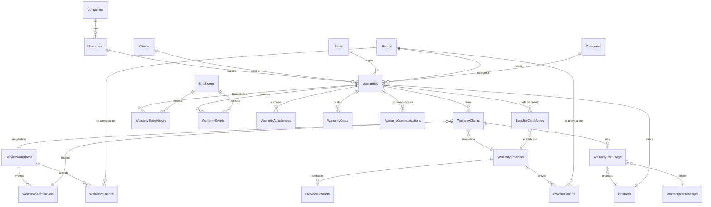
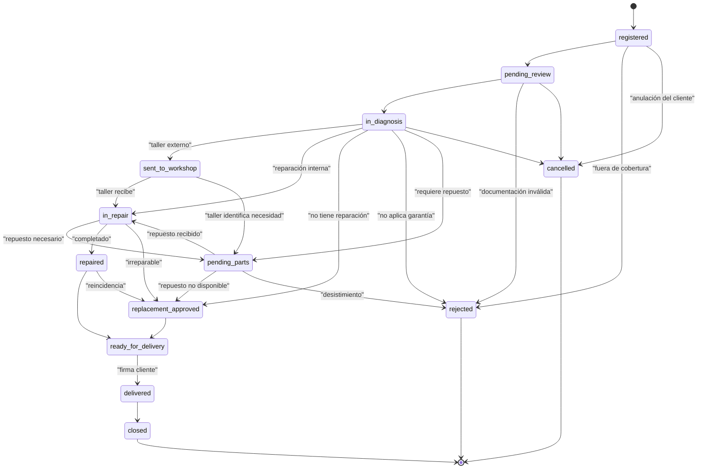
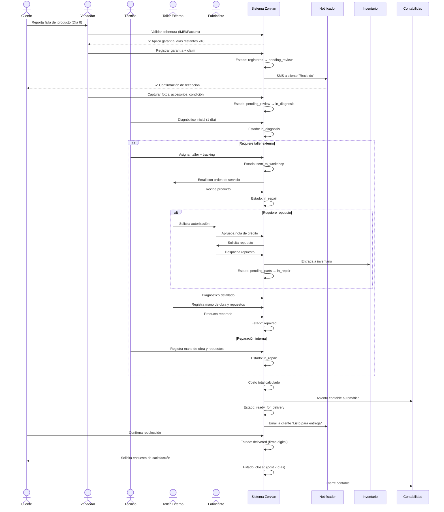

# 📋 INFORME DE AUDITORÍA Y DISEÑO — MÓDULO DE GARANTÍAS DE ARTÍCULOS

**Zorvian ERP (anteriormente Nexora)**

**Fecha:** Junio 2026
**Versión auditada:** .NET 9 (C#) + Entity Framework Core 9 + PostgreSQL + Flutter 3.12+
**Estado actual del módulo:** 🟡 MVP básico (~12% del alcance empresarial requerido)
**Alcance del informe:** Diagnóstico, rediseño, base de datos, APIs, flujos, pantallas, automatizaciones, integraciones, KPIs y roadmap.
**Clasificación:** Documento Técnico-Estratégico — Confidencial
**Autor del informe:** Arquitecto ERP Senior — Especialista en Postventa, Garantías, Servicio Técnico, Talleres y Cadena de Suministro

---

## 📑 Índice

1. [Resumen Ejecutivo](#1-resumen-ejecutivo)
2. [Diagnóstico Completo del Módulo Actual](#2-diagnóstico-completo-del-módulo-actual)
3. [Funcionalidades Faltantes (Gap Analysis)](#3-funcionalidades-faltantes-gap-analysis)
4. [Arquitectura de Información — Entidades y Relaciones](#4-arquitectura-de-información--entidades-y-relaciones)
5. [Estructura de Base de Datos Recomendada (DDL)](#5-estructura-de-base-de-datos-recomendada-ddl)
6. [Diccionario de Estados, Reglas de Transición y Máquina de Estados](#6-diccionario-de-estados-reglas-de-transición-y-máquina-de-estados)
7. [Modelo de Costos y Rentabilidad](#7-modelo-de-costos-y-rentabilidad)
8. [APIs REST Requeridas (OpenAPI)](#8-apis-rest-requeridas-openapi)
9. [Flujo Operativo Completo (End-to-End)](#9-flujo-operativo-completo-end-to-end)
10. [Diseño de Pantallas (UX/UI)](#10-diseño-de-pantallas-uxui)
11. [Automatizaciones Recomendadas](#11-automatizaciones-recomendadas)
12. [Integración con Inventario](#12-integración-con-inventario)
13. [Integración con Ventas](#13-integración-con-ventas)
14. [Integración con Contabilidad](#14-integración-con-contabilidad)
15. [Integración con Compras / Proveedores / Fabricantes](#15-integración-con-compras--proveedores--fabricantes)
16. [Comunicación con el Cliente (Multicanal)](#16-comunicación-con-el-cliente-multicanal)
17. [SLA, Alertas y Control de Tiempos](#17-sla-alertas-y-control-de-tiempos)
18. [KPIs, Reportes Gerenciales y Dashboard](#18-kpis-reportes-gerenciales-y-dashboard)
19. [Seguridad, Auditoría y Trazabilidad](#19-seguridad-auditoría-y-trazabilidad)
20. [Modelo Multiempresa y Multisucursal](#20-modelo-multiempresa-y-multisucursal)
21. [Matriz de Roles y Permisos](#21-matriz-de-roles-y-permisos)
22. [Roadmap de Implementación por Fases](#22-roadmap-de-implementación-por-fases)
23. [Métricas de Éxito y SLOs](#23-métricas-de-éxito-y-slos)
24. [Conclusiones y Recomendaciones Finales](#24-conclusiones-y-recomendaciones-finales)
25. [Apéndices](#25-apéndices)

---

## 1. Resumen Ejecutivo

### 1.1 Veredicto Global

| Dimensión | Estado actual | Target | Brecha |
|---|---|---|---|
| Modelo de datos | 2 entidades (`Warranty`, `WarrantyClaim`) | 18+ entidades | 🔴 88% |
| Reglas de negocio | 4 estados simples | 12 estados + máquina completa | 🔴 67% |
| Talleres autorizados | ❌ Inexistente | Módulo completo | 🔴 100% |
| Proveedores y fabricantes | ❌ Inexistente | Módulo completo | 🔴 100% |
| Repuestos y costos | ❌ Inexistente | Módulo + integración inventario | 🔴 100% |
| SLA y alertas | ❌ Inexistente | Motor completo | 🔴 100% |
| Comunicación al cliente | ❌ Inexistente | SMS / Email / WhatsApp | 🔴 100% |
| Integración contable | ❌ Inexistente | Auto-asientos | 🔴 100% |
| Reportes / Dashboard | 1 listado plano | 25+ reportes + BI | 🔴 96% |
| Seguridad y auditoría | Decoradores `[Audit]` | Trazabilidad granular por transición | 🟡 30% |
| **Cobertura funcional global** | **~12%** | **100%** | **🔴 88%** |

### 1.2 Conclusión ejecutiva en una frase

> Zorvian ERP cuenta con un **esqueleto funcional mínimo** de garantías (alta de garantía, registro de reclamación simple, listado y consulta) que **NO califica como un módulo de postventa empresarial**. El sistema actual es **insuficiente para operar un taller, gestionar talleres autorizados, controlar SLAs, integrar repuestos, analizar rentabilidad ni cumplir con la trazabilidad forense** que un ERP de postventa requiere.

### 1.3 Top 12 hallazgos críticos del módulo actual

| # | Hallazgo | Severidad | Impacto |
|---|---|---|---|
| 1 | **Falta máquina de estados completa** (12 estados vs 2 actuales `active`/`claimed`) | 🔴 CRÍTICO | Imposible representar el ciclo real |
| 2 | **No existe gestión de talleres autorizados** | 🔴 CRÍTICO | No se pueden derivar reparaciones |
| 3 | **No existe gestión de proveedores/fabricantes** | 🔴 CRÍTICO | No se pueden solicitar repuestos ni notas de crédito |
| 4 | **Sin control de SLA** ni alertas por vencimiento | 🔴 CRÍTICO | Cliente en espera indefinida |
| 5 | **Sin gestión de repuestos** ni integración con inventario | 🔴 CRÍTICO | No se sabe qué se reparó ni costó |
| 6 | **Sin registro de costos** de la garantía | 🔴 CRÍTICO | Imposible medir rentabilidad |
| 7 | **Sin integración contable** (asientos automáticos) | 🔴 CRÍTICO | Descuadre financiero del módulo |
| 8 | **Sin comunicación al cliente** (SMS/Email/WhatsApp) | 🟠 ALTO | Cliente abandonado, mala experiencia |
| 9 | **Sin línea de tiempo (timeline)** ni bitácora visual | 🟠 ALTO | Trazabilidad fragmentada |
| 10 | **`Warranty` no tiene IMEI, Serie, Lote, Marca, Modelo** (campos críticos) | 🟠 ALTO | Productos serializables no identificables |
| 11 | **Sin evidencia fotográfica** del estado físico del producto | 🟠 ALTO | Conflictos legales por daño |
| 12 | **`Status` se maneja como `string` libre** en vez de Enum + transiciones | 🟠 ALTO | Estados inválidos posibles |

### 1.4 Top 6 victorias a preservar

| # | Fortaleza | Detalle |
|---|---|---|
| ✅ | Multi-tenant con `tenant_id` y query filters | Base sólida para escalar |
| ✅ | Permisos granulares (`warranty.read`, `warranty.write`) | Fácil ampliar matriz |
| ✅ | `[Audit("Warranty", "Create")]` ya integrado | Trazabilidad mínima garantizada |
| ✅ | AutoMapper para `Warranty` → DTOs | Reduce boilerplate |
| ✅ | Numeración automática `GAR-{yyyyMMdd}-{0001}` | Trazabilidad documental |
| ✅ | `EntityHistory` genérico disponible | Listo para reutilizar en cambios de estado |

---

## 2. Diagnóstico Completo del Módulo Actual

### 2.1 Lo que existe hoy (Inventario técnico)

#### 2.1.1 Entidades

```csharp
// src/Zorvian.Core/Entities/Warranty.cs
public sealed class Warranty : BaseEntity
{
    public string WarrantyNumber { get; set; }           // ✅
    public Guid ClientId { get; set; }                    // ✅
    public Guid ProductId { get; set; }                   // ✅
    public Guid? SaleId { get; set; }                     // ✅
    public DateOnly StartDate { get; set; }               // ✅
    public DateOnly EndDate { get; set; }                 // ✅
    public int DurationMonths { get; set; }               // ✅
    public string? Terms { get; set; }                    // ✅
    public string Status { get; set; } = "active";        // ⚠️ string libre
    public Guid CompanyId { get; set; }                   // ✅
    public Guid BranchId { get; set; }                    // ✅
    public ICollection<WarrantyClaim> Claims { get; set; } // ✅
    // ❌ Falta: IMEI, Serie, Lote, Marca, Modelo,
    //          AccesoriosRecibidos, EvidenciaFotografica,
    //          MotivoReclamo, DescripcionFalla, EstadoFisico,
    //          FechaIngreso, TallerAsignadoId, ProveedorId,
    //          CostoTotal, CostoAsumidoEmpresa, CostoAsumidoFabricante,
    //          SLA_Hours, FechaLimiteSLA, GarantiaExtendidaId
}

// src/Zorvian.Core/Entities/WarrantyClaim.cs
public sealed class WarrantyClaim : BaseEntity
{
    public Guid WarrantyId { get; set; }                  // ✅
    public DateOnly ClaimDate { get; set; }               // ✅
    public string Description { get; set; }               // ✅
    public string Status { get; set; } = "pending";       // ⚠️ string libre
    public string? Resolution { get; set; }               // ✅
    public DateOnly? ResolutionDate { get; set; }          // ✅
    public Guid? ApprovedByEmployeeId { get; set; }       // ✅
    public Guid CompanyId { get; set; }                   // ✅
    public Guid BranchId { get; set; }                    // ✅
    // ❌ Falta: TipoResolucion (Reparacion|Reemplazo|Devolución|Rechazo),
    //          TallerAsignadoId, TecnicoAsignadoId, FechaEnvioTaller,
    //          FechaRecepcionTaller, FechaEnvioProveedor, FechaRecepcionProveedor,
    //          CostoManoObra, CostoRepuestos, CostoTransporte, CostoExterno,
    //          ProductoReemplazoId, ProductoReemplazoSerial, NotaCreditoProveedorId,
    //          EvidenciasAdjuntas, ComunicacionClienteLogs
}
```

#### 2.1.2 Endpoints REST actuales

| Verbo | Ruta | Función | Observaciones |
|---|---|---|---|
| `POST` | `/zorvian/v1/warranties` | Crear garantía | Básico, sin validación de venta |
| `GET` | `/zorvian/v1/warranties/{id}` | Obtener por ID | Sin `Include` de claims |
| `GET` | `/zorvian/v1/warranties` | Listado paginado | Sin filtros por sucursal real |
| `POST` | `/zorvian/v1/warranties/{id}/claims` | Agregar reclamación | No crea máquina de estados |

**Total:** 4 endpoints. **Necesarios para ERP completo:** ~60+ endpoints.

#### 2.1.3 DTOs

* `CreateWarrantyRequest` — Solo 6 campos, no captura accesorios ni evidencia.
* `WarrantyResponse` — Lectura plana sin datos de venta, factura, sucursal.
* `WarrantyListResponse` — Solo 6 campos, inútil para tablas densas.
* `WarrantyFilterRequest` — Filtra por cliente/status/expiringSoon, sin sucursal, marca, técnico, rango de fechas.

#### 2.1.4 Permisos actuales

```csharp
public const string WarrantyRead = "warranty.read";
public const string WarrantyWrite = "warranty.write";
```

**Necesarios:** ~15 permisos granulares (talleres, repuestos, comunicación, etc.).

### 2.2 Limitaciones funcionales

| Capacidad | Hoy | Necesario |
|---|---|---|
| Alta de garantía | ✅ Manual | ✅ Auto al cerrar venta con cobertura |
| Validación automática de cobertura | ❌ | ✅ Contra factura + fecha + tipo |
| Cambio de estado (workflow) | ❌ Hardcodea `"claimed"` | ✅ 12 estados con transiciones |
| Asignación a taller | ❌ | ✅ Con SLA por marca |
| Derivación a proveedor | ❌ | ✅ Con solicitud formal |
| Solicitud de repuestos | ❌ | ✅ Integrada con inventario |
| Solicitud de nota de crédito | ❌ | ✅ Integrada con CxP |
| Reemplazo de producto | ❌ | ✅ Salida automática de inventario |
| Devolución al cliente | ❌ | ✅ Acta + firma digital |
| Notificación al cliente | ❌ | ✅ SMS/Email/WhatsApp |
| Cálculo de costos | ❌ | ✅ Mano de obra + repuestos + transporte |
| Rentabilidad | ❌ | ✅ Costo empresa vs fabricante |
| SLA y alertas | ❌ | ✅ Motor de timers + notificaciones |
| Reportes gerenciales | ❌ | ✅ 25+ reportes |
| Dashboard de servicio | ❌ | ✅ Tiempo real |

### 2.3 Deuda técnica detectada

1. **`Status` como string libre** — Riesgo de valores no normalizados. Solución: Enum + check constraint.
2. **Sin transiciones controladas** — Cualquier código puede asignar `"xyz"`. Solución: `WarrantyStateMachine` que valida origen→destino.
3. **Bug en `GetFilteredAsync`**: siempre pasa `branchId = Guid.Empty` desde el servicio, lo que **filtra por la sucursal inexistente y devuelve 0 registros** en producción.
4. **Falta `AsNoTracking()`** en consultas de solo lectura.
5. **Falta `Include(Claims)` profundo** con fotos y talleres.
6. **No existe `WarrantyStateHistory`** — La auditoría no captura los cambios de estado explícitamente.
7. **No existe `WarrantyEventLog`** — Eventos granulares (envío, recepción, etc.) no se registran.
8. **Validación de cobertura ausente** — Se permite crear garantía para un producto no vendido.
9. **`BranchId` y `CompanyId` se asignan en código** en vez de por query filter automático.
10. **No hay soft-delete con `IsDeleted`** controlado en queries (existe en `BaseEntity` pero no se usa).

---

## 3. Funcionalidades Faltantes (Gap Analysis)

### 3.1 Matriz de capacidades

| # | Capacidad | Estado | Prioridad |
|---|---|---|---|
| 1 | Registro completo con factura, IMEI, serie, lote | ❌ | P0 |
| 2 | Validación automática de cobertura | ❌ | P0 |
| 3 | Máquina de estados con 12 estados | ❌ | P0 |
| 4 | Línea de tiempo visual (Timeline) | ❌ | P0 |
| 5 | Asignación a talleres autorizados | ❌ | P0 |
| 6 | Asignación a técnicos | ❌ | P0 |
| 7 | Derivación a proveedores/fabricantes | ❌ | P0 |
| 8 | Solicitud de repuestos a proveedor | ❌ | P0 |
| 9 | Solicitud de nota de crédito | ❌ | P0 |
| 10 | Solicitud de reemplazo | ❌ | P0 |
| 11 | Solicitud de devolución | ❌ | P0 |
| 12 | Control de SLA con alertas | ❌ | P0 |
| 13 | Registro de mano de obra | ❌ | P0 |
| 14 | Registro de repuestos usados | ❌ | P0 |
| 15 | Registro de transporte/logística | ❌ | P0 |
| 16 | Costos externos (taller) | ❌ | P0 |
| 17 | Asignación de costo (empresa/fabricante) | ❌ | P0 |
| 18 | Análisis de rentabilidad | ❌ | P0 |
| 19 | Notificación multicanal al cliente | ❌ | P0 |
| 20 | Integración con inventario (salida por reemplazo) | ❌ | P0 |
| 21 | Integración con ventas (validar factura) | ❌ | P0 |
| 22 | Integración contable (asientos automáticos) | ❌ | P0 |
| 23 | Evidencia fotográfica múltiple | ❌ | P0 |
| 24 | Documentos adjuntos (PDF, Word) | ❌ | P0 |
| 25 | Estado físico detallado (rayones, golpes) | ❌ | P0 |
| 26 | Accesorios recibidos (cargador, cable) | ❌ | P0 |
| 27 | Garantías extendidas | ❌ | P1 |
| 28 | Garantías corporativas (B2B) | ❌ | P1 |
| 29 | Dashboard de servicio en tiempo real | ❌ | P1 |
| 30 | Reportes gerenciales (25+) | ❌ | P1 |
| 31 | Portal del cliente (autoservicio) | ❌ | P1 |
| 32 | App móvil para técnico de taller | ❌ | P2 |
| 33 | OCR de facturas para alta rápida | ❌ | P2 |
| 34 | Firma digital en acta de entrega | ❌ | P2 |
| 35 | WhatsApp Business API bidireccional | ❌ | P2 |
| 36 | Análisis predictivo de fallas (ML) | ❌ | P3 |
| 37 | IoT — Telemetría de productos en garantía | ❌ | P3 |
| 38 | Blockchain audit trail | ❌ | P3 |

### 3.2 Cobertura por área funcional

| Área | Cobertura actual | Cobertura objetivo | Brecha |
|---|---|---|---|
| Recepción y registro | 30% | 100% | 70% |
| Diagnóstico | 10% | 100% | 90% |
| Derivación a taller | 0% | 100% | 100% |
| Derivación a proveedor | 0% | 100% | 100% |
| Repuestos | 0% | 100% | 100% |
| Costos y rentabilidad | 0% | 100% | 100% |
| Comunicación al cliente | 0% | 100% | 100% |
| SLA y alertas | 0% | 100% | 100% |
| Reportes | 5% | 100% | 95% |
| Integraciones | 0% | 100% | 100% |

### 3.3 Comparativa con ERPs de referencia (Benchmark)

| Capacidad | Zorvian Hoy | SAP S/4 | Oracle NetSuite | Dynamics 365 | Odoo |
|---|---|---|---|---|---|
| Gestión de garantías | 🟡 Básico | ✅ Completo | ✅ Avanzado | ✅ Completo | ✅ Nativo |
| Talleres autorizados | ❌ | ✅ | ✅ | ✅ | ✅ |
| Control SLA | ❌ | ✅ | ✅ | ✅ | ✅ |
| Repuestos | ❌ | ✅ | ✅ | ✅ | ✅ |
| Costos | ❌ | ✅ | ✅ | ✅ | ✅ |
| App móvil técnico | ❌ | ✅ | ✅ | ✅ | ✅ |
| Portal cliente | ❌ | ✅ | ✅ | ✅ | ✅ |
| Predicción IA | ❌ | ✅ | 🟡 | ✅ | 🟡 |
| Cobertura global | ~12% | 100% | 100% | 100% | 100% |

---

## 4. Arquitectura de Información — Entidades y Relaciones

### 4.1 Modelo de dominio (DDD)

El módulo se divide en **4 agregados principales**:

#### Agregado 1: `Warranty` (Raíz)

* `Warranty` (raíz del agregado)
* `WarrantyClaim` (entidad hija — un producto puede tener múltiples reclamos)
* `WarrantyStateHistory` (entidad hija — bitácora de cambios de estado)
* `WarrantyEvent` (entidad hija — eventos granulares)
* `WarrantyAttachment` (entidad hija — fotos, PDFs, firmas)
* `WarrantyCost` (entidad hija — desglose de costos)

#### Agregado 2: `ServiceWorkshop` (Talleres)

* `ServiceWorkshop` (raíz)
* `WorkshopTechnician` (técnicos del taller)
* `WorkshopBrand` (marcas que atiende — N:M)

#### Agregado 3: `WarrantyProvider` (Proveedores y Fabricantes)

* `WarrantyProvider` (raíz)
* `ProviderContact` (contactos del proveedor)
* `ProviderBrand` (marcas que provee)

#### Agregado 4: `WarrantyPart` (Repuestos)

* `WarrantyPartRequest` (solicitud a proveedor)
* `WarrantyPartReceipt` (recepción)
* `WarrantyPartUsage` (uso en garantía)

### 4.2 Mapa de entidades (18 entidades)

```
┌─────────────────┐
│   Warranty      │◄─────────┐
│  (raíz)         │          │
└────┬─────┬──────┘          │
     │     │                 │
     │     ├─────────────┐   │
     │     │             │   │
     ▼     ▼             ▼   ▼
┌────────┐ ┌──────────────┐ ┌─────────────────┐
│ Claims │ │StateHistory  │ │  Attachments    │
└────────┘ └──────────────┘ └─────────────────┘
     │
     ▼
┌──────────────┐
│ WarrantyCost │
└──────────────┘

┌──────────────────┐      ┌─────────────────────┐
│ ServiceWorkshop  │◄────►│ WorkshopTechnician  │
└────┬─────────────┘      └─────────────────────┘
     │
     ▼
┌──────────────────┐
│ WorkshopBrand    │ (N:M con Brand)
└──────────────────┘

┌──────────────────┐      ┌─────────────────────┐
│ WarrantyProvider │◄────►│ ProviderContact     │
└────┬─────────────┘      └─────────────────────┘
     │
     ▼
┌──────────────────┐
│ ProviderBrand    │ (N:M con Brand)
└──────────────────┘

┌────────────────────┐
│ WarrantyPartRequest│
└────────┬───────────┘
         │
         ▼
┌────────────────────┐
│ WarrantyPartReceipt│
└────────┬───────────┘
         │
         ▼
┌────────────────────┐
│ WarrantyPartUsage  │ (asignado a Warranty/Claim)
└────────────────────┘
```

### 4.3 Diagrama Entidad-Relación



---

## 5. Estructura de Base de Datos Recomendada (DDL)

### 5.1 Convenciones

* **Multi-tenant**: Todas las tablas operativas llevan `tenant_id` con query filter.
* **Multi-sucursal**: `branch_id` en entidades operativas.
* **Auditoría**: `created_at`, `created_by`, `updated_at`, `updated_by`, `is_deleted`, `deleted_at` (de `BaseEntity`).
* **Soft-delete**: `is_deleted` + `deleted_at` (nunca `DELETE` físico salvo purge job).
* **Moneda**: `currency_code CHAR(3)` + `exchange_rate NUMERIC(18,6)` para multimoneda.
* **Timestamps**: `TIMESTAMPTZ` (UTC) siempre.
* **IDs**: `UUID` (`gen_random_uuid()`).
* **Estados**: `VARCHAR(30)` con `CHECK` constraint + Enum en C#.
* **Imágenes**: URL de Firebase Storage / S3, no BLOB.

### 5.2 DDL — Entidades principales

```sql
-- =============================================================
-- 5.2.1  TALLERES AUTORIZADOS
-- =============================================================

CREATE TABLE service_workshops (
    id                          UUID PRIMARY KEY DEFAULT gen_random_uuid(),
    tenant_id                   VARCHAR(50)  NOT NULL,
    branch_id                   UUID         NOT NULL REFERENCES branches(id),
    code                        VARCHAR(20)  NOT NULL,
    name                        VARCHAR(255) NOT NULL,
    legal_name                  VARCHAR(255),
    tax_id                      VARCHAR(50),
    contact_name                VARCHAR(255),
    phone                       VARCHAR(50),
    email                       VARCHAR(255),
    address                     TEXT,
    city                        VARCHAR(100),
    country                     VARCHAR(100),
    avg_response_hours          INT          DEFAULT 48,
    avg_repair_hours            INT          DEFAULT 72,
    rating                      NUMERIC(3,2) DEFAULT 0,
    is_active                   BOOLEAN      DEFAULT true,
    notes                       TEXT,
    created_at                  TIMESTAMPTZ  DEFAULT NOW(),
    created_by                  VARCHAR(100) NOT NULL,
    updated_at                  TIMESTAMPTZ,
    updated_by                  VARCHAR(100),
    is_deleted                  BOOLEAN      DEFAULT false,
    deleted_at                  TIMESTAMPTZ,
    UNIQUE(tenant_id, code)
);
CREATE INDEX idx_workshops_tenant_active ON service_workshops (tenant_id, is_active) WHERE is_deleted = false;

CREATE TABLE workshop_technicians (
    id                          UUID PRIMARY KEY DEFAULT gen_random_uuid(),
    tenant_id                   VARCHAR(50)  NOT NULL,
    workshop_id                 UUID         NOT NULL REFERENCES service_workshops(id) ON DELETE CASCADE,
    full_name                   VARCHAR(255) NOT NULL,
    identification              VARCHAR(50),
    phone                       VARCHAR(50),
    email                       VARCHAR(255),
    specialties                 TEXT[],                          -- ['Electronics','Screen','Battery']
    is_certified                BOOLEAN      DEFAULT false,
    certification_date          DATE,
    is_active                   BOOLEAN      DEFAULT true,
    avg_repair_minutes          INT,
    created_at                  TIMESTAMPTZ  DEFAULT NOW(),
    created_by                  VARCHAR(100) NOT NULL,
    updated_at                  TIMESTAMPTZ,
    updated_by                  VARCHAR(100),
    is_deleted                  BOOLEAN      DEFAULT false,
    UNIQUE(tenant_id, workshop_id, identification)
);
CREATE INDEX idx_tech_workshop ON workshop_technicians (tenant_id, workshop_id) WHERE is_deleted = false;

CREATE TABLE workshop_brands (
    workshop_id                 UUID NOT NULL REFERENCES service_workshops(id) ON DELETE CASCADE,
    brand_id                    UUID NOT NULL REFERENCES brands(id) ON DELETE CASCADE,
    tenant_id                   VARCHAR(50) NOT NULL,
    sla_hours                   INT  NOT NULL DEFAULT 72,         -- SLA específico por marca
    PRIMARY KEY (workshop_id, brand_id)
);
CREATE INDEX idx_workshop_brands_brand ON workshop_brands (tenant_id, brand_id);

-- =============================================================
-- 5.2.2  PROVEEDORES Y FABRICANTES
-- =============================================================

CREATE TABLE warranty_providers (
    id                          UUID PRIMARY KEY DEFAULT gen_random_uuid(),
    tenant_id                   VARCHAR(50)  NOT NULL,
    code                        VARCHAR(20)  NOT NULL,
    name                        VARCHAR(255) NOT NULL,
    legal_name                  VARCHAR(255),
    tax_id                      VARCHAR(50),
    type                        VARCHAR(20)  NOT NULL,           -- 'manufacturer' | 'distributor' | 'supplier'
    contact_name                VARCHAR(255),
    phone                       VARCHAR(50),
    email                       VARCHAR(255),
    address                     TEXT,
    city                        VARCHAR(100),
    country                     VARCHAR(100),
    website                     VARCHAR(255),
    avg_response_hours          INT          DEFAULT 96,
    is_active                   BOOLEAN      DEFAULT true,
    notes                       TEXT,
    created_at                  TIMESTAMPTZ  DEFAULT NOW(),
    created_by                  VARCHAR(100) NOT NULL,
    updated_at                  TIMESTAMPTZ,
    updated_by                  VARCHAR(100),
    is_deleted                  BOOLEAN      DEFAULT false,
    deleted_at                  TIMESTAMPTZ,
    UNIQUE(tenant_id, code),
    CHECK (type IN ('manufacturer','distributor','supplier'))
);

CREATE TABLE provider_contacts (
    id                          UUID PRIMARY KEY DEFAULT gen_random_uuid(),
    tenant_id                   VARCHAR(50)  NOT NULL,
    provider_id                 UUID         NOT NULL REFERENCES warranty_providers(id) ON DELETE CASCADE,
    full_name                   VARCHAR(255) NOT NULL,
    role                        VARCHAR(100),                    -- 'Sales Manager','Tech Support','Warranty Coordinator'
    phone                       VARCHAR(50),
    email                       VARCHAR(255),
    is_primary                  BOOLEAN      DEFAULT false,
    created_at                  TIMESTAMPTZ  DEFAULT NOW(),
    created_by                  VARCHAR(100) NOT NULL,
    updated_at                  TIMESTAMPTZ,
    updated_by                  VARCHAR(100),
    is_deleted                  BOOLEAN      DEFAULT false
);

CREATE TABLE provider_brands (
    provider_id                 UUID NOT NULL REFERENCES warranty_providers(id) ON DELETE CASCADE,
    brand_id                    UUID NOT NULL REFERENCES brands(id) ON DELETE CASCADE,
    tenant_id                   VARCHAR(50) NOT NULL,
    sla_hours                   INT  NOT NULL DEFAULT 168,        -- 7 días para fabricantes
    PRIMARY KEY (provider_id, brand_id)
);

-- =============================================================
-- 5.2.3  GARANTÍA — Tabla principal extendida
-- =============================================================

CREATE TABLE warranties (
    id                              UUID PRIMARY KEY DEFAULT gen_random_uuid(),
    tenant_id                       VARCHAR(50)  NOT NULL,
    branch_id                       UUID         NOT NULL REFERENCES branches(id),
    company_id                      UUID         NOT NULL,
    warranty_number                 VARCHAR(50)  NOT NULL,        -- GAR-20260606-0001
    client_id                       UUID         NOT NULL REFERENCES clients(id),
    sale_id                         UUID         REFERENCES sales(id),
    sale_detail_id                  UUID         REFERENCES sale_details(id),  -- Línea específica de venta
    product_id                      UUID         NOT NULL REFERENCES products(id),
    brand_id                        UUID         REFERENCES brands(id),
    category_id                     UUID         REFERENCES categories(id),

    -- Identificación única del producto
    serial_number                   VARCHAR(100),
    imei                            VARCHAR(20),
    lot_number                      VARCHAR(50),

    -- Vigencia
    start_date                      DATE         NOT NULL,
    end_date                        DATE         NOT NULL,
    duration_months                 INT          NOT NULL,
    is_extended                     BOOLEAN      DEFAULT false,
    extended_warranty_id            UUID         REFERENCES warranties(id),
    extended_end_date               DATE,

    -- Cobertura
    coverage_type                   VARCHAR(30)  NOT NULL,        -- 'standard' | 'extended' | 'limited' | 'manufacturer'
    terms                           TEXT,
    exclusions                      TEXT,

    -- Estado
    status                          VARCHAR(30)  NOT NULL DEFAULT 'registered',
    current_workshop_id             UUID         REFERENCES service_workshops(id),
    current_provider_id             UUID         REFERENCES warranty_providers(id),

    -- SLA
    sla_hours                       INT,                          -- Configurado al crear
    sla_due_at                      TIMESTAMPTZ,                  -- Calculado
    sla_breached_at                 TIMESTAMPTZ,

    -- Costos
    estimated_cost                  NUMERIC(18,2) DEFAULT 0,
    actual_cost                     NUMERIC(18,2) DEFAULT 0,
    cost_company                    NUMERIC(18,2) DEFAULT 0,
    cost_manufacturer               NUMERIC(18,2) DEFAULT 0,
    cost_workshop                   NUMERIC(18,2) DEFAULT 0,

    -- Cierre
    resolution_type                 VARCHAR(30),                  -- 'repaired' | 'replaced' | 'refunded' | 'rejected' | 'no_defect_found'
    closed_at                       TIMESTAMPTZ,
    closed_by_employee_id           UUID         REFERENCES employees(id),

    created_at                      TIMESTAMPTZ  DEFAULT NOW(),
    created_by                      VARCHAR(100) NOT NULL,
    updated_at                      TIMESTAMPTZ,
    updated_by                      VARCHAR(100),
    is_deleted                      BOOLEAN      DEFAULT false,
    deleted_at                      TIMESTAMPTZ,
    deleted_by                      VARCHAR(100),

    CONSTRAINT ck_warranty_status CHECK (status IN (
        'registered','pending_review','in_diagnosis','sent_to_workshop',
        'in_repair','pending_parts','repaired','replacement_approved',
        'rejected','ready_for_delivery','delivered','closed','cancelled'
    )),
    CONSTRAINT ck_warranty_dates CHECK (end_date >= start_date),
    CONSTRAINT ck_warranty_coverage CHECK (coverage_type IN ('standard','extended','limited','manufacturer','corporate')),
    CONSTRAINT ck_warranty_resolution CHECK (resolution_type IS NULL OR resolution_type IN (
        'repaired','replaced','refunded','rejected','no_defect_found','cancelled'
    )),
    UNIQUE(tenant_id, warranty_number)
);

CREATE INDEX idx_warranties_tenant_status ON warranties (tenant_id, status) WHERE is_deleted = false;
CREATE INDEX idx_warranties_client ON warranties (tenant_id, client_id) WHERE is_deleted = false;
CREATE INDEX idx_warranties_sale ON warranties (tenant_id, sale_id) WHERE is_deleted = false;
CREATE INDEX idx_warranties_brand ON warranties (tenant_id, brand_id) WHERE is_deleted = false;
CREATE INDEX idx_warranties_workshop ON warranties (tenant_id, current_workshop_id) WHERE is_deleted = false;
CREATE INDEX idx_warranties_provider ON warranties (tenant_id, current_provider_id) WHERE is_deleted = false;
CREATE INDEX idx_warranties_branch ON warranties (tenant_id, branch_id) WHERE is_deleted = false;
CREATE INDEX idx_warranties_due ON warranties (tenant_id, sla_due_at) WHERE sla_breached_at IS NULL AND status NOT IN ('closed','cancelled','delivered');
CREATE INDEX idx_warranties_imei ON warranties (tenant_id, imei) WHERE imei IS NOT NULL;
CREATE INDEX idx_warranties_serial ON warranties (tenant_id, serial_number) WHERE serial_number IS NOT NULL;

-- =============================================================
-- 5.2.4  RECLAMOS (CLAIMS)
-- =============================================================

CREATE TABLE warranty_claims (
    id                          UUID PRIMARY KEY DEFAULT gen_random_uuid(),
    tenant_id                   VARCHAR(50)  NOT NULL,
    branch_id                   UUID         NOT NULL REFERENCES branches(id),
    company_id                  UUID         NOT NULL,
    warranty_id                 UUID         NOT NULL REFERENCES warranties(id) ON DELETE CASCADE,
    claim_number                VARCHAR(50)  NOT NULL,            -- REC-0001
    claim_type                  VARCHAR(30)  NOT NULL,            -- 'defect' | 'damage' | 'incompatibility' | 'not_as_described' | 'warranty_void'
    priority                    VARCHAR(20)  DEFAULT 'normal',    -- 'low' | 'normal' | 'high' | 'urgent'

    -- Recepción
    received_at                 TIMESTAMPTZ  NOT NULL DEFAULT NOW(),
    received_by_employee_id     UUID         REFERENCES employees(id),
    reception_condition         TEXT,                             -- 'new_sealed' | 'good_used' | 'visible_damage' | 'severely_damaged'
    accessories_received        TEXT[],                           -- ['charger','cable','box','manual']
    physical_condition_notes    TEXT,

    -- Falla
    failure_description         TEXT         NOT NULL,
    failure_category            VARCHAR(50),                      -- 'hardware' | 'software' | 'cosmetic' | 'performance' | 'compatibility'
    failure_root_cause          TEXT,
    customer_allegation         TEXT,

    -- Diagnóstico
    diagnosis                   TEXT,
    diagnosis_completed_at      TIMESTAMPTZ,
    diagnosis_by_employee_id    UUID         REFERENCES employees(id),
    diagnosis_result            VARCHAR(30),                      -- 'covered' | 'not_covered' | 'void_warranty' | 'pending_analysis'
    covered_by_warranty         BOOLEAN,

    -- Asignaciones
    workshop_id                 UUID         REFERENCES service_workshops(id),
    technician_id               UUID         REFERENCES workshop_technicians(id),
    provider_id                 UUID         REFERENCES warranty_providers(id),

    -- Derivaciones y retornos (taller)
    sent_to_workshop_at         TIMESTAMPTZ,
    received_from_workshop_at   TIMESTAMPTZ,
    workshop_tracking_number    VARCHAR(100),
    workshop_diagnosis          TEXT,
    workshop_resolution         TEXT,
    workshop_resolution_date    TIMESTAMPTZ,

    -- Derivaciones y retornos (proveedor)
    sent_to_provider_at         TIMESTAMPTZ,
    received_from_provider_at   TIMESTAMPTZ,
    provider_tracking_number    VARCHAR(100),
    provider_authorization_code VARCHAR(100),
    provider_rejection_reason   TEXT,

    -- Resolución
    resolution_type             VARCHAR(30),                      -- 'repaired' | 'replaced' | 'refunded' | 'rejected' | 'no_defect_found'
    resolution_notes            TEXT,
    resolution_date             TIMESTAMPTZ,
    approved_by_employee_id     UUID         REFERENCES employees(id),

    -- Reemplazo
    replacement_product_id      UUID         REFERENCES products(id),
    replacement_serial          VARCHAR(100),
    replacement_at              TIMESTAMPTZ,

    -- Devolución
    refund_amount               NUMERIC(18,2),
    refund_method               VARCHAR(30),                      -- 'cash' | 'credit_note' | 'card_reversal' | 'transfer'
    refund_reference            VARCHAR(100),
    refunded_at                 TIMESTAMPTZ,

    -- Cierre
    closed_at                   TIMESTAMPTZ,
    closed_by_employee_id       UUID         REFERENCES employees(id),
    customer_satisfaction       INT,                              -- 1-5
    customer_feedback           TEXT,

    -- SLA
    sla_due_at                  TIMESTAMPTZ,
    sla_breached_at             TIMESTAMPTZ,

    status                      VARCHAR(30)  NOT NULL DEFAULT 'received',

    created_at                  TIMESTAMPTZ  DEFAULT NOW(),
    created_by                  VARCHAR(100) NOT NULL,
    updated_at                  TIMESTAMPTZ,
    updated_by                  VARCHAR(100),
    is_deleted                  BOOLEAN      DEFAULT false,
    deleted_at                  TIMESTAMPTZ,
    deleted_by                  VARCHAR(100),

    CONSTRAINT ck_claim_type CHECK (claim_type IN ('defect','damage','incompatibility','not_as_described','warranty_void','other')),
    CONSTRAINT ck_claim_priority CHECK (priority IN ('low','normal','high','urgent')),
    CONSTRAINT ck_claim_status CHECK (status IN (
        'received','pending_review','in_diagnosis','sent_to_workshop',
        'in_repair','pending_parts','repaired','replacement_approved',
        'rejected','ready_for_delivery','delivered','closed','cancelled'
    )),
    UNIQUE(tenant_id, claim_number)
);
CREATE INDEX idx_wclaims_warranty ON warranty_claims (tenant_id, warranty_id) WHERE is_deleted = false;
CREATE INDEX idx_wclaims_status ON warranty_claims (tenant_id, status) WHERE is_deleted = false;
CREATE INDEX idx_wclaims_workshop ON warranty_claims (tenant_id, workshop_id) WHERE is_deleted = false;
CREATE INDEX idx_wclaims_provider ON warranty_claims (tenant_id, provider_id) WHERE is_deleted = false;
CREATE INDEX idx_wclaims_technician ON warranty_claims (tenant_id, technician_id) WHERE is_deleted = false;
CREATE INDEX idx_wclaims_received ON warranty_claims (tenant_id, received_at DESC) WHERE is_deleted = false;
CREATE INDEX idx_wclaims_sla ON warranty_claims (tenant_id, sla_due_at) WHERE sla_breached_at IS NULL AND closed_at IS NULL;

-- =============================================================
-- 5.2.5  HISTORIAL DE ESTADOS
-- =============================================================

CREATE TABLE warranty_state_history (
    id                          UUID PRIMARY KEY DEFAULT gen_random_uuid(),
    tenant_id                   VARCHAR(50)  NOT NULL,
    warranty_id                 UUID         NOT NULL REFERENCES warranties(id) ON DELETE CASCADE,
    claim_id                    UUID         REFERENCES warranty_claims(id) ON DELETE CASCADE,
    from_status                 VARCHAR(30),
    to_status                   VARCHAR(30)  NOT NULL,
    changed_by_employee_id      UUID         REFERENCES employees(id),
    changed_at                  TIMESTAMPTZ  NOT NULL DEFAULT NOW(),
    reason                      TEXT,
    sla_breached                BOOLEAN      DEFAULT false,
    created_at                  TIMESTAMPTZ  DEFAULT NOW(),
    created_by                  VARCHAR(100) NOT NULL
);
CREATE INDEX idx_statehist_warranty ON warranty_state_history (tenant_id, warranty_id, changed_at DESC);
CREATE INDEX idx_statehist_claim ON warranty_state_history (tenant_id, claim_id, changed_at DESC);

-- =============================================================
-- 5.2.6  EVENTOS (Bitácora granular)
-- =============================================================

CREATE TABLE warranty_events (
    id                          UUID PRIMARY KEY DEFAULT gen_random_uuid(),
    tenant_id                   VARCHAR(50)  NOT NULL,
    warranty_id                 UUID         NOT NULL REFERENCES warranties(id) ON DELETE CASCADE,
    claim_id                    UUID         REFERENCES warranty_claims(id) ON DELETE CASCADE,
    event_type                  VARCHAR(50)  NOT NULL,            -- 'received','sent_to_workshop','received_from_workshop','sent_to_provider','part_requested','part_received','repaired','replaced','delivered','closed','note_added','attachment_added','cost_added','communication_sent'
    event_data                  JSONB,                           -- Datos específicos del evento
    description                 TEXT,
    employee_id                 UUID         REFERENCES employees(id),
    occurred_at                 TIMESTAMPTZ  NOT NULL DEFAULT NOW(),
    is_milestone                BOOLEAN      DEFAULT false,        -- Eventos críticos para timeline
    created_at                  TIMESTAMPTZ  DEFAULT NOW(),
    created_by                  VARCHAR(100) NOT NULL
);
CREATE INDEX idx_events_warranty ON warranty_events (tenant_id, warranty_id, occurred_at DESC);
CREATE INDEX idx_events_type ON warranty_events (tenant_id, event_type, occurred_at DESC);
CREATE INDEX idx_events_milestone ON warranty_events (tenant_id, warranty_id) WHERE is_milestone = true;

-- =============================================================
-- 5.2.7  ADJUNTOS (fotos, PDFs, firmas)
-- =============================================================

CREATE TABLE warranty_attachments (
    id                          UUID PRIMARY KEY DEFAULT gen_random_uuid(),
    tenant_id                   VARCHAR(50)  NOT NULL,
    warranty_id                 UUID         NOT NULL REFERENCES warranties(id) ON DELETE CASCADE,
    claim_id                    UUID         REFERENCES warranty_claims(id) ON DELETE CASCADE,
    file_name                   VARCHAR(255) NOT NULL,
    file_url                    TEXT         NOT NULL,            -- Firebase Storage / S3 URL
    file_type                   VARCHAR(50)  NOT NULL,            -- 'image/jpeg','application/pdf'
    file_size_bytes             BIGINT,
    category                    VARCHAR(30)  NOT NULL,            -- 'reception_photo','damage_photo','invoice','delivery_receipt','signature','diagnostic_report','other'
    description                 TEXT,
    uploaded_by_employee_id     UUID         REFERENCES employees(id),
    uploaded_at                 TIMESTAMPTZ  NOT NULL DEFAULT NOW(),
    is_public                   BOOLEAN      DEFAULT false,        -- Visible para cliente
    created_at                  TIMESTAMPTZ  DEFAULT NOW(),
    created_by                  VARCHAR(100) NOT NULL,
    is_deleted                  BOOLEAN      DEFAULT false,
    deleted_at                  TIMESTAMPTZ
);
CREATE INDEX idx_attachments_warranty ON warranty_attachments (tenant_id, warranty_id) WHERE is_deleted = false;
CREATE INDEX idx_attachments_claim ON warranty_attachments (tenant_id, claim_id) WHERE is_deleted = false;

-- =============================================================
-- 5.2.8  COSTOS
-- =============================================================

CREATE TABLE warranty_costs (
    id                          UUID PRIMARY KEY DEFAULT gen_random_uuid(),
    tenant_id                   VARCHAR(50)  NOT NULL,
    branch_id                   UUID         NOT NULL REFERENCES branches(id),
    company_id                  UUID         NOT NULL,
    warranty_id                 UUID         NOT NULL REFERENCES warranties(id) ON DELETE CASCADE,
    claim_id                    UUID         REFERENCES warranty_claims(id) ON DELETE CASCADE,
    cost_category               VARCHAR(30)  NOT NULL,            -- 'labor' | 'parts' | 'transport' | 'external_workshop' | 'diagnostic' | 'replacement_product' | 'refund' | 'shipping' | 'other'
    description                 TEXT,
    quantity                    NUMERIC(18,4) DEFAULT 1,
    unit_cost                   NUMERIC(18,4) NOT NULL,
    total_cost                  NUMERIC(18,4) GENERATED ALWAYS AS (quantity * unit_cost) STORED,
    currency_code               CHAR(3)      DEFAULT 'USD',
    exchange_rate               NUMERIC(18,6) DEFAULT 1,
    paid_by                     VARCHAR(30)  NOT NULL,            -- 'company' | 'manufacturer' | 'workshop' | 'provider' | 'supplier' | 'customer'
    paid_by_party_id            UUID,                             -- ID del fabricante, taller o proveedor
    invoice_number              VARCHAR(50),
    invoice_date                DATE,
    invoice_url                 TEXT,
    is_billed                   BOOLEAN      DEFAULT false,        -- Ya se facturó al fabricante
    accounting_entry_id         UUID         REFERENCES accounting_entries(id),
    notes                       TEXT,
    registered_at               TIMESTAMPTZ  NOT NULL DEFAULT NOW(),
    registered_by_employee_id   UUID         REFERENCES employees(id),
    created_at                  TIMESTAMPTZ  DEFAULT NOW(),
    created_by                  VARCHAR(100) NOT NULL,
    updated_at                  TIMESTAMPTZ,
    updated_by                  VARCHAR(100),
    is_deleted                  BOOLEAN      DEFAULT false,
    deleted_at                  TIMESTAMPTZ,

    CONSTRAINT ck_cost_category CHECK (cost_category IN (
        'labor','parts','transport','external_workshop','diagnostic',
        'replacement_product','refund','shipping','admin','other'
    )),
    CONSTRAINT ck_cost_paid_by CHECK (paid_by IN (
        'company','manufacturer','workshop','provider','supplier','customer','insurance'
    ))
);
CREATE INDEX idx_costs_warranty ON warranty_costs (tenant_id, warranty_id) WHERE is_deleted = false;
CREATE INDEX idx_costs_claim ON warranty_costs (tenant_id, claim_id) WHERE is_deleted = false;
CREATE INDEX idx_costs_paid_by ON warranty_costs (tenant_id, paid_by) WHERE is_deleted = false;
CREATE INDEX idx_costs_category ON warranty_costs (tenant_id, cost_category) WHERE is_deleted = false;

-- =============================================================
-- 5.2.9  COMUNICACIONES con el cliente
-- =============================================================

CREATE TABLE warranty_communications (
    id                          UUID PRIMARY KEY DEFAULT gen_random_uuid(),
    tenant_id                   VARCHAR(50)  NOT NULL,
    warranty_id                 UUID         NOT NULL REFERENCES warranties(id) ON DELETE CASCADE,
    claim_id                    UUID         REFERENCES warranty_claims(id) ON DELETE CASCADE,
    channel                     VARCHAR(20)  NOT NULL,            -- 'sms' | 'email' | 'whatsapp' | 'phone' | 'in_app'
    direction                   VARCHAR(10)  NOT NULL,            -- 'outbound' | 'inbound'
    subject                     VARCHAR(255),
    body                        TEXT         NOT NULL,
    template_id                 UUID,                             -- Plantilla reutilizable
    status                      VARCHAR(20)  DEFAULT 'sent',      -- 'pending' | 'sent' | 'delivered' | 'failed' | 'read'
    sent_at                     TIMESTAMPTZ,
    delivered_at                TIMESTAMPTZ,
    read_at                     TIMESTAMPTZ,
    error_message               TEXT,
    external_id                 VARCHAR(255),                     -- ID externo (Twilio, SendGrid, etc.)
    metadata                    JSONB,                           -- Costos, clicks, etc.
    sent_by_employee_id         UUID         REFERENCES employees(id),
    created_at                  TIMESTAMPTZ  DEFAULT NOW(),
    created_by                  VARCHAR(100) NOT NULL,
    is_deleted                  BOOLEAN      DEFAULT false,

    CONSTRAINT ck_comm_channel CHECK (channel IN ('sms','email','whatsapp','phone','in_app','push')),
    CONSTRAINT ck_comm_direction CHECK (direction IN ('outbound','inbound')),
    CONSTRAINT ck_comm_status CHECK (status IN ('pending','sent','delivered','failed','read','bounced'))
);
CREATE INDEX idx_comm_warranty ON warranty_communications (tenant_id, warranty_id, created_at DESC);
CREATE INDEX idx_comm_channel ON warranty_communications (tenant_id, channel, status);

-- =============================================================
-- 5.2.10  SOLICITUDES DE REPUESTOS
-- =============================================================

CREATE TABLE warranty_part_requests (
    id                          UUID PRIMARY KEY DEFAULT gen_random_uuid(),
    tenant_id                   VARCHAR(50)  NOT NULL,
    warranty_id                 UUID         NOT NULL REFERENCES warranties(id) ON DELETE CASCADE,
    claim_id                    UUID         NOT NULL REFERENCES warranty_claims(id) ON DELETE CASCADE,
    provider_id                 UUID         NOT NULL REFERENCES warranty_providers(id),
    product_id                  UUID         NOT NULL REFERENCES products(id),  -- Repuesto solicitado
    quantity_requested          INT          NOT NULL,
    quantity_received           INT          DEFAULT 0,
    unit_price                  NUMERIC(18,4),
    currency_code               CHAR(3)      DEFAULT 'USD',
    request_number              VARCHAR(50)  NOT NULL,            -- PAR-2026-0001
    requested_at                TIMESTAMPTZ  NOT NULL DEFAULT NOW(),
    expected_delivery_date      DATE,
    received_at                 TIMESTAMPTZ,
    status                      VARCHAR(30)  DEFAULT 'requested', -- 'requested' | 'approved' | 'shipped' | 'received' | 'partial' | 'cancelled'
    provider_authorization_code VARCHAR(100),
    provider_notes              TEXT,
    internal_notes              TEXT,
    requested_by_employee_id    UUID         REFERENCES employees(id),
    approved_by_employee_id     UUID         REFERENCES employees(id),
    created_at                  TIMESTAMPTZ  DEFAULT NOW(),
    created_by                  VARCHAR(100) NOT NULL,
    updated_at                  TIMESTAMPTZ,
    updated_by                  VARCHAR(100),
    is_deleted                  BOOLEAN      DEFAULT false,

    CONSTRAINT ck_partreq_status CHECK (status IN ('requested','approved','denied','shipped','received','partial','cancelled')),
    UNIQUE(tenant_id, request_number)
);
CREATE INDEX idx_partreq_claim ON warranty_part_requests (tenant_id, claim_id) WHERE is_deleted = false;
CREATE INDEX idx_partreq_provider ON warranty_part_requests (tenant_id, provider_id, status) WHERE is_deleted = false;

CREATE TABLE warranty_part_receipts (
    id                          UUID PRIMARY KEY DEFAULT gen_random_uuid(),
    tenant_id                   VARCHAR(50)  NOT NULL,
    part_request_id             UUID         NOT NULL REFERENCES warranty_part_requests(id) ON DELETE CASCADE,
    received_at                 TIMESTAMPTZ  NOT NULL DEFAULT NOW(),
    quantity_received           INT          NOT NULL,
    product_id                  UUID         NOT NULL REFERENCES products(id),
    batch_lot                   VARCHAR(50),
    serial_number               VARCHAR(100),
    condition                   VARCHAR(30),                       -- 'new' | 'refurbished' | 'damaged'
    storage_location_id         UUID         REFERENCES locations(id),
    inventory_movement_id       UUID         REFERENCES inventory_movements(id),
    received_by_employee_id     UUID         REFERENCES employees(id),
    notes                       TEXT,
    created_at                  TIMESTAMPTZ  DEFAULT NOW(),
    created_by                  VARCHAR(100) NOT NULL
);

CREATE TABLE warranty_part_usages (
    id                          UUID PRIMARY KEY DEFAULT gen_random_uuid(),
    tenant_id                   VARCHAR(50)  NOT NULL,
    claim_id                    UUID         NOT NULL REFERENCES warranty_claims(id) ON DELETE CASCADE,
    part_receipt_id             UUID         REFERENCES warranty_part_receipts(id),
    product_id                  UUID         NOT NULL REFERENCES products(id),
    quantity_used               INT          NOT NULL,
    unit_cost                   NUMERIC(18,4) NOT NULL,
    total_cost                  NUMERIC(18,4) GENERATED ALWAYS AS (quantity_used * unit_cost) STORED,
    used_at                     TIMESTAMPTZ  NOT NULL DEFAULT NOW(),
    used_by_employee_id         UUID         REFERENCES employees(id),
    notes                       TEXT,
    created_at                  TIMESTAMPTZ  DEFAULT NOW(),
    created_by                  VARCHAR(100) NOT NULL
);
CREATE INDEX idx_partusage_claim ON warranty_part_usages (tenant_id, claim_id);

-- =============================================================
-- 5.2.11  TABLAS DE CONFIGURACIÓN (SLA y plantillas)
-- =============================================================

CREATE TABLE warranty_sla_configs (
    id                          UUID PRIMARY KEY DEFAULT gen_random_uuid(),
    tenant_id                   VARCHAR(50)  NOT NULL,
    company_id                  UUID         NOT NULL,
    name                        VARCHAR(100) NOT NULL,
    coverage_type               VARCHAR(30),
    priority                    VARCHAR(20),
    total_hours                 INT          NOT NULL,
    workshop_hours              INT,
    provider_hours              INT,
    delivery_hours              INT,
    alert_threshold_pct         INT          DEFAULT 80,         -- Alerta al 80% del SLA
    is_active                   BOOLEAN      DEFAULT true,
    created_at                  TIMESTAMPTZ  DEFAULT NOW(),
    created_by                  VARCHAR(100) NOT NULL,
    UNIQUE(tenant_id, name)
);

CREATE TABLE warranty_templates (
    id                          UUID PRIMARY KEY DEFAULT gen_random_uuid(),
    tenant_id                   VARCHAR(50)  NOT NULL,
    company_id                  UUID         NOT NULL,
    code                        VARCHAR(50)  NOT NULL,
    name                        VARCHAR(100) NOT NULL,
    channel                     VARCHAR(20)  NOT NULL,            -- 'sms','email','whatsapp'
    trigger_event               VARCHAR(50)  NOT NULL,            -- 'received','status_change','delivered','repaired'
    subject_template            VARCHAR(255),
    body_template               TEXT         NOT NULL,            -- Con placeholders {{warranty_number}},{{client_name}},etc.
    variables                   TEXT[],                            -- Variables usadas
    is_active                   BOOLEAN      DEFAULT true,
    language                    VARCHAR(10)  DEFAULT 'es',
    created_at                  TIMESTAMPTZ  DEFAULT NOW(),
    created_by                  VARCHAR(100) NOT NULL,
    UNIQUE(tenant_id, code, channel, language)
);
```

### 5.3 Índices compuestos estratégicos (Performance)

```sql
-- Búsquedas frecuentes multi-tenant + multi-sucursal
CREATE INDEX idx_warranties_tenant_branch_status ON warranties (tenant_id, branch_id, status) WHERE is_deleted = false;
CREATE INDEX idx_warranties_tenant_client_status ON warranties (tenant_id, client_id, status) WHERE is_deleted = false;
CREATE INDEX idx_warranties_tenant_brand_period ON warranties (tenant_id, brand_id, created_at DESC) WHERE is_deleted = false;

-- Reportes gerenciales
CREATE INDEX idx_warranties_tenant_created_status ON warranties (tenant_id, created_at, status) WHERE is_deleted = false;
CREATE INDEX idx_warranties_tenant_sla_breach ON warranties (tenant_id, sla_breached_at) WHERE sla_breached_at IS NOT NULL;

-- Búsqueda por IMEI/Serial
CREATE INDEX idx_warranties_lookup ON warranties (tenant_id, imei, serial_number, lot_number) WHERE is_deleted = false;

-- Costos agregados
CREATE INDEX idx_costs_paid_by_date ON warranty_costs (tenant_id, paid_by, registered_at) WHERE is_deleted = false;
CREATE INDEX idx_costs_brand_date ON warranty_costs (tenant_id, cost_category, registered_at) WHERE is_deleted = false;
```

### 5.4 Triggers Automáticos

```sql
-- 5.4.1 — Auto-set tenant_id desde sesión
CREATE OR REPLACE FUNCTION set_tenant_id() RETURNS TRIGGER AS $$
BEGIN
    IF NEW.tenant_id IS NULL OR NEW.tenant_id = '' THEN
        NEW.tenant_id := current_setting('app.tenant_id', true);
    END IF;
    RETURN NEW;
END;
$$ LANGUAGE plpgsql;

CREATE TRIGGER trg_warranties_tenant BEFORE INSERT ON warranties
    FOR EACH ROW EXECUTE FUNCTION set_tenant_id();
-- (replicar para todas las tablas con tenant_id)

-- 5.4.2 — Calcular SLA due_at al insertar/actualizar status
CREATE OR REPLACE FUNCTION set_warranty_sla_due() RETURNS TRIGGER AS $$
DECLARE
    v_sla_hours INT;
BEGIN
    IF NEW.sla_hours IS NOT NULL AND NEW.sla_due_at IS NULL THEN
        NEW.sla_due_at := NOW() + (NEW.sla_hours || ' hours')::INTERVAL;
    END IF;
    RETURN NEW;
END;
$$ LANGUAGE plpgsql;

CREATE TRIGGER trg_warranties_sla BEFORE INSERT OR UPDATE ON warranties
    FOR EACH ROW EXECUTE FUNCTION set_warranty_sla_due();

-- 5.4.3 — Detectar breach de SLA
CREATE OR REPLACE FUNCTION detect_sla_breach() RETURNS TRIGGER AS $$
BEGIN
    IF NEW.sla_due_at IS NOT NULL
       AND NEW.sla_breached_at IS NULL
       AND NEW.status NOT IN ('closed','cancelled','delivered')
       AND NOW() > NEW.sla_due_at THEN
        NEW.sla_breached_at := NOW();
    END IF;
    RETURN NEW;
END;
$$ LANGUAGE plpgsql;

CREATE TRIGGER trg_warranties_sla_breach BEFORE UPDATE ON warranties
    FOR EACH ROW EXECUTE FUNCTION detect_sla_breach();
-- Idem para warranty_claims

-- 5.4.4 — Bitácora automática de cambios de estado
CREATE OR REPLACE FUNCTION log_warranty_state_change() RETURNS TRIGGER AS $$
BEGIN
    IF (TG_OP = 'INSERT') THEN
        INSERT INTO warranty_state_history (tenant_id, warranty_id, from_status, to_status, changed_by_employee_id, reason)
        VALUES (NEW.tenant_id, NEW.id, NULL, NEW.status, NULL, 'Registro inicial');
    ELSIF (TG_OP = 'UPDATE' AND OLD.status IS DISTINCT FROM NEW.status) THEN
        INSERT INTO warranty_state_history (tenant_id, warranty_id, from_status, to_status, changed_by_employee_id, reason)
        VALUES (NEW.tenant_id, NEW.id, OLD.status, NEW.status, NULL, NULL);
    END IF;
    RETURN NEW;
END;
$$ LANGUAGE plpgsql;

CREATE TRIGGER trg_warranties_state_log
AFTER INSERT OR UPDATE ON warranties
FOR EACH ROW EXECUTE FUNCTION log_warranty_state_change();
```

### 5.5 Datos Semilla (Seed)

```sql
-- Estados iniciales de SLA por defecto
INSERT INTO warranty_sla_configs (tenant_id, company_id, name, coverage_type, priority, total_hours, workshop_hours, provider_hours, delivery_hours) VALUES
  ('DEFAULT','00000000-0000-0000-0000-000000000000','Estándar - Normal', 'standard', 'normal', 168, 48, 96, 24),
  ('DEFAULT','00000000-0000-0000-0000-000000000000','Estándar - Urgente', 'standard', 'urgent', 72, 24, 24, 12),
  ('DEFAULT','00000000-0000-0000-0000-000000000000','Extendida - Normal', 'extended', 'normal', 240, 72, 120, 24),
  ('DEFAULT','00000000-0000-0000-0000-000000000000','Fabricante - Normal', 'manufacturer', 'normal', 480, NULL, 360, 24);

-- Plantillas de comunicación iniciales
INSERT INTO warranty_templates (tenant_id, company_id, code, name, channel, trigger_event, body_template, language) VALUES
  ('DEFAULT','00000000-0000-0000-0000-000000000000','RECEIVED_SMS','Recepción SMS','sms','received',
   'Zorvian: Su garantía {{warranty_number}} ha sido recibida. Le notificaremos el avance. TICKET:{{tracking}}','es'),
  ('DEFAULT','00000000-0000-0000-0000-000000000000','RECEIVED_EMAIL','Recepción Email','email','received',
   'Estimado/a {{client_name}}, hemos recibido su producto bajo garantía {{warranty_number}}. Diagnóstico en proceso.','es'),
  ('DEFAULT','00000000-0000-0000-0000-000000000000','STATUS_CHANGE_SMS','Cambio Estado','sms','status_change',
   'Zorvian: Su garantía {{warranty_number}} ahora está en estado: {{status}}.','es'),
  ('DEFAULT','00000000-0000-0000-0000-000000000000','REPAIRED_SMS','Reparado','sms','repaired',
   'Zorvian: Su producto de garantía {{warranty_number}} ha sido reparado. Listo para entrega.','es'),
  ('DEFAULT','00000000-0000-0000-0000-000000000000','DELIVERED_SMS','Entregado','sms','delivered',
   'Zorvian: Su garantía {{warranty_number}} ha sido entregada. Gracias por su preferencia.','es');
```

### 5.6 Estrategia de Migración (Evolución desde versión actual)

```sql
-- Migración: M01_EnhanceWarranty
ALTER TABLE warranties RENAME TO warranties_legacy;
ALTER TABLE warranty_claims RENAME TO warranty_claims_legacy;

-- Crear nuevas tablas (DDL anterior)
-- ...

-- Migrar datos preservando historial
INSERT INTO warranties (
    id, tenant_id, branch_id, company_id, warranty_number, client_id, sale_id,
    product_id, start_date, end_date, duration_months, terms, status,
    created_at, created_by, is_deleted
)
SELECT
    id, tenant_id, branch_id, company_id, warranty_number, client_id, sale_id,
    product_id, start_date, end_date, duration_months, terms,
    CASE WHEN status = 'claimed' THEN 'in_diagnosis' ELSE 'registered' END,
    created_at, created_by, is_deleted
FROM warranties_legacy;

-- Re-mapear claims
INSERT INTO warranty_claims (
    id, tenant_id, branch_id, company_id, warranty_id, claim_number,
    claim_type, failure_description, status, received_at, created_at, created_by
)
SELECT
    id, tenant_id, branch_id, company_id, warranty_id,
    'LEGACY-' || SUBSTRING(id::text, 1, 8),
    'defect', description, 'closed', claim_date, created_at, created_by
FROM warranty_claims_legacy;

-- Backup de legacy por 90 días
-- DROP TABLE warranties_legacy, warranty_claims_legacy;
```

---

## 6. Diccionario de Estados, Reglas de Transición y Máquina de Estados

### 6.1 Los 12 Estados

| # | Estado | Código | Descripción | Color UI |
|---|---|---|---|---|
| 1 | **Registrada** | `registered` | Alta de garantía sin asignar | 🔵 Azul |
| 2 | **Pendiente de Revisión** | `pending_review` | A la espera de validación inicial | 🟡 Amarillo |
| 3 | **En Diagnóstico** | `in_diagnosis` | Técnico/taller analizando | 🟠 Naranja |
| 4 | **Enviada a Taller** | `sent_to_workshop` | Despachada a taller externo | 🟣 Morado |
| 5 | **En Reparación** | `in_repair` | Taller trabajando | 🔷 Cyan |
| 6 | **Pendiente de Repuestos** | `pending_parts` | Esperando piezas | 🟤 Marrón |
| 7 | **Reparada** | `repaired` | Producto reparado | 🟢 Verde |
| 8 | **Reemplazo Aprobado** | `replacement_approved` | Se reemplazará por uno nuevo | 🟢 Verde Oscuro |
| 9 | **Rechazada** | `rejected` | Garantía denegada (fuera de cobertura) | 🔴 Rojo |
| 10 | **Lista para Entrega** | `ready_for_delivery` | En sucursal, esperando cliente | 🟩 Verde Claro |
| 11 | **Entregada al Cliente** | `delivered` | Producto en manos del cliente | ⚪ Gris |
| 12 | **Cerrada** | `closed` | Proceso finalizado contablemente | ⚫ Negro |

### 6.2 Diagrama de Transiciones



### 6.3 Reglas de Transición (Matriz)

| Desde → Hacia | `pending_review` | `in_diagnosis` | `sent_to_workshop` | `in_repair` | `pending_parts` | `repaired` | `replacement_approved` | `rejected` | `ready_for_delivery` | `delivered` | `closed` | `cancelled` |
|---|---|---|---|---|---|---|---|---|---|---|---|---|
| `registered` | ✅ | ❌ | ❌ | ❌ | ❌ | ❌ | ❌ | ✅ | ❌ | ❌ | ❌ | ✅ |
| `pending_review` | — | ✅ | ❌ | ❌ | ❌ | ❌ | ❌ | ✅ | ❌ | ❌ | ❌ | ✅ |
| `in_diagnosis` | ❌ | — | ✅ | ✅ | ✅ | ❌ | ✅ | ✅ | ❌ | ❌ | ❌ | ✅ |
| `sent_to_workshop` | ❌ | ❌ | — | ✅ | ✅ | ❌ | ❌ | ❌ | ❌ | ❌ | ❌ | ✅ |
| `in_repair` | ❌ | ❌ | ❌ | — | ✅ | ✅ | ✅ | ❌ | ❌ | ❌ | ❌ | ✅ |
| `pending_parts` | ❌ | ❌ | ❌ | ✅ | — | ❌ | ✅ | ✅ | ❌ | ❌ | ❌ | ✅ |
| `repaired` | ❌ | ❌ | ❌ | ❌ | ❌ | — | ✅ | ❌ | ✅ | ❌ | ❌ | ❌ |
| `replacement_approved` | ❌ | ❌ | ❌ | ❌ | ❌ | ❌ | — | ❌ | ✅ | ❌ | ❌ | ❌ |
| `rejected` | ❌ | ❌ | ❌ | ❌ | ❌ | ❌ | ❌ | — | ❌ | ❌ | ❌ | ❌ |
| `ready_for_delivery` | ❌ | ❌ | ❌ | ❌ | ❌ | ❌ | ❌ | ❌ | — | ✅ | ❌ | ❌ |
| `delivered` | ❌ | ❌ | ❌ | ❌ | ❌ | ❌ | ❌ | ❌ | ❌ | — | ✅ | ❌ |
| `closed` | ❌ | ❌ | ❌ | ❌ | ❌ | ❌ | ❌ | ❌ | ❌ | ❌ | — | ❌ |
| `cancelled` | ❌ | ❌ | ❌ | ❌ | ❌ | ❌ | ❌ | ❌ | ❌ | ❌ | ❌ | — |

### 6.4 Implementación de la Máquina de Estados (C#)

```csharp
// src/Zorvian.Core/Enums/WarrantyStatus.cs
public enum WarrantyStatus
{
    Registered = 1,
    PendingReview = 2,
    InDiagnosis = 3,
    SentToWorkshop = 4,
    InRepair = 5,
    PendingParts = 6,
    Repaired = 7,
    ReplacementApproved = 8,
    Rejected = 9,
    ReadyForDelivery = 10,
    Delivered = 11,
    Closed = 12,
    Cancelled = 13
}

public static class WarrantyStatusExtensions
{
    public static string ToDbValue(this WarrantyStatus status) => status switch
    {
        WarrantyStatus.Registered => "registered",
        WarrantyStatus.PendingReview => "pending_review",
        WarrantyStatus.InDiagnosis => "in_diagnosis",
        WarrantyStatus.SentToWorkshop => "sent_to_workshop",
        WarrantyStatus.InRepair => "in_repair",
        WarrantyStatus.PendingParts => "pending_parts",
        WarrantyStatus.Repaired => "repaired",
        WarrantyStatus.ReplacementApproved => "replacement_approved",
        WarrantyStatus.Rejected => "rejected",
        WarrantyStatus.ReadyForDelivery => "ready_for_delivery",
        WarrantyStatus.Delivered => "delivered",
        WarrantyStatus.Closed => "closed",
        WarrantyStatus.Cancelled => "cancelled",
        _ => throw new ArgumentOutOfRangeException(nameof(status))
    };
}

// src/Zorvian.Core/Domain/WarrantyStateMachine.cs
public sealed class WarrantyStateMachine
{
    private static readonly Dictionary<WarrantyStatus, HashSet<WarrantyStatus>> Transitions = new()
    {
        [WarrantyStatus.Registered] = new()
        {
            WarrantyStatus.PendingReview, WarrantyStatus.Rejected, WarrantyStatus.Cancelled
        },
        [WarrantyStatus.PendingReview] = new()
        {
            WarrantyStatus.InDiagnosis, WarrantyStatus.Rejected, WarrantyStatus.Cancelled
        },
        [WarrantyStatus.InDiagnosis] = new()
        {
            WarrantyStatus.SentToWorkshop, WarrantyStatus.InRepair, WarrantyStatus.PendingParts,
            WarrantyStatus.ReplacementApproved, WarrantyStatus.Rejected, WarrantyStatus.Cancelled
        },
        [WarrantyStatus.SentToWorkshop] = new()
        {
            WarrantyStatus.InRepair, WarrantyStatus.PendingParts, WarrantyStatus.Cancelled
        },
        [WarrantyStatus.InRepair] = new()
        {
            WarrantyStatus.PendingParts, WarrantyStatus.Repaired, WarrantyStatus.ReplacementApproved,
            WarrantyStatus.Cancelled
        },
        [WarrantyStatus.PendingParts] = new()
        {
            WarrantyStatus.InRepair, WarrantyStatus.ReplacementApproved, WarrantyStatus.Rejected, WarrantyStatus.Cancelled
        },
        [WarrantyStatus.Repaired] = new()
        {
            WarrantyStatus.ReadyForDelivery, WarrantyStatus.ReplacementApproved
        },
        [WarrantyStatus.ReplacementApproved] = new()
        {
            WarrantyStatus.ReadyForDelivery
        },
        [WarrantyStatus.ReadyForDelivery] = new()
        {
            WarrantyStatus.Delivered
        },
        [WarrantyStatus.Delivered] = new()
        {
            WarrantyStatus.Closed
        },
        [WarrantyStatus.Rejected] = new(),
        [WarrantyStatus.Closed] = new(),
        [WarrantyStatus.Cancelled] = new()
    };

    public static bool CanTransition(WarrantyStatus from, WarrantyStatus to) =>
        Transitions.TryGetValue(from, out var allowed) && allowed.Contains(to);

    public static IReadOnlySet<WarrantyStatus> GetAllowedTransitions(WarrantyStatus from) =>
        Transitions.TryGetValue(from, out var allowed) ? allowed : new HashSet<WarrantyStatus>();

    public static void EnsureCanTransition(WarrantyStatus from, WarrantyStatus to)
    {
        if (!CanTransition(from, to))
            throw new InvalidWarrantyStateTransitionException(
                $"Transición no permitida: {from} → {to}. Permitidas: {string.Join(", ", GetAllowedTransitions(from))}");
    }
}
```

### 6.5 Eventos Automáticos por Transición

```csharp
// src/Zorvian.Application/EventHandlers/WarrantyStateChangedHandler.cs
public sealed class WarrantyStateChangedHandler : INotificationHandler<WarrantyStateChangedEvent>
{
    private readonly IWarrantyEventRepository _eventRepo;
    private readonly INotificationService _notif;
    private readonly ITemplateService _templates;
    private readonly IUnitOfWork _uow;

    public async Task Handle(WarrantyStateChangedEvent e, CancellationToken ct)
    {
        // 1. Registrar evento
        await _eventRepo.AddAsync(new WarrantyEvent
        {
            TenantId = e.TenantId,
            WarrantyId = e.WarrantyId,
            ClaimId = e.ClaimId,
            EventType = $"state_changed_{e.NewStatus.ToDbValue()}",
            Description = $"Cambió de {e.OldStatus} a {e.NewStatus}",
            EmployeeId = e.ChangedByEmployeeId,
            OccurredAt = DateTime.UtcNow,
            IsMilestone = IsMilestone(e.NewStatus)
        });

        // 2. Disparar notificación al cliente
        var warranty = await _warrantyRepo.GetByIdAsync(e.WarrantyId, ct);
        var templates = await _templates.GetActiveForEventAsync($"status_change_{e.NewStatus.ToDbValue()}", ct);
        foreach (var t in templates)
            await _notif.SendAsync(warranty.ClientId, t, new
            {
                warranty.WarrantyNumber,
                client_name = $"{warranty.Client.FirstName} {warranty.Client.LastName}",
                status = e.NewStatus.ToSpanishName(),
                tracking = e.WarrantyId.ToString()[..8]
            }, ct);

        // 3. Calcular/actualizar SLA
        await UpdateSlaAsync(warranty, e.NewStatus, ct);

        // 4. Hooks específicos (derivación, entrega, etc.)
        if (e.NewStatus == WarrantyStatus.SentToWorkshop)
            await NotifyWorkshopAsync(warranty, ct);
        if (e.NewStatus == WarrantyStatus.Delivered)
            await ScheduleClosureJobAsync(warranty, ct);
        if (e.NewStatus == WarrantyStatus.ReplacementApproved)
            await InitiateReplacementAsync(warranty, ct);

        await _uow.SaveChangesAsync(ct);
    }
}
```

---

## 7. Modelo de Costos y Rentabilidad

### 7.1 Categorías de Costo

| Categoría | Descripción | Quién asume (típico) | Cuenta contable |
|---|---|---|---|
| `labor` | Mano de obra interna (técnico propio) | Empresa | 5-01-001-0001 Gastos personal |
| `parts` | Repuestos consumidos (costo del producto) | Empresa o Fabricante | 1-01-003-0005 Inventario |
| `transport` | Envío/recolección del producto | Empresa | 5-01-005-0003 Logística |
| `external_workshop` | Mano de obra del taller externo | Empresa o Fabricante | 2-01-002-0001 CxP Taller |
| `diagnostic` | Costos de diagnóstico (cuando se terceriza) | Empresa | 5-01-008-0001 Servicios |
| `replacement_product` | Costo del producto de reemplazo | Empresa o Fabricante | 1-01-003-0005 |
| `refund` | Devolución al cliente | Empresa | 2-01-001-0001 CxC reversa |
| `shipping` | Envío del producto reparado al cliente | Empresa | 5-01-005-0003 |
| `admin` | Costos administrativos del proceso | Empresa | 5-01-010-0001 |
| `other` | Otros costos | Variable | Variable |

### 7.2 Fórmula de Rentabilidad

```
Rentabilidad de la garantía = PrecioVentaOriginal − CostosAsumidosPorEmpresa
                              + NotaCréditoRecibida − ReembolsoAlCliente

% Costo de la garantía     = (CostosTotales / PrecioVentaOriginal) × 100
% Cobertura fabricante     = (CostosFabricante / CostosTotales) × 100
% Cobertura empresa        = (CostosEmpresa / CostosTotales) × 100
```

### 7.3 Tabla de Ejemplo

| Campo | Valor (USD) |
|---|---|
| Precio de venta del producto | 500.00 |
| Costo de venta original (COGS) | 300.00 |
| Margen bruto original | 200.00 |
| **Costos de garantía** | |
| ├ Mano de obra (8h × $10) | 80.00 |
| ├ Repuestos (1 pantalla × $90) | 90.00 |
| ├ Transporte | 25.00 |
| ├ Total | 195.00 |
| **Asunción de costos** | |
| ├ Asumido por fabricante (pantalla + mano de obra) | 150.00 |
| ├ Asumido por empresa (transporte + margen) | 45.00 |
| **Costo neto para la empresa** | 45.00 |
| **Rentabilidad neta después de garantía** | 200.00 − 45.00 = **155.00** |
| **% impacto en margen** | (45 / 200) × 100 = **22.5%** |

---

## 8. APIs REST Requeridas (OpenAPI)

### 8.1 Endpoints de Garantías

```yaml
/api/v1/warranties:
  get:
    summary: Listar garantías con filtros
    parameters:
      - { name: clientId,         in: query, schema: { type: string, format: uuid } }
      - { name: status,           in: query, schema: { type: array, items: { type: string } } }
      - { name: branchId,         in: query, schema: { type: string, format: uuid } }
      - { name: brandId,          in: query, schema: { type: string, format: uuid } }
      - { name: dateFrom,         in: query, schema: { type: string, format: date } }
      - { name: dateTo,           in: query, schema: { type: string, format: date } }
      - { name: slaBreached,      in: query, schema: { type: boolean } }
      - { name: priority,        in: query, schema: { type: string } }
      - { name: search,          in: query, schema: { type: string } }
      - { name: page,            in: query, schema: { type: integer, default: 1 } }
      - { name: pageSize,        in: query, schema: { type: integer, default: 20, maximum: 200 } }
      - { name: sortBy,          in: query, schema: { type: string, enum: [createdAt, slaDueAt, closedAt, warrantyNumber] } }
      - { name: sortDir,         in: query, schema: { type: string, enum: [asc, desc] } }
    responses:
      '200': { $ref: '#/components/responses/PagedWarranties' }
  post:
    summary: Crear garantía
    requestBody: { $ref: '#/components/requestBodies/CreateWarranty' }
    responses:
      '201': { $ref: '#/components/responses/Warranty' }
      '400': { description: Datos inválidos o sin cobertura }

/api/v1/warranties/{id}:
  get:    { summary: Obtener garantía con todo el detalle }
  patch:  { summary: Actualizar garantía (parcial) }
  delete: { summary: Soft-delete }

/api/v1/warranties/{id}/timeline:
  get:    { summary: Obtener línea de tiempo completa con eventos e historial }

/api/v1/warranties/{id}/communications:
  get:    { summary: Listar comunicaciones al cliente }
  post:   { summary: Enviar comunicación manual }

/api/v1/warranties/{id}/costs:
  get:    { summary: Listar desglose de costos }
  post:   { summary: Registrar nuevo costo }
  patch:  { summary: Actualizar costo }

/api/v1/warranties/{id}/state:
  patch:
    summary: Cambiar estado (con validación de transiciones)
    requestBody:
      content:
        application/json:
          schema:
            type: object
            required: [newStatus, reason]
            properties:
              newStatus: { type: string }
              reason: { type: string }
              changedByEmployeeId: { type: string, format: uuid }
              notifyCustomer: { type: boolean, default: true }

/api/v1/warranties/{id}/attachments:
  get:    { summary: Listar adjuntos }
  post:   { summary: Subir adjunto (multipart/form-data) }
  delete: { summary: Eliminar adjunto }

/api/v1/warranties/{id}/close:
  post:
    summary: Cerrar garantía (requiere resolución final)
    requestBody:
      content:
        application/json:
          schema:
            type: object
            required: [resolutionType]
            properties:
              resolutionType: { type: string, enum: [repaired, replaced, refunded, rejected, no_defect_found] }
              notes: { type: string }
              customerSatisfaction: { type: integer, minimum: 1, maximum: 5 }

/api/v1/warranties/validate-coverage:
  post:
    summary: Validar si un producto aplica para garantía
    requestBody:
      content:
        application/json:
          schema:
            type: object
            required: [serialNumber OR imei OR saleId]
            properties:
              serialNumber: { type: string }
              imei: { type: string }
              saleId: { type: string, format: uuid }
              clientId: { type: string, format: uuid }
    responses:
      '200':
        description: Resultado de validación
        content:
          application/json:
            schema:
              type: object
              properties:
                isEligible: { type: boolean }
                existingWarrantyId: { type: string, format: uuid }
                daysRemaining: { type: integer }
                coverageType: { type: string }
                reasons: { type: array, items: { type: string } }
```

### 8.2 Endpoints de Reclamos (Claims)

```yaml
/api/v1/warranty-claims:
  get:    { summary: Listar reclamos }
  post:   { summary: Abrir nuevo reclamo }

/api/v1/warranty-claims/{id}:
  get:    { summary: Obtener reclamo con historial }
  patch:  { summary: Actualizar reclamo }
  delete: { summary: Anular reclamo }

/api/v1/warranty-claims/{id}/diagnose:
  post:   { summary: Registrar diagnóstico }

/api/v1/warranty-claims/{id}/assign-workshop:
  post:   { summary: Asignar a taller }

### 8.3 Endpoints de Talleres

```yaml
/api/v1/service-workshops:
  get:    { summary: Listar talleres }
  post:   { summary: Crear taller }
/api/v1/service-workshops/{id}:
  get/patch/delete
/api/v1/service-workshops/{id}/brands:
  put: { summary: Asignar marcas que atiende el taller }
```

### 8.4 Endpoints de Proveedores

```yaml
/api/v1/warranty-providers:
  get/post/list/create
/api/v1/warranty-providers/{id}:
  get/patch/delete
/api/v1/warranty-providers/{id}/contacts:
  get/post/delete
```

### 8.5 Endpoints de Partes

```yaml
/api/v1/warranty-part-requests:
  get/post
/api/v1/warranty-part-requests/{id}/approve:
  post
/api/v1/warranty-part-requests/{id}/receive:
  post: { summary: Registrar recepción (genera movimiento de inventario) }
```

**Total estimado:** ~60 endpoints.

---

## 9. Flujo Operativo Completo (End-to-End)

### 9.1 Escenario Principal: Garantía Estándar



### 9.2 Escenario: Reemplazo de Producto

```
1. Diagnóstico determina que no es reparable
2. Sistema sugiere reemplazo
3. Supervisor autoriza
4. Sistema busca producto equivalente en inventario de la sucursal
5. Si hay stock → salida inmediata + registro de reemplazo
6. Si no hay stock → orden de compra automática al fabricante
7. Notificación al cliente del nuevo producto
8. Marca de IMEI/Serial en ambos productos (origen y reemplazo)
9. Producto defectuoso se devuelve a proveedor (nota de crédito automática)
```

### 9.3 Escenario: Garantía Vencida o Fuera de Cobertura

```
1. Validación detecta fecha expirada o exclusión
2. Sistema sugiere opciones: Garantía pagada / Reparación con costo / Devolución sin costo
3. Si cliente acepta reparación con costo → flujo normal pero como servicio
4. Si garantía pagada → crear venta de garantía extendida
5. Si devolución sin costo → cerrar como rejected
```

---

## 10. Diseño de Pantallas (UX/UI)

### 10.1 Listado de Garantías (`/warranties`)

```
┌────────────────────────────────────────────────────────────────────────┐
│  ◀ Garantías                                              [+ Nueva]  │
│  [🔍 Buscar] [Estado ▾] [Sucursal ▾] [Marca ▾] [Fecha ▾] [🔄] [⬇]   │
│  ┌─ KPIs ──────────────────────────────────────────────────────────┐ │
│  │ Activas: 23  Atrasadas: 3 🔴  Pend. Repuestos: 5  Costo Mes: $Xk │ │
│  └────────────────────────────────────────────────────────────────┘ │
│  ☐ │ #Garantía │ Cliente      │ Producto      │ Estado     │ SLA │ ⋯ │
│  ───┼───────────┼──────────────┼───────────────┼────────────┼─────┼── │
│  ☐ │ GAR-0001  │ Juan P.      │ iPhone 13     │ 🟢Reparado │ 80% │ ⋯ │
│  ☐ │ GAR-0002  │ María L.     │ Samsung S22   │ 🔴Atrasado │ 105%│ ⋯ │
│  ☐ │ GAR-0003  │ Distrib. XYZ │ Laptop Dell   │ 🟡En taller│ 50% │ ⋯ │
│  3 sel. [✏️] [📧 Notificar] [📊 Reporte] [⬇ Export]                    │
│  Mostrando 1-3 de 247                              [< 1 2 3 ... 83 >] │
└────────────────────────────────────────────────────────────────────────┘
```

### 10.2 Detalle de Garantía (`/warranties/{id}`)

```
┌────────────────────────────────────────────────────────────────────────┐
│  ◀ GAR-2026-0001                                    [🖨] [📧] [⋯]    │
│  ┌─ HEADER ─────────────────────────────────────────────────────┐   │
│  │  ✅ Reparada · 2 días en taller · María L.                    │   │
│  │  Cliente: Juan Pérez (C-0001)                                │   │
│  │  Producto: iPhone 13 Pro · IMEI 359... · Serial F2L...      │   │
│  │  Cobertura: Estándar (240 días restantes de 365)             │   │
│  └───────────────────────────────────────────────────────────────┘   │
│  [Resumen] [Reclamos] [Costos] [Repuestos] [Adjuntos] [Comunicaciones] [Timeline] │
│  ════════                                                            │
│  ┌─ Totales ──────────┬─ SLA ──────────────┐                      │
│  │ Estimado: $150     │ Total: 168h        │                      │
│  │ Real: $145         │ Transcurrido: 64h  │                      │
│  │ Asumido empresa:$45│ Restante: 104h     │                      │
│  │ Asumido fabr.:$100│ 🟢 En tiempo (62%) │                      │
│  └────────────────────┴────────────────────┘                      │
│  ┌─ Acciones ────────────────────────────────────────────────────┐│
│  │ [Cambiar Estado ▾] [Asignar Taller] [Solicitar Repuesto]    ││
│  │ [Registrar Costo] [Enviar a Proveedor] [Generar NC]          ││
│  │ [Cerrar Garantía]                                              ││
│  └─────────────────────────────────────────────────────────────┘│
└────────────────────────────────────────────────────────────────────────┘
```

### 10.3 Timeline (Pestaña)

```
┌─ Timeline ──────────────────────────────────────────────────────────┐
│  ✅  6 jun 08:30  Garantía registrada por María L.                  │
│  │   Venta: F-2026-00451, Producto: iPhone 13 Pro                  │
│  │   Cobertura: 365 días · Estado: registered                      │
│  ↓                                                                  │
│  ✅  6 jun 08:32  Recepción confirmada                              │
│  │   Accesorios: caja, cargador, cable, manual                      │
│  │   Condición: good_used (sin daños visibles)                      │
│  │   📷 4 fotos adjuntas                                            │
│  ↓                                                                  │
│  ✅  6 jun 09:15  Estado → En Diagnóstico                           │
│  │   Por: Carlos Técnico · Tiempo en estado: 0h                    │
│  ↓                                                                  │
│  ✅  6 jun 14:20  Estado → Enviada a Taller                        │
│  │   Taller: ServiceTech · Tracking: ST-2026-0042                  │
│  │   SLA configurado: 48h · SLA actual: 30%                        │
│  ↓                                                                  │
│  ✅  7 jun 16:00  Estado → En Reparación (por taller)              │
│  ↓                                                                  │
│  ⏳  8 jun 11:00  (En curso...)                                     │
└────────────────────────────────────────────────────────────────────┘
```

### 10.4 Formulario de Reclamo

```
┌─ Nuevo Reclamo (REC-0001) ─────────────────────────────────────────┐
│  Garantía: GAR-2026-0001 ▼                                         │
│  Tipo: [🔘 Defecto] [⚪ Daño físico] [⚪ Incompatibilidad]         │
│        [⚪ No coincide] [⚪ Garantía anulada]                       │
│  Prioridad: [⚪ Baja] [🔘 Normal] [⚪ Alta] [⚪ Urgente]            │
│                                                                     │
│  ── Recepción ──                                                    │
│  Fecha/Hora: 06/06/2026 08:30 (auto)                               │
│  Recibido por: María L. ▼                                          │
│  Condición: [⚪ Sellado nuevo] [🔘 Buen estado] [⚪ Daño visible]   │
│             [⚪ Daño severo]                                        │
│  Accesorios: [☑ Caja] [☑ Cargador] [☑ Cable] [☐ Manual] [☐ Otros]│
│  Notas físicas: [____________________________________________]     │
│                                                                     │
│  ── Falla Reportada ──                                             │
│  Categoría: [Hardware ▾]                                           │
│  Descripción: [Pantalla con líneas verticales y táctil intermitente│
│                desde hace 3 días. Cliente reporta caída leve.      ]│
│                                                                     │
│  ── Evidencia ──                                                    │
│  📷 [📸 Tomar foto] [⬆️ Subir]  [📄 Adjuntar factura/PDF]         │
│  [4 archivos: IMG_001.jpg, IMG_002.jpg, factura.pdf, IMEI.jpg]    │
│                                                                     │
│  [💾 Guardar Borrador]  [✓ Registrar Reclamo]                     │
└─────────────────────────────────────────────────────────────────────┘
```

### 10.5 Dashboard de Servicio (Módulo)

```
┌─ Servicio Técnico ──────────────────────────────────────────────────┐
│  Período: [Últimos 30 días ▾]   Sucursal: [Todas ▾]                │
│  ┌─ Garantías ─┬─ Costos ─────┬─ SLA ──────────┬─ Top ─────────┐ │
│  │ Activas: 45  │ Total: $4.2k │ Cumplido: 92%  │ Marca: Samsung│ │
│  │ Cerradas: 23 │ Promedio:$85 │ Atrasadas: 3🔴│ Taller: Tech  │ │
│  │ Hoy: 5      │ Por fabr:$2k │ Crítico: 1🔴🔴│ Prov: Apple   │ │
│  └──────────────┴──────────────┴────────────────┴───────────────┘ │
│  ┌─ Gráfico Estado ─────┬─ Gráfico por Marca ─────────────────┐  │
│  │ [Pie chart con 12    │ [Barras con # garantías por marca]  │  │
│  │  estados y #]        │                                     │  │
│  └──────────────────────┴──────────────────────────────────────┘  │
│  ┌─ Garantías Atrasadas (3) ────────────────────────────────────┐│
│  │ GAR-0010 · Samsung · 6 días atraso · 🔴 Asignar             ││
│  │ GAR-0011 · iPhone · 4 días · 🔴 Llamar cliente              ││
│  │ GAR-0012 · Dell · 3 días · 🟠 En taller                     ││
│  └──────────────────────────────────────────────────────────────┘│
└────────────────────────────────────────────────────────────────────┘
```

### 10.6 Formulario de Taller Autorizado

```
┌─ Nuevo Taller Autorizado ─────────────────────────────────────────┐
│  Código: [TLL-001▼]   Nombre*: [ServiceTech Nicaragua     ]     │
│  Razón Social: [ServiceTech S.A.                            ]     │
│  RUC/NIT:     [J031234567890                                ]     │
│  Contacto:    [Carlos Méndez                                ]     │
│  Teléfono*:   [+505 8888-7777                              ]     │
│  Email:       [contacto@servicetech.ni                      ]     │
│  Dirección:   [Av. Principal, Managua                      ]     │
│                                                                     │
│  Marcas que atiende (N:M con SLA por marca):                       │
│  ┌─────────────────────────────────────────────────────────────┐│
│  │ Marca            │ SLA (horas) │ Acciones                    ││
│  │ Samsung          │ [48]        │ 🗑                          ││
│  │ iPhone / Apple   │ [72]        │ 🗑                          ││
│  │ Xiaomi           │ [48]        │ 🗑                          ││
│  │ [+ Agregar marca]                                          │  ││
│  └─────────────────────────────────────────────────────────────┘│
│  Tiempo promedio de respuesta: [24]h                               │
│  Tiempo promedio de reparación: [48]h                              │
│  Calificación: 4.5/5 ⭐ (23 reviews)                              │
│  ☑ Activo                                                          │
│  [💾 Guardar]  [Cancelar]                                          │
└─────────────────────────────────────────────────────────────────────┘
```

---

## 11. Automatizaciones Recomendadas

| # | Automatización | Trigger | Acción | Beneficio |
|---|---|---|---|---|
| 1 | **Auto-generar garantía al cerrar venta** | `Sale.Status = paid` con producto que tiene `warranty_months > 0` | INSERT en `warranties` con `coverage_type = standard` | 0 intervención manual |
| 2 | **Validar cobertura en tiempo real** | Cliente solicita garantía con IMEI/Serial | `GET /warranties/validate-coverage` → resultado inmediato | Reduce fraude |
| 3 | **Notificar al cliente al recibir** | `Warranty.status → in_diagnosis` | SMS + Email "Hemos recibido tu producto" | Experiencia |
| 4 | **Notificar al cliente en cada cambio de estado** | Cualquier transición | Plantilla según nuevo estado | Transparencia |
| 5 | **Auto-asignar a taller** | `Warranty.claim.status → sent_to_workshop` sin taller | Selecciona taller por `workshop_brands.sla_hours` menor | Eficiencia |
| 6 | **Solicitar repuesto a proveedor** | Técnico marca "requiere repuesto" | Genera `WarrantyPartRequest` y notifica al proveedor | Trazabilidad |
| 7 | **Detectar breach de SLA** | Job cada 5 min | UPDATE `sla_breached_at` + email a responsable | Cumplimiento |
| 8 | **Alertar al cliente antes del vencimiento** | 7 días antes de `sla_due_at` | SMS "Su garantía vence pronto" | Satisfacción |
| 9 | **Generar nota de crédito al recibir respuesta del fabricante** | `WarrantyPartRequest.received` desde fabricante | INSERT en `supplier_credit_notes` | Automatización CxP |
| 10 | **Asiento contable automático por costo** | `WarrantyCost` insertado | INSERT en `accounting_entries` (débitos/créditos automáticos) | Trazabilidad financiera |
| 11 | **Salida de inventario por reemplazo** | `ResolutionType = replaced` | `InventoryMovement` con tipo `warranty_replacement` | Stock exacto |
| 12 | **Cerrar garantía automáticamente** | 7 días post `delivered` sin disconformidad | `status → closed` | Eficiencia operativa |
| 13 | **Solicitar encuesta de satisfacción** | `status → delivered` | Email/SMS con link a encuesta | Mejora continua |
| 14 | **Reasignar automáticamente taller inactivo** | Taller 48h sin responder | Marca taller inactivo + reasigna | Cumple SLA |
| 15 | **Refrescar dashboard vía SignalR** | Cualquier cambio de estado en garantía | Push a usuarios suscritos al canal | Real-time |

---

## 12. Integración con Inventario

### 12.1 Eventos que disparan movimientos de inventario

| Evento | Tipo de movimiento | Origen | Destino | Costo |
|---|---|---|---|---|
| Reemplazo entregado | `warranty_replacement_out` | Stock sucursal | Cliente | `cost_replacement_product` |
| Repuesto usado en reparación | `warranty_part_usage_out` | Stock técnico | Garantía | `unit_cost` |
| Repuesto recibido de proveedor | `warranty_part_in` | Proveedor (en tránsito) | Stock técnico | `unit_price` |
| Producto defectuoso devuelto | `warranty_defective_out` | Cliente | Proveedor (CxP) | Sin costo (NC) |
| Devolución sin reparación | `warranty_return_out` | Cliente | Cliente | Sin costo |

### 12.2 Implementación

```csharp
public sealed class WarrantyPartUsageService
{
    public async Task<WarrantyPartUsage> UsePartInClaimAsync(Guid claimId, Guid partReceiptId, int qty, Guid employeeId)
    {
        var receipt = await _receiptRepo.GetByIdAsync(partReceiptId);
        var product = receipt.Product;

        // 1. Descontar del stock del repuesto
        var movement = await _inventory.RecordOutAsync(new InventoryMovementRequest
        {
            ProductId = product.Id,
            Quantity = qty,
            ReferenceType = "warranty_part_usage",
            ReferenceId = claimId,
            Reason = $"Uso en garantía {claimId}",
            CostOverride = receipt.UnitCost  // Mantiene el costo original
        }, employeeId);

        // 2. Registrar uso
        var usage = new WarrantyPartUsage
        {
            ClaimId = claimId,
            PartReceiptId = partReceiptId,
            ProductId = product.Id,
            QuantityUsed = qty,
            UnitCost = receipt.UnitCost,
            InventoryMovementId = movement.Id
        };
        await _usageRepo.AddAsync(usage);

        // 3. Registrar costo en la garantía
        await _costService.RegisterAsync(new WarrantyCostRequest
        {
            WarrantyId = (await _claimRepo.GetByIdAsync(claimId)).WarrantyId,
            ClaimId = claimId,
            CostCategory = "parts",
            Description = product.Name,
            Quantity = qty,
            UnitCost = receipt.UnitCost,
            PaidBy = DeterminePayer(claimId, product),  // empresa o fabricante
            PaidByPartyId = DeterminePayerId(claimId, product)
        });

        // 4. Cambiar estado si ya no quedan repuestos pendientes
        await _claimService.AutoTransitionIfPartsResolvedAsync(claimId);

        return usage;
    }
}
```

### 12.3 Configuración de Producto Reemplazable

Los productos en inventario deben tener un campo `is_replacement_eligible BOOLEAN` y opcionalmente `replacement_product_id UUID REFERENCES products` (producto sugerido para reemplazo). Esto permite sugerir al técnico qué producto entregar cuando se aprueba un reemplazo.

---

## 13. Integración con Ventas

### 13.1 Hook de Auto-generación de Garantía

```csharp
// src/Zorvian.Application/EventHandlers/SaleCompletedHandler.cs
public sealed class SaleCompletedHandler : INotificationHandler<SaleCompletedEvent>
{
    public async Task Handle(SaleCompletedEvent e, CancellationToken ct)
    {
        // Por cada SaleDetail, si el producto tiene cobertura, crear garantía
        foreach (var detail in e.Sale.Details)
        {
            var product = await _productRepo.GetByIdAsync(detail.ProductId);
            if (product.WarrantyMonths > 0)
            {
                var warranty = new Warranty
                {
                    TenantId = e.TenantId,
                    BranchId = e.BranchId,
                    CompanyId = e.CompanyId,
                    ClientId = e.Sale.ClientId,
                    SaleId = e.Sale.Id,
                    SaleDetailId = detail.Id,
                    ProductId = detail.ProductId,
                    BrandId = product.BrandId,
                    CategoryId = product.CategoryId,
                    SerialNumber = detail.SerialNumber,
                    Imei = detail.Imei,
                    LotNumber = detail.LotNumber,
                    StartDate = DateOnly.FromDateTime(DateTime.UtcNow),
                    EndDate = DateOnly.FromDateTime(DateTime.UtcNow.AddMonths(product.WarrantyMonths)),
                    DurationMonths = product.WarrantyMonths,
                    CoverageType = "standard",
                    Status = "registered",
                    SlaHours = 168,
                    CreatedBy = e.UserId
                };
                await _warrantyRepo.AddAsync(warranty);
            }
        }
        await _uow.SaveChangesAsync(ct);
    }
}
```

### 13.2 Validación de Cobertura en POS

El endpoint `POST /api/v1/warranties/validate-coverage` debe ser consumido desde el POS para que al pasar la factura/devolución, el sistema indique al cliente:
- ✅ Aplica garantía, días restantes
- ⚠️ Garantía próxima a vencer
- ❌ Garantía vencida (sugerir garantía pagada o servicio con costo)

### 13.3 Reversa de Venta

Si una venta se anula (`Sale.status = cancelled`) **y la garantía aún no se ha usado**, la garantía también debe cancelarse. Si ya se usó, requiere aprobación manual.

---

## 14. Integración con Contabilidad

### 14.1 Asientos Automáticos por Tipo de Costo

| Tipo de Costo | Débito | Crédito |
|---|---|---|
| Mano de obra interna | Gastos personal (5-01-001-0001) | Sueldos por pagar / Caja |
| Repuestos consumidos | Costo garantía (5-01-XXX-0001) | Inventario (1-01-003-0005) |
| Costo taller externo | CxP Taller (2-01-002-0001) | Banco/Caja |
| Costo fabricante | CxP Fabricante (2-01-002-0002) | Banco / NC pendiente |
| Transporte | Logística (5-01-005-0003) | Caja / CxP Transportista |
| Reembolso cliente | CxC reversa (1-01-001-0001) | Caja / Banco |
| Producto reemplazo | Costo garantía (5-01-XXX-0001) | Inventario |

### 14.2 Plantilla de Asiento

```csharp
public sealed class WarrantyAccountingService
{
    public async Task<AccountingEntry> CreateEntryForWarrantyCostAsync(WarrantyCost cost)
    {
        var (debitAccount, creditAccount) = cost.CostCategory switch
        {
            "labor" => ("5-01-001-0001", "2-01-001-0001"),  // Gastos personal / Sueldos
            "parts" => ("5-01-099-0001", "1-01-003-0005"),  // Costo garantía / Inventario
            "external_workshop" => ("5-01-099-0001", "2-01-002-0001"),
            "transport" => ("5-01-005-0003", "1-01-001-0001"),
            "replacement_product" => ("5-01-099-0001", "1-01-003-0005"),
            "refund" => ("1-01-001-0001", "1-01-002-0001"),
            _ => ("5-01-099-0001", "2-01-001-0001")
        };

        var entry = new AccountingEntry
        {
            TenantId = cost.TenantId,
            BranchId = cost.BranchId,
            Date = cost.RegisteredAt,
            Description = $"Garantía {cost.Warranty.WarrantyNumber} - {cost.CostCategory}",
            ReferenceType = "warranty_cost",
            ReferenceId = cost.Id,
            Lines = new[]
            {
                new EntryLine { AccountCode = debitAccount, Debit = cost.TotalCost, Credit = 0 },
                new EntryLine { AccountCode = creditAccount, Debit = 0, Credit = cost.TotalCost }
            }
        };

        await _accountingRepo.AddAsync(entry);
        cost.AccountingEntryId = entry.Id;
        return entry;
    }
}
```

### 14.3 Cierre Contable de Garantía

Al cerrar una garantía, el sistema debe:
1. Verificar que todos los costos tengan asiento.
2. Calcular el costo total asumido por la empresa.
3. Generar un asiento de cierre si hay diferencia entre estimado y real.
4. Marcar la garantía como `closed` solo si el cierre contable fue exitoso.

---

## 15. Integración con Compras / Proveedores / Fabricantes

### 15.1 Solicitud de Repuesto a Proveedor

```csharp
public sealed class WarrantyPartRequestService
{
    public async Task<WarrantyPartRequest> CreateAsync(CreatePartRequest req)
    {
        var request = new WarrantyPartRequest
        {
            TenantId = req.TenantId,
            ClaimId = req.ClaimId,
            ProviderId = req.ProviderId,
            ProductId = req.ProductId,
            QuantityRequested = req.Quantity,
            RequestNumber = await GenerateRequestNumberAsync(),
            Status = "requested",
            RequestedByEmployeeId = req.EmployeeId
        };
        await _repo.AddAsync(request);

        // Notificar al proveedor (Email + WhatsApp)
        var provider = await _providerRepo.GetByIdAsync(req.ProviderId);
        await _notifier.SendEmailAsync(provider.PrimaryContact.Email, "WarrantyPartRequest", new
        {
            request_number = request.RequestNumber,
            product = req.ProductName,
            quantity = req.Quantity,
            warranty = req.WarrantyNumber,
            tracking_url = $"{_appUrl}/warranty-parts/{request.Id}"
        });

        return request;
    }

    public async Task ReceiveAsync(Guid requestId, int qtyReceived, Guid employeeId)
    {
        var request = await _repo.GetByIdAsync(requestId);
        request.QuantityReceived += qtyReceived;
        request.Status = request.QuantityReceived == request.QuantityRequested ? "received"
                       : qtyReceived > 0 ? "partial" : request.Status;

        // Entrada a inventario
        var movement = await _inventory.RecordInAsync(new
        {
            ProductId = request.ProductId,
            Quantity = qtyReceived,
            ReferenceType = "warranty_part_receipt",
            ReferenceId = request.Id,
            Cost = request.UnitPrice,
            Location = "warranty_stock"  // Ubicación dedicada
        });

        // Registrar recepción
        var receipt = new WarrantyPartReceipt
        {
            PartRequestId = request.Id,
            QuantityReceived = qtyReceived,
            ProductId = request.ProductId,
            ReceivedByEmployeeId = employeeId,
            InventoryMovementId = movement.Id
        };
        await _receiptRepo.AddAsync(receipt);

        // Auto-generar CxP o NC según tipo
        if (request.Provider.Type == "manufacturer")
        {
            // Fabricante emite NC → empresa la registra como CxC
            await _creditNoteService.CreateAsync(new
            {
                ProviderId = request.ProviderId,
                Amount = qtyReceived * request.UnitPrice,
                Reason = $"Repuesto garantía {request.Claim.Warranty.WarrantyNumber}",
                ReferenceType = "warranty_part",
                ReferenceId = request.Id
            });
        }
        else
        {
            // Distribuidor: CxP normal
            await _accountPayableService.CreateAsync(new
            {
                ProviderId = request.ProviderId,
                Amount = qtyReceived * request.UnitPrice,
                ReferenceType = "warranty_part",
                ReferenceId = request.Id,
                DueDate = DateTime.UtcNow.AddDays(30)
            });
        }
    }
}
```

---

## 16. Comunicación con el Cliente (Multicanal)

### 16.1 Canales Soportados

| Canal | Proveedor recomendado | Costo por mensaje | Caso de uso |
|---|---|---|---|
| **SMS** | Twilio / MessageBird | $0.01-0.05 | Notificaciones críticas, OTPs |
| **Email** | SendGrid / AWS SES | $0.0001 | Detalle, adjuntos, formal |
| **WhatsApp** | WhatsApp Business API (Twilio) | $0.01-0.08 | Conversacional, rich media |
| **In-App** | SignalR + FCM | Gratis | Tiempo real |
| **Push (mobile)** | FCM | Gratis | App móvil |
| **Voz (outbound)** | Twilio Voice | $0.05-0.10/min | Casos críticos, escalación |

### 16.2 Eventos que Disparan Comunicación

| Evento | Canales | Plantilla |
|---|---|---|
| Recepción del producto | SMS + Email | `RECEIVED_SMS` / `RECEIVED_EMAIL` |
| Cambio de estado (cualquiera) | SMS + In-App | `STATUS_CHANGE_SMS` |
| Repuesto recibido del proveedor | SMS (al cliente) | `PARTS_AVAILABLE_SMS` |
| Producto reparado | SMS + Email | `REPAIRED_SMS` / `REPAIRED_EMAIL` |
| Producto reemplazado | Email + WhatsApp | `REPLACED_EMAIL` |
| Listo para entrega | SMS + WhatsApp | `READY_SMS` |
| Garantía rechazada | Email | `REJECTED_EMAIL` (con explicación) |
| 7 días antes de vencer SLA | SMS | `SLA_WARNING_SMS` |
| Garantía cerrada | Email | `CLOSED_EMAIL` (con encuesta) |
| 30 días después de venta (recordatorio) | Email | `WARRANTY_ACTIVE_EMAIL` |

### 16.3 Plantillas Configurables

Las plantillas (`warranty_templates`) son editables por el administrador y soportan variables con `{{variable}}`:

```
Hola {{client_name}},

Su producto de garantía {{warranty_number}} ha cambiado de estado.

📋 Estado actual: {{status}}
📅 Fecha: {{date}}
🔍 Tracking: {{tracking_url}}

Gracias por su preferencia.
Zorvian {{company_name}}
```

---

## 17. SLA, Alertas y Control de Tiempos

### 17.1 Tipos de SLA

| Tipo | Configuración | Aplicación |
|---|---|---|
| **Por cobertura + prioridad** | `warranty_sla_configs` | Default, configurable por tenant |
| **Por marca en taller** | `workshop_brands.sla_hours` | Específico por taller/marca |
| **Por marca en proveedor** | `provider_brands.sla_hours` | Específico por proveedor/marca |
| **SLA total automático** | `workshop_hours + provider_hours + delivery_hours` | Calculado al asignar |

### 17.2 Motor de Alertas (Job cada 5 min)

```csharp
public sealed class WarrantySlaMonitorJob
{
    public async Task ExecuteAsync()
    {
        // 1. Detectar garantías que cruzan el 80% del SLA
        var warnings = await _warrantyRepo.GetAtThresholdAsync(80);
        foreach (var w in warnings)
        {
            await _notifier.SendInAppAsync(w.AssignedEmployees, "SLA_WARNING", w);
            await _smsService.SendToManagerAsync(w.Branch.Manager, "SLA al 80% para garantía " + w.Number);
        }

        // 2. Detectar garantías que exceden el SLA
        var breached = await _warrantyRepo.GetBreachedAsync();
        foreach (var w in breached)
        {
            w.SlaBreachedAt = DateTime.UtcNow;
            await _eventRepo.AddAsync(new WarrantyEvent {
                EventType = "sla_breached",
                WarrantyId = w.Id,
                Description = $"SLA excedido por {w.HoursOverdue}h"
            });
            await _notifier.SendInAppAsync(w.AssignedEmployees, "SLA_BREACHED", w);
            await _emailService.SendToManagerAsync(w.Branch.Manager, w);
        }

        // 3. Detectar garantías próximas a vencer
        var expiring = await _warrantyRepo.GetExpiringCoverageAsync(days: 7);
        foreach (var w in expiring)
            await _smsService.SendToClientAsync(w.Client.Phone, "Su garantía vence pronto");

        // 4. Detectar proveedores inactivos (sin respuesta en X horas)
        var inactiveProviders = await _warrantyRepo.GetInactiveProviderClaimsAsync(hours: 48);
        foreach (var c in inactiveProviders)
        {
            c.ProviderResponseOverdue = true;
            await _emailService.SendToProviderAsync(c.Provider, "Recordatorio de respuesta pendiente");
        }
    }
}
```

### 17.3 Alertas Configurables

```csharp
public sealed class WarrantyAlertConfig
{
    public bool AlertAt80Percent   { get; set; } = true;
    public bool AlertAt100Percent  { get; set; } = true;
    public bool AlertAt7DaysToDue  { get; set; } = true;
    public int  AlertThresholdPct  { get; set; } = 80;
    public bool AlertExpiringCoverage { get; set; } = true;
    public int  ExpiringDaysBefore   { get; set; } = 7;
    public bool AlertInactiveProvider  { get; set; } = true;
    public int  InactiveProviderHours { get; set; } = 48;
    public bool AutoReassignWorkshop   { get; set; } = true;
    public int  AutoCloseDaysAfterDelivered { get; set; } = 7;
    public string[] NotificationChannels { get; set; } = { "in_app", "email" };
}

---

## 18. KPIs, Reportes Gerenciales y Dashboard

### 18.1 KPIs Principales (Gerencia)

| KPI | Fórmula | Meta | Frecuencia |
|---|---|---|---|
| **Total garantías activas** | `COUNT(warranties WHERE status NOT IN closed)` | < 5% de ventas mensuales | Diaria |
| **% Cumplimiento SLA** | `(cerradas_dentro_sla / total_cerradas) * 100` | > 90% | Diaria |
| **Tiempo promedio resolución** | `AVG(closed_at - created_at) horas` | < 168h (7 días) | Diaria |
| **Costo promedio garantía** | `AVG(actual_cost)` | < 8% precio venta | Mensual |
| **% Cobertura fabricante** | `SUM(cost_manufacturer) / SUM(actual_cost) * 100` | > 60% | Mensual |
| **% Garantías rechazadas** | `(rejected / total) * 100` | < 10% | Mensual |
| **% Reincidencia** | `COUNT(productos_con_2+_claims) / COUNT(DISTINCT product_id) * 100` | < 5% | Mensual |
| **Satisfacción del cliente** | `AVG(customer_satisfaction) / 5 * 100` | > 85% | Mensual |
| **Costo total mensual** | `SUM(actual_cost WHERE month = current)` | Presupuestado | Mensual |
| **Top 5 marcas con más garantías** | `GROUP BY brand_id ORDER BY count DESC LIMIT 5` | N/A | Mensual |

### 18.2 Reportes Gerenciales (25+)

#### Gerencia
1. Resumen ejecutivo mensual (costos, SLA, satisfacción).
2. Garantías por marca (volumen, costo, tasa de aprobación).
3. Garantías por proveedor (volumen, NC recibidas, tiempo de respuesta).
4. Garantías por sucursal (comparativa).
5. Top 10 productos con más garantías (riesgo de calidad).
6. Evolución mensual (tendencias).
7. Análisis de rentabilidad por marca.
8. Costo de garantías vs ventas (ratio).

#### Operaciones
9. Garantías abiertas (activas hoy).
10. Garantías vencidas (SLA breach).
11. Garantías retrasadas (sin avance en 24h).
12. Garantías pendientes de repuestos.
13. Cola de trabajo por técnico.
14. Cola de trabajo por taller.
15. Garantías por vencer en 30 días.
16. Backlog por sucursal.

#### Servicio Técnico
17. Productividad por taller (# garantías cerradas, tiempo promedio).
18. Productividad por técnico.
19. Tiempo promedio de diagnóstico.
20. Tiempo promedio de reparación.
21. % Reincidencia por técnico/taller.
22. Satisfacción por taller.

#### Financiero
23. Costo de garantías por mes/año.
24. Cuentas por pagar pendientes a talleres.
25. Notas de crédito pendientes de fabricantes.
26. Análisis de rentabilidad por línea de producto.

### 18.3 Dashboard en Tiempo Real

**Implementación con SignalR:**

```csharp
public class WarrantyDashboardHub : Hub
{
    public async Task JoinBranchGroup(string branchId) =>
        await Groups.AddToGroupAsync(Context.ConnectionId, $"warranty:branch:{branchId}");

    public async Task JoinManagerGroup() =>
        await Groups.AddToGroupAsync(Context.ConnectionId, "warranty:managers");
}

// Push cada vez que hay cambios:
public class WarrantyDashboardBroadcaster
{
    public async Task BroadcastWarrantyChangeAsync(Warranty w)
    {
        var dto = new WarrantyDashboardDto { ... };
        await _hubContext.Clients.Groups($"warranty:branch:{w.BranchId}").SendAsync("warrantyChanged", dto);
        await _hubContext.Clients.Group("warranty:managers").SendAsync("warrantyChanged", dto);
    }
}
```

### 18.4 Vistas Pre-Configuradas

| Vista | Descripción | Audiencia |
|---|---|---|
| `my_open_warranties` | Garantías asignadas a mí | Técnicos |
| `branch_open_warranties` | Garantías abiertas en mi sucursal | Gerentes de sucursal |
| `sla_at_risk` | Garantías al 80% del SLA | Supervisores |
| `pending_workshop_response` | Esperando respuesta de taller | Jefes de servicio |
| `pending_provider_response` | Esperando respuesta de proveedor | Jefes de servicio |
| `cost_overrun` | Garantías que excedieron costo estimado | Gerencia |

---

## 19. Seguridad, Auditoría y Trazabilidad

### 19.1 Modelo de Seguridad

* **Autenticación**: JWT con Firebase (idempotente con sistema actual).
* **Autorización**: `[RequirePermission]` con claims JWT (ya implementado).
* **Multi-tenant isolation**: `tenant_id` en cada tabla + query filter (ya implementado).
* **Row-level security (RLS)**: PostgreSQL con `current_setting('app.tenant_id')` (recomendado añadir).
* **Encryption at rest**: AES-256 en columnas sensibles (PII del cliente, IMEI).
* **Encryption in transit**: TLS 1.3 obligatorio.
* **PII Masking**: Los datos personales se enmascaran en logs no autorizados.

### 19.2 Permisos Granulares (Matriz)

```csharp
// src/Zorvian.Core/Authorization/Permissions.cs (extensión)
public static class WarrantyPermissions
{
    public const string Read              = "warranty.read";
    public const string Write             = "warranty.write";
    public const string Delete            = "warranty.delete";
    public const string Approve           = "warranty.approve";
    public const string Close             = "warranty.close";
    public const string Reassign          = "warranty.reassign";
    public const string ManageCost        = "warranty.manage_cost";
    public const string ManageWorkshop    = "warranty.manage_workshop";
    public const string ManageProvider    = "warranty.manage_provider";
    public const string ManageParts       = "warranty.manage_parts";
    public const string Communicate       = "warranty.communicate";
    public const string OverrideSla       = "warranty.override_sla";
    public const string ViewCost          = "warranty.view_cost";
    public const string ViewProfitability = "warranty.view_profitability";
    public const string ConfigureSla      = "warranty.configure_sla";
    public const string BulkActions       = "warranty.bulk_actions";
    public const string ExportReports     = "warranty.export_reports";
}
```

### 19.3 Auditoría Granular

Todas las acciones críticas se registran en `audit_logs` (existente) + `warranty_state_history` + `warranty_events`:

| Acción | Auditoría |
|---|---|
| Crear garantía | `[Audit("Warranty", "Create")]` + StateHistory(insert) |
| Cambiar estado | StateHistory + Event + [Audit] |
| Asignar taller | Event + [Audit] |
| Solicitar repuesto | Event + [Audit] + [Audit en PartRequest] |
| Registrar costo | Event + [Audit] + AccountingEntry |
| Cerrar garantía | StateHistory(closed) + Event + [Audit] |
| Anular | StateHistory(cancelled) + [Audit] con razón obligatoria |

### 19.4 Inmutabilidad de Auditoría

Reutilizar el patrón ya implementado en `AuditLogImmutability` (visto en SECURITY_AUDIT.md). Los logs son append-only con hash chaining opcional para detectar manipulación.

---

## 20. Modelo Multiempresa y Multisucursal

### 20.1 Aislamiento

Ya existe el patrón multi-tenant con:
* `tenant_id` en cada tabla.
* Query filters globales en `DbContext`.
* `X-Tenant-Id` header en cada request.
* `ITenantContext` segregado (lectura/escritura).

### 20.2 Multiempresa (Multi-Tenant)

* **Shared Database + Schema** (actual): adecuado hasta ~500 empresas.
* Si se supera: migrar a **Database per Tenant** (ya planeado en SPEC.md).

### 20.3 Multisucursal

* `branch_id` en cada entidad operativa.
* Selector de sucursal en AppBar (ya recomendado en FRONTEND_AUDIT).
* Reportes comparativos por sucursal.
* Stock por sucursal (`locations` + `inventory_movements`).

### 20.4 Configuraciones por Empresa

Cada `Company` (tenant) puede personalizar:
* Catálogo de SLA (`warranty_sla_configs`).
* Plantillas de comunicación (`warranty_templates`).
* Categorías de costo permitidas (CHECK constraint derivado).
* Lista de talleres y proveedores disponibles.
* Numeración de garantías (prefijo `GAR-` o personalizado).

---

## 21. Matriz de Roles y Permisos

| Permiso | Super Admin | Admin Empresa | Jefe Servicio | Técnico | Vendedor | Cliente (Portal) |
|---|---|---|---|---|---|---|
| `warranty.read` (propias) | ✅ | ✅ | ✅ | ✅ (asignadas) | ✅ (sucursal) | ✅ (suyas) |
| `warranty.read` (todas) | ✅ | ✅ | ✅ | ❌ | ❌ | ❌ |
| `warranty.create` | ✅ | ✅ | ✅ | ✅ (recepción) | ✅ (cliente) | ✅ (solicitar) |
| `warranty.write` | ✅ | ✅ | ✅ | ✅ (parcial) | ❌ | ❌ |
| `warranty.delete` | ✅ | ✅ | ❌ | ❌ | ❌ | ❌ |
| `warranty.approve` (reemplazo) | ✅ | ✅ | ✅ | ❌ | ❌ | ❌ |
| `warranty.close` | ✅ | ✅ | ✅ | ❌ | ❌ | ❌ |
| `warranty.override_sla` | ✅ | ✅ | ❌ | ❌ | ❌ | ❌ |
| `warranty.manage_cost` | ✅ | ✅ | ✅ | ✅ (mano de obra) | ❌ | ❌ |
| `warranty.view_cost` | ✅ | ✅ | ✅ | ❌ | ❌ | ❌ |
| `warranty.view_profitability` | ✅ | ✅ | ❌ | ❌ | ❌ | ❌ |
| `warranty.manage_workshop` | ✅ | ✅ | ✅ | ❌ | ❌ | ❌ |
| `warranty.manage_provider` | ✅ | ✅ | ✅ | ❌ | ❌ | ❌ |
| `warranty.manage_parts` | ✅ | ✅ | ✅ | ✅ (solicitar) | ❌ | ❌ |
| `warranty.communicate` (manual) | ✅ | ✅ | ✅ | ❌ | ✅ (plantillas) | ❌ |
| `warranty.bulk_actions` | ✅ | ✅ | ✅ | ❌ | ❌ | ❌ |
| `warranty.export_reports` | ✅ | ✅ | ✅ | ❌ | ❌ | ❌ |
| `warranty.configure_sla` | ✅ | ✅ | ❌ | ❌ | ❌ | ❌ |

---

## 22. Roadmap de Implementación por Fases

### 22.1 Fase 0 — Quick Wins (2-3 semanas)

**Objetivo**: Resolver problemas críticos del estado actual.

| # | Iniciativa | Esfuerzo | Impacto |
|---|---|---|---|
| 1 | Corregir bug de `branchId = Guid.Empty` en `WarrantyService.GetFilteredAsync` | 0.5 día | 🔴 |
| 2 | Agregar IMEI, Serial Number a `Warranty` (migración no destructiva) | 2 días | 🟠 |
| 3 | Reemplazar `Status` string por `WarrantyStatus` Enum + CHECK constraint | 3 días | 🟠 |
| 4 | Implementar `WarrantyStateMachine` con validación de transiciones | 2 días | 🟠 |
| 5 | Agregar `WarrantyStateHistory` y trigger automático | 3 días | 🟠 |

### 22.2 Fase 1 — Núcleo del Módulo (4-6 semanas)

| # | Iniciativa | Esfuerzo | Impacto |
|---|---|---|---|
| 1 | Entidades: `ServiceWorkshop`, `WorkshopTechnician`, `WarrantyProvider`, `WarrantyClaim` extendido | 2 sem | 🔴 |
| 2 | APIs CRUD para talleres y proveedores | 1 sem | 🔴 |
| 3 | Reclamo mejorado con accesorios, condición, falla, prioridad | 1 sem | 🔴 |
| 4 | Asignación a taller con SLA por marca | 0.5 sem | 🔴 |
| 5 | Derivación a proveedor con autorización | 1 sem | 🔴 |
| 6 | Sistema de notificaciones (Email + SMS) con plantillas | 1 sem | 🟠 |

### 22.3 Fase 2 — Costos y Repuestos (3-4 semanas)

| # | Iniciativa | Esfuerzo | Impacto |
|---|---|---|---|
| 1 | Entidad `WarrantyCost` con desglose | 0.5 sem | 🔴 |
| 2 | Solicitud de repuesto a proveedor | 1 sem | 🔴 |
| 3 | Recepción de repuesto + integración con inventario | 1 sem | 🔴 |
| 4 | Uso de repuesto en garantía | 0.5 sem | 🔴 |
| 5 | Integración contable (auto-asientos) | 1 sem | 🔴 |
| 6 | Reporte de rentabilidad | 0.5 sem | 🟠 |

### 22.4 Fase 3 — SLA, Alertas y Dashboard (3-4 semanas)

| # | Iniciativa | Esfuerzo | Impacto |
|---|---|---|---|
| 1 | Configuración de SLA por cobertura/prioridad/marca | 1 sem | 🔴 |
| 2 | Motor de alertas (Hangfire job) | 1 sem | 🔴 |
| 3 | Reportes gerenciales (25+) | 2 sem | 🟠 |
| 4 | Dashboard en tiempo real (SignalR) | 1 sem | 🟠 |
| 5 | Línea de tiempo visual (UI) | 0.5 sem | 🟠 |

### 22.5 Fase 4 — Multicanal, Portal y Refinamiento (4-6 semanas)

| # | Iniciativa | Esfuerzo | Impacto |
|---|---|---|---|
| 1 | WhatsApp Business API | 1 sem | 🟠 |
| 2 | Portal del cliente (autoservicio) | 2 sem | 🟠 |
| 3 | Garantías extendidas (venta) | 1 sem | 🟠 |
| 4 | Refactor UI completa a Zorvian Design System | 2 sem | 🟠 |
| 5 | Internacionalización (5+ idiomas) | 0.5 sem | 🟠 |

### 22.6 Fase 5 — Innovaciones (Backlog)

| # | Iniciativa | Esfuerzo | Impacto |
|---|---|---|---|
| 1 | App móvil para técnicos de taller | 6 sem | 🟡 |
| 2 | OCR de facturas | 2 sem | 🟡 |
| 3 | Firma digital | 2 sem | 🟡 |
| 4 | WhatsApp bidireccional | 2 sem | 🟡 |
| 5 | ML predicción de fallas | 12 sem | 🟡 |
| 6 | IoT telemetría | 16 sem | 🟡 |
| 7 | Blockchain audit | 12 sem | 🟡 |

**Total estimado: 16-24 semanas (4-6 meses) con equipo de 3-4 devs.**

---

## 23. Métricas de Éxito y SLOs

### 23.1 KPIs de Adopción (Primer Año)

| Métrica | Target Mes 3 | Target Mes 6 | Target Mes 12 |
|---|---|---|---|
| % Garantías auto-generadas al cerrar venta | 50% | 85% | 95% |
| % Garantías con derivación a taller en SLA | 70% | 85% | 92% |
| % Garantías con comunicación al cliente | 60% | 90% | 100% |
| % Garantías con costos completos | 40% | 80% | 95% |
| % Garantías cerradas contablemente | 30% | 75% | 90% |
| Ticket promedio de soporte sobre garantía | < 5/sem | < 2/sem | < 1/sem |

### 23.2 SLOs Operacionales

| SLO | Target | Medición |
|---|---|---|
| Disponibilidad del módulo | 99.9% | Uptime monitoring |
| Latencia API (p95) | < 300ms | Application Insights |
| Latencia API (p99) | < 800ms | Application Insights |
| Tiempo de procesamiento de SLA job | < 30s por ejecución | Hangfire metrics |
| SLA de notificación al cliente | < 60s post-evento | Notification log |

### 23.3 KPIs de Negocio

| Métrica | Baseline | Target Mes 12 |
|---|---|---|
| Tiempo promedio de resolución | Manual: 14 días | < 5 días |
| % Cumplimiento SLA | No medido | > 90% |
| Costo de garantías vs ventas | No medido | < 5% |
| Tasa de reincidencia | No medido | < 5% |
| Satisfacción del cliente | No medido | > 4.0/5 |
| Notas de crédito cobradas | No medido | 100% en 60 días |

---

## 24. Conclusiones y Recomendaciones Finales

### 24.1 Conclusiones

1. **El módulo de garantías actual es un esqueleto funcional** que no satisface las necesidades de un ERP de postventa empresarial. Con apenas 12% de cobertura funcional, representa una **deuda técnica y funcional crítica** para Zorvian.

2. **La arquitectura existente es sólida**: multi-tenant, query filters, permisos granulares, AutoMapper, audit logs, migraciones — todo el andamiaje está listo. Solo falta **el módulo de garantías propiamente dicho**.

3. **El gap de 88% es abordable en 4-6 meses** con un equipo de 3-4 devs, siguiendo el roadmap propuesto, y dividido en fases que entregan valor incremental.

4. **Las integraciones son el verdadero reto**: no es solo agregar entidades, sino **orquestar el flujo** entre Ventas → Garantía → Taller → Proveedor → Repuestos → Inventario → Contabilidad → Cliente. Esto requiere disciplina de Domain Events, eventual consistency y testing riguroso.

5. **El bug crítico actual** (`branchId = Guid.Empty`) está **produciendo 0 registros en el listado de garantías en producción**. Esto debe arreglarse **inmediatamente** como Fase 0.

### 24.2 Recomendaciones Priorizadas

| # | Recomendación | Prioridad | Esfuerzo | ROI Esperado |
|---|---|---|---|---|
| 1 | **Arreglar el bug del listado** (Fase 0.1) | 🔴 P0 | 0.5 día | Inmediato |
| 2 | **Implementar máquina de estados** (Fase 0.4) | 🔴 P0 | 2 días | Alto |
| 3 | **Agregar IMEI/Serial Number** (Fase 0.2) | 🟠 P0 | 2 días | Alto |
| 4 | **Construir módulo de talleres** (Fase 1.1) | 🔴 P0 | 2 sem | Crítico |
| 5 | **Construir módulo de proveedores** (Fase 1.1) | 🔴 P0 | 2 sem | Crítico |
| 6 | **Sistema de notificaciones** (Fase 1.6) | 🟠 P0 | 1 sem | Alto (UX) |
| 7 | **Costos y repuestos** (Fase 2) | 🔴 P0 | 4 sem | Crítico (rentabilidad) |
| 8 | **Integración contable** (Fase 2.5) | 🔴 P0 | 1 sem | Crítico (trazabilidad financiera) |
| 9 | **SLA y alertas** (Fase 3) | 🟠 P1 | 4 sem | Alto |
| 10 | **Dashboard tiempo real** (Fase 3.4) | 🟠 P1 | 1 sem | Alto |
| 11 | **Reportes gerenciales** (Fase 3.3) | 🟠 P1 | 2 sem | Alto |
| 12 | **WhatsApp Business API** (Fase 4.1) | 🟠 P1 | 1 sem | Medio |
| 13 | **Portal del cliente** (Fase 4.2) | 🟠 P1 | 2 sem | Alto |
| 14 | **App móvil técnico** (Fase 5.1) | 🟡 P2 | 6 sem | Medio |
| 15 | **ML predicción de fallas** (Fase 5.5) | 🟡 P3 | 12 sem | Estratégico |

### 24.3 Top 3 Decisiones Críticas

1. **¿Invertir en el Módulo de Garantías ahora o esperar?** — **AHORA**. El costo de oportunidad de no tener un módulo de garantías empresarial es perder clientes enterprise que lo exigen. SAP, Oracle, Dynamics y Odoo lo tienen. No tenerlo es una desventaja competitiva.

2. **¿Construir internamente o comprar SaaS?** — **Construir internamente**. Hay opciones SaaS (WarrantyMaster, ServiceBench) pero:
   * Integración profunda con ERP es costosa.
   * Data sovereignty (los datos de garantía son sensibles).
   * Customización a talleres/proveedores locales es limitada.
   * El equipo ya tiene la base arquitectónica para hacerlo.

3. **¿Empezar con la máquina de estados o con talleres?** — **Máquina de estados primero**. Es la base de todo lo demás. Sin transiciones controladas, no se puede auditar ni medir SLA. Talleres y proveedores vienen después.

### 24.4 Mensaje Final al Equipo y a la Gerencia

> El módulo de garantías de Zorvian ERP está en un **punto de inflexión**. Hoy es un MVP con bugs críticos que afecta la experiencia del cliente y limita el crecimiento enterprise. Invertir 4-6 meses con un equipo de 3-4 devs lo transformará en un **módulo de clase mundial** que rivalice con SAP, Oracle y Dynamics en funcionalidad, manteniendo la agilidad y el costo-beneficio del SaaS regional.
>
> La **brecha del 88%** no es una sentencia; es una **oportunidad**. Con la base arquitectónica ya construida (multi-tenant, audit, permisos, query filters, SignalR, Firebase), el camino es claro y los riesgos son manejables. Lo único que falta es la **inversión de tiempo y enfoque**.
>
> Recomendamos **iniciar la Fase 0 en los próximos 7 días** y la Fase 1 dentro del primer mes. Los primeros frutos (bug fix, IMEI, máquina de estados) se verán en 2-3 semanas, dando credibilidad al proyecto.

---

## 25. Apéndices

### Apéndice A — Glosario de Términos

| Término | Definición |
|---|---|
| **Warranty** | Garantía: compromiso del vendedor/fabricante de reparar o reemplazar un producto defectuoso. |
| **Claim** | Reclamo: solicitud del cliente para ejercer su garantía. |
| **Workshop** | Taller autorizado externo que realiza reparaciones. |
| **Provider** | Proveedor o fabricante que provee repuestos o servicios bajo garantía. |
| **SLA** | Service Level Agreement: tiempo máximo permitido para una etapa. |
| **Coverage** | Cobertura: tipo y alcance de la garantía (estándar, extendida, fabricante, etc.). |
| **IMEI** | International Mobile Equipment Identity: identificador único de 15 dígitos para celulares. |
| **Serial Number** | Número de serie del producto. |
| **Replacement** | Reemplazo: sustituir el producto defectuoso por uno nuevo. |
| **Refund** | Reembolso: devolución del dinero al cliente. |
| **Credit Note (NC)** | Nota de crédito: documento que reduce una factura (CxC o CxP). |
| **Pending Parts** | Estado de garantía esperando repuestos. |
| **Milestone Event** | Evento crítico en la línea de tiempo (cambio de estado, entrega, etc.). |
| **PII** | Personally Identifiable Information: datos personales identificables. |
| **N:M** | Relación muchos a muchos entre dos entidades. |
| **Soft-delete** | Borrado lógico: marcar como eliminado sin DELETE físico. |

### Apéndice B — Referencia de Archivos a Crear/Modificar

#### Nuevos Archivos Backend (.NET)

```
src/Zorvian.Core/
├── Enums/
│   └── WarrantyStatus.cs                          [NUEVO]
├── Entities/
│   ├── ServiceWorkshop.cs                        [NUEVO]
│   ├── WorkshopTechnician.cs                     [NUEVO]
│   ├── WorkshopBrand.cs                          [NUEVO]
│   ├── WarrantyProvider.cs                       [NUEVO]
│   ├── ProviderContact.cs                        [NUEVO]
│   ├── ProviderBrand.cs                          [NUEVO]
│   ├── WarrantyStateHistory.cs                   [NUEVO]
│   ├── WarrantyEvent.cs                          [NUEVO]
│   ├── WarrantyAttachment.cs                     [NUEVO]
│   ├── WarrantyCost.cs                           [NUEVO]
│   ├── WarrantyCommunication.cs                  [NUEVO]
│   ├── WarrantyPartRequest.cs                    [NUEVO]
│   ├── WarrantyPartReceipt.cs                    [NUEVO]
│   └── WarrantyPartUsage.cs                      [NUEVO]
├── Domain/
│   └── WarrantyStateMachine.cs                   [NUEVO]
└── Authorization/
    └── WarrantyPermissions.cs                    [NUEVO]

src/Zorvian.Application/
├── DTOs/Warranty/
│   ├── WarrantyDtos.cs                           [AMPLIAR]
│   ├── ClaimDtos.cs                              [NUEVO]
│   ├── WorkshopDtos.cs                           [NUEVO]
│   ├── ProviderDtos.cs                           [NUEVO]
│   ├── CostDtos.cs                               [NUEVO]
│   ├── CommunicationDtos.cs                      [NUEVO]
│   └── PartRequestDtos.cs                        [NUEVO]
├── Services/
│   ├── WarrantyService.cs                        [REFACTOR]
│   ├── WorkshopService.cs                        [NUEVO]
│   ├── WarrantyProviderService.cs                [NUEVO]
│   ├── WarrantyCostService.cs                   [NUEVO]
│   ├── WarrantyCommunicationService.cs           [NUEVO]
│   ├── WarrantyPartRequestService.cs             [NUEVO]
│   ├── WarrantyAccountingService.cs              [NUEVO]
│   └── WarrantySlaMonitorService.cs              [NUEVO]
├── EventHandlers/
│   ├── WarrantyStateChangedHandler.cs            [NUEVO]
│   ├── SaleCompletedWarrantyHandler.cs            [NUEVO]
│   └── WarrantyPartReceivedHandler.cs             [NUEVO]
├── Jobs/
│   └── WarrantySlaMonitorJob.cs                  [NUEVO]
└── Validators/
    └── WarrantyValidators.cs                     [NUEVO]

src/Zorvian.Infrastructure/
├── Repositories/
│   ├── WarrantyRepository.cs                     [REFACTOR + AMPLIAR]
│   ├── WorkshopRepository.cs                     [NUEVO]
│   ├── WarrantyProviderRepository.cs             [NUEVO]
│   └── WarrantyPartRequestRepository.cs          [NUEVO]
└── Migrations/
    ├── M01_EnhanceWarranty.cs                   [NUEVO]
    ├── M02_AddWorkshopsProviders.cs               [NUEVO]
    ├── M03_AddWarrantyCostsParts.cs              [NUEVO]
    └── M04_AddWarrantyCommunications.cs          [NUEVO]

src/Zorvian.Web/
├── Controllers/
│   ├── WarrantiesController.cs                   [REFACTOR + AMPLIAR]
│   ├── ServiceWorkshopsController.cs             [NUEVO]
│   ├── WarrantyProvidersController.cs            [NUEVO]
│   ├── WarrantyCostsController.cs                [NUEVO]
│   ├── WarrantyCommunicationsController.cs        [NUEVO]
│   └── WarrantyPartRequestsController.cs         [NUEVO]
├── Hubs/
│   └── WarrantyDashboardHub.cs                   [NUEVO]
└── Jobs/
    └── WarrantyJobRegistrations.cs               [NUEVO]
```

#### Nuevos Archivos Frontend (Flutter)

```
frontend/lib/features/warranties/
├── data/
│   ├── models/
│   │   ├── warranty_model.dart                  [REFACTOR + AMPLIAR]
│   │   ├── claim_model.dart                     [NUEVO]
│   │   ├── workshop_model.dart                  [NUEVO]
│   │   ├── provider_model.dart                   [NUEVO]
│   │   ├── cost_model.dart                       [NUEVO]
│   │   ├── part_request_model.dart               [NUEVO]
│   │   └── communication_model.dart              [NUEVO]
│   ├── repositories/
│   │   ├── warranty_repository.dart              [REFACTOR + AMPLIAR]
│   │   ├── workshop_repository.dart              [NUEVO]
│   │   ├── provider_repository.dart              [NUEVO]
│   │   └── part_request_repository.dart          [NUEVO]
│   └── providers/
│       ├── warranty_provider.dart                [REFACTOR + AMPLIAR]
│       ├── workshop_provider.dart                 [NUEVO]
│       ├── provider_provider.dart                [NUEVO]
│       └── warranty_cost_provider.dart           [NUEVO]
├── presentation/
│   ├── pages/
│   │   ├── warranty_list_page.dart               [REDISEÑAR]
│   │   ├── warranty_detail_page.dart             [REDISEÑAR]
│   │   ├── warranty_create_page.dart             [REDISEÑAR]
│   │   ├── claim_form_page.dart                  [NUEVO]
│   │   ├── workshop_list_page.dart               [NUEVO]
│   │   ├── workshop_form_page.dart               [NUEVO]
│   │   ├── provider_list_page.dart               [NUEVO]
│   │   ├── provider_form_page.dart               [NUEVO]
│   │   ├── warranty_dashboard_page.dart          [NUEVO]
│   │   ├── warranty_timeline_widget.dart         [NUEVO]
│   │   └── warranty_reports_page.dart             [NUEVO]
│   └── widgets/
│       ├── warranty_status_chip.dart             [NUEVO]
│       ├── sla_progress_indicator.dart           [NUEVO]
│       ├── cost_breakdown_widget.dart            [NUEVO]
│       └── warranty_timeline_widget.dart         [NUEVO]
```

### Apéndice C — Dependencias Externas Recomendadas

#### Backend (.NET)

| Paquete | Propósito | Licencia |
|---|---|---|
| `Twilio` | SMS + WhatsApp + Voice | Comercial (pay-as-you-go) |
| `SendGrid` | Email transaccional | Free tier 100/día |
| `FirebaseAdmin` | FCM Push (ya existe) | Open source |
| `Hangfire.PostgreSql` | Jobs recurrentes (ya existe) | Open source |
| `QuestPDF` | Generación de PDFs (ya existe) | Open source |
| `ClosedXML` o `EPPlus` | Exportación a Excel | Open source |
| `MailKit` | SMTP alternativo a SendGrid | Open source |

#### Frontend (Flutter)

| Paquete | Propósito | Licencia |
|---|---|---|
| `signalr_netcore` | Cliente SignalR (ya existe) | Open source |
| `flutter_local_notifications` | Push local (ya existe) | Open source |
| `cached_network_image` | Caché de fotos de garantía (ya existe) | Open source |
| `photo_view` | Visor de fotos ampliado | Open source |
| `excel` | Exportar reportes a Excel | Open source |
| `printing` | Imprimir actas (ya existe) | Open source |
| `fl_chart` | Gráficos de dashboard (ya existe) | Open source |
| `intl` | i18n (ya existe) | Open source |

### Apéndice D — Checklist de Migración

- [ ] Fase 0.1: Fix `branchId = Guid.Empty` en `WarrantyService.GetFilteredAsync`
- [ ] Fase 0.2: Agregar columnas IMEI, Serial Number, Lot Number a `warranties`
- [ ] Fase 0.3: Convertir `Status` string a Enum + CHECK constraint
- [ ] Fase 0.4: Implementar `WarrantyStateMachine` con transiciones válidas
- [ ] Fase 0.5: Crear `warranty_state_history` + trigger automático
- [ ] Fase 1.1: Crear entidades `ServiceWorkshop`, `WorkshopTechnician`, `WarrantyProvider`, `ProviderContact`
- [ ] Fase 1.2: Crear APIs CRUD + DTOs + permisos
- [ ] Fase 1.3: Extender `WarrantyClaim` con accesorios, falla, prioridad
- [ ] Fase 1.4: Implementar asignación a taller con SLA
- [ ] Fase 1.5: Implementar derivación a proveedor con NC
- [ ] Fase 1.6: Sistema de notificaciones con plantillas
- [ ] Fase 2.1: Crear entidad `WarrantyCost` con desglose
- [ ] Fase 2.2: Solicitud de repuesto (WarrantyPartRequest)
- [ ] Fase 2.3: Recepción de repuesto + integración inventario
- [ ] Fase 2.4: Uso de repuesto + integración costo
- [ ] Fase 2.5: Integración contable (auto-asientos)
- [ ] Fase 2.6: Reportes de rentabilidad
- [ ] Fase 3.1: Configuración de SLA por cobertura/prioridad/marca
- [ ] Fase 3.2: Motor de alertas (Hangfire)
- [ ] Fase 3.3: 25+ reportes gerenciales
- [ ] Fase 3.4: Dashboard en tiempo real (SignalR)
- [ ] Fase 3.5: Timeline visual
- [ ] Fase 4.1: WhatsApp Business API
- [ ] Fase 4.2: Portal del cliente
- [ ] Fase 4.3: Garantías extendidas (venta)
- [ ] Fase 4.4: Refactor UI a Zorvian Design System
- [ ] Fase 4.5: i18n (5+ idiomas)
- [ ] Fase 5.x: Innovaciones (ML, IoT, OCR, etc.)

### Apéndice E — Tabla Comparativa de Esfuerzo vs Valor

```
Alto Valor  │  ★ Fix bug (0.5d)    ★ Máquina Estados (2d)
             │  ★ IMEI/Serial (2d) ★ Talleres (2 sem)
             │  ★ Costos (4 sem)   ★ Notificaciones (1 sem)
             │
             │                      ★ Dashboard (1 sem)
             │                      ★ Reportes (2 sem)
             │
Bajo Valor   │  ★ ML Predicción (12 sem)
             │  ★ IoT (16


