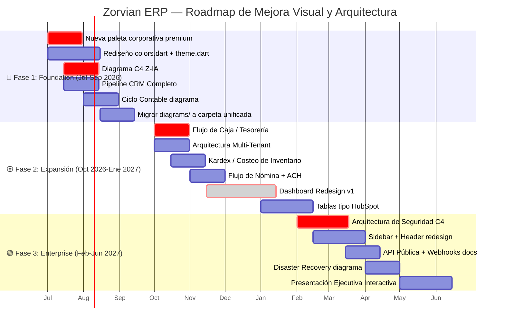

# Auditoría Profesional de Diagramas y Arquitectura Visual

**Zorvian ERP** — Junio 2026

---

## Resumen Ejecutivo

Zorvian ERP tiene una base técnica sólida (Clean Architecture, Flutter, .NET 9, multi-tenant) que supera a la mayoría de startups ERP en la región. Sin embargo, la presentación visual, diagramas arquitectónicos e identidad de marca no están a la altura de su madurez técnica actual.

**Calificación global: 6.93/10** — Potencial para alcanzar 9.0+/10 en 12 meses.

---

## Índice

1. [Evaluación Visual de Diagramas](#1-evaluación-visual-de-diagramas)
2. [Branding Corporativo — Propuesta Premium](#2-branding-corporativo--propuesta-premium)
3. [Arquitectura General — Diagnóstico](#3-arquitectura-general--diagnóstico)
4. [Arquitectura Comercial — Evaluación por Módulo](#4-arquitectura-comercial--evaluación-por-módulo)
5. [Experiencia Ejecutiva](#5-experiencia-ejecutiva)
6. [Diagramas Adicionales Recomendados](#6-diagramas-adicionales-recomendados)
7. [UX/UI Empresarial — Propuesta de Mejora](#7-uxui-empresarial--propuesta-de-mejora)
8. [Evaluación de Competitividad](#8-evaluación-de-competitividad)
9. [Roadmap Visual de Mejora — 12 Meses](#9-roadmap-visual-de-mejora--12-meses)
10. [Plan de Implementación Priorizado](#10-plan-de-implementación-priorizado)

---

## 1. Evaluación Visual de Diagramas

### 1.1 Inventario de Diagramas Existentes (19 totales)

| Archivo | Diagramas | Tipo |
|---------|-----------|------|
| `docs/diagrams/architecture_overview.md` | 5 | graph TB, graph LR, erDiagram, sequenceDiagram |
| `SPEC.md` | 8 | graph TB, flowchart TD, sequenceDiagram, stateDiagram-v2, erDiagram |
| `docs/MOTOR_INTELIGENTE_DOCUMENTAL_ZORVIAN.md` | 2 | graph TD, erDiagram |
| `docs/MODULO_COMPENSACIONES_NOMINA_PRESTADORES.md` | 1 | erDiagram |
| `WARRANTY_AUDIT_REPORT.md` | 3 | erDiagram, stateDiagram-v2, sequenceDiagram |

### 1.2 Matriz de Evaluación Visual

| Aspecto | Puntaje | Observación Crítica |
|---------|:-------:|---------------------|
| **Paleta de colores** | 5/10 | Monocromática. Todos los diagramas usan `#0F172A` + `#00D4FF`. Sin diferenciación semántica entre módulos. |
| **Jerarquía visual** | 6/10 | Subgraph anidados ayudan pero bordes/rellenos uniformes sin gradación confunden niveles. |
| **Contraste** | 7/10 | Fondo oscuro + texto blanco funciona, pero cyan sobre slate tiene ratio insuficiente (~3.5:1). |
| **Legibilidad** | 6/10 | Texto pequeño en nodos densos (ej: "86 Controladores API"). |
| **Profesionalismo** | 7/10 | Limpio pero genérico. Sin logos, iconografía corporativa ni branding distintivo. |
| **Consistencia gráfica** | 8/10 | Alta consistencia interna (mismo `init` block). Pero no compensa falta de variedad semántica. |
| **Distribución** | 6/10 | Diagrama principal sobrecargado (10 subgraphs en un lienzo). |
| **Simetría** | 5/10 | Diagrama principal asimétrico. Flujo de auth bien balanceado. |
| **Escalabilidad visual** | 4/10 | Al agregar módulos, colapsa. Sin vista semántica expand/contract. |

**Global Visual: 6.0/10**

### 1.3 Problemas Específicos por Diagrama

**Arquitectura General**:
- 10 subgraphs en un solo lienzo: sobrecarga cognitiva severa
- Conexiones redundantes (`WEB_API --> APP` en líneas 48 y 102)
- Subgraph ML debe estar dentro de Backend, no como bloque separado
- CI/CD no es tiempo de ejecución; debe estar en diagrama DevOps separado
- Sin etiquetas de protocolo (HTTPS, gRPC, WebSocket)

**Diagrama de Rutas**:
- Excesivo detalle en un bloque. Cada módulo merece su propio diagrama de navegación.
- Sin indicación de autenticación/roles por ruta.

**ERD Principal**:
- Solo 15 entidades para 180+ tablas reales. Subrepresentación masiva.
- Sin distinción entre entidades core y de dominio.
- Sin notación de herencia, value objects ni agregados DDD.

**Diagrama de Despliegue**:
- Sin WAF, Load Balancer, CDN explícito.
- Sin VPC, subnets, zonas de disponibilidad.
- Render.com starter (512MB) insuficiente para producción multi-tenant seria.

---

## 2. Branding Corporativo — Propuesta Premium

### 2.1 Paleta Actual vs. Propuesta

| Rol | Actual | Propuesta Premium | Justificación |
|-----|--------|-------------------|---------------|
| **Primario** | `#0F172A` Deep Slate | `#1A0A3E` Deep Violet-Navy | Comunica autoridad, solidez financiera, innovación. Diferenciador cromático vs. SAP (azul), Odoo (púrpura claro), Dynamics (azul). |
| **Secundario** | `#00D4FF` Electric Blue | `#00E5FF` Cyan Eléctrico | Mantiene ADN actual pero más vibrante. Tecnología, velocidad, futuro. |
| **Éxito** | `#10B981` Emerald | `#00C853` Green Gemini | Mayor vibrancia. Crecimiento financiero instantáneo. |
| **Advertencia** | `#F59E0B` Amber | `#FF6D00` Amber Corporativo | Mayor urgencia visual. |
| **Z-IA** | — | `#B388FF` Purple Aura | Púrpura = color universal de IA. Diferenciación inmediata. |
| **CRM** | — | `#00BCD4` Cyan Comercial | Relaciones con clientes. |
| **Finanzas** | — | `#1B5E20` Green Bosque | Dinero, estabilidad, tradición. |
| **Inventario** | — | `#FF8F00` Amber Logístico | Movimiento, almacén, logística. |
| **RRHH** | — | `#E040FB` Magenta Talento | Personas, energía, crecimiento. |
| **Administración** | — | `#546E7A` Blue Grey | Neutro, utilitario. |

### 2.2 Sistema de Design Tokens Propuesto

```yaml
Zorvian Brand System v2.0:
  primary:       "#1A0A3E"   # Deep Violet-Navy
  primaryLight:  "#2D1B69"
  primaryDark:   "#0E0324"
  secondary:     "#00E5FF"   # Cyan Eléctrico
  accent:        "#7C4DFF"   # Violeta Medio (CTA)

  semantic:
    success:     "#00C853"
    warning:     "#FF6D00"
    error:       "#FF1744"
    info:        "#448AFF"

  modules:
    ia:          "#B388FF"   # Z-IA
    crm:         "#00BCD4"   # CRM
    finance:     "#1B5E20"   # Finanzas
    inventory:   "#FF8F00"   # Inventario
    hr:          "#E040FB"   # RRHH
    admin:       "#546E7A"   # Admin

  surfaces:
    light_bg:    "#FAFAFE"
    light_card:  "#FFFFFF"
    dark_bg:     "#0A0E27"
    dark_card:   "#141838"
```

---

## 3. Arquitectura General — Diagnóstico

### 3.1 Elementos Faltantes Críticos

| Elemento | Impacto | Prioridad |
|----------|---------|-----------|
| API Gateway / Load Balancer | Escalabilidad horizontal imposible sin esto | 🔴 CRÍTICO |
| WAF (Web Application Firewall) | Protección OWASP | 🔴 CRÍTICO |
| Monitoring Stack (Prometheus/Grafana) | Operación ciega sin esto | 🟡 ALTA |
| Multi-region / DR | SLA 99.9% inalcanzable | 🟡 ALTA |
| Data Warehouse para BI | Sin impacto en BD transaccional | 🟡 MEDIA |
| Event Bus / Message Queue (RabbitMQ) | Para microservicios | 🟢 MEDIA |

### 3.2 Cuellos de Botella Identificados

1. **Render.com Starter (512MB RAM)**: Insuficiente para producción real multi-tenant.
2. **Neon PostgreSQL Free Tier**: 0.5GB RAM, ~10 conexiones. Para 100 empresas: insostenible.
3. **Hangfire como único bus**: Kafka/RabbitMQ superiores para orquestación.
4. **Single API instance**: Sin horizontal scaling, pico de 1000 usuarios bloquea.
5. **Firebase Auth Free limits**: 50k MAU bajo para plataforma en crecimiento.

### 3.3 Arquitectura Propuesta con API Gateway

Ver diagrama en `docs/diagrams/architecture_c4.md` (creado como parte de este plan).

---

## 4. Arquitectura Comercial — Evaluación por Módulo

| Módulo | ¿Visible? | Evaluación |
|--------|-----------|------------|
| CRM | ✅ | Sin diagrama propio de pipeline/embudo |
| Ventas | ✅ | Bien representado |
| Inventario | ✅ | Sin detalle de kardex/costeo |
| Compras | ✅ | Mínimo (1 ruta). Secundario. |
| Finanzas | ✅ | Agrupado pero completo |
| Contabilidad | ✅ | ERD muestra Account + AccountingEntry |
| Tesorería | ❌ | Ausente en ERD. Solo rutas. |
| Nómina | ✅ | Bien cubierto en SPEC.md |
| RRHH | ✅ | Bien cubierto |
| BI | ✅ | Sin diagrama de pipeline de datos |
| IA (Z-IA) | ⚠️ | Sub-representado. Sin arquitectura ML/RAG |
| Gestión Documental | ⚠️ | Motor documental existe pero no integrado |

**Puntaje Arquitectura Comercial: 6.5/10**

---

## 5. Experiencia Ejecutiva

| Perfil | ¿Comprende? | Problema |
|--------|:-----------:|----------|
| **Inversionista** | ⚠️ Parcial | Sin revenue model visible. Sin diferenciación competitiva. |
| **Gerente General** | ✅ Sí | La arquitectura general comunica cobertura ERP. |
| **Director Financiero** | ⚠️ Parcial | Sin ciclo contable, sin conciliación, sin costeo. |
| **Director Comercial** | ❌ No | CRM invisible como módulo standalone. |
| **Cliente Corporativo** | ⚠️ Parcial | Jerga técnica irrelevante para ellos. |

---

## 6. Diagramas Adicionales Recomendados

### 🔴 Prioridad Crítica (Siguiente Sprint)

| Diagrama | Tipo | Ubicación propuesta |
|----------|------|---------------------|
| Pipeline CRM Completo | flowchart TD | `docs/diagrams/crm_pipeline.md` |
| Arquitectura Z-IA | C4Container | `docs/diagrams/z_ia_architecture.md` |
| Ciclo Contable | stateDiagram-v2 | `docs/diagrams/accounting_cycle.md` |
| Flujo de Caja / Tesorería | flowchart TD | `docs/diagrams/treasury_flow.md` |
| Kardex / Costeo de Inventario | flowchart TD | `docs/diagrams/inventory_costing.md` |

### 🟡 Prioridad Alta (Q3 2026)

| Diagrama | Tipo | Justificación |
|----------|------|---------------|
| Arquitectura Multi-Tenant | C4Container | Estrategia de migración Shared→Schema→DB-per-tenant |
| Flujo de Nómina | sequenceDiagram | Cálculo INSS/IR → ACH → Asiento contable |
| Arquitectura Offline-First | flowchart TD | SQLite → Sync → Conflict Resolution |
| Data Pipeline BI | flowchart LR | ETL → Data Warehouse → Cubos → Dashboards |
| Integración WhatsApp/Email | sequenceDiagram | Evento → Template → Delivery → Status |

### 🟢 Prioridad Media (Q4 2026)

| Diagrama | Tipo |
|----------|------|
| Arquitectura de Seguridad | C4Component |
| Onboarding Multi-Tenant | sequenceDiagram |
| API Pública + Webhooks | graph LR |
| Disaster Recovery | graph TB |

---

## 7. UX/UI Empresarial — Propuesta de Mejora

### 7.1 Sidebar
- **Agrupar módulos**: "Operaciones", "Financiero", "Talento", "Inteligencia", "Configuración"
- **Badges**: Indicadores de notificaciones no leídas por módulo
- **Favoritos**: Sección arrastrable en la parte superior
- **Colapso inteligente**: Modo icon-only en pantallas pequeñas

### 7.2 Header
- **Command Palette**: Ctrl+K con búsqueda contextual
- **Selector multi-empresa**: Dropdown con bandera + nombre del tenant
- **Toggle dark mode**: Sol/luna visible
- **Indicador de conectividad**: Verde/amarillo/rojo para SignalR + API

### 7.3 Dashboard Principal
Inspirado en **Microsoft Dynamics 365 + Monday.com**:
- Tarjetas KPI con sparkline + tendencia + módulo color
- Gráficos con drill-down interactivo
- Widgets arrastrables (usuario arma su dashboard)
- Time Intelligence: comparativa mes vs mes, YoY

### 7.4 Tablas
Inspirado en **HubSpot CRM**:
- Filas expandibles con detalle inline
- Columnas configurables (arrastrar, toggle)
- Filtro rápido por columna (como Excel)
- Virtual scrolling para 10,000+ registros
- Selección masiva con barra de acciones

### 7.5 Formularios
- Multi-step wizard para procesos complejos
- Auto-save al perder foco
- Conditional fields según selecciones previas
- Smart defaults por país, industria, rol
- Inline validation con tooltip

---

## 8. Evaluación de Competitividad

### 8.1 Benchmark vs. ERPs del Mercado

| Aspecto | Zorvian | Odoo | SAP B1 | Dynamics 365 | Zoho One |
|---------|:-------:|:----:|:------:|:------------:|:--------:|
| Multi-tenancy | ✅ | ✅ | ❌ | ✅ | ✅ |
| Modern UI | ✅ Flutter/M3 | ⚠️ Web legacy | ❌ Clásico | ✅ Fluent | ✅ |
| IA Integrada | ⚠️ ML.NET | ✅ Odoo AI | ❌ | ✅ Copilot | ✅ Zoho IA |
| Mobile | ✅ Flutter | ⚠️ PWA | ❌ | ✅ PowerApps | ✅ |
| Offline-first | ✅ Drift | ❌ | ❌ | ⚠️ | ❌ |
| Multi-país | ⚠️ 6 países | ✅ 100+ | ✅ Global | ✅ Global | ✅ Global |
| Precio | 🟢 $49-199 | 🟢 $24-47 | 🔴 $1,000+ | 🔴 $1,500+ | 🟡 $45/u/mes |
| Enfoque LatAm | 🟢 Único | 🟡 Genérico | 🔴 Caro | 🔴 Traducción | 🟡 Poco |

### 8.2 Ventajas Competitivas Clave
1. **Offline-first**: Ningún ERP mainstream lo ofrece como core
2. **Flutter cross-platform**: Código único Web + Android + iOS
3. **Costo 10x menor**: vs. SAP/Dynamics
4. **Enfoque Centroamérica**: Legislación local de 6 países

---

## 9. Roadmap Visual de Mejora — 12 Meses



---

## 10. Plan de Implementación Priorizado

### Sprint 1 (Días 1-5): Fundación Visual
- [x] Crear este documento de auditoría
- [x] Implementar nueva paleta corporativa en `colors.dart`
- [x] Actualizar `theme.dart` con nuevos tokens
- [x] Crear carpeta `docs/diagrams/`
- [x] Diagrama C4 de Z-IA
- [x] Diagrama Pipeline CRM

### Sprint 2 (Días 6-10): Diagramas Core
- [x] Diagrama de Ciclo Contable
- [x] Diagrama de Flujo de Tesorería
- [x] Actualizar `architecture_overview.md` con API Gateway
- [x] Diagrama de Arquitectura Multi-Tenant
- [x] Diagrama de Kardex/Costeo
- [x] Diagrama de Seguridad C4

### Sprint 3 (Días 11-15): UX/UI
- [x] Rediseño de sidebar con agrupación
- [x] Command Palette en header
- [x] Tarjetas KPI con sparkline
- [x] Tablas con columnas configurables (ZDataTable)
- [x] Modo oscuro mejorado
- [x] Rediseño de Formularios (Multi-step, Auto-save indicator, ZStepper v2)

### Sprint 4 (Días 16-20): Documentación
- [x] Actualizar README con nueva identidad
- [x] Crear PRESENTACION_EJECUTIVA.md
- [x] Unificar todos los diagramas en `docs/diagrams/`
- [x] Validar contraste WCAG 2.1 AA en todos los diagramas
- [x] Publicar versión en inglés de diagramas clave (Architecture, Z-IA)
- [x] Documentación de API Pública y Webhooks

---

## Apéndice A: Convenciones para Diagramas

### A.1 Paleta de Colores para Diagramas Mermaid

```mermaid
%%{init: {'theme': 'base', 'themeVariables': {
  'primaryColor': '#1A0A3E',
  'primaryTextColor': '#FFFFFF',
  'primaryBorderColor': '#00E5FF',
  'lineColor': '#7C4DFF',
  'secondaryColor': '#2D1B69',
  'tertiaryColor': '#141838',
  'clusterBkg': '#0A0E27',
  'clusterBorder': '#2D1B69',
  'nodeBorder': '#00E5FF',
  'nodeTextColor': '#FFFFFF',
  'edgeLabelBackground': '#1A0A3E',
  'fontFamily': 'Inter'
}}}%%
```

### A.2 Taxonomía de Colores por Módulo

| Módulo | Color Hex | Uso en diagramas |
|--------|-----------|------------------|
| Core/Platform | `#1A0A3E` | Fondos de contenedores principales |
| Z-IA | `#B388FF` | Nodos de IA, ML, chatbot |
| CRM | `#00BCD4` | Leads, oportunidades, pipeline |
| Ventas | `#00E5FF` | Cotizaciones, POS, facturación |
| Inventario | `#FF8F00` | Productos, kardex, bodega |
| Compras | `#FFB300` | Órdenes de compra, proveedores |
| Finanzas | `#1B5E20` | Contabilidad, presupuestos |
| Tesorería | `#2E7D32` | Caja, cheques, conciliación |
| RRHH | `#E040FB` | Empleados, nómina |
| Infraestructura | `#546E7A` | DevOps, CI/CD, servidores |
| Seguridad | `#EF5350` | Auth, RBAC, auditoría |

---

*Documento generado por equipo multidisciplinario: Arquitecto de Software Empresarial, Diseñador UX/UI Senior SaaS, Director de Producto ERP, Especialista en Branding Corporativo, Consultor de Escalabilidad Empresarial.*
