# Módulo de Compensaciones, Nómina y Prestadores de Servicios

**Zorvian ERP v2.0**

| Versión | Fecha | Autor | Descripción |
|---------|-------|-------|-------------|
| 1.0 | 2026-06-10 | Arquitectura ERP | Documento funcional oficial |

---

## Tabla de Contenido

1. [Visión General](#1-visión-general)
2. [Objetivos](#2-objetivos)
3. [Alcance](#3-alcance)
4. [Arquitectura Funcional](#4-arquitectura-funcional)
5. [Casos de Uso](#5-casos-de-uso)
6. [Reglas de Negocio](#6-reglas-de-negocio)
7. [Modelo de Datos](#7-modelo-de-datos)
8. [Flujo de Procesos](#8-flujo-de-procesos)
9. [Integraciones ERP](#9-integraciones-erp)
10. [Contabilidad Automática](#10-contabilidad-automática)
11. [Configuración Multipaís](#11-configuración-multipaís)
12. [Seguridad](#12-seguridad)
13. [Dashboards](#13-dashboards)
14. [Experiencia de Usuario](#14-experiencia-de-usuario)
15. [Escalabilidad](#15-escalabilidad)
16. [Recomendaciones para Implementación](#16-recomendaciones-para-implementación)

---

## 1. Visión General

Zorvian ERP administra cualquier tipo de **Colaborador** que participe en la operación de la empresa, sin limitarse a la nómina tradicional de empleados formales.

### 1.1 Concepto Central: Colaborador

Un **Colaborador** es toda persona natural o jurídica que preste servicios a la empresa, independientemente de la naturaleza jurídica del vínculo. El sistema clasifica automáticamente las obligaciones, prestaciones, cálculos, retenciones y procesos según el tipo de colaborador.

### 1.2 Tipos de Colaborador

| Tipo | Naturaleza | Obligaciones Laborales | Prestaciones | Retenciones | Contrato |
|------|-----------|----------------------|-------------|-------------|----------|
| **Empleado** | Relación de dependencia | Completas | Aguinaldo, vacaciones, indemnización | INSS, IR | Laboral |
| **Prestador de Servicios** | Profesional independiente | Ninguna | Ninguna | IR (retención definitiva 10%) | Servicios profesionales |
| **Contratista** | Persona jurídica o natural con obra determinada | Ninguna | Ninguna | Ninguna (factura con IVA) | Contrato civil/mercantil |
| **Consultor** | Asesoría especializada | Ninguna | Ninguna | IR (retención definitiva) | Consultoría |
| **Freelancer** | Trabajo por tarea/proyecto | Ninguna | Ninguna | Según país | Servicios |
| **Comisionista** | Intermediación comercial | Ninguna | Ninguna | IR sobre comisiones | Comercial |
| **Temporal** | Relación de dependencia por tiempo definido | Completas (proporcionales) | Proporcionales | INSS, IR | Temporal |
| **Agente Comercial** | Representación de ventas | Ninguna | Ninguna | IR | Agencia |
| **Gestor de Cobranza** | Recuperación de cartera | Ninguna | Ninguna | IR | Gestión |
| **Técnico Externo** | Instalación/reparación | Ninguna | Ninguna | IR | Servicios técnicos |

### 1.3 Filosofía de Diseño

- **Unificación**: Un solo expediente por persona física/jurídica, independientemente del rol
- **Polimorfismo**: Cada tipo hereda comportamientos pero expone interfaces diferentes
- **Configuración sobre código**: Motores de reglas que permiten adaptación sin desarrollo
- **Multipaís nativo**: Reglas fiscales y laborales parametrizadas por país

---

## 2. Objetivos

### 2.1 Estratégicos

1. **Automatizar** el 100% del ciclo de compensación de todos los tipos de colaboradores
2. **Reducir** el tiempo de cierre de nómina de días a horas
3. **Eliminar** errores de cálculo manual en prestaciones y retenciones
4. **Garantizar** cumplimiento fiscal y laboral en todos los países de operación
5. **Proveer** visibilidad en tiempo real de costos laborales por área, proyecto y colaborador

### 2.2 Tácticos

1. Motor de comisiones configurable sin código
2. Motor de metas e incentivos con vinculación a resultados de negocio
3. Subsistema completo para prestadores de servicios sin relación de dependencia
4. Integración contable automática con generación de asientos
5. Dashboards ejecutivos con KPIs de desempeño y costo

### 2.3 Operativos

1. Expediente digital único por colaborador
2. Contratos parametrizables con generación automática
3. Cálculo de nómina en lotes paralelos para alto volumen
4. Exportación de pagos a archivos ACH/CSV por banco
5. Portal de autoservicio para colaboradores

---

## 3. Alcance

### 3.1 Incluye

| Componente | Descripción |
|-----------|-------------|
| **Expediente de Colaboradores** | Registro, consulta, edición, documentos, historial, bancario |
| **Clasificación de Colaboradores** | Los 10 tipos definidos + extensibilidad |
| **Gestión de Contratos** | Laborales, servicios, temporales, por proyecto |
| **Nómina Tradicional** | Salarios, horas extras, vacaciones, aguinaldo, liquidaciones, subsidios, retenciones |
| **Honorarios Profesionales** | Contratos de servicios, facturas recibidas, pagos, retenciones |
| **Anticipos** | Salariales y de honorarios |
| **Bonificaciones** | Fijas, variables, extraordinarias |
| **Comisiones** | Motor configurable por reglas |
| **Metas e Incentivos** | Motor empresarial de objetivos |
| **KPI y Desempeño** | Indicadores, rankings, reportes |
| **Prestadores de Servicios** | Subsistema completo de gestión |
| **Contabilidad Automática** | Asientos contables de nómina, comisiones, bonos |
| **Configuración Multipaís** | Nicaragua, Honduras, El Salvador, Guatemala, Costa Rica, Panamá |
| **Dashboards** | RH, Gerencia, Finanzas, Ventas, Cobranza |

### 3.2 Excluye (fases posteriores)

| Componente | Fase Estimada |
|-----------|--------------|
| Reclutamiento y selección | Fase 2 |
| Evaluación de desempeño 360 | Fase 2 |
| Sucesión y planes de carrera | Fase 3 |
| Clima organizacional y encuestas | Fase 3 |
| Capacitación y desarrollo | Fase 3 |

### 3.3 Usuarios del Sistema

| Rol | Responsabilidad |
|-----|----------------|
| Gerente General | Aprobaciones globales, dashboards ejecutivos |
| Recursos Humanos | Administración de colaboradores, nómina, contratos |
| Contabilidad | Asientos contables, retenciones, conciliación |
| Supervisor | Aprobación de metas, comisiones, evaluaciones |
| Vendedor | Consulta de comisiones, metas, ranking |
| Técnico | Consulta de pagos, órdenes de servicio |
| Prestador de Servicios | Portal de autoservicio, facturación, pagos |
| Administrador del Sistema | Configuración de parámetros, usuarios, permisos |

---

## 4. Arquitectura Funcional

### 4.1 Diagrama de Capas

```
┌──────────────────────────────────────────────────────────────────────────┐
│                         CANALES DE ACCESO                                 │
│  Web App (Flutter) │ Mobile App │ Portal Prestadores │ API Pública        │
└──────────────────────────────────────────────────────────────────────────┘
                                      │
┌──────────────────────────────────────────────────────────────────────────┐
│                        CAPA DE PRESENTACIÓN                               │
│  ┌──────────┐ ┌──────────┐ ┌──────────┐ ┌──────────┐ ┌──────────┐       │
│  │Dashboards│ │ Formularios│ │Reportes  │ │Rankings  │ │Mi Espacio│       │
│  └──────────┘ └──────────┘ └──────────┘ └──────────┘ └──────────┘       │
└──────────────────────────────────────────────────────────────────────────┘
                                      │
┌──────────────────────────────────────────────────────────────────────────┐
│                      CAPA DE NEGOCIO (APIs/Servicios)                     │
│                                                                           │
│  ┌──────────────────────────────────────────────────────────────────┐     │
│  │                    SUBSISTEMA DE NÓMINA                         │     │
│  │  ┌──────────┐ ┌──────────┐ ┌──────────┐ ┌──────────┐           │     │
│  │  │Tradicional│ │Honorarios│ │Anticipos │ │Bonos     │           │     │
│  │  └──────────┘ └──────────┘ └──────────┘ └──────────┘           │     │
│  └──────────────────────────────────────────────────────────────────┘     │
│                                                                           │
│  ┌──────────────────────────────────────────────────────────────────┐     │
│  │                SUBSISTEMA DE COMPENSACIONES                      │     │
│  │  ┌──────────┐ ┌──────────┐ ┌──────────┐ ┌──────────┐           │     │
│  │  │Comisiones│ │  Metas   │ │Incentivos│ │   KPIs   │           │     │
│  │  └──────────┘ └──────────┘ └──────────┘ └──────────┘           │     │
│  └──────────────────────────────────────────────────────────────────┘     │
│                                                                           │
│  ┌──────────────────────────────────────────────────────────────────┐     │
│  │              SUBSISTEMA DE PRESTADORES                           │     │
│  │  ┌──────────┐ ┌──────────┐ ┌──────────┐ ┌──────────┐           │     │
│  │  │Contratos │ │Proyectos│ │Entregables│ │  Pagos   │           │     │
│  │  └──────────┘ └──────────┘ └──────────┘ └──────────┘           │     │
│  └──────────────────────────────────────────────────────────────────┘     │
└──────────────────────────────────────────────────────────────────────────┘
                                      │
┌──────────────────────────────────────────────────────────────────────────┐
│                   MOTOR DE REGLAS (Rules Engine)                          │
│  ┌──────────┐ ┌──────────┐ ┌──────────┐ ┌──────────┐ ┌──────────┐       │
│  │Fiscales  │ │Laborales │ │Comisiones│ │  Metas   │ │Prestaciones│      │
│  │ (país)   │ │ (país)   │ │ (config) │ │(config)  │ │ (país)    │      │
│  └──────────┘ └──────────┘ └──────────┘ └──────────┘ └──────────┘       │
└──────────────────────────────────────────────────────────────────────────┘
                                      │
┌──────────────────────────────────────────────────────────────────────────┐
│                    CAPA DE INTEGRACIÓN ERP                                │
│  ┌──────────┐ ┌──────────┐ ┌──────────┐ ┌──────────┐ ┌──────────┐       │
│  │   CRM    │ │ Ventas   │ │Inventario│ │Garantías │ │Contabilidad│      │
│  └──────────┘ └──────────┘ └──────────┘ └──────────┘ └──────────┘       │
└──────────────────────────────────────────────────────────────────────────┘
                                      │
┌──────────────────────────────────────────────────────────────────────────┐
│                         CAPA DE DATOS                                     │
│  ┌──────────────────────────────────────────────────────────────────┐     │
│  │                    PostgreSQL 16 (Multi-tenant)                  │     │
│  │  ┌──────────┐ ┌──────────┐ ┌──────────┐ ┌──────────┐           │     │
│  │  │Colaboradores│ │ Nómina │ │Comisiones│ │Prestadores│          │     │
│  │  └──────────┘ └──────────┘ └──────────┘ └──────────┘           │     │
│  └──────────────────────────────────────────────────────────────────┘     │
│  ┌──────────────────────────────────────────────────────────────────┐     │
│  │                     Redis Cache                                   │     │
│  └──────────────────────────────────────────────────────────────────┘     │
└──────────────────────────────────────────────────────────────────────────┘
```

### 4.2 Patrón de Estrategia por País

```
PayrollCalculationFactory
├── NicaraguaCalculationStrategy
├── HondurasCalculationStrategy
├── ElSalvadorCalculationStrategy
├── GuatemalaCalculationStrategy
├── CostaRicaCalculationStrategy
└── PanamaCalculationStrategy
```

Cada estrategia implementa:

| Método | Propósito |
|--------|-----------|
| `CalculateINSS(employee, period)` | Deducción INSS del empleado |
| `CalculateINSSEmployer(employee, period)` | Aporte patronal INSS |
| `CalculateIR(grossPay, deductions, period)` | Retención IR |
| `CalculateAguinaldo(employee, year)` | Treceavo mes |
| `CalculateVacationPay(employee, days)` | Pago de vacaciones |
| `CalculateIndemnity(employee, years)` | Indemnización por despido |
| `CalculateProfessionalServiceWithholding(amount)` | Retención a prestadores |

### 4.3 Arquitectura del Motor de Comisiones

```
CommissionEngine
├── RuleEvaluator (evalúa condiciones)
│   ├── SaleAmountRule
│   ├── CollectionAmountRule
│   ├── ProfitMarginRule
│   ├── ProductLineRule
│   ├── ProductCategoryRule
│   ├── BrandRule
│   ├── BranchRule
│   ├── TeamRule
│   └── GoalComplianceRule
├── CommissionCalculator (calcula el monto)
│   ├── PercentageCalculator
│   ├── TieredCalculator (escalonada)
│   ├── FixedAmountCalculator
│   └── MixedCalculator (base + variable)
└── CommissionAccumulator (agrupa y provisiona)
    ├── ByPeriodAccumulator
    ├── BySalespersonAccumulator
    └── ByTeamAccumulator
```

### 4.4 Arquitectura del Motor de Metas

```
GoalEngine
├── GoalDefinition (define la meta)
│   ├── TargetType (ventas/cobranza/utilidad/calidad...)
│   ├── BaseLine (línea base)
│   ├── TargetValue (valor objetivo)
│   └── StretchValue (valor sobresaliente)
├── GoalTracker (rastrea el progreso)
│   ├── RealTimeTracker (conexión CRM/Ventas)
│   ├── PeriodTracker (cierre mensual/trimestral)
│   └── CumulativeTracker (YTD)
└── GoalEvaluator (evalúa el cumplimiento)
    ├── PercentageEvaluator
    ├── TieredEvaluator
    ├── GateEvaluator (condición habilitante)
    └── PartialEvaluator (metas parciales)
```

---

## 5. Casos de Uso

### 5.1 Gestión de Colaboradores

| ID | Caso de Uso | Actor | Descripción |
|----|------------|-------|-------------|
| CU-01 | Registrar Colaborador | RH | Captura datos personales, fiscales, bancarios y tipo de colaborador |
| CU-02 | Clasificar Colaborador | RH | Asigna tipo (empleado, prestador, etc.) con efectos automáticos |
| CU-03 | Adjuntar Documentos | RH | Sube documentos al expediente (cédula, RUC, CV, títulos) |
| CU-04 | Registrar Contrato | RH | Crea contrato laboral o de servicios según el tipo |
| CU-05 | Modificar Salario | RH | Cambia salario con historial de modificaciones |
| CU-06 | Terminar Relación | RH | Registra terminación con cálculo automático de liquidación |
| CU-07 | Consultar Expediente | RH/Gerencia | Visualiza expediente completo del colaborador |

### 5.2 Nómina

| ID | Caso de Uso | Actor | Descripción |
|----|------------|-------|-------------|
| CU-08 | Crear Período de Nómina | RH | Define período, frecuencia, fechas |
| CU-09 | Generar Nómina | Sistema | Calcula automáticamente salarios, deducciones, prestaciones, retenciones |
| CU-10 | Revisar Nómina | RH/Contabilidad | Valida resultados antes de aprobar |
| CU-11 | Aprobar Nómina | Gerencia | Aprueba nómina para pago |
| CU-12 | Pagar Nómina | Contabilidad | Marca como pagada, exporta ACH |
| CU-13 | Registrar Horas Extras | Supervisor | Registra horas extras del período |
| CU-14 | Calcular Liquidación | RH | Calcula liquidación por terminación |
| CU-15 | Solicitar Anticipo | Colaborador | Solicita anticipo salarial |
| CU-16 | Aprobar Anticipo | Supervisor | Aprueba/rechaza anticipo |
| CU-17 | Procesar Bonificación | RH | Registra bonificación fija/variable |

### 5.3 Comisiones

| ID | Caso de Uso | Actor | Descripción |
|----|------------|-------|-------------|
| CU-18 | Configurar Esquema de Comisión | RH/Gerencia | Define reglas de comisión (por venta, cobranza, utilidad, etc.) |
| CU-19 | Asignar Esquema a Vendedor | RH | Vincula esquema de comisión al colaborador |
| CU-20 | Calcular Comisiones | Sistema | Ejecuta motor de comisiones contra ventas del período |
| CU-21 | Revisar Comisiones | Supervisor | Valida comisiones calculadas |
| CU-22 | Aprobar Comisiones | Gerencia | Aprueba comisiones para pago en nómina |
| CU-23 | Consultar Comisiones | Vendedor | Visualiza comisiones generadas y su detalle |

### 5.4 Metas e Incentivos

| ID | Caso de Uso | Actor | Descripción |
|----|------------|-------|-------------|
| CU-24 | Crear Meta | Gerencia | Define objetivo, indicador, período, valor meta |
| CU-25 | Asignar Meta a Colaborador | Gerencia/Supervisor | Asigna meta a uno o varios colaboradores |
| CU-26 | Configurar Incentivo | RH/Gerencia | Define incentivo asociado al cumplimiento de meta |
| CU-27 | Evaluar Cumplimiento | Sistema | Calcula % de cumplimiento vs datos reales del ERP |
| CU-28 | Pagar Incentivo | Sistema | Genera bono en nómina cuando corresponde |
| CU-29 | Ver Progreso de Metas | Colaborador | Visualiza avance en tiempo real |

### 5.5 Prestadores de Servicios

| ID | Caso de Uso | Actor | Descripción |
|----|------------|-------|-------------|
| CU-30 | Registrar Prestador | RH/Compras | Registra prestador con datos fiscales y bancarios |
| CU-31 | Crear Contrato de Servicios | RH | Define alcance, entregables, hitos de pago, plazos |
| CU-32 | Definir Proyecto | Supervisor | Desglosa proyecto en fases y entregables |
| CU-33 | Registrar Entregable | Prestador/Supervisor | Marca entregable como completado |
| CU-34 | Aprobar Hito de Pago | Supervisor | Aprueba hito para facturación |
| CU-35 | Registrar Factura Recibida | Contabilidad | Ingresa factura del prestador al sistema |
| CU-36 | Programar Pago | Contabilidad | Programa fecha de pago |
| CU-37 | Ejecutar Pago | Sistema | Realiza pago y genera retención si aplica |

### 5.6 KPI y Desempeño

| ID | Caso de Uso | Actor | Descripción |
|----|------------|-------|-------------|
| CU-38 | Configurar KPI | RH/Gerencia | Define indicador, fórmula, fuente de datos, frecuencia |
| CU-39 | Generar Ranking | Sistema | Calcula ranking de vendedores, cobradores, técnicos |
| CU-40 | Visualizar Dashboard | Gerencia | KPIs en tiempo real, comparativas, tendencias |
| CU-41 | Exportar Reporte | Cualquier rol | Exporta reporte de desempeño a PDF/Excel |

---

## 6. Reglas de Negocio

### 6.1 Reglas Generales por Tipo de Colaborador

```
BN-GEN-01: El tipo de colaborador determina automáticamente el motor de
           compensación aplicable. No es posible asignar un motor incompatible.

BN-GEN-02: Un colaborador puede cambiar de tipo solo si no tiene períodos
           de nómina activos pendientes.

BN-GEN-03: Cada colaborador debe tener al menos un contrato activo para
           generar compensaciones.

BN-GEN-04: La información bancaria es obligatoria para procesar pagos.
           Si no existe, el sistema bloquea el proceso de pago.
```

### 6.2 Reglas de Nómina Tradicional (Empleados)

```
BN-NOM-01 (INSS):
  Nicaragua → INSS Laboral = MIN(salario * 0.07, techo_INSS)
           → INSS Patronal = MIN(salario * 0.225, techo_INSS_patronal)
  Honduras  → INSS no aplica (IHSS + RAP)
  Guatemala → IGSS = salario * 0.0483 (IGSS), + 0.01 (INTECAP) + 0.02 (IRATRA)
  etc. (por país)

BN-NOM-02 (IR):
  Nicaragua → IR = aplicar tabla progresiva IR anualizada
  Honduras   → ISR = tabla progresiva mensual
  El Salvador → ISSS + AFP + ISR

BN-NOM-03 (Aguinaldo):
  Nicaragua → 1 salario mínimo o proporcional (según años)
  Guatemala → Bono 14 (1 sueldo nominal, julio)
           + Aguinaldo (1 sueldo nominal, diciembre)

BN-NOM-04 (Vacaciones):
  Nicaragua → 15 días hábiles después de 6 meses
  Costa Rica → 2 semanas por año + bono de vacaciones (50% sobre salario)

BN-NOM-05 (Liquidación):
  Nicaragua → Despido injustificado = 1 mes + 1 semana por año (tope 5 meses)
           + preaviso no dado

BN-NOM-06 (Horas Extras):
  Nicaragua → Diurnas (6am-9pm) = 1.5x
           → Nocturnas (9pm-6am) = 2x
           → Horas extras en días feriados = 3x
           → Máximo 3 horas/día, 9 horas/semana
```

### 6.3 Reglas de Honorarios Profesionales

```
BN-HON-01: Prestadores de servicios están excluidos de INSS y prestaciones
           laborales. No generan aguinaldo, vacaciones ni indemnización.

BN-HON-02: Retención IR definitiva del 10% sobre el monto bruto facturado
           (Nicaragua). Variación por país.

BN-HON-03: Los pagos a prestadores requieren factura o comprobante fiscal.

BN-HON-04: Los pagos parciales se registran contra el contrato de servicios,
           no contra un período de nómina.
```

### 6.4 Reglas del Motor de Comisiones

```
BN-COM-01: Un colaborador puede tener múltiples esquemas de comisión
           activos simultáneamente. Se suman todos los resultados.

BN-COM-02: Esquemas de comisión pueden tener condiciones habilitantes
           (gate conditions). Ej: "Solo aplica si cobranza > 80%".

BN-COM-03: Comisiones escalonadas se evalúan por tramo, no sobre el total.

BN-COM-04: Comisiones de equipo se distribuyen según ponderación definida
           en el esquema.

BN-COM-05: Las comisiones se provisionan en el período de la transacción
           que las origina, aunque se paguen en el período siguiente.

BN-COM-06: Para comisión por cobranza, el cálculo se hace contra el monto
           efectivamente cobrado en el período, no contra lo facturado.

BN-COM-07: Devoluciones y notas de crédito descuentan comisiones ya
           calculadas en períodos anteriores (clawback).
```

### 6.5 Reglas de Metas e Incentivos

```
BN-MET-01: Las metas se definen sobre datos objetivos del ERP
           (ventas, cobranza, facturación, etc.), no sobre datos manuales.

BN-MET-02: Cada meta tiene un período de vigencia. Fuera de este, no se
           evalúa.

BN-MET-03: Metas pueden tener "condiciones de puerta": si no se cumple
           el mínimo habilitante, el incentivo es cero.

BN-MET-04: Metas pueden ser individuales, de equipo o mixtas (X% individual
           + Y% equipo).

BN-MET-05: El pago de incentivos se integra automáticamente a la nómina
           del período siguiente al de cierre de la meta.

BN-MET-06: Metas con cumplimiento > 100% pueden tener acelerador
           (porcentaje extra sobre el incentivo base).
```

### 6.6 Reglas de Prestadores de Servicios

```
BN-PRS-01: Todo prestador debe tener un contrato de servicios activo y
           vigente para recibir pagos.

BN-PRS-02: Los hitos de pago deben estar definidos en el contrato antes
           de registrar avances.

BN-PRS-03: No se puede pagar un hito sin que el entregable asociado esté
           aprobado.

BN-PRS-04: Facturas recibidas se concilian contra hitos de pago. Un hito
           no puede pagarse dos veces.

BN-PRS-05: La retención IR se calcula automáticamente al momento de
           programar el pago.

BN-PRS-06: Pagos parciales están permitidos solo si el contrato lo
           especifica.
```

### 6.7 Reglas de Contabilidad Automática

```
BN-CON-01: Cada concepto de nómina debe tener una cuenta contable asociada
           por defecto (configurable por empresa).

BN-CON-02: Los asientos se generan al aprobar la nómina, no al pagarla.

BN-CON-03: Los asientos de comisiones y bonos se generan por separado
           para mejor trazabilidad.

BN-CON-04: Asientos contables se generan en la moneda local de la empresa.
           Si hay diferencia cambiaria, se genera asiento adicional.

BN-CON-05: Anticipos se contabilizan como "Cuentas por Cobrar a
           Empleados" hasta su deducción completa.
```

---

## 7. Modelo de Datos

### 7.1 Diagrama Entidad-Relación (Mermaid)

```mermaid
erDiagram
    Collaborator {
        guid Id PK
        guid TenantId FK
        string CollaboratorCode UK
        string FirstName
        string LastName
        string Email
        string Phone
        string CollaboratorType "enum: employee, service_provider, contractor, consultant, freelancer, commission_agent, temporary, commercial_agent, collection_agent, external_technician"
        string TaxId "RUC/Cédula/NIT"
        string Nationality
        date BirthDate
        string Gender
        string MaritalStatus
        string Address
        string City
        string Department
        string Country
        string EmergencyContact
        string EmergencyPhone
        date RegistrationDate
        date TerminationDate
        string Status "active, inactive, suspended"
        string PhotoUrl
        string BankName
        string BankAccountNumber
        string BankAccountType
        string Notes
        datetime CreatedAt
        datetime UpdatedAt
        boolean IsDeleted
    }

    CollaboratorDocument {
        guid Id PK
        guid CollaboratorId FK
        string DocumentType "cedula, ruc, passport, resume, certificate, contract, other"
        string FileName
        string FileUrl
        date ExpirationDate
        string Notes
        datetime UploadedAt
    }

    CollaboratorHistory {
        guid Id PK
        guid CollaboratorId FK
        string ChangeType "salary_change, position_change, department_change, status_change, type_change"
        string OldValue
        string NewValue
        string ChangedBy
        datetime ChangedAt
    }

    Contract {
        guid Id PK
        guid CollaboratorId FK
        string ContractType "laboral, professional_services, temporary, project, commission, consultancy"
        string ContractNumber UK
        string ContractCode
        date StartDate
        date EndDate "nullable, open-ended if null"
        string Position
        string Department
        decimal BaseSalary
        string SalaryType "monthly, biweekly, weekly, hourly, per_project"
        string SalaryCurrency
        string PaymentFrequency
        string WorkingHours
        string Status "draft, active, expired, terminated"
        string ContractFileUrl
        string Terms
        string ApprovalFlowId
        datetime CreatedAt
    }

    PayrollPeriod {
        guid Id PK
        guid TenantId FK
        string Name
        int Year
        int Month
        int PeriodNumber
        string Frequency "weekly, biweekly, semi_monthly, monthly"
        date StartDate
        date EndDate
        date PaymentDate
        string Status "open, closed, approved, paid"
        string Currency
        decimal ExchangeRate
    }

    PayrollRun {
        guid Id PK
        guid PayrollPeriodId FK
        string RunType "salary, commission, bonus, settlement, professional_fees"
        string Status "draft, calculated, reviewed, approved, paid, cancelled"
        decimal TotalSalaries
        decimal TotalDeductions
        decimal TotalNetPay
        decimal TotalEmployerCosts
        decimal TotalCommissions
        decimal TotalBonuses
        decimal TotalProvisions
        int EmployeeCount
        string Notes
        guid ApprovedBy
        datetime ApprovedAt
        datetime CreatedAt
    }

    PayrollDetail {
        guid Id PK
        guid PayrollRunId FK
        guid CollaboratorId FK
        string CollaboratorType
        decimal BaseSalary
        decimal GrossPay "base + extras + commissions + bonuses"
        decimal TotalDeductions "INSS + IR + loans + advances"
        decimal NetPay
        string InssCode
        decimal InssDeduction
        decimal InssEmployerDeduction
        decimal IrDeduction
        decimal OtherDeductions
        decimal CommissionsAmount
        decimal BonusesAmount
        decimal OvertimeAmount
        decimal PaymentStatus "pending, paid, failed"
        string PaymentReference
        string BankAccount
        string Notes
    }

    PayrollDetailConcept {
        guid Id PK
        guid PayrollDetailId FK
        string ConceptCode
        string Description
        decimal Amount
        boolean IsEmployerCost
        string Category "earning, deduction, employer_cost, provision"
    }

    CommissionScheme {
        guid Id PK
        guid TenantId FK
        string Name
        string Description
        string CommissionType "sale, collection, profit, product_line, category, branch, brand, tiered, goal, team, mixed"
        string CalculationMethod "percentage, fixed, tiered, mixed"
        string Status "active, inactive"
        date EffectiveDate
        date ExpirationDate
        boolean IsTeamBased
        boolean RequiresMinimumGoal
        boolean ApplyClawback
        datetime CreatedAt
    }

    CommissionRule {
        guid Id PK
        guid CommissionSchemeId FK
        int Priority
        string ConditionType "sale_amount, collection_amount, profit_margin, product_line, category, brand, branch"
        string ConditionOperator "equals, greater_than, less_than, between, in, contains"
        string ConditionValue "JSON condition definition"
        string CalculationType "percentage, fixed, tiered"
        string CalculationValue "JSON calculation definition"
        decimal MinValue "for tiered calculations - floor"
        decimal MaxValue "for tiered calculations - ceiling"
        decimal Rate "percentage or fixed amount"
        string ApplyOn "gross, net, profit, collection"
    }

    CommissionAssignment {
        guid Id PK
        guid CommissionSchemeId FK
        guid CollaboratorId FK
        date EffectiveDate
        date ExpirationDate
        decimal TeamPercentage "if team-based, this member's share"
        boolean IsActive
    }

    CommissionRecord {
        guid Id PK
        guid CommissionAssignmentId FK
        guid PayrollRunId FK "nullable, until processed"
        guid SourceTransactionId "sale_id, collection_id, etc."
        string SourceType "sale, collection, invoice"
        decimal BaseAmount "amount that generated the commission"
        decimal CommissionAmount
        string CommissionRuleId
        string Description
        string Status "calculated, approved, paid, clawed_back"
        datetime TransactionDate
    }

    GoalDefinition {
        guid Id PK
        guid TenantId FK
        string Name
        string Description
        string GoalType "sales, collection, profit, billing, new_clients, warranties, services, deliveries, production, support"
        string MetricType "amount, count, percentage, ratio"
        string Frequency "monthly, quarterly, yearly, custom"
        int EvaluationPeriodDays
        string DataSource "crm, sales, inventory, warranties, service"
        string CalculationFormula
        boolean HasGateCondition
        string GateDescription
        string Status "active, inactive"
    }

    GoalAssignment {
        guid Id PK
        guid GoalDefinitionId FK
        guid CollaboratorId FK "nullable if team goal"
        guid TeamId FK "nullable if individual"
        decimal TargetValue
        decimal StretchValue
        decimal BaseLine
        decimal Weight "for multiple goals"
        decimal MinimumGate "minimum to qualify"
        date EffectiveDate
        date ExpirationDate
        string Status "active, completed, expired"
    }

    GoalProgress {
        guid Id PK
        guid GoalAssignmentId FK
        decimal CurrentValue
        decimal CompliancePercentage
        date EvaluationDate
        string PeriodKey "2026-01, 2026-Q1, etc."
        string Notes
    }

    Incentive {
        guid Id PK
        guid TenantId FK
        string Name
        string IncentiveType "bonus, commission_multiplier, fixed_amount, percentage_of_salary"
        decimal Value
        string Currency
        string PaymentTrigger "automatic, manual_approval"
        string Status
    }

    IncentivePayment {
        guid Id PK
        guid IncentiveId FK
        guid GoalAssignmentId FK
        guid CollaboratorId FK
        decimal Amount
        decimal CompliancePercentage
        decimal CalculatedAmount
        decimal Adjustments
        decimal FinalAmount
        string Status "pending, approved, paid"
        guid PayrollRunId FK
        datetime PaidAt
    }

    ServiceProvider {
        guid Id PK "same as Collaborator but with additional data"
        string BusinessName "razón social"
        string FiscalAddress
        string TaxRegime
        string ProfessionalLicense
        string Specialization
        string ServiceCategory "accounting, legal, programming, design, consulting, technical"
        string InsurancePolicy
        string InsuranceExpiration
    }

    ServiceContract {
        guid Id PK
        guid ServiceProviderId FK "collaborator id"
        string ContractNumber UK
        string ContractName
        string Scope "JSON description of scope"
        decimal TotalContractAmount
        string Currency
        string PaymentTerms
        string PaymentMilestones "JSON array of milestones"
        date StartDate
        date EndDate
        string Status "draft, active, completed, terminated"
        string ContractFileUrl
    }

    PaymentMilestone {
        guid Id PK
        guid ServiceContractId FK
        string Name
        string Description
        decimal Amount
        string DeliverableDescription
        date EstimatedDate
        date CompletionDate
        string Status "pending, in_progress, completed, approved, paid"
        string DeliverableFileUrl
    }

    ProviderInvoice {
        guid Id PK
        guid PaymentMilestoneId FK
        string InvoiceNumber
        date InvoiceDate
        decimal InvoiceAmount
        decimal WithholdingAmount
        decimal NetAmount
        string Currency
        string InvoiceFileUrl
        string Status "received, verified, approved, paid"
        date PaymentDate
        string PaymentReference
    }

    KpiDefinition {
        guid Id PK
        guid TenantId FK
        string Name
        string Description
        string KpiCategory "sales, collection, productivity, efficiency, profitability, quality, service"
        string Formula
        string DataSource
        string Frequency
        decimal TargetValue
        string Unit "% | currency | count | ratio"
        string VisualizationType "gauge, bar, line, number"
    }

    KpiRecord {
        guid Id PK
        guid KpiDefinitionId FK
        guid CollaboratorId FK "nullable"
        guid TeamId FK "nullable"
        guid BranchId FK "nullable"
        decimal ActualValue
        decimal TargetValue
        decimal CompliancePercentage
        date EvaluationDate
        string PeriodKey
    }

    Ranking {
        guid Id PK
        guid TenantId FK
        string RankingType "salesperson, collector, technician, branch"
        string PeriodKey
        int Position
        guid EntityId "collaborator or branch"
        string EntityName
        decimal Value
        decimal Growth "vs previous period"
    }

    AccountingEntry {
        guid Id PK
        string Module "payroll, commissions, bonuses, professional_fees, provisions"
        guid SourceId "payroll_run_id, etc."
        int JournalEntryNumber
        date EntryDate
        string Description
        string Status "draft, posted, cancelled"
        datetime CreatedAt
    }

    AccountingEntryLine {
        guid Id PK
        guid AccountingEntryId FK
        string AccountCode
        string AccountName
        decimal Debit
        decimal Credit
        string CostCenterId
        string CollaboratorId "nullable"
    }
```



### 7.2 Diccionario de Tipos de Colaborador

| Código | Tipo | Tabla Extendida | Motor de Compensación | Prestaciones |
|--------|------|----------------|----------------------|-------------|
| `employee` | Empleado | - | Nómina tradicional | Aguinaldo, vacaciones, indemnización |
| `service_provider` | Prestador de Servicios | `ServiceProvider` | Honorarios profesionales | Ninguna |
| `contractor` | Contratista | `ServiceProvider` | Facturas | Ninguna |
| `consultant` | Consultor | `ServiceProvider` | Honorarios profesionales | Ninguna |
| `freelancer` | Freelancer | `ServiceProvider` | Honorarios profesionales | Ninguna |
| `commission_agent` | Comisionista | - | Comisiones | Ninguna |
| `temporary` | Temporal | - | Nómina tradicional | Proporcionales |
| `commercial_agent` | Agente Comercial | - | Comisiones | Ninguna |
| `collection_agent` | Gestor de Cobranza | - | Comisiones | Ninguna |
| `external_technician` | Técnico Externo | `ServiceProvider` | Honorarios profesionales + Comisiones | Ninguna |

### 7.3 Catálogo de Conceptos de Nómina

| Código | Nombre | Tipo | Aplica INSS | Aplica IR | Es Costo Patronal |
|--------|--------|------|-------------|-----------|-------------------|
| `SAL_BASE` | Salario Base | Earning | Sí | Sí | No |
| `HE_DIURNA` | Hora Extra Diurna | Earning | Sí | Sí | No |
| `HE_NOCTURNA` | Hora Extra Nocturna | Earning | Sí | Sí | No |
| `HE_FERIADO` | Hora Extra Feriado | Earning | Sí | Sí | No |
| `COMISION` | Comisiones | Earning | Sí | Sí | No |
| `BONO_FIJO` | Bonificación Fija | Earning | Sí | Sí | No |
| `BONO_VAR` | Bonificación Variable | Earning | Sí | Sí | No |
| `ANTICIPO` | Anticipo Salarial | Deduction | No | No | No |
| `INSS_LAB` | INSS Laboral | Deduction | No | Sí (deducible) | No |
| `IR` | IR (Impuesto sobre Renta) | Deduction | No | No | No |
| `PRESTAMO` | Préstamo Personal | Deduction | No | No | No |
| `INSS_PAT` | INSS Patronal | EmployerCost | No | Sí (deducible) | Sí |
| `AGUINALDO` | Aguinaldo | Provision | No | No | Sí |
| `VACACIONES` | Vacaciones | Provision | No | No | Sí |
| `INDEMNIZACION` | Indemnización | Provision | No | No | Sí |
| `SUBSIDIO` | Subsidio INSS | Earning | No | No | No |
| `RET_HONOR` | Retención Honorarios | Deduction | No | Sí | No |

---

## 8. Flujo de Procesos

### 8.1 Flujo de Nómina Tradicional

```
┌─────────────────────────────────────────────────────────────────────────┐
│                       CICLO DE NÓMINA MENSUAL                            │
└─────────────────────────────────────────────────────────────────────────┘

┌──────────────┐
│  INICIO       │
│  (1er día)    │
└──────┬───────┘
       │
       ▼
┌──────────────────────┐
│ Crear Período         │
│ de Nómina             │
│ - Frecuencia          │
│ - Fechas              │
│ - Moneda              │
└──────┬───────────────┘
       │
       ▼
┌──────────────────────────────────┐
│ Registrar Novedades del Período   │
│ ┌──────────────────────────────┐  │
│ │ Nuevos ingresos              │  │
│ │ Retiros y suspensiones       │  │
│ │ Cambios salariales           │  │
│ │ Horas extras                 │  │
│ │ Ausencias y permisos         │  │
│ │ Incapacidades                │  │
│ │ Anticipos                    │  │
│ │ Préstamos                    │  │
│ │ Embargos                     │  │
│ └──────────────────────────────┘  │
└──────┬───────────────────────────┘
       │
       ▼
┌──────────────────────────────────────────────────────────────────────┐
│                                                                       │
│  ┌──────────────────────────────────────────────────────────────┐    │
│  │               CALCULAR NÓMINA AUTOMÁTICAMENTE                 │    │
│  │                                                               │    │
│  │  1. Filtrar colaboradores activos en el período               │    │
│  │  2. Calcular salario base (proporcional si ingreso/retiro)    │    │
│  │  3. Calcular horas extras                                     │    │
│  │  4. Calcular comisiones (integrar desde motor de comisiones)  │    │
│  │  5. Calcular incentivos (integrar desde motor de metas)       │    │
│  │  6. Calcular bonificaciones                                   │    │
│  │  7. Calcular INSS laboral (según país)                        │    │
│  │  8. Calcular IR (según tabla progresiva del país)             │    │
│  │  9. Aplicar deducciones (préstamos, anticipos, embargos)      │    │
│  │  10. Calcular INSS patronal                                   │    │
│  │  11. Procesar subsidios (incapacidades pagadas por INSS)      │    │
│  │  12. Generar provisiones (aguinaldo, vacaciones, indemnización)│    │
│  │                                                               │    │
│  └──────────────────────────────────────────────────────────────┘    │
│                                                                       │
└──────────────────────────┬───────────────────────────────────────────┘
                           │
                           ▼
┌──────────────────┐       ┌──────────────────┐
│ ¿Errores?        │──────>│ Corregir         │
│                  │       │ novedades        │
└──────┬───────────┘       └──────────────────┘
       │ No
       ▼
┌──────────────────────┐
│ Revisar y Validar     │
│ (RH + Contabilidad)   │
│ - Montos vs esperado  │
│ - Totales vs anterior │
│ - Variaciones         │
└──────┬───────────────┘
       │
       ▼
┌──────────────────────┐
│ ¿Aprobado?            │
└──────┬───────────────┘
       │
   ┌───┴───┐
   │       │
   │       │
   │       ▼
   │  ┌──────────────────────────────┐
   │  │ Enviar a aprobación           │
   │  │ (Gerente General o Finanzas) │
   │  │ - Notificación automática    │
   │  │ - Resumen ejecutivo          │
   └──┘                              │
      └──────────────┬───────────────┘
                     │
                     ▼
          ┌──────────────────┐
          │ ¿Aprueba?         │
          └──────┬───────────┘
                 │
                 ▼
          ┌──────────────────────────────────────────────┐
          │              GENERAR ASIENTO CONTABLE          │
          │                                                │
          │  Gasto por Salarios (Dr)     XXXX              │
          │  Gasto Horas Extras (Dr)     XXXX              │
          │  Gasto Comisiones (Dr)       XXXX              │
          │  Gasto INSS Patronal (Dr)    XXXX              │
          │  Gasto Bonos (Dr)            XXXX              │
          │  Provisiones (Dr)            XXXX              │
          │      INSS por Pagar (Cr)     XXXX              │
          │      IR por Pagar (Cr)       XXXX              │
          │      Sueldos por Pagar (Cr)  XXXX              │
          │      Cuotas Obreras (Cr)     XXXX              │
          │      Anticipos (Cr)          XXXX              │
          └──────────────────────────────────────────────┘
                     │
                     ▼
          ┌──────────────────────────────┐
          │       EJECUTAR PAGO           │
          │  - Exportar ACH bancario      │
          │  - Exportar CSV               │
          │  - Generar comprobantes       │
          │  - Enviar notificaciones      │
          └──────┬───────────────────────┘
                 │
                 ▼
          ┌──────────────────────────────┐
          │      REGISTRAR PAGO           │
          │  - Marcar nómina como pagada  │
          │  - Registrar fecha de pago    │
          │  - Vincular transacción       │
          │    bancaria                   │
          │  - Generar asiento de pago    │
          └──────────────────────────────┘
```

### 8.2 Flujo de Comisiones

```
┌─────────────────────────────────────────────────────────────────────────┐
│                         CICLO DE COMISIONES                              │
└─────────────────────────────────────────────────────────────────────────┘

┌──────────────┐
│  INICIO       │
│  (cierre mensual)│
└──────┬───────┘
       │
       ▼
┌──────────────────────────────────────────────┐
│ Obtener transacciones del período             │
│                                              │
│  ┌────────────────────────────────────────┐  │
│  │ Ventas cerradas (desde módulo Ventas)  │  │
│  │ Cobros registrados (desde Tesorería)   │  │
│  │ Facturación (desde módulo Facturación) │  │
│  │ Utilidades por venta (desde módulo     │  │
│  │   de Costos/Inventario)                │  │
│  └────────────────────────────────────────┘  │
└──────┬───────────────────────────────────────┘
       │
       ▼
┌──────────────────────────────────────────────┐
│ Evaluar reglas de comisión                    │
│                                              │
│  Para cada colaborador con esquema activo:   │
│  ┌────────────────────────────────────────┐  │
│  │ 1. Obtener transacciones del período   │  │
│  │    asignadas al colaborador            │  │
│  │ 2. Aplicar filtros del esquema         │  │
│  │    (producto, línea, categoría, etc.)  │  │
│  │ 3. Evaluar condiciones habilitantes    │  │
│  │ 4. Calcular comisión por cada regla    │  │
│  │ 5. Aplicar escalas (tiered si aplica)  │  │
│  │ 6. Sumar comisiones del período        │  │
│  └────────────────────────────────────────┘  │
└──────┬───────────────────────────────────────┘
       │
       ▼
┌──────────────────────────────────────────────┐
│ Generar registros de comisión                 │
│  - Por colaborador                           │
│  - Desglosado por transacción                │
│  - Desglosado por regla                      │
└──────┬───────────────────────────────────────┘
       │
       ▼
┌──────────────────────┐
│ Revisar comisiones    │
│ (Supervisor)          │
└──────┬───────────────┘
       │
       ▼
┌──────────────────────┐
│ ¿Aprueba?             │
└──────┬───────────────┘
       │
       ▼
┌──────────────────────────────────────────────┐
│ Integrar a la nómina del período              │
│  - Sumar al gross pay del colaborador         │
│  - Asociar como concepto COMISION             │
│  - Pagar junto con salario en nómina          │
└──────────────────────────────────────────────┘
```

### 8.3 Flujo de Metas e Incentivos

```
┌─────────────────────────────────────────────────────────────────────────┐
│                      CICLO DE METAS E INCENTIVOS                         │
└─────────────────────────────────────────────────────────────────────────┘

┌────────────────────────────────────┐
│ CONFIGURACIÓN INICIAL               │
│                                     │
│ 1. Definir tipo de meta             │
│ 2. Definir período de evaluación    │
│ 3. Definir valor meta               │
│ 4. Definir incentivo asociado       │
│ 5. Configurar fuente de datos       │
└────────────┬────────────────────────┘
             │
             ▼
┌────────────────────────────────────┐
│ ASIGNACIÓN                          │
│                                     │
│ 1. Seleccionar colaborador(es)      │
│ 2. Asignar meta                     │
│ 3. Configurar peso (si múltiples)   │
│ 4. Configurar condición puerta      │
└────────────┬────────────────────────┘
             │
             ▼
┌────────────────────────────────────┐
│ DURANTE EL PERÍODO                  │
│                                     │
│ - Tracking automático desde ERP     │
│ - Dashboard en tiempo real          │
│ - Alertas de cumplimiento           │
│ - Notificaciones semanales          │
└────────────┬────────────────────────┘
             │
             ▼
┌──────────────────────────────────────────────┐
│ CIERRE DEL PERÍODO                            │
│                                               │
│ 1. Congelar datos del período                 │
│ 2. Calcular % cumplimiento                    │
│ 3. Evaluar condición puerta                   │
│ 4. Calcular incentivo según tabla             │
│ 5. Acelerador si >100%                        │
│ 6. Generar registro de incentivo              │
└────────────┬──────────────────────────────────┘
             │
             ▼
┌──────────────────────┐
│ Revisar incentivos    │
│ (Supervisor)          │
└──────┬───────────────┘
       │
       ▼
┌──────────────────────────────────────────────┐
│ Integrar a la nómina (próximo período)        │
│  - Concepto BONO_VAR                          │
│  - Afecta INSS e IR según país                │
└──────────────────────────────────────────────┘
```

### 8.4 Flujo de Prestadores de Servicios

```
┌─────────────────────────────────────────────────────────────────────────┐
│                    CICLO DE PRESTADORES DE SERVICIOS                     │
└─────────────────────────────────────────────────────────────────────────┘

┌──────────────┐
│  INICIO       │
└──────┬───────┘
       │
       ▼
┌──────────────────────────────────────────────┐
│ 1. Registrar/Seleccionar Prestador            │
│    - Datos fiscales (RUC/NIT, régimen)        │
│    - Datos bancarios                          │
│    - Especialidad                             │
│    - Licencias y seguros                      │
└──────┬───────────────────────────────────────┘
       │
       ▼
┌──────────────────────────────────────────────┐
│ 2. Crear Contrato de Servicios                │
│    - Alcance del servicio                     │
│    - Monto total o estimado                   │
│    - Términos de pago                         │
│    - Definir hitos de pago                    │
│    - Definir entregables                      │
│    - Duración                                 │
└──────┬───────────────────────────────────────┘
       │
       ▼
┌──────────────────────────────────────────────┐
│ 3. Ejecutar (durante el período del contrato) │
│                                               │
│    ┌──────────────────────────────────────┐   │
│    │ Hito 1: Inicio del proyecto          │   │
│    │   └─ Entregable: Plan de trabajo     │   │
│    │   └─ Pago: 30%                       │   │
│    │                                       │   │
│    │ Hito 2: Desarrollo                   │   │
│    │   └─ Entregable: Módulo A            │   │
│    │   └─ Pago: 30%                       │   │
│    │                                       │   │
│    │ Hito 3: Finalización                 │   │
│    │   └─ Entregable: Proyecto completo   │   │
│    │   └─ Pago: 40%                       │   │
│    └──────────────────────────────────────┘   │
└──────┬───────────────────────────────────────┘
       │
       ▼
┌──────────────────────────────────────────────┐
│ 4. Por cada Hito:                             │
│                                               │
│    a. Prestador completa entregable           │
│       └─ Sube evidencia al sistema            │
│                                               │
│    b. Supervisor aprueba entregable           │
│       └─ Marca hito como completado           │
│                                               │
│    c. Prestador emite factura                 │
│       └─ Registra factura en sistema           │
│                                               │
│    d. Sistema calcula retención               │
│       └─ IR 10% (u otro según país)           │
│                                               │
│    e. Contabilidad programa pago              │
│       └─ Fecha de pago                        │
│                                               │
│    f. Sistema genera pago                     │
│       └─ ACH/Transferencia                    │
│       └─ Genera asiento contable              │
└──────────────────────────────────────────────┘
```

---

## 9. Integraciones ERP

### 9.1 Integración con CRM

| Evento CRM | Efecto en Compensaciones | Automatización |
|-----------|------------------------|----------------|
| Cliente nuevo registrado | Métrica para meta de "Clientes Nuevos" | Webhook en tiempo real |
| Oportunidad ganada | Posible comisión si el vendedor tiene esquema de comisión por venta cerrada | Webhook al cerrar oportunidad |
| Cliente asignado a vendedor | Asignación de comisiones futuras | Sincronización automática |
| Pipeline stage change | Tracking de progreso de meta | Actualización periódica |

**Interfaz Técnica:**

```
CRM → Sistema de Compensaciones
  POST /api/v1/commissions/events
  {
    "event_type": "opportunity_won" | "client_created",
    "source_id": "guid-de-la-oportunidad",
    "salesperson_id": "guid-del-vendedor",
    "amount": 15000.00,
    "currency": "NIO",
    "timestamp": "2026-06-10T14:30:00Z",
    "metadata": {
      "product_id": "guid",
      "category_id": "guid",
      "branch_id": "guid"
    }
  }
```

### 9.2 Integración con Ventas

| Evento Ventas | Efecto en Compensaciones | Automatización |
|--------------|------------------------|----------------|
| Factura emitida | Base para comisión por venta | Webhook al emitir factura |
| Factura anulada | Clawback de comisión | Webhook de anulación |
| Nota de crédito | Ajuste de comisión | Webhook de nota de crédito |
| Cobro registrado | Base para comisión por cobranza | Evento de tesorería |
| Utilidad de venta | Base para comisión por utilidad | Cálculo al cierre contable |

**Interfaz Técnica:**

```
Ventas → Sistema de Compensaciones
  POST /api/v1/commissions/sales
  {
    "sale_id": "guid",
    "invoice_id": "guid",
    "salesperson_id": "guid",
    "invoice_date": "2026-06-10",
    "invoice_amount": 15000.00,
    "currency": "NIO",
    "profit_amount": 4500.00,
    "profit_margin": 0.30,
    "products": [
      {
        "product_id": "guid",
        "product_name": "Servicio XYZ",
        "product_line": "Línea A",
        "category": "Categoría 1",
        "brand": "Marca X",
        "quantity": 1,
        "unit_price": 15000.00,
        "cost": 10500.00
      }
    ],
    "branch_id": "guid",
    "client_id": "guid"
  }
```

### 9.3 Integración con Inventario

| Evento Inventario | Efecto en Compensaciones | Automatización |
|-----------------|------------------------|----------------|
| Producto entregado | Métrica para meta de "Entregas Realizadas" | Evento de despacho |
| Categoría de producto vendido | Filtro para comisión por categoría | Sincronización de catálogo |
| Servicio completado | Hito para técnico externo | Evento de orden de servicio |

### 9.4 Integración con Garantías

| Evento Garantías | Efecto en Compensaciones | Automatización |
|----------------|------------------------|----------------|
| Caso de garantía resuelto | Métrica para meta de "Garantías Resueltas" | Webhook al cerrar caso |
| Tiempo de reparación registrado | KPI de eficiencia de técnico | Sincronización periódica |
| Satisfacción del cliente | Factor de ajuste de comisión/bono | Encuesta post-servicio |

### 9.5 Integración con Contabilidad

Ver sección [10. Contabilidad Automática](#10-contabilidad-automática).

---

## 10. Contabilidad Automática

### 10.1 Asientos de Nómina Tradicional

```
───────────────────────────────────────────────────────────────
Período: Junio 2026
Fecha: 30/06/2026
Descripción: Nómina Mensual - Junio 2026
───────────────────────────────────────────────────────────────
Cuenta                     | Débito      | Crédito       | CC
───────────────────────────────────────────────────────────────
Gastos de Personal         |             |               |
  Salarios Ordinarios      | 100,000.00  |               | CC-RH
  Horas Extras             |  15,000.00  |               | CC-RH
  Comisiones               |  25,000.00  |               | CC-Ventas
  Bonificaciones           |  10,000.00  |               | CC-RH
  INSS Patronal            |  28,125.00  |               | CC-RH
  Vacaciones               |   8,333.33  |               | CC-RH
  Aguinaldo                |   8,333.33  |               | CC-RH
  Indemnización            |   4,166.67  |               | CC-RH
                           |             |               |
Pasivos                    |             |               |
  INSS por Pagar           |             |   35,000.00   |
  IR por Pagar             |             |   12,500.00   |
  Sueldos por Pagar        |             |   85,000.00   |
  Cuotas Obreras           |             |    7,000.00   |
  Vacaciones por Pagar     |             |    8,333.33   |
  Aguinaldo por Pagar      |             |    8,333.33   |
  Indemnización por Pagar  |             |    4,166.67   |
                           |             |               |
  Ctas. x Cobrar           |             |               |
  Anticipos Empleados      |             |    3,000.00   |
  Préstamos Empleados      |             |    2,500.00   |
───────────────────────────────────────────────────────────────
TOTALES                    | 198,958.33  | 165,833.33   |
                           |             |               |
Diferencia (Bancos/        |             |   33,125.00   |
  Efectivo a desembolsar)  |             |               |
───────────────────────────────────────────────────────────────
```

### 10.2 Asientos de Honorarios Profesionales

```
───────────────────────────────────────────────────────────────
Período: Junio 2026
Fecha: 15/06/2026
Descripción: Pago Honorarios - Consultoría Legal
───────────────────────────────────────────────────────────────
Cuenta                     | Débito      | Crédito
───────────────────────────────────────────────────────────────
Gastos de Administración   |             |
  Servicios Profesionales  |  10,000.00  |
                           |             |
Pasivos                    |             |
  IR por Pagar (10%)       |             |   1,000.00
  Proveedores por Pagar    |             |   9,000.00
───────────────────────────────────────────────────────────────
TOTALES                    |  10,000.00  |  10,000.00
───────────────────────────────────────────────────────────────
```

### 10.3 Asientos de Comisiones

```
───────────────────────────────────────────────────────────────
Período: Junio 2026
Fecha: 30/06/2026
Descripción: Provisión de Comisiones - Junio 2026
───────────────────────────────────────────────────────────────
Cuenta                     | Débito      | Crédito
───────────────────────────────────────────────────────────────
Gastos de Ventas           |             |
  Comisiones por Pagar     |  25,000.00  |
                           |             |
Pasivos                    |             |
  Comisiones Acumuladas    |             |  25,000.00
───────────────────────────────────────────────────────────────
TOTALES                    |  25,000.00  |  25,000.00
───────────────────────────────────────────────────────────────

--- Al integrarse a nómina (contra el pasivo): ---

Pasivos                    |             |
  Comisiones Acumuladas    |  25,000.00  |
                           |             |
  Sueldos por Pagar        |             |  25,000.00
───────────────────────────────────────────────────────────────
```

### 10.4 Plantilla de Mapeo Contable

| Concepto | Cuenta Débito Por Defecto | Cuenta Crédito Por Defecto |
|----------|--------------------------|---------------------------|
| Salario Base | 6.01.01.01 Gastos de Personal - Salarios | 2.01.01.01 Sueldos por Pagar |
| Horas Extras | 6.01.01.02 Gastos de Personal - Horas Extras | 2.01.01.01 Sueldos por Pagar |
| Comisiones | 6.01.02.01 Gastos de Ventas - Comisiones | 2.01.01.02 Comisiones por Pagar |
| Bonificaciones | 6.01.01.03 Gastos de Personal - Bonificaciones | 2.01.01.01 Sueldos por Pagar |
| INSS Laboral | 2.01.02.01 INSS por Pagar | 2.01.01.01 Sueldos por Pagar |
| INSS Patronal | 6.01.01.04 Gastos de Personal - INSS Patronal | 2.01.02.01 INSS por Pagar |
| IR | 2.01.01.01 Sueldos por Pagar | 2.01.02.02 IR por Pagar |
| Anticipos | 1.01.03.01 Anticipos a Empleados | 2.01.01.01 Sueldos por Pagar |
| Préstamos | 1.01.03.02 Préstamos a Empleados | 2.01.01.01 Sueldos por Pagar |
| Aguinaldo | 6.01.01.05 Gastos de Personal - Aguinaldo | 2.01.01.03 Aguinaldo por Pagar |
| Vacaciones | 6.01.01.06 Gastos de Personal - Vacaciones | 2.01.01.04 Vacaciones por Pagar |
| Indemnización | 6.01.01.07 Gastos de Personal - Indemnización | 2.01.01.05 Indemnización por Pagar |
| Honorarios Profesionales | 6.01.03.01 Gastos de Administración - Servicios Profesionales | 2.01.03.01 Proveedores por Pagar |
| Retención Honorarios | 6.01.03.01 Gastos de Administración - Servicios Profesionales | 2.01.02.02 IR por Pagar |

**Configuración por Empresa:** La tabla anterior es la configuración por defecto. Cada empresa puede redefinir las cuentas contables según su catálogo (plan de cuentas). La configuración se almacena en la entidad `PayrollConcept` con su `AccountMappingId`.

---

## 11. Configuración Multipaís

### 11.1 Arquitectura de Configuración por País

```
CountryTaxConfig
├── CountryCode: "NI" | "HN" | "SV" | "GT" | "CR" | "PA"
├── Currency: "NIO" | "HNL" | "USD" | "GTQ" | "CRC" | "PAB"
├── InssEmployeeRate: decimal
├── InssEmployeeMax: decimal
├── InssEmployerRate: decimal
├── InssEmployerMax: decimal
├── IrTableJson: JSON (tramos de IR)
├── ProfessionalFeeWithholdingRate: decimal
├── ChristmasBonusPercentage: decimal
├── VacationDaysPerYear: int
├── VacationAccrualRate: decimal
├── SeveranceDaysPerYear: int
├── MaxSeveranceMonths: int
├── OvertimeRatesJson: JSON
├── MinimumWage: decimal
├── SubsidyRulesJson: JSON
```

### 11.2 Tabla Comparativa por País

| Regla | Nicaragua | Honduras | El Salvador | Guatemala | Costa Rica | Panamá |
|-------|-----------|----------|-------------|-----------|------------|--------|
| **Moneda** | NIO/C$ | HNL/L | USD/$ | GTQ/Q | CRC/₡ | PAB/B/. |
| **INSS/SS Empleado** | 7% (techo C$11,484) | IHSS 2.5% + RAP 2.5% | ISSS 3% + AFP 6.25% | IGSS 4.83% | CCSS 10.67% | CSS 10.75% |
| **INSS/SS Patronal** | 22.5% (techo) | IHSS 3.5% + RAP 2% | ISSS 6.75% + AFP 7.75% | IGSS 10.67% + INTECAP 1% + IRATRA 2% | CCSS 14.33% + 2% cada | CSS 12.25% |
| **IR/ISR Mínimo** | Mensual > C$17,000 | Mensual > HNL 24,396 | > $503.87/mes | Mensual > GTQ 5,000 | Mensual > CRC 929,000 | Mensual > PAB 11,000 |
| **Aguinaldo/Bono 14** | 1 salario mínimo o 30 días | 1 salario + 13vo + 14vo | 1 sueldo | Bono 14 (julio) + Aguinaldo (dic) | 1 sueldo (navidad) | 1 mes |

### 11.3 Motor de Reglas Fiscales

Cada país implementa una estrategia que extiende `IPayrollCalculationStrategy`:

```csharp
public interface IPayrollCalculationStrategy
{
    string CountryCode { get; }
    Task<InssResult> CalculateINSSAsync(Employee employee, PayrollPeriod period);
    Task<InssResult> CalculateINSSEmployerAsync(Employee employee, PayrollPeriod period);
    Task<IrResult> CalculateIRAsync(decimal grossPay, decimal deductibleDeductions, PayrollPeriod period);
    Task<decimal> CalculateAguinaldoAsync(Employee employee, int year);
    Task<decimal> CalculateVacationPayAsync(Employee employee, int days);
    Task<decimal> CalculateIndemnityAsync(Employee employee, int yearsOfService, TerminationType type);
    Task<decimal> CalculateProfessionalServiceWithholdingAsync(decimal amount);
    Task<decimal> CalculateOvertimeAsync(OvertimeRecord record);
    Task<SubsidyResult> CalculateSubsidiesAsync(Employee employee, PayrollPeriod period);
}
```

El `PayrollCalculationFactory` selecciona la estrategia según el país de la empresa:

```csharp
public class PayrollCalculationFactory
{
    private readonly Dictionary<string, IPayrollCalculationStrategy> _strategies;

    public PayrollCalculationFactory(IEnumerable<IPayrollCalculationStrategy> strategies)
    {
        _strategies = strategies.ToDictionary(s => s.CountryCode);
    }

    public IPayrollCalculationStrategy GetStrategy(string countryCode)
    {
        return _strategies.TryGetValue(countryCode, out var strategy)
            ? strategy
            : throw new NotSupportedException($"País {countryCode} no soportado");
    }
}
```

### 11.4 Configuración sin Código

Para agregar un nuevo país o modificar reglas sin cambiar código:

1. **Reglas de IR/ISR**: Tabla `RegionalTaxConfiguration` almacena tramos impositivos como registros con `CountryCode`, `TaxType`, `Rate`, `FromAmount`, `ToAmount`, `FixedAmount`, `EffectiveDate`.

2. **Parámetros de Prestaciones**: Tabla `CountryTaxConfig` almacena todos los parámetros como registro único por país.

3. **Fórmulas Personalizadas**: El sistema permite definir fórmulas de cálculo mediante un lenguaje de expresión simple (similar a Excel) que se evalúa en tiempo de ejecución.

4. **Reglas de Subsidios**: Configuración JSON que define condiciones de elegibilidad y montos.

---

## 12. Seguridad

### 12.1 Modelo de Permisos

```
Colaboradores
├── Colaborador.Ver
├── Colaborador.Crear
├── Colaborador.Editar
├── Colaborador.Eliminar
├── Colaborador.Documentos.Ver
├── Colaborador.Documentos.Subir
├── Colaborador.Documentos.Eliminar
├── Colaborador.Bancario.Ver
├── Colaborador.Bancario.Editar
├── Colaborador.Contrato.Ver
├── Colaborador.Contrato.Crear
├── Colaborador.Contrato.Firmar

Nómina
├── Nómina.Período.Ver
├── Nómina.Período.Crear
├── Nómina.Período.Cerrar
├── Nómina.Generar
├── Nómina.Revisar
├── Nómina.Aprobar
├── Nómina.Pagar
├── Nómina.Anular
├── Nómina.ExportarACH
├── Nómina.Detalle.Ver
├── Nómina.Detalle.Editar
├── Nómina.Anticipos.Gestionar
├── Nómina.Liquidaciones.Calcular

Comisiones
├── Comisiones.Esquema.Ver
├── Comisiones.Esquema.Configurar
├── Comisiones.Esquema.Asignar
├── Comisiones.Calcular
├── Comisiones.Revisar
├── Comisiones.Aprobar
├── Comisiones.Propias.Ver  (vendedor ve las suyas)

Metas e Incentivos
├── Metas.Definir
├── Metas.Asignar
├── Metas.Evaluar
├── Metas.Progreso.Ver
├── Incentivos.Configurar
├── Incentivos.Aprobar

Prestadores
├── Prestadores.Ver
├── Prestadores.Registrar
├── Prestadores.Contratos.Gestionar
├── Prestadores.Hitos.Aprobar
├── Prestadores.Facturas.Registrar
├── Prestadores.Pagos.Programar
├── Prestadores.Pagos.Ejecutar

Reportes y Dashboards
├── Reportes.Nómina.Ver
├── Reportes.Comisiones.Ver
├── Reportes.Metas.Ver
├── Reportes.KPI.Ver
├── Reportes.Costos.Ver
├── Dashboard.RH.Ver
├── Dashboard.Gerencial.Ver
├── Dashboard.Financiero.Ver
├── Dashboard.Ventas.Ver

Configuración
├── Configuración.País.Editar
├── Configuración.Conceptos.Editar
├── Configuración.Contable.Editar
├── Configuración.Permisos.Asignar
```

### 12.2 Matriz de Permisos por Rol

| Permiso | Gerente General | RRHH | Contabilidad | Supervisor | Vendedor | Técnico | Prestador |
|---------|:---------------:|:----:|:------------:|:----------:|:--------:|:-------:|:---------:|
| **Colaboradores** | | | | | | | |
| Ver | Sí | Sí | Sí | Sí (su equipo) | No | No | Sí (solo perfil) |
| Crear/Editar | Sí | Sí | No | No | No | No | No |
| Documentos | Sí | Sí | No | No | No | No | Sí (solo subir) |
| **Nómina** | | | | | | | |
| Ver períodos | Sí | Sí | Sí | No | No | No | No |
| Generar | No | Sí | No | No | No | No | No |
| Aprobar | Sí | No | No | No | No | No | No |
| Pagar | Sí | No | Sí | No | No | No | No |
| Detalle empleados | Sí | Sí | Sí | Sí (su equipo) | No | No | No |
| **Comisiones** | | | | | | | |
| Configurar esquemas | Sí | Sí | No | Sí (su equipo) | No | No | No |
| Calcular | No | Sí | No | No | No | No | No |
| Revisar | Sí | Sí | No | Sí (su equipo) | No | No | No |
| Ver propias | No | No | No | No | Sí | Sí | No |
| **Metas** | | | | | | | |
| Definir | Sí | No | No | Sí | No | No | No |
| Ver progreso propio | No | No | No | No | Sí | Sí | No |
| **Prestadores** | | | | | | | |
| Registrar | Sí | Sí | Sí | No | No | No | No |
| Hitos (aprobar) | Sí | No | No | Sí | No | No | No |
| **Dashboards** | | | | | | | |
| RH | Sí | Sí | Sí | No | No | No | No |
| Gerencial | Sí | No | Sí | No | No | No | No |
| Ventas | Sí | No | No | Sí | Sí | No | No |

### 12.3 Principios de Seguridad

1. **Segregación de funciones**: Separación clara entre quien genera, revisa, aprueba y paga la nómina. Ningún rol tiene todos los permisos.
2. **Mínimo privilegio**: Cada rol tiene solo los permisos necesarios para su función.
3. **Auditoría completa**: Cada acción sobre datos sensibles queda registrada en `AuditLog` con `OldValue`, `NewValue`, `ChangedBy`, `Timestamp`.
4. **Aislamiento por tenant**: Todos los datos están aislados por `TenantId`. Un usuario de una empresa no puede ver datos de otra.
5. **Confidencialidad salarial**: Los datos salariales son visibles solo para RH, Gerencia y Contabilidad. Los supervisores ven solo resúmenes agregados.
6. **Aprobaciones multicapa**: Las nóminas requieren aprobación de RH + Gerencia antes de pagarse.

---

## 13. Dashboards

### 13.1 Dashboard de Recursos Humanos

```
┌─────────────────────────────────────────────────────────────────────────┐
│  DASHBOARD RH                                                    [Hoy]  │
├─────────────────────────────────────────────────────────────────────────┤
│ ┌──────────────┐ ┌──────────────┐ ┌──────────────┐ ┌──────────────┐     │
│ │   Total       │ │   Nómina      │ │   Costo por   │ │   Rotación    │     │
│ │ Colaboradores  │ │   del Mes     │ │  Colaborador  │ │   Mensual     │     │
│ │     142       │ │  C$ 2,145,000 │ │   C$ 15,105  │ │     2.8%      │     │
│ │  ▲ 3 vs mes   │ │  ▼ 2.1% vs   │ │   ▲ 1.2% vs  │ │   ▼ 0.5% vs  │     │
│ │    anterior   │ │    anterior   │ │    anterior   │ │    anterior   │     │
│ └──────────────┘ └──────────────┘ └──────────────┘ └──────────────┘     │
│                                                                          │
│ ┌─────────────────────────────┐  ┌─────────────────────────────┐        │
│ │ Distribución por Tipo       │  │ Composición de la Nómina    │        │
│ │                             │  │                             │        │
│ │ Empleados:      98 (69%)   │  │ Salarios:       65%         │        │
│ │ Prestadores:     22 (15%)  │  │ Comisiones:     18%         │        │
│ │ Comisionistas:   12 (9%)   │  │ Horas Extras:    5%         │        │
│ │ Contratistas:     6 (4%)   │  │ Bonos:           8%         │        │
│ │ Otros:            4 (3%)   │  │ Prestaciones:    4%         │        │
│ └─────────────────────────────┘  └─────────────────────────────┘        │
│                                                                          │
│ ┌──────────────────────────────────────────────────────────────────┐    │
│ │ Costo Laboral por Departamento                                   │    │
│ │ ████████████████████████████████████ Ventas      C$ 850,000     │    │
│ │ ██████████████████████████         Operaciones  C$ 620,000      │    │
│ │ ███████████████████                Marketing    C$ 320,000      │    │
│ │ ███████████████                    Admin/Fin   C$ 290,000       │    │
│ │ █████████                          TI          C$ 195,000       │    │
│ │ █████                              RRHH        C$ 120,000       │    │
│ └──────────────────────────────────────────────────────────────────┘    │
│                                                                          │
│ ┌─────────────────────────────┐  ┌─────────────────────────────┐        │
│ │ Próximos Vencimientos       │  │ Solicitudes Pendientes      │        │
│ │                             │  │                             │        │
│ │ Vacaciones:      5 aprob.   │  │ Anticipos:     3           │        │
│ │ Contratos:       3 expiran  │  │ Vacaciones:     5           │        │
│ │ Períodos abiertos: 1        │  │ Permisos:       7           │        │
│ └─────────────────────────────┘  └─────────────────────────────┘        │
└─────────────────────────────────────────────────────────────────────────┘
```

### 13.2 Dashboard Gerencial

```
┌─────────────────────────────────────────────────────────────────────────┐
│  DASHBOARD GERENCIAL                                              [Q2]  │
├─────────────────────────────────────────────────────────────────────────┤
│ ┌──────────────┐ ┌──────────────┐ ┌──────────────┐ ┌──────────────┐     │
│ │  Costo Laboral│ │ % de Nómina  │ │  Costo por    │ │  Retorno     │     │
│ │   Total       │ │ vs Ingresos  │ │  Colaborador  │ │  por C$1     │     │
│ │ C$ 2,145,000  │ │    31.2%     │ │  C$ 15,105   │ │   C$ 5.20    │     │
│ └──────────────┘ └──────────────┘ └──────────────┘ └──────────────┘     │
│                                                                          │
│ ┌──────────────────────────────────────────────────────────────────┐    │
│ │ Tendencias de Costo Laboral (YTD)                                │    │
│ │                                                                  │    │
│ │ 2.2M ┤                                    ┌───                    │    │
│ │ 2.0M ┤                           ┌───┐   │                       │    │
│ │ 1.8M ┤               ┌─────┐   │   │   │                       │    │
│ │ 1.6M ┤   ┌──────┐   │     │   │   │   │                       │    │
│ │       └───┴──────┴───┴─────┴───┴───┴───┴───────────────────────    │
│ │       Ene  Feb  Mar  Abr  May  Jun  Jul  Ago  Sep  Oct  Nov  Dic    │
│ └──────────────────────────────────────────────────────────────────┘    │
│                                                                          │
│ ┌─────────────────────────────┐  ┌─────────────────────────────┐        │
│ │ Ranking de Rentabilidad     │  │ Cumplimiento de Metas       │        │
│ │ por Colaborador (Top 5)    │  │ Global por Departamento     │        │
│ │ 1. Vendedor A    323%      │  │ Ventas:        87%          │        │
│ │ 2. Vendedor B    298%      │  │ Cobranza:      92%          │        │
│ │ 3. Vendedor C    245%      │  │ Operaciones:   78%          │        │
│ │ 4. Vendedor D    210%      │  │ Producción:    65%          │        │
│ │ 5. Vendedor E    198%      │  │ Servicio:      95%          │        │
│ └─────────────────────────────┘  └─────────────────────────────┘        │
└─────────────────────────────────────────────────────────────────────────┘
```

### 13.3 Dashboard de Ventas (Comisiones)

```
┌─────────────────────────────────────────────────────────────────────────┐
│  DASHBOARD DE VENTAS Y COMISIONES                                 [Jun] │
├─────────────────────────────────────────────────────────────────────────┤
│ ┌──────────────┐ ┌──────────────┐ ┌──────────────┐ ┌──────────────┐     │
│ │   Ventas       │ │  Comisiones   │ │   % Comisión  │ │   Meta       │     │
│ │   del Mes      │ │   del Mes     │ │   Promedio    │ │   del Mes    │     │
│ │ C$ 4,850,000  │ │  C$ 242,500  │ │    5.0%       │ │  C$ 5,000,000│     │
│ │   ▲ 12% vs    │ │   ▲ 15% vs   │ │   ▲ 0.3% vs  │ │   97%        │     │
│ │    anterior   │ │    anterior   │ │    anterior   │ │   cumplido   │     │
│ └──────────────┘ └──────────────┘ └──────────────┘ └──────────────┘     │
│                                                                          │
│ ┌──────────────────────────────────────────────────────────────────┐    │
│ │ Ranking de Vendedores                                    [Mes]   │    │
│ │ # │ Vendedor     │ Ventas     │ Comisión │ Meta   │ %Cumpl.     │    │
│ │ ──┼──────────────┼────────────┼──────────┼────────┼───────────  │    │
│ │ 1 │ Pérez, Juan  │ C$ 580K    │ C$ 34.8K │ C$ 500K│ 116% ▲      │    │
│ │ 2 │ García, Ana  │ C$ 520K    │ C$ 31.2K │ C$ 500K│ 104% ▲      │    │
│ │ 3 │ López, Carlos│ C$ 490K    │ C$ 24.5K │ C$ 500K│  98%        │    │
│ │ 4 │ Martínez, L  │ C$ 410K    │ C$ 20.5K │ C$ 500K│  82%        │    │
│ │ 5 │ Rodríguez, M │ C$ 380K    │ C$ 19.0K │ C$ 450K│  84%        │    │
│ └──────────────────────────────────────────────────────────────────┘    │
│                                                                          │
│ ┌─────────────────────────────┐  ┌─────────────────────────────┐        │
│ │ Comisiones por Tipo         │  │ Ventas por Producto         │        │
│ │                             │  │                             │        │
│ │ Por venta:      C$ 180,000 │  │ Producto A     C$ 1,200,000 │        │
│ │ Por cobranza:   C$  42,500 │  │ Producto B     C$   950,000 │        │
│ │ Por utilidad:   C$  20,000 │  │ Servicio X     C$   800,000 │        │
│ └─────────────────────────────┘  └─────────────────────────────┘        │
└─────────────────────────────────────────────────────────────────────────┘
```

### 13.4 KPIs Técnicos

| KPI | Fórmula | Frecuencia | Unidad |
|-----|---------|-----------|--------|
| Costo Laboral / Ventas | Total Nómina / Total Ventas Netas | Mensual | % |
| Eficiencia de Comisiones | Total Comisiones / Total Ventas Netas | Mensual | % |
| Productividad por Colaborador | Ventas Netas / Número de Vendedores | Mensual | Monto |
| Cumplimiento de Metas | ∑(Meta Alcanzada) / ∑(Meta Asignada) | Mensual | % |
| Rotación de Personal | (Bajas del Mes / Total Colaboradores) × 100 | Mensual | % |
| Costo por Contratación | Total Costos de Contratación / Nuevos Colaboradores | Trimestral | Monto |
| Retorno en Compensación | (Ventas Generadas - Costo Total Colaborador) / Costo Total Colaborador | Mensual | Ratio |
| Tiempo de Cierre de Nómina | Fecha Pago - Fecha Cierre del Período | Mensual | Días |
| Índice de Clawback | Comisiones Clawback / Total Comisiones | Mensual | % |
| Prestadores Activos | Prestadores con contratos vigentes | Mensual | Conteo |

---

## 14. Experiencia de Usuario

### 14.1 Principios de Diseño

| Principio | Descripción |
|-----------|-------------|
| **Extremadamente Simple** | Cada pantalla resuelve una sola tarea. Sin información innecesaria. |
| **Nivel Empresarial** | Diseño profesional, consistente, con jerarquía visual clara. |
| **Mínimos Clics** | Las acciones más frecuentes se realizan en ≤ 3 clics desde cualquier pantalla. |
| **Configuración Visual** | Los administradores configuran reglas de comisión, metas y conceptos mediante interfaces visuales, no código. |
| **Escalable** | La interfaz funciona igual con 5 o 5,000 colaboradores. |
| **Responsive** | Adaptable a cualquier resolución de escritorio (1024px - 2560px). |
| **Mobile First** | Diseñado primero para mobile; la versión desktop es una expansión. |

### 14.2 Flujo de Pantallas Principales

```
APP SHELL
├── Dashboard (rol-based)
├── Colaboradores
│   ├── Lista (búsqueda + filtros + exportar)
│   ├── Detalle
│   │   ├── Información General
│   │   ├── Datos Fiscales
│   │   ├── Información Bancaria
│   │   ├── Documentos
│   │   ├── Contratos
│   │   └── Historial
│   └── Formulario (crear/editar)
│
├── Nómina
│   ├── Dashboard de Nómina
│   ├── Períodos
│   │   └── Detalle del Período
│   ├── Generar Nómina
│   ├── Revisar Nómina
│   │   └── Detalle por Colaborador
│   ├── Pagar Nómina
│   └── Reportes
│
├── Comisiones
│   ├── Dashboard de Comisiones
│   ├── Esquemas
│   │   ├── Configurador Visual
│   │   └── Asignaciones
│   ├── Calcular Comisiones
│   ├── Revisar y Aprobar
│   └── Mis Comisiones (vendedor)
│
├── Metas
│   ├── Dashboard de Metas
│   ├── Definir Metas
│   ├── Asignar Metas
│   ├── Seguimiento (progreso)
│   └── Mis Metas (colaborador)
│
├── Prestadores
│   ├── Lista de Prestadores
│   ├── Detalle del Prestador
│   ├── Contratos de Servicios
│   │   └── Hitos y Entregables
│   ├── Facturas Recibidas
│   └── Pagos
│
└── Reportes y Rankings
    ├── Ranking de Vendedores
    ├── Ranking de Cobradores
    ├── Ranking de Técnicos
    ├── Ranking de Sucursales
    └── Reportes Exportables
```

### 14.3 Portal de Autoservicio

Cada colaborador (incluyendo prestadores) tiene un portal donde puede:

| Funcionalidad | Empleado | Prestador | Comisionista |
|--------------|:--------:|:---------:|:------------:|
| Ver información personal | Sí | Sí | Sí |
| Actualizar datos bancarios | Sí | Sí | Sí |
| Ver recibos de pago | Sí | Sí | Sí |
| Solicitar anticipo | Sí | No | Sí |
| Solicitar vacaciones | Sí | No | No |
| Ver comisiones generadas | No | No | Sí |
| Ver progreso de metas | Sí | No | Sí |
| Subir facturas | No | Sí | No |
| Subir entregables | No | Sí | No |
| Ver historial de pagos | Sí | Sí | Sí |

---

## 15. Escalabilidad

### 15.1 Estrategia de Escalabilidad

| Dimensión | Estrategia | Detalle |
|-----------|-----------|---------|
| **Volumen de colaboradores** | Particionamiento horizontal | Tabla `employees` particionada por `TenantId` con índices compuestos. Consultas de nómina con filtro de tenant obligatorio. |
| **Volumen de transacciones** | Procesamiento por lotes | Las nóminas se calculan en lotes de 500 colaboradores mediante Hangfire jobs paralelizados. |
| **Multi-empresa** | Aislamiento por TenantId | Cada operación de base de datos filtra por `TenantId`. Las migraciones son compatibles con multi-tenant. |
| **Retención de datos** | Archivado automático | Nóminas > 12 meses se archivan a tablas de histórico con partición por mes. |
| **Alta disponibilidad** | PostgreSQL con replicación | Lecturas en réplicas, escrituras en primaria. Redis como caché de sesiones y configuraciones. |
| **Cálculos complejos** | Procesamiento asíncrono | Cálculos de nómina, comisiones y metas ejecutados como Hangfire background jobs con notificación SignalR al completar. |

### 15.2 Estimaciones de Rendimiento

| Operación | Volumen | Tiempo Estimado |
|-----------|---------|-----------------|
| Carga de lista de colaboradores | 5,000 registros | < 2 segundos |
| Cálculo de nómina mensual | 500 empleados | < 30 segundos |
| Cálculo de comisiones | 200 vendedores, 10,000 transacciones | < 45 segundos |
| Generación de ranking mensual | 500 colaboradores | < 10 segundos |
| Reporte de costos laborales | 12 meses, 500 colaboradores | < 15 segundos |
| Dashboard ejecutivo | 500 colaboradores | < 5 segundos |

### 15.3 Manejo de Alta Concurrencia

- Locking optimista en Entity Framework Core para evitar conflictos en ediciones concurrentes de nómina.
- `Serializable` transaction isolation level para cálculos de nómina.
- Redis distributed lock para evitar doble generación de nómina en el mismo período.
- Idempotencia en webhooks de integración (CRM/Ventas) para evitar duplicación de comisiones.

---

## 16. Recomendaciones para Implementación en Zorvian ERP

### 16.1 Estado Actual vs. Objetivo

| Componente | Estado Actual (v1.0) | Estado Objetivo (v2.0) | Prioridad |
|-----------|---------------------|-----------------------|-----------|
| Colaboradores | Solo `Employee` | 10 tipos + extensibilidad | **Alta** |
| Nómina tradicional | Completa (madurez 95%) | Mantener y expandir | **Alta** |
| Comisiones | `CommissionRecord` básico | Motor configurable completo | **Alta** |
| Metas e Incentivos | No existe | Motor empresarial completo | **Alta** |
| Prestadores de Servicios | No existe | Subsistema completo | **Media** |
| KPI y Desempeño | Dashboard Service básico | Rankings, indicadores, reportes | **Media** |
| Multipaís | Nicaragua implementado | 6 países de Centroamérica | **Alta** |
| Contabilidad automática | Integración contable existente | Asientos detallados por concepto | **Alta** |

### 16.2 Plan de Implementación Sugerido

#### Fase 1 - Fundación (Semanas 1-4)

```
┌──────────────────────────────────────────────────────────────────┐
│ FASE 1: FUNDACIÓN                                                │
├──────────────────────────────────────────────────────────────────┤
│                                                                  │
│ 1. Extender modelo de datos:                                     │
│    - Refactorizar Employee → Collaborator (con tipo)             │
│    - Crear tablas: ServiceProvider, ServiceContract,             │
│      PaymentMilestone, ProviderInvoice                           │
│    - Crear tablas: GoalDefinition, GoalAssignment,               │
│      GoalProgress, Incentive, IncentivePayment                   │
│    - Crear tablas: CommissionScheme, CommissionRule,             │
│      CommissionAssignment                                        │
│    - Crear tablas: KpiDefinition, KpiRecord, Ranking             │
│                                                                  │
│ 2. Migración de datos:                                           │
│    - Employee → Collaborator (type = employee)                   │
│    - EmployeeSalary → esquema de comisiones básico               │
│                                                                  │
│ 3. Refactorizar servicios:                                       │
│    - EmployeeService → CollaboratorService                        │
│    - Añadir PayrollCalculationFactory                            │
│    - Añadir extensibilidad de tipos en PayrollService            │
│                                                                  │
└──────────────────────────────────────────────────────────────────┘
```

#### Fase 2 - Motor de Comisiones (Semanas 5-8)

```
┌──────────────────────────────────────────────────────────────────┐
│ FASE 2: MOTOR DE COMISIONES                                      │
├──────────────────────────────────────────────────────────────────┤
│                                                                  │
│ 1. Implementar CommissionEngine:                                 │
│    - RuleEvaluator con todas las condiciones                     │
│    - CommissionCalculator (porcentaje, fijo, escalonado, mixto)│
│    - CommissionAccumulator (por período, vendedor, equipo)      │
│                                                                  │
│ 2. Implementar integraciones:                                    │
│    - Webhook de CRM → CommissionEngine                           │
│    - Webhook de Ventas → CommissionEngine                        │
│    - Webhook de Tesorería → CommissionEngine (cobranza)         │
│                                                                  │
│ 3. Interfaz de usuario:                                          │
│    - Configurador visual de esquemas de comisión                 │
│    - Asignación de esquemas a colaboradores                      │
│    - Dashboard de comisiones                                     │
│    - Portal "Mis Comisiones" para vendedores                     │
│                                                                  │
└──────────────────────────────────────────────────────────────────┘
```

#### Fase 3 - Metas e Incentivos (Semanas 9-12)

```
┌──────────────────────────────────────────────────────────────────┐
│ FASE 3: METAS E INCENTIVOS                                       │
├──────────────────────────────────────────────────────────────────┤
│                                                                  │
│ 1. Implementar GoalEngine:                                       │
│    - GoalDefinition con tipos y fórmulas                         │
│    - GoalTracker con conexión a datos ERP                        │
│    - GoalEvaluator con condición puerta y acelerador             │
│                                                                  │
│ 2. Integrar con datos del ERP:                                   │
│    - CRM → clientes nuevos                                       │
│    - Ventas → facturación, cobranza                              │
│    - Inventario → entregas                                       │
│    - Garantías → casos resueltos                                 │
│    - Servicios → órdenes completadas                             │
│                                                                  │
│ 3. Interfaz de usuario:                                          │
│    - Configurador de metas                                       │
│    - Dashboard de cumplimiento en tiempo real                    │
│    - Portal "Mis Metas"                                          │
│                                                                  │
└──────────────────────────────────────────────────────────────────┘
```

#### Fase 4 - Prestadores de Servicios (Semanas 13-16)

```
┌──────────────────────────────────────────────────────────────────┐
│ FASE 4: PRESTADORES DE SERVICIOS                                 │
├──────────────────────────────────────────────────────────────────┤
│                                                                  │
│ 1. Implementar subsistema:                                       │
│    - ServiceProviderController/Service                           │
│    - ServiceContractController/Service                           │
│    - PaymentMilestoneController/Service                          │
│    - ProviderInvoiceController/Service                           │
│                                                                  │
│ 2. Flujo completo:                                               │
│    - Registro de prestador                                       │
│    - Contrato con hitos de pago                                  │
│    - Aprobación de entregables                                   │
│    - Facturación recibida                                        │
│    - Cálculo de retención                                        │
│    - Pago y asiento contable                                     │
│                                                                  │
│ 3. Portal de autoservicio para prestadores:                      │
│    - Subir entregables                                           │
│    - Subir facturas                                              │
│    - Ver historial de pagos                                      │
│                                                                  │
└──────────────────────────────────────────────────────────────────┘
```

#### Fase 5 - Multipaís y Expansión (Semanas 17-20)

```
┌──────────────────────────────────────────────────────────────────┐
│ FASE 5: MULTIPAÍS                                                │
├──────────────────────────────────────────────────────────────────┤
│                                                                  │
│ 1. Implementar estrategias por país:                             │
│    - HondurasCalculationStrategy                                 │
│    - ElSalvadorCalculationStrategy                               │
│    - GuatemalaCalculationStrategy                                │
│    - CostaRicaCalculationStrategy                                │
│    - PanamaCalculationStrategy                                   │
│                                                                  │
│ 2. Configuraciones regionales:                                   │
│    - Tablas de IR/ISR por país                                   │
│    - Tablas de INSS/SS por país                                  │
│    - Configuraciones de prestaciones por país                    │
│    - Reglas de subsidios por país                                │
│                                                                  │
│ 3. Pruebas de cumplimiento:                                      │
│    - Validación con contadores locales                           │
│    - Generación de reportes fiscales por país                    │
│                                                                  │
└──────────────────────────────────────────────────────────────────┘
```

### 16.3 Consideraciones Técnicas Clave

#### Base de Datos

```sql
-- Índices recomendados para el nuevo modelo
CREATE INDEX idx_collaborator_tenant_type ON collaborators(tenant_id, collaborator_type);
CREATE INDEX idx_commission_record_period ON commission_records(payroll_run_id, collaborator_id);
CREATE INDEX idx_goal_progress_period ON goal_progress(goal_assignment_id, period_key);
CREATE INDEX idx_ranking_type_period ON rankings(ranking_type, period_key, position);
CREATE INDEX idx_payroll_detail_run ON payroll_details(payroll_run_id, collaborator_id);
```

#### Servicios Críticos a Implementar

| Servicio | Propósito | Dependencias |
|----------|-----------|-------------|
| `CommissionEngine` | Evaluar reglas y calcular comisiones | `CommissionScheme`, `CommissionRule`, `CommissionAssignment` |
| `CommissionIntegrationService` | Recibir eventos de CRM/Ventas | `CommissionEngine` |
| `GoalEngine` | Evaluar cumplimiento de metas | `GoalDefinition`, `GoalAssignment`, datos ERP |
| `GoalIntegrationService` | Sincronizar datos de otros módulos | `GoalEngine` |
| `ProviderLifecycleService` | Gestionar ciclo de prestadores | `ServiceContract`, `PaymentMilestone` |
| `ProviderPaymentService` | Calcular retenciones y ejecutar pagos | `ProviderInvoice`, `CountryTaxConfig` |
| `RankingService` | Generar rankings periódicos | `KpiRecord`, `Collaborator` |
| `AutoAccountingService` | Generar asientos contables | `PayrollRun`, `CommissionRecord`, `IncentivePayment` |

#### Background Jobs (Hangfire)

| Job | Programación | Descripción |
|-----|-------------|-------------|
| `CalculatePayrollJob` | Al cierre de período | Calcula nómina completa |
| `CalculateCommissionsJob` | Al cierre de período | Ejecuta motor de comisiones |
| `EvaluateGoalsJob` | Diario | Actualiza progreso de metas |
| `GenerateProvisionsJob` | Mensual | Calcula provisiones de aguinaldo, vacaciones |
| `GenerateRankingsJob` | Mensual | Genera rankings actualizados |
| `ArchiveOldPayrollsJob` | Mensual | Archiva nóminas > 12 meses |
| `SendPayrollNotificationsJob` | Al aprobar/pagar | Notifica a colaboradores |

### 16.4 Pruebas Recomendadas

| Tipo | Cobertura | Herramienta |
|------|-----------|-------------|
| Unitarias | Estrategias por país, motores de cálculo | xUnit + FluentAssertions |
| Integración | Flujo completo nómina, comisiones, metas | TestContainers + PostgreSQL |
| Validación fiscal | Cálculos vs tablas oficiales por país | Pruebas parametrizadas |
| Rendimiento | Nómina con 500/1000/5000 colaboradores | k6 + Artillery |
| Seguridad | Permisos y segregación de funciones | OWASP ZAP + pruebas manuales |

### 16.5 Riesgos y Mitigaciones

| Riesgo | Impacto | Probabilidad | Mitigación |
|--------|---------|-------------|------------|
| Complejidad de reglas fiscales por país | Alto | Alta | Diseño basado en estrategias con pruebas de validación por país |
| Migración de empleados a colaboradores | Alto | Media | Scripts de migración probados, rollback plan, validación post-migración |
| Volumen de transacciones de comisiones | Medio | Media | Procesamiento asíncrono, índices optimizados, particionamiento |
| Cambios regulatorios en países | Alto | Alta | Configuración sin código, tablas de parámetros, alertas de vencimiento |
| Adopción de usuarios (prestadores) | Medio | Media | Portal simple, onboarding guiado, soporte multi-dispositivo |

---

## Apéndice A: Glosario de Términos

| Término | Definición |
|---------|-----------|
| **Colaborador** | Toda persona que participa en la operación de la empresa, independientemente del tipo de vinculación. |
| **Prestador de Servicios** | Profesional independiente sin relación de dependencia laboral. |
| **Nómina** | Proceso de cálculo y pago de compensaciones a empleados. |
| **Honorarios Profesionales** | Compensación a prestadores de servicios por servicios profesionales. |
| **Comisión** | Compensación variable basada en resultados de ventas, cobranza u otros indicadores. |
| **Meta** | Objetivo cuantificable asignado a un colaborador o equipo. |
| **Incentivo** | Compensación económica vinculada al cumplimiento de una meta. |
| **Aguinaldo** | Treceavo mes o bonificación navideña obligatoria en Centroamérica. |
| **INSS/IGSS/CCSS** | Instituto de seguridad social (nombre varía por país). |
| **IR/ISR** | Impuesto sobre la renta de las personas. |
| **Clawback** | Recuperación de comisión pagada cuando la transacción original se anula. |
| **Provisiones** | Acumulación mensual del costo de prestaciones para pagos futuros. |

## Apéndice B: Convenciones de API

```
Base URL: /zorvian/v1

Colaboradores:
  GET    /collaborators                    - Listar colaboradores
  POST   /collaborators                    - Crear colaborador
  GET    /collaborators/{id}               - Obtener colaborador
  PUT    /collaborators/{id}               - Actualizar colaborador
  DELETE /collaborators/{id}               - Eliminar colaborador
  GET    /collaborators/{id}/documents     - Documentos del colaborador
  POST   /collaborators/{id}/documents     - Subir documento
  GET    /collaborators/{id}/contracts     - Contratos del colaborador
  GET    /collaborators/{id}/history       - Historial del colaborador
  GET    /collaborators/{id}/salaries      - Historial salarial
  GET    /collaborators/{id}/commissions   - Comisiones del colaborador
  GET    /collaborators/{id}/goals         - Metas del colaborador

Nómina:
  GET    /payroll/periods                  - Listar períodos
  POST   /payroll/periods                  - Crear período
  POST   /payroll/runs                     - Generar nómina
  GET    /payroll/runs/{id}                - Detalle de nómina
  POST   /payroll/runs/{id}/approve        - Aprobar nómina
  POST   /payroll/runs/{id}/pay            - Pagar nómina
  POST   /payroll/runs/{id}/cancel         - Cancelar nómina
  GET    /payroll/runs/{id}/export/ach     - Exportar ACH
  GET    /payroll/runs/{id}/export/csv     - Exportar CSV

Comisiones:
  GET    /commissions/schemes              - Listar esquemas
  POST   /commissions/schemes              - Crear esquema
  PUT    /commissions/schemes/{id}         - Actualizar esquema
  POST   /commissions/schemes/{id}/assign  - Asignar a colaborador
  POST   /commissions/calculate            - Calcular comisiones
  GET    /commissions/records              - Listar registros
  POST   /commissions/records/{id}/approve - Aprobar registro
  POST   /commissions/events               - Recibir evento externo

Metas:
  GET    /goals/definitions                - Listar definiciones
  POST   /goals/definitions                - Crear definición
  POST   /goals/assign                     - Asignar meta
  GET    /goals/progress                   - Progreso de metas
  POST   /goals/evaluate                   - Evaluar metas
  GET    /goals/my                         - Mis metas (colaborador)

Prestadores:
  GET    /providers                        - Listar prestadores
  POST   /providers                        - Registrar prestador
  GET    /providers/{id}/contracts         - Contratos del prestador
  POST   /providers/contracts              - Crear contrato
  GET    /providers/contracts/{id}         - Detalle de contrato
  POST   /providers/contracts/{id}/milestones - Agregar hito
  PUT    /providers/milestones/{id}/approve  - Aprobar hito
  POST   /providers/invoices               - Registrar factura
  POST   /providers/payments               - Programar pago

Rankings:
  GET    /rankings/salespersons            - Ranking vendedores
  GET    /rankings/collectors              - Ranking cobradores
  GET    /rankings/technicians             - Ranking técnicos
  GET    /rankings/branches                - Ranking sucursales
