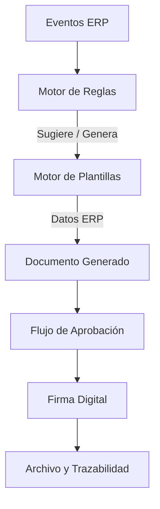
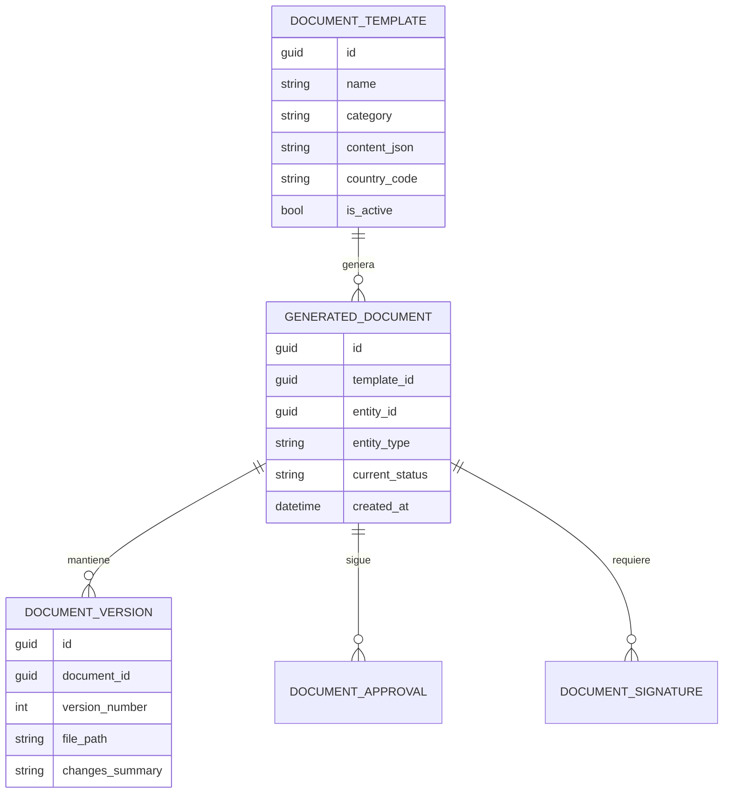

# Motor Inteligente de Generación Documental - Zorvian ERP

## 1. Arquitectura Funcional

El Motor Documental de Zorvian ERP está diseñado como un servicio transversal (Cross-cutting Concern) que se integra con todos los módulos operativos. No es un simple repositorio de archivos, sino un motor de eventos y reglas que garantiza el cumplimiento documental y legal de la organización.

### Capas del Sistema

1.  **Capa de Eventos (ERP Trigger)**: Intercepta acciones en el ERP (Creación de empleado, aprobación de crédito, registro de garantía).
2.  **Capa de Reglas (Rule Engine)**: Evalúa el contexto (País, Sucursal, Tipo de Entidad) para determinar qué documentos son requeridos.
3.  **Capa de Composición (Template Engine)**: Inyecta datos dinámicos en plantillas HTML/XML/Docx.
4.  **Capa de Ciclo de Vida (Lifecycle Manager)**: Gestiona estados, versiones y flujos de aprobación.
5.  **Capa de Firma y Archivo (Firma Digital)**: Asegura la validez legal y el almacenamiento seguro.

---

## 2. Casos de Uso

| Caso de Uso | Actor | Descripción |
| :--- | :--- | :--- |
| **Onboarding Automático** | RRHH | Al contratar un empleado, el sistema genera automáticamente el Contrato Laboral y el NDA basados en su cargo y país. |
| **Formalización de Crédito** | Ejecutivo | Al aprobar un crédito, se genera el Pagaré y el Contrato de Crédito listo para firma electrónica. |
| **Garantía Técnica** | Técnico | Al recibir un artículo, se genera el comprobante de recepción y el formulario de diagnóstico pre-llenado. |
| **Cierre de Ventas** | Vendedor | Generación de Proforma y Contrato Comercial al cambiar el estado del lead a "Cerrado Ganado". |

---

## 3. Reglas de Negocio

### Inteligencia de Generación
- **Geolocalización**: El sistema debe aplicar la plantilla legal correspondiente al país de la sucursal del empleado/cliente.
- **Validación de Datos**: No se permite generar un documento si faltan variables críticas (ej. Salario en contrato, Monto en pagaré).
- **Consistencia**: Un documento generado no puede ser editado manualmente si está en flujo de aprobación (debe generarse una nueva versión).

---

## 4. Modelo de Datos

---

## 5. Catálogo Documental (Taxonomía)

### Recursos Humanos
- **Contratos**: Laboral (Indefinido, Término Fijo), Servicios Profesionales.
- **Gestión**: Carta de Vacaciones, Constancia Salarial, Amonestaciones, Acta Disciplinaria.
- **Salida**: Renuncia, Liquidación, Finiquito.

### Ventas y Compras
- **Comercial**: Cotización, Proforma, Contrato Comercial, Orden de Compra (Proveedor).
- **Entrega**: Acta de Entrega, Recepción de Mercancía.

### Créditos y Garantías
- **Financiero**: Pagaré, Acuerdo de Pago, Solicitud de Crédito.
- **Garantías**: Orden de Recepción, Diagnóstico Técnico, Seguimiento.

---

## 6. Motor de Generación y Plantillas

### Variables Dinámicas
El sistema soporta placeholders inteligentes:
- `{{empresa.nombre}}`, `{{cliente.razon_social}}`, `{{colaborador.salario_letras}}`
- Inyección de tablas dinámicas para detalles de facturas o calendarios de pago.

### Editor No-Code
Zorvian ERP incluirá un editor visual para que los departamentos Legal y RRHH modifiquen el texto de las plantillas sin intervención de IT.

---

## 7. Flujos de Aprobación y Firma

### Estados del Documento
1.  **Borrador**: Generado automáticamente o manualmente.
2.  **En Revisión**: Notificación automática al supervisor/legal.
3.  **Aprobado**: Listo para firma.
4.  **Firmado**: Con sello de tiempo y validez legal.
5.  **Archivado**: Disponible para consulta histórica.

### Firma Electrónica
Arquitectura preparada para:
- **OTP (One Time Password)** vía WhatsApp/Email para clientes.
- **Firma Biométrica** en tablets para entrega de productos.
- **Firma Digital (Token/Certificado)** para contratos legales de alta cuantía.

---

## 8. Integración ERP

El motor documental se conecta vía **Webhooks Internos**:
- **Módulo Ventas** -> Trigger: "Orden Confirmada" -> Acción: "Generar Factura y Contrato".
- **Módulo RRHH** -> Trigger: "Empleado Creado" -> Acción: "Sugerir Documentos de Ingreso".

---

## 9. IA Documental

Propuestas de valor agregado con IA:
- **Análisis de Riesgos**: Detectar cláusulas inusuales en contratos cargados por proveedores.
- **Resumen Ejecutivo**: IA genera un resumen de 3 puntos clave para documentos de más de 10 páginas.
- **Detección de Omisiones**: La IA alerta si falta un documento obligatorio para un proceso específico según las políticas de la empresa.

---

## 10. Roadmap de Implementación

| Fase | Duración | Entregable Clave |
| :--- | :--- | :--- |
| **Fase 1: Motor Base** | 4 Semanas | CRUD de Plantillas y Generador PDF Core. |
| **Fase 2: Regales y Eventos** | 3 Semanas | Integración con triggers de RRHH y Ventas. |
| **Fase 3: Firma y Aprobación** | 4 Semanas | Flujos de aprobación y Firma Digital básica. |
| **Fase 4: IA y Optimización** | 4 Semanas | Módulo de análisis de contratos y sugerencias. |

---
*Este documento define el estándar de gestión documental para Zorvian ERP, alineado con las mejores prácticas internacionales de arquitectura empresarial.*
