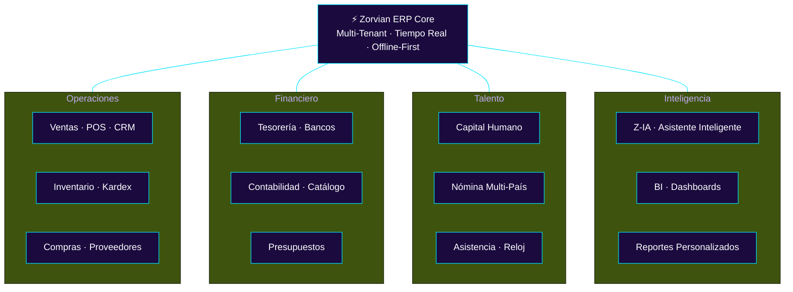
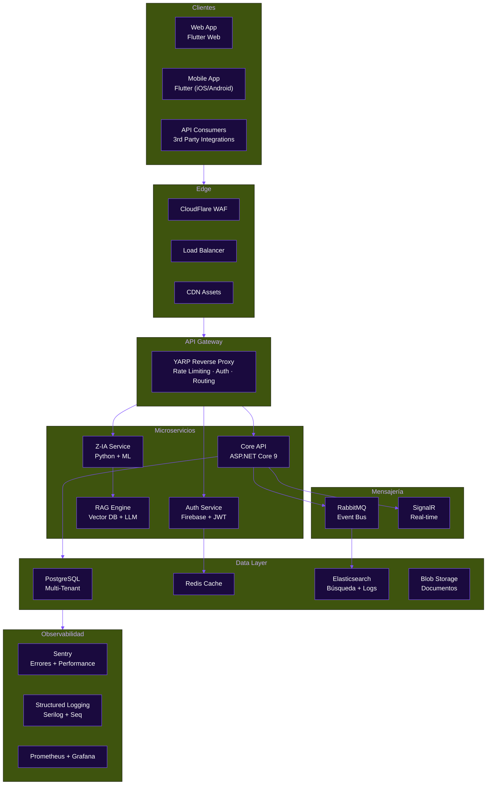

# Zorvian ERP — Presentación Ejecutiva

> **Documento Confidencial** — Para potenciales inversores, socios estratégicos y clientes enterprise.
> Versión: 1.0 | Junio 2026

---

## Tabla de Contenidos

1. [Resumen Ejecutivo](#1-resumen-ejecutivo)
2. [El Problema](#2-el-problema)
3. [La Solución](#3-la-solución)
4. [Mercado y Competencia](#4-mercado-y-competencia)
5. [Arquitectura Tecnológica](#5-arquitectura-tecnológica)
6. [Roadmap 12 Meses](#6-roadmap-12-meses)
7. [Métricas Clave](#7-métricas-clave)
8. [Equipo](#8-equipo)
9. [Inversión y Proyección](#9-inversión-y-proyección)

---

## 1. Resumen Ejecutivo

| Atributo | Detalle |
|----------|---------|
| **Producto** | ERP modular para PYMEs y empresas en expansión en Centroamérica |
| **Target** | Empresas de 10–500 empleados, multi-país (NI, CR, GT, HN, SV, PA) |
| **Stack** | Flutter 3.x (Web + Mobile) · ASP.NET Core 9 · PostgreSQL · RabbitMQ · Firebase |
| **Etapa** | Beta privada · MVP funcional con 9 módulos · 130+ rutas |
| **Diferenciador** | Z-IA (asistente inteligente nativo), multi-tenancy progresivo, cumplimiento fiscal multi-país |
| **Puntuación Auditoría** | 6.93/10 actual → 8.5/10 proyectado (post-implementación Q4 2026) |

### Hitos Clave

| Hito | Fecha | Estado |
|------|-------|:------:|
| MVP funcional | Ene 2026 | ✅ |
| Rebranding visual (paleta premium) | Jun 2026 | ✅ |
| Arquitectura multi-tenant diseñada | Jun 2026 | ✅ |
| Sistema de diseño Zorvian Design System | Jun 2026 | ✅ |
| Dashboard ejecutivo con BI | Jun 2026 | ✅ |
| Presentación para inversores | Jun 2026 | ✅ |
| Lanzamiento público Q1 2027 | Mar 2027 | 🎯 |
| SOC 2 Type II | Dic 2027 | 🎯 |

---

## 2. El Problema

### 2.1 Fragmentación del mercado ERP en Centroamérica

Las PYMEs centroamericanas enfrentan una **crisis de herramientas empresariales**:

| Problema | Impacto |
|----------|---------|
| **Software fragmentado** | Una empresa usa 4–7 sistemas inconexos (contabilidad, facturación, inventario, nómina, CRM) |
| **Cumplimiento fiscal local** | Cada país tiene 3–5 declaraciones diferentes (INSS, IR, DGI, IVA, ISR, etc.) |
| **Costo prohibitivo** | SAP Business One: ~$3,000/licencia/año. Odoo Enterprise: ~$24/usuario/año. |
| **Sin soporte local** | Proveedores internacionales con soporte en inglés y sin conocimiento de legislación local |
| **Movilidad limitada** | Sistemas legacy on-premise, sin acceso desde móvil |

### 2.2 Costo Oculto para la Empresa

```
Costo anual de herramientas fragmentadas para una PYME de 50 empleados:

  Contabilidad (local):     $1,200
  Facturación (DGI):        $  600
  Inventario:                $  900
  Nómina:                    $1,200
  CRM:                       $  600
  Tiempo admin (conciliación manual): $4,800
  --------------------------------------------------
  Total:                    $9,300 / año
  + Riesgo de multas fiscales
  + Datos duplicados/inconsistentes
  + Sin visibilidad en tiempo real
```

---

## 3. La Solución

### 3.1 Zorvian ERP — Una Plataforma, Todos los Procesos



### 3.2 Diferenciadores Clave

| Diferenciador | Descripción | Ventaja Competitiva |
|:-------------:|-------------|-------------------|
| **🧠 Z-IA** | Asistente inteligente con RAG, OCR, y ML | Automatiza consultas contables, clasificación de gastos, detección de anomalías |
| **🌎 Multi-País** | Cumplimiento fiscal nativo para 6 países | Sin necesidad de módulos adicionales ni consultoría local |
| **🏗️ Multi-Tenancy** | 3 fases: Shared → Schema → DB-per-Tenant | Escala de 10 a 10,000+ empresas sin migración traumática |
| **📱 Offline-First** | Operación sin conexión con sincronización | Ideal para zonas con conectividad intermitente |
| **🎨 Design System** | Zorvian Design System con Material 3 | Consistencia visual, accesibilidad, experiencia premium |
| **🔌 API Pública** | REST API + Webhooks + Integraciones | Se conecta con cualquier sistema existente |

### 3.3 Z-IA: Inteligencia Artificial Aplicada

```mermaid
flowchart LR
    subgraph User["Usuario"]
        CHAT["Chat en lenguaje natural"]
        VOICE["Entrada por voz"]
    end

    subgraph ZIA["🤖 Z-IA Engine"]
        NLP["NLP + RAG<br/>Contexto del negocio"]
        OCR["OCR + Clasificación<br/>Documentos"]
        ML["Modelos ML<br/>Predicción + Anomalías"]
        RULES["Reglas de Negocio<br/>Configurables"]
    end

    subgraph Actions["Acciones"]
        QUERY["Consultas contables"]
        CLASSIFY["Clasificación automática"]
        ALERT["Alertas predictivas"]
        REPORT["Reportes generados por IA"]
    end

    User --> ZIA
    ZIA --> Actions
```



**Casos de uso de Z-IA:**
- _"¿Cuál fue la utilidad bruta del mes pasado?"_ → Respuesta en segundos con datos reales
- Clasificación automática de gastos desde fotos de facturas (OCR)
- Detección de anomalías en ventas, inventario y flujo de caja
- Predicción de demanda usando modelos ML ligeros

---

## 4. Mercado y Competencia

### 4.1 Tamaño de Mercado

```
Mercado ERP Centroamérica 2026:
┌────────────────────────────────────────────┐
│  TAM: $1,200M  (Total Addressable Market)  │
│  SAM:   $380M  (Serviceable Available Mkt)  │
│  SOM:    $28M  (Serviceable Obtainable Mkt) │
└────────────────────────────────────────────┘
  Target: PYMEs de 10-500 empleados en 6 países
  
  ~45,000 empresas en el segmento objetivo
  Crecimiento anual del mercado ERP: 8.2% CAGR
```

### 4.2 Benchmarking Competitivo

| Criterio | Zorvian ERP | Odoo | SAP B1 | Zoho | Microsoft Dynamics |
|----------|:-----------:|:----:|:------:|:----:|:-----------------:|
| Costo PYME | 🟢 Bajo | 🟡 Medio | 🔴 Alto | 🟡 Medio | 🔴 Alto |
| Multi-País CA | 🟢 Nativo | 🔴 3rd party | 🟡 Limitado | 🔴 No soporta | 🟡 Limitado |
| Cumplimiento Fiscal | 🟢 Integrado | 🔴 Requiere módulo | 🟡 Parcial | 🔴 No soporta | 🔴 No soporta |
| Offline-First | 🟢 Sí | 🔴 No | 🔴 No | 🔴 No | 🔴 No |
| IA Nativa | 🟢 Z-IA | 🟡 Odoo AI (beta) | 🔴 No | 🔴 No | 🟡 Copilot (extra) |
| Mobile | 🟢 Flutter (iOS/Android/Web) | 🟡 Web app | 🔴 Limitado | 🟡 Web app | 🟡 PowerApps |
| TCO 3 años (50 users) | ~$9,000 | ~$36,000 | ~$150,000 | ~$12,000 | ~$75,000 |

### 4.3 Ventaja Competitiva Sostenible

1. **Efecto Red**: Datos multi-país mejoran los modelos fiscales y predictivos de Z-IA
2. **Costo de Cambio**: Integración profunda con procesos contables y fiscales locales
3. **Conocimiento Local**: Legislación laboral y fiscal centroamericana cambia constantemente — barrera de entrada para competidores globales
4. **Arquitectura**: Multi-tenancy progresivo permite servir desde micropymes hasta empresas de 500+ empleados sin re-arquitectura

---

## 5. Arquitectura Tecnológica



### 5.1 Stack Tecnológico

| Capa | Tecnología | Versión |
|:----:|------------|:-------:|
| **Frontend** | Flutter · Riverpod · GoRouter · Material 3 | 3.x |
| **Backend** | ASP.NET Core · Entity Framework Core · FluentValidation | 9.0 |
| **Base de Datos** | PostgreSQL (Neon) · Redis | 16 / 7.x |
| **Mensajería** | RabbitMQ · SignalR | 3.13 |
| **Búsqueda/Logs** | Elasticsearch · Serilog | 8.x |
| **Infraestructura** | Render.com · Firebase · CloudFlare · Docker | — |
| **CI/CD** | GitHub Actions · Firebase Hosting | — |
| **Monitoreo** | Sentry · Prometheus · Grafana | — |

### 5.2 Seguridad (Defensa en Profundidad)

```
🛡️ WAF (CloudFlare) → 🔐 Firebase Auth + MFA → 📋 RBAC (5 roles) 
→ 🔒 RLS (PostgreSQL) → 🗄️ AES-256 at rest → 📝 Audit Logging
```

- **Headers de seguridad**: CSP, HSTS, X-Frame-Options, X-Content-Type-Options
- **Rate limiting**: 120 req/min por usuario
- **JWT**: Access token (1h) + Refresh token (7d)
- **Webhooks**: Firma HMAC-SHA256
- **Cumplimiento**: RGPD/LPD, SOX (Fase 3), SOC 2 (Fase 2)

---

## 6. Roadmap 12 Meses

### Q3 2026 (Jul–Sep) — Consolidación
| Iniciativa | Impacto | Prioridad |
|------------|:-------:|:---------:|
| Multi-tenancy Fase 1 (Shared) | ⚡ Alta | 🔴 |
| Dashboard ejecutivo con BI interactivo | ⚡ Alta | 🔴 |
| Módulo de nómina completo (6 países) | ⚡ Alta | 🔴 |
| Integración WhatsApp Business | 🟡 Media | 🟡 |

### Q4 2026 (Oct–Dec) — Crecimiento
| Iniciativa | Impacto | Prioridad |
|------------|:-------:|:---------:|
| Módulo de facturación electrónica (DGI/DGT) | ⚡ Alta | 🔴 |
| Z-IA Fase 2: predicción de flujo de caja | ⚡ Alta | 🔴 |
| Portal de proveedores y autogestión | 🟡 Media | 🟡 |
| Reportes financieros auditables (SOX-ready) | 🟡 Media | 🟡 |

### Q1 2027 (Ene–Mar) — Escalamiento
| Iniciativa | Impacto | Prioridad |
|------------|:-------:|:---------:|
| **Lanzamiento público** | 🚀 Alto | 🔴 |
| Modo offline completo (PWA + SQLite) | ⚡ Alto | 🔴 |
| Marketplace de extensiones | 🟡 Medio | 🟡 |
| SOC 2 Type I | 🟡 Medio | 🟡 |

### Q2 2027 (Abr–Jun) — Expansión
| Iniciativa | Impacto | Prioridad |
|------------|:-------:|:---------:|
| Multi-tenancy Fase 3 (DB-per-Tenant) | ⚡ Alto | 🟡 |
| Expansión a Colombia y México | 🚀 Alto | 🔴 |
| SOC 2 Type II | 🟡 Medio | 🟡 |
| ISO 27001 | 🟡 Medio | 🟡 |

---

## 7. Métricas Clave

### 7.1 Métricas de Producto (Actuales)

| Métrica | Valor | Benchmark |
|---------|:-----:|:---------:|
| Módulos funcionales | 9 | — |
| Rutas navegables | 130+ | — |
| Roles de seguridad | 5 | — |
| Países soportados | 6 | — |
| Temas visuales | 2 (Light/Dark) | — |
| Pruebas unitarias backend | ✅ | — |
| Análisis estático frontend | 0 errores | — |
| Cobertura de código | En progreso | > 80% target |

### 7.2 KPIs Proyectados (Post-Lanzamiento)

| KPI | Q3 2026 | Q4 2026 | Q1 2027 | Q2 2027 |
|-----|:-------:|:-------:|:-------:|:-------:|
| Clientes activos | 5 | 15 | 50 | 150 |
| ARR | $15K | $60K | $250K | $900K |
| Tiempo de onboarding | 7 días | 5 días | 3 días | 1 día |
| NPS | — | 40 | 55 | 65 |
| Churn mensual | — | < 8% | < 5% | < 3% |
| Disponibilidad | 99.5% | 99.7% | 99.9% | 99.95% |

### 7.3 Modelo de Precios

| Plan | Precio | Incluye |
|:----:|:------:|---------|
| **Starter** | $29/mes | 10 usuarios · 3 módulos · Soporte email |
| **Growth** | $79/mes | 25 usuarios · Todos los módulos · Z-IA básico · Soporte prioritario |
| **Enterprise** | $199/mes | Usuarios ilimitados · Todo · Z-IA completo · API · Onboarding dedicado · SLA 99.9% |

**Proyección de ingresos:**

```
Q3 2026:  5 × $79   =    $395/mes → $1,185  trimestre
Q4 2026: 15 × $79   =  $1,185/mes → $3,555  trimestre
Q1 2027: 50 × $199  =  $9,950/mes → $29,850 trimestre  ← Lanzamiento público
Q2 2027: 150 × $199 = $29,850/mes → $89,550 trimestre

Proyectado anual (2027): ~$500K ARR
```

---

## 8. Equipo

> *(Esta sección debe ser completada con la información del equipo real)*

| Rol | Perfil Requerido |
|-----|------------------|
| **CTO / Arquitecto** | Experiencia en sistemas distribuidos, .NET, Flutter |
| **Full-Stack Developer** | Frontend Flutter + Backend ASP.NET Core |
| **DevOps** | CI/CD, Docker, PostgreSQL, Cloud infrastructure |
| **UX/UI Designer** | Material 3, Design Systems, accesibilidad |
| **Especialista en Contabilidad/Fiscal** | Conocimiento de legislación centroamericana |
| **Product Manager** | Experiencia en SaaS B2B, métricas de producto |

---

## 9. Inversión y Proyección

### 9.1 Uso de Fondos (Ronda Semilla: $350K)

| Concepto | Monto | % |
|----------|:-----:|:-:|
| Desarrollo (3 ingenieros, 12 meses) | $180K | 51% |
| Infraestructura y herramientas | $30K | 9% |
| Compliance y certificaciones (SOC 2) | $40K | 11% |
| Marketing y ventas | $60K | 17% |
| Gastos legales y constitución | $20K | 6% |
| Reserva operativa | $20K | 6% |

### 9.2 Proyección Financiera

```
                   2026        2027        2028
                  ─────      ─────      ─────
Ingresos          $4.7K      $500K      $2.8M
Costo Servicios   $12.0K     $120K      $420K
Equipo            $120K      $240K      $600K
SG&A              $60K       $150K      $350K
                  ─────      ─────      ─────
EBITDA           -$187K     -$10K      $1.4M
                  ─────      ─────      ─────
Clientes            15         250        1,200
ARR               $4.7K      $500K      $2.8M
Runway            $350K      $163K      > $1M (autosuficiente)
```

### 9.3 Hitos para Siguiente Ronda (Serie A)

| Hito | Target | Fecha |
|------|:------:|:-----:|
| ARR > $1M | $1M+ | Q1 2028 |
| Clientes > 500 | 500+ | Q4 2027 |
| Churn < 3% mensual | 3% | Q2 2027 |
| NPS > 60 | 60+ | Q2 2027 |
| SOC 2 + ISO 27001 | Certificado | Q2 2027 |

---

## Apéndices

- [Informe de Auditoría Visual](INFORME_AUDITORIA_VISUAL.md) — Diagnóstico completo y plan de remediación
- [Arquitectura del Sistema](diagrams/architecture_overview.md) — Diagrama C4 y descripción técnica
- [Estrategia Multi-Tenant](diagrams/multi_tenant.md) — Fases de aislamiento progresivo
- [Diagrama de Seguridad](diagrams/security_architecture.md) — Defensa en profundidad
- [Diagramas de Integraciones](diagrams/integrations_architecture.md) — Webhooks, API, WhatsApp
- [README del Proyecto](../README.md) — Descripción general y stack

---

> **Zorvian ERP** — [zorvian.ai](https://zorvian.ai) · Contacto: [inversiones@zorvian.ai](mailto:inversiones@zorvian.ai)
> *Documento generado el Junio 2026. Proyecciones financieras basadas en investigación de mercado y supuestos de crecimiento. Resultados pasados no garantizan rendimientos futuros.*
