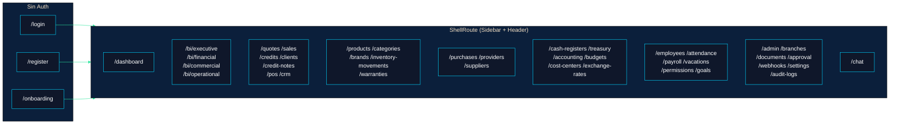
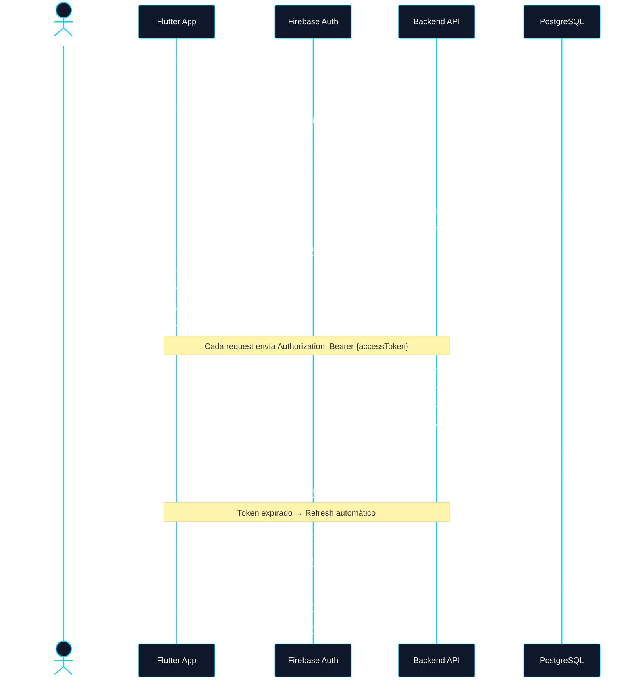
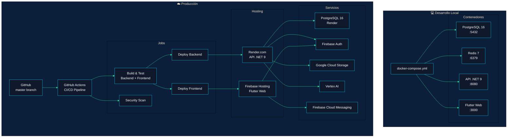

# Zorvian ERP — Diagrama de Arquitectura

```mermaid
%%{init: {'theme': 'base', 'themeVariables': { 'primaryColor': '#0F172A', 'primaryTextColor': '#fff', 'primaryBorderColor': '#00D4FF', 'lineColor': '#2EE59D', 'secondaryColor': '#1E293B', 'tertiaryColor': '#0B1F3B'}}}%%

---
title: Zorvian ERP — Arquitectura General
---

graph TB
  subgraph Cliente["🧑‍💻 Cliente"]
    WEB["🌐 Web App<br/>Flutter (Hosting Firebase)"]
    MOBILE["📱 Mobile App<br/>Flutter (Android/iOS)"]
  end

  subgraph CDN["⚡ CDN"]
    FH["Firebase Hosting<br/>zorvian-erp.web.app"]
  end

  subgraph Frontend["Frontend — Flutter (frontend/)"]
    FW["Flutter Framework 3.x"]
    subgraph Core["Core"]
      R["go_router 130+ rutas<br/>ShellRoute + Sidebar"]
      AUTH["auth_provider<br/>Firebase Auth + JWT"]
      SIG["SignalR<br/>Notificaciones en vivo"]
      OFF["Drift SQLite<br/>Offline-first + Sync"]
      DS["Design System<br/>45 componentes Z-*"]
    end
    subgraph Features["46 Módulos"]
      V["Ventas<br/>(CRM, POS, Cotizaciones<br/>Facturación, Créditos)"]
      I["Inventario<br/>(Productos, Garantías<br/>Movimientos)"]
      C["Compras<br/>(Órdenes, Proveedores)"]
      F["Finanzas<br/>(Caja, Contabilidad<br/>Presupuestos, TES)"]
      HR["Talento Humano<br/>(Planilla, Asistencia<br/>Vacaciones, Metas)"]
      BI["BI & IA<br/>(Dashboards, ML<br/>Z-IA Asistente)"]
      ADM["Administración<br/>(Usuarios, Webhooks<br/>Auditoría)"]
    end
    NAV["Nav Config<br/>9 Módulos, 40+ ítems<br/>Filtrado por rol"]
  end

  subgraph Backend["Backend — .NET 9 (src/)"]
    direction TB
    WEB_API["🌐 Zorvian.Web<br/>86 Controladores API<br/>zorvian/v1/*"]
    APP["📦 Zorvian.Application<br/>87 Servicios<br/>AutoMapper + FluentValidation"]
    INFRA["🔧 Zorvian.Infrastructure<br/>86 Repositorios<br/>31 Servicios de infraestructura"]
    CORE["🎯 Zorvian.Core<br/>154 Entidades de dominio<br/>Enums + Interfaces"]

    WEB_API --> APP
    APP --> CORE
    INFRA --> APP
  end

  subgraph Database["💾 Datos"]
    PG[("PostgreSQL 16<br/>180+ tablas")]
    REDIS[("Redis 7<br/>Rate Limiting / Cache")]
    GCS[("Google Cloud Storage<br/>Archivos / Documentos")]
  end

  subgraph Servicios["🔌 Servicios Externos"]
    FA["Firebase Auth<br/>Autenticación"]
    FCM["Firebase Cloud Messaging<br/>Notificaciones Push"]
    GCV["Google Cloud Vision<br/>OCR"]
    GAI["Vertex AI<br/>Z-IA Chatbot"]
    SMTP["SMTP Brevo<br/>Correos Electrónicos"]
  end

  subgraph ML["🧠 Machine Learning (ML.NET)"]
    ABS["Predicción Ausentismo"]
    SALES["Predicción Ventas"]
    EXP["Clasificación Gastos"]
  end

  subgraph Jobs["⏰ Hangfire Jobs (10)"]
    J1["CheckInReminder<br/>9 AM diario"]
    J2["Backup DB<br/>2 AM diario"]
    J3["Training ML<br/>Semanal"]
    J4["Cleanup<br/>Mensual"]
    J5["VacationAccrual<br/>1° del mes"]
    J6["WebhookDelivery<br/>Scoped"]
  end

  subgraph CI_CD["🚀 CI/CD — GitHub Actions"]
    direction TB
    BUILD["Build & Test<br/>Backend + Frontend"]
    SCAN["Security Scan<br/>Secrets + Firebase"]
    DEPLOY_B["Deploy Backend<br/>→ Render.com"]
    DEPLOY_F["Deploy Frontend<br/>→ Firebase Hosting"]
    BUILD --> SCAN
    SCAN --> DEPLOY_B
    SCAN --> DEPLOY_F
  end

  %% Conexiones Frontend
  WEB --> FH
  MOBILE --> FH
  FH --> WEB_API
  WEB -.-> SIG
  MOBILE -.-> FCM
  Frontend --> FA

  %% Conexiones Backend
  WEB_API --> APP
  WEB_API -. SignalR .-> SIG
  INFRA --> PG
  INFRA --> REDIS
  INFRA --> GCS
  INFRA --> FCM
  INFRA --> GCV
  INFRA --> SMTP
  APP --> ML
  INFRA --> Jobs

  %% Conexiones CI/CD
  BUILD --> Frontend
  BUILD --> Backend
```

---

## Diagrama de Rutas — Frontend



---

## Diagrama de Bases de Datos — Módulos Principales

```mermaid
%%{init: {'theme': 'base', 'themeVariables': { 'primaryColor': '#0F172A', 'primaryTextColor': '#fff', 'primaryBorderColor': '#00D4FF', 'lineColor': '#2EE59D', 'secondaryColor': '#1E293B', 'tertiaryColor': '#0B1F3B'}}}%%

erDiagram
    Tenant {
        string Id PK
        string Name
    }
    User {
        string Id PK
        string TenantId FK
        string Email
        string FirebaseUid
    }
    Role {
        string Id PK
        string Name "SuperAdmin|CompanyAdmin|Rrhh|Supervisor|Employee"
    }
    UserRole {
        string UserId FK
        string RoleId FK
    }
    Branch {
        string Id PK
        string TenantId FK
        string Name
    }
    Employee {
        string Id PK
        string TenantId FK
        string BranchId FK
        string FirstName
        string LastName
        string Email
    }
    Lead {
        string Id PK
        string TenantId FK
        string FirstName
        string LastName
        string Status "new|contacted|qualified|lost"
        string Source
    }
    Opportunity {
        string Id PK
        string TenantId FK
        string LeadId FK
        string Title
        float ExpectedValue
        string StageId FK
        int Probability
    }
    PipelineStage {
        string Id PK
        string TenantId FK
        string Name
        int Order
        string Color
    }
    Sale {
        string Id PK
        string TenantId FK
        string ClientId FK
        string BranchId FK
        datetime Date
        float Total
        string Status
    }
    SaleDetail {
        string SaleId FK
        string ProductId FK
        int Quantity
        float UnitPrice
    }
    Product {
        string Id PK
        string TenantId FK
        string Name
        string CategoryId FK
        string BrandId FK
        float Price
        int Stock
    }
    Category {
        string Id PK
        string TenantId FK
        string Name
    }
    Brand {
        string Id PK
        string TenantId FK
        string Name
    }
    PayrollRun {
        string Id PK
        string TenantId FK
        string PeriodId FK
        datetime Date
        string Status
    }
    PayrollDetail {
        string PayrollRunId FK
        string EmployeeId FK
        float GrossSalary
        float NetSalary
    }
    AttendanceRecord {
        string Id PK
        string TenantId FK
        string EmployeeId FK
        datetime CheckIn
        datetime CheckOut
    }
    AccountingEntry {
        string Id PK
        string TenantId FK
        string AccountId FK
        float Debit
        float Credit
        datetime Date
    }
    Account {
        string Id PK
        string TenantId FK
        string Code "1-01-001"
        string Name
        string Type "asset|liability|equity|income|expense"
    }

    Tenant ||--o{ User : ""
    Tenant ||--o{ Branch : ""
    Tenant ||--o{ Lead : ""
    Tenant ||--o{ Opportunity : ""
    Tenant ||--o{ PipelineStage : ""
    Tenant ||--o{ Product : ""
    Tenant ||--o{ Account : ""
    User ||--o{ UserRole : ""
    Role ||--o{ UserRole : ""
    Branch ||--o{ Employee : ""
    Branch ||--o{ Sale : ""
    Lead ||--o{ Opportunity : ""
    PipelineStage ||--o{ Opportunity : ""
    Sale ||--o{ SaleDetail : ""
    Product ||--o{ SaleDetail : ""
    Category ||--o{ Product : ""
    Brand ||--o{ Product : ""
    PayrollRun ||--o{ PayrollDetail : ""
    Employee ||--o{ PayrollDetail : ""
    Employee ||--o{ AttendanceRecord : ""
    PayrollRun ||--o{ PayrollDetail : ""
    Account ||--o{ AccountingEntry : ""
```



---

## Diagrama de Flujo de Autenticación



---

## Diagrama de Despliegue



---

## Leyenda

| Color | Significado |
|-------|-------------|
| `#0F172A` Deep Slate | Backend / Core |
| `#00D4FF` Electric Blue | Frontend / Cliente |
| `#2EE59D` Neo Teal | Infraestructura / CI/CD |
| `#1E293B` Secondary | Servicios externos |
