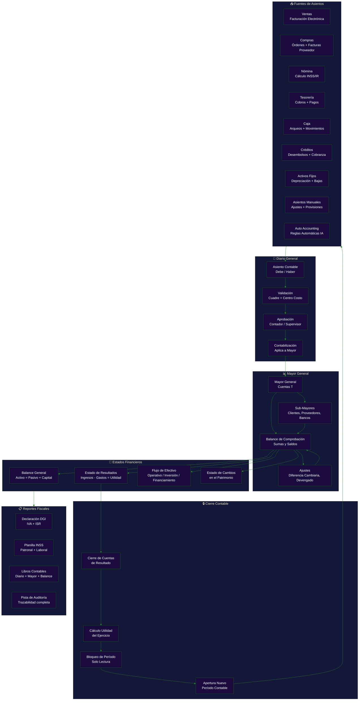
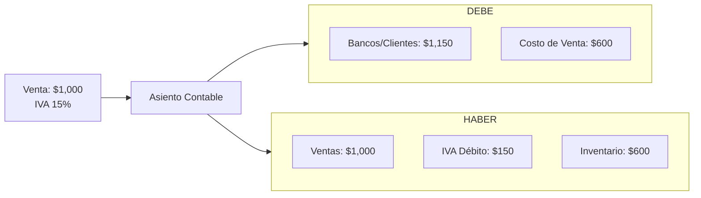

# Ciclo Contable Completo

**Zorvian ERP** — Módulo de Contabilidad

---



---

## Políticas Contables por País

| País | Moneda | IVA | ISR | Frecuencia |
|------|--------|:---:|:---:|:-----------|
| 🇳🇮 Nicaragua | NIO / USD | 15% | 30% | Mensual |
| 🇨🇷 Costa Rica | CRC | 13% | 30% | Mensual |
| 🇬🇹 Guatemala | GTQ | 12% | 25% | Mensual |
| 🇭🇳 Honduras | HNL | 15% | 25% | Mensual |
| 🇸🇻 El Salvador | USD | 13% | 30% | Mensual |
| 🇵🇦 Panamá | USD | 7% (ITBMS) | 25% | Trimestral |

---

## Catálogo de Cuentas (Estructura)

```
1-00-000  ACTIVO
│
├── 1-01-000  Activo Corriente
│   ├── 1-01-001  Efectivo y Equivalentes
│   ├── 1-01-002  Bancos
│   ├── 1-01-003  Cuentas por Cobrar
│   └── 1-01-004  Inventarios
│
├── 1-02-000  Activo No Corriente
│   ├── 1-02-001  Propiedad, Planta y Equipo
│   └── 1-02-002  Activos Intangibles
│
2-00-000  PASIVO
│
├── 2-01-000  Pasivo Corriente
└── 2-02-000  Pasivo No Corriente

3-00-000  PATRIMONIO
4-00-000  INGRESOS
5-00-000  COSTOS
6-00-000  GASTOS
7-00-000  CUENTAS DE ORDEN
```

---

## Ejemplo: Asiento Automático de Venta



---

## KPIs del Módulo Contable

| KPI | Descripción | Objetivo |
|-----|-------------|:--------:|
| Tiempo de Cierre Mensual | Días para cerrar mes contable | < 5 días |
| Automatización | % de asientos generados automáticamente | > 80% |
| Precisión | % de asientos sin correcciones | > 98% |
| Diferencia Cambiaria | % de exposición cambiaria monitoreada | 100% |
| Conciliación Bancaria | % de cuentas conciliadas mensualmente | 100% |
