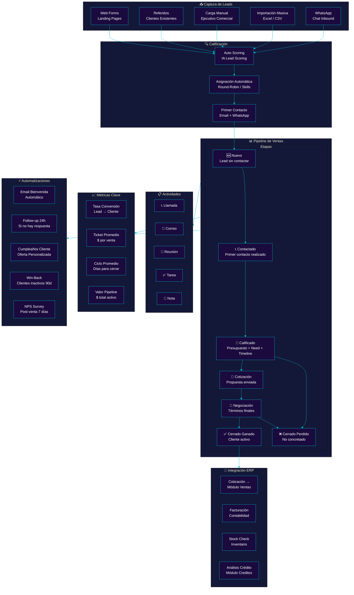
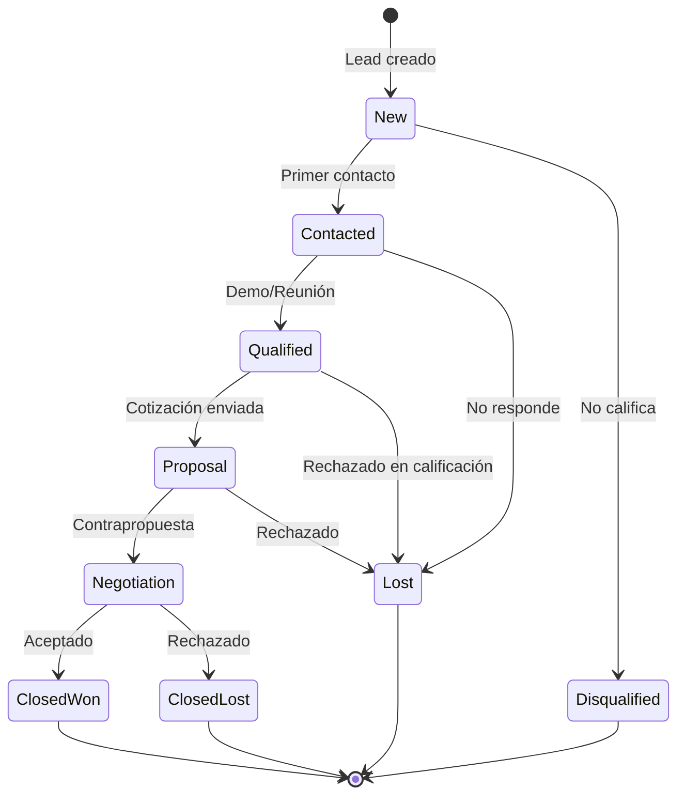
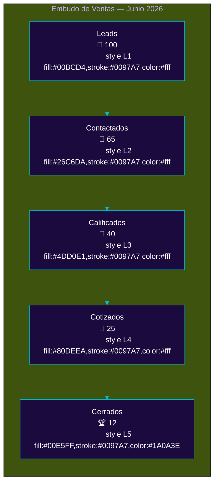

# CRM: Pipeline Comercial Completo

**Zorvian ERP** — Módulo CRM y Ventas

---

---

## Estados del Lead y Oportunidad

---

## Pipeline Visual (Embudo de Ventas)

---

## Reglas de Negocio CRM

| Regla | Descripción | Automatización |
|-------|-------------|:--------------:|
| Lead Scoring Automático | Puntúa leads por fuente, industria, cargo | ✅ IA |
| Round-Robin Assignment | Distribución equitativa entre ejecutivos | ✅ |
| Follow-up 24h | Si no hay actividad en 24h, asigna tarea automática | ✅ |
| Win-Back 90d | Clientes sin compra en 90 días → campaña automática | ✅ |
| NPS Post-Venta | Encuesta 7 días después del cierre | ✅ |
| Crédito Automático | Si el monto > $1,000, solicita análisis de crédito | ✅ |

---

## KPIs del Módulo CRM

| KPI | Fórmula | Benchmark | Zorvian Objetivo |
|-----|---------|:---------:|:----------------:|
| Tasa de Conversión | (Closed Won / Leads totales) × 100 | 15-25% | > 20% |
| Ticket Promedio | $ ventas totales / N° ventas | — | $500-$5,000 |
| Ciclo de Venta | Días desde Lead → Closed Won | 15-45 días | < 30 días |
| Lead Response Time | Tiempo hasta primer contacto | < 5 min | < 2 min |
| Pipeline Coverage | Valor pipeline / Cuota del mes | 3x | > 3.5x |
| Tasa de Ganancia | Won / (Won + Lost) × 100 | 40-60% | > 50% |
