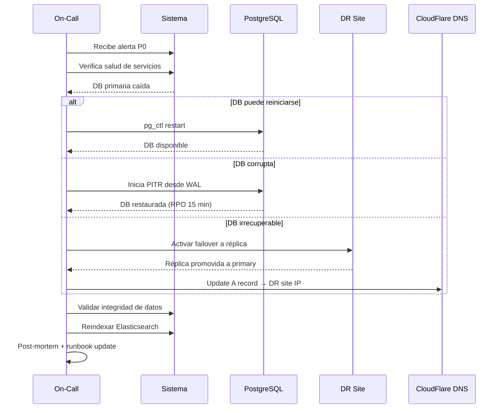

```mermaid
%%{init: {'theme': 'base', 'themeVariables': { 'primaryColor': '#1A0A3E', 'primaryTextColor': '#fff', 'primaryBorderColor': '#EF5350', 'lineColor': '#EF5350', 'secondaryColor': '#C62828', 'tertiaryColor': '#141838'}}}%%

graph TB
    subgraph Normal["✅ Operación Normal"]
        APP["Zorvian ERP<br/>Render.com + Neon"]
        CACHE["Redis Cache<br/>7d retention"]
        BLOB["Blob Storage<br/>Documentos"]
        MONITOR["Sentry + Uptime Robot<br/>Monitoreo 24/7"]
    end

    subgraph Incident["🚨 Detección de Incidente"]
        ALERT["Alerta automática<br/>Sentry / Uptime Robot"]
        ON_CALL["On-call engineer<br/>notificado via Slack + SMS"]
        CLASSIFY["Clasificación<br/>P0–P3"]
    end

    subgraph Recovery["🔄 Recuperación"]
        PITR["Point-in-Time Recovery<br/>PostgreSQL (15 min RPO)"]
        FAILOVER["Failover a réplica<br/>en lectura (standby)"]
        REBUILD["Rebuild service<br/>Docker → Render"]
        RESTORE_BLOB["Restore Blob Storage<br/>desde backup cifrado"]
    end

    subgraph DR["☁️ Disaster Recovery Site"]
        DR_DB["Réplica PostgreSQL<br/>Región secundaria"]
        DR_APP["App Server Standby<br/>Render.com"]
        DR_DNS["DNS Failover<br/>CloudFlare"]
    end

    subgraph Restore["🔧 Restauración Completa"]
        VALIDATE["Validar integridad<br/>de datos restaurados"]
        REINDEX["Reindexar Elasticsearch<br/>y Redis Cache"]
        TEST["Prueba de humo<br/>endpoints críticos"]
        SWITCH["Switch DNS → DR Site"]
    end

    Normal -->|Detección| Incident
    Incident -->|P0/P1| Recovery
    Recovery --> DR
    DR --> Restore
    Restore --> Normal
```

# Plan de Recuperación ante Desastres (DRP)

**Zorvian ERP** — Estrategia de Continuidad del Negocio

---



---

## Estrategia de Respaldo

| Tipo | Frecuencia | Retención | RPO | RTO |
|:----:|:----------:|:---------:|:---:|:---:|
| **PostgreSQL Full** | Diaria | 30 días | 15 min | 2 h |
| **PostgreSQL WAL** | Streaming continuo | 7 días | 1 s | — |
| **Redis Snapshot** | Cada 6 h | 7 días | 6 h | 30 min |
| **Blob Storage** | Sincrónico multi-región | 90 días | 0 | 15 min |
| **Elasticsearch Snapshot** | Diaria | 14 días | 24 h | 4 h |
| **Config (Terraform)** | Por commit | Indefinido (git) | 0 | 1 h |

---

## Matriz de Severidad

| Nivel | Definición | Ejemplos | Tiempo de Respuesta | SLA |
|:-----:|------------|:--------:|:-------------------:|:---:|
| **P0** | Pérdida total del servicio | DB caída, outage completo | < 5 min | < 1 h |
| **P1** | Funcionalidad crítica afectada | Módulo de facturación caído | < 15 min | < 4 h |
| **P2** | Funcionalidad parcial afectada | Dashboard lento, error en UI | < 1 h | < 24 h |
| **P3** | Problema cosmético o no urgente | Error visual, typo | < 24 h | < 72 h |

---

## Runbook de Respuesta P0

### 1. Detección
```
⏱ T-0 min:  Alerta Sentry/Uptime Robot → Slack #incidents
⏱ T-5 min:  On-call confirma → canal #incident-response
```

### 2. Diagnóstico Rápido
```bash
# Verificar estado de servicios
curl -s https://api.zorvian.app/zorvian/v1/auth/health | jq .
curl -s https://api.zorvian.app/zorvian/v1/health/ready | jq .

# Verificar PostgreSQL
pg_isready -h $DB_HOST -p 5432

# Verificar Redis
redis-cli -h $REDIS_HOST ping

# Verificar Elasticsearch
curl -s http://$ES_HOST:9200/_cluster/health | jq .status
```

### 3. Contención

| Síntoma | Acción Inmediata |
|---------|------------------|
| DB primaria caída | `SELECT pg_promote()` en réplica → actualizar connection string |
| App server caído | `docker compose up -d --scale web=3` en DR site |
| Cache corrupto | `FLUSHALL` en Redis → recarga automática desde DB |
| Ataque DDoS | Activar CloudFlare Under Attack Mode → WAF rules |

### 4. Recuperación



---

## Pruebas de Recuperación

| Tipo | Frecuencia | Alcance | Responsable |
|:----:|:----------:|:--------|:-----------:|
| **Tabletop** | Mensual | Revisión del runbook, roles y comunicación | DevOps Lead |
| **Failover DB** | Trimestral | Promover réplica, validar integridad | DB Admin |
| **DR Full** | Semestral | Switch completo a DR site, 24 h de operación | Todo el equipo |
| **Restore from Backup** | Trimestral | Restaurar DB en entorno de staging | DevOps |

---

## KPIs de Resiliencia

| KPI | Definición | Target Actual | Objetivo |
|-----|-----------|:-------------:|:--------:|
| **RTO DB** | Tiempo para restaurar DB | 45 min | < 15 min |
| **RTO App** | Tiempo para restaurar app | 30 min | < 5 min |
| **RPO** | Pérdida máxima de datos | 15 min | < 1 min |
| **Uptime mensual** | Disponibilidad del servicio | 99.5% | 99.99% |
| **Cobertura de backup** | % servicios con backup automático | 80% | 100% |
| **Pruebas DR** | % de pruebas completadas a tiempo | — | 100% |
