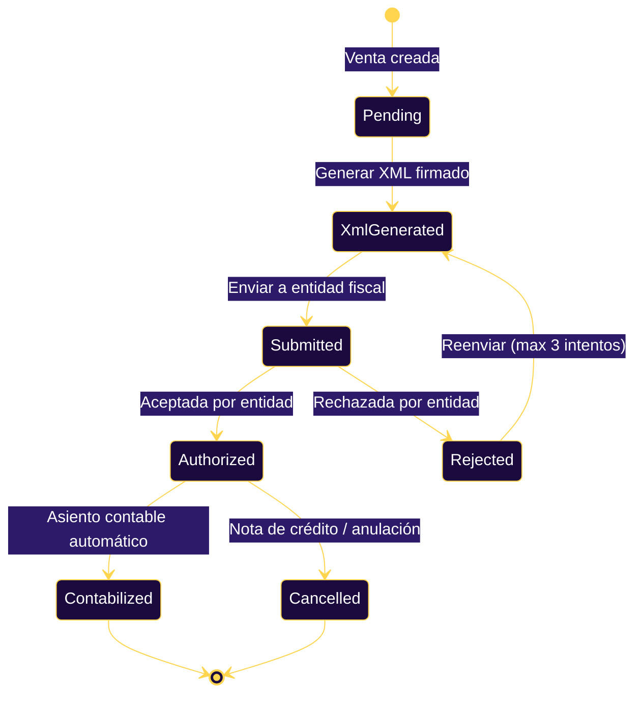
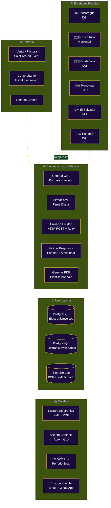
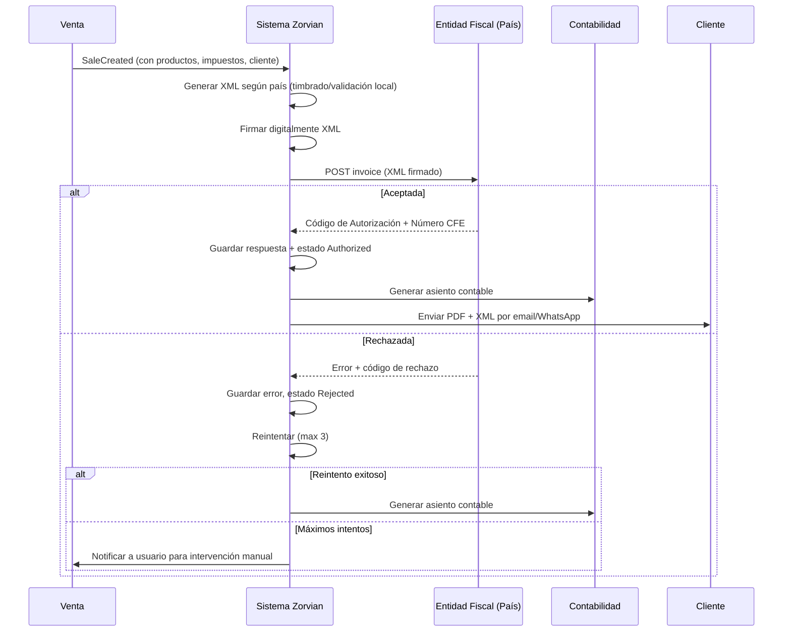
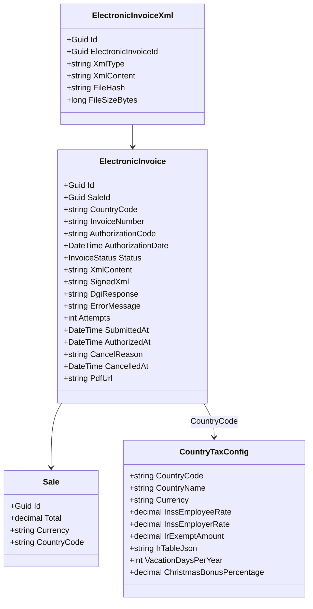

# Facturación Electrónica Multi-País

**Zorvian ERP** — Cumplimiento Fiscal Centroamericano (DGI / Hacienda / SAT / SAR / MH)

---

## Ciclo de Vida de la Factura Electrónica

---

## Arquitectura del Módulo

---

## Flujo por País

---

## Endpoints de la API

| Método | Endpoint | Descripción |
|--------|----------|-------------|
| `POST` | `/zorvian/v1/ElectronicInvoice/issue` | Emitir factura electrónica para una venta |
| `GET` | `/zorvian/v1/ElectronicInvoice/sale/{saleId}` | Obtener factura por ID de venta |
| `GET` | `/zorvian/v1/ElectronicInvoice/{id}` | Obtener factura por ID |
| `GET` | `/zorvian/v1/ElectronicInvoice` | Listar facturas por compañía + país |
| `POST` | `/zorvian/v1/ElectronicInvoice/{id}/resubmit` | Reenviar factura rechazada |
| `POST` | `/zorvian/v1/ElectronicInvoice/{id}/cancel` | Anular factura autorizada |
| `GET` | `/zorvian/v1/ElectronicInvoice/sale/{saleId}/xml` | Obtener XML de factura |
| `GET` | `/zorvian/v1/ElectronicInvoice/{id}/pdf` | Obtener URL del PDF |

---

## Modelo de Datos

---

## Formatos XML por País

| País | Entidad | Namespace | Prefijo Factura | Versión |
|:----:|:-------:|:---------:|:----------------:|:-------:|
| 🇳🇮 Nicaragua | DGI | `http://www.dgi.gob.ni` | NIC- | 1.0 |
| 🇨🇷 Costa Rica | Hacienda | `https://www.hacienda.go.cr` | CRI- | 4.3 |
| 🇬🇹 Guatemala | SAT | `http://www.sat.gob.gt` | GTM- | 2.0 |
| 🇭🇳 Honduras | SAR | `http://www.sar.gob.hn` | HND- | 1.1 |
| 🇸🇻 El Salvador | MH | `http://www.mh.gob.sv` | SLV- | 2.0 |
| 🇵🇦 Panamá | DGI | `http://www.dgi.gob.pa` | PAN- | 1.0 |

---

## Estados de la Factura Electrónica

| Estado | Descripción | Acción Siguiente |
|--------|-------------|------------------|
| `Pending` | Factura creada, pendiente de generar XML | Generar XML firmado |
| `XmlGenerated` | XML generado y firmado | Enviar a entidad fiscal |
| `Submitted` | Enviado a entidad fiscal | Esperar respuesta |
| `Authorized` | Aceptada por la entidad fiscal | ✅ Factura válida — generar asiento |
| `Rejected` | Rechazada por la entidad | Revisar error, corregir, reenviar |
| `Cancelled` | Anulada (nota de crédito) | Generar asiento de anulación |

---

## KPIs del Módulo

| KPI | Definición | Objetivo |
|-----|-----------|:--------:|
| Tasa de Autorización | % facturas autorizadas al primer intento | > 95% |
| Tiempo de Emisión | Segundos desde venta → factura autorizada | < 30s |
| Tasa de Rechazo | % facturas rechazadas | < 5% |
| Automatización Contable | % asientos generados automáticamente | 100% |
| Tiempo de Procesamiento Batch | Tiempo para procesar n facturas | < 1s por factura |

---

## Referencias en el Código

| Componente | Ruta |
|------------|------|
| Controller | `src/Zorvian.Web/Controllers/ElectronicInvoiceController.cs` |
| Service | `src/Zorvian.Application/Services/ElectronicInvoiceService.cs` |
| Entity | `src/Zorvian.Core/Entities/ElectronicInvoice.cs` |
| Repository | `src/Zorvian.Infrastructure/Repositories/ElectronicInvoiceRepository.cs` |
| Country Config | `src/Zorvian.Core/Entities/CountryTaxConfig.cs` |
| Regional Tax | `src/Zorvian.Core/Entities/RegionalTaxConfiguration.cs` |
