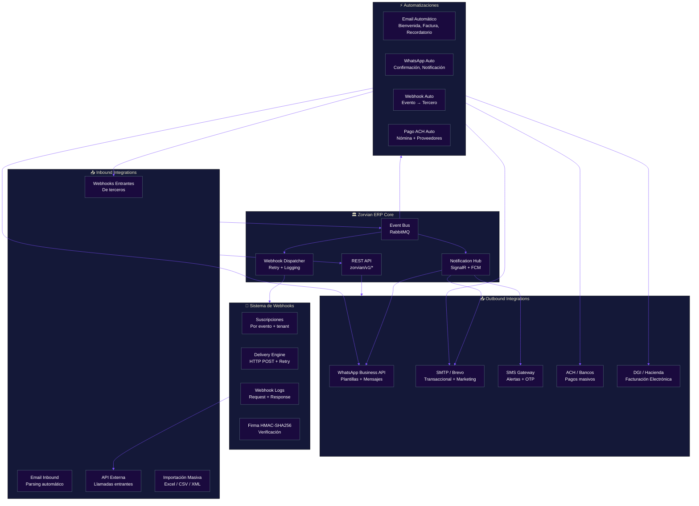
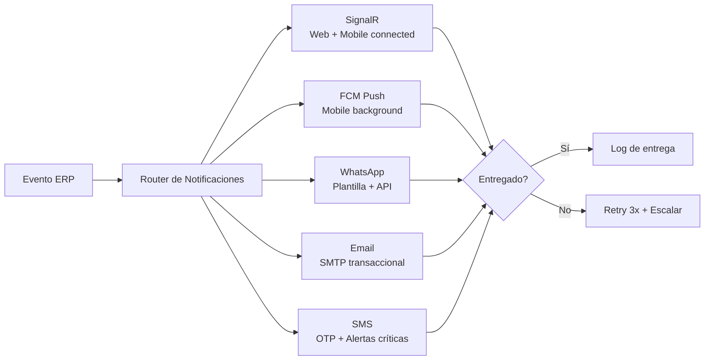

# Integraciones: WhatsApp, Email, Webhooks, API

**Zorvian ERP** — Arquitectura de Integración

---

---

## Catálogo de Webhooks

| Evento | Descripción | Payload | Frecuencia |
|--------|-------------|---------|:-----------:|
| `sale.created` | Venta facturada | Cliente, monto, productos | Inmediato |
| `sale.credit_note` | Nota de crédito emitida | Referencia, monto, razón | Inmediato |
| `inventory.low_stock` | Stock por debajo del mínimo | Producto, cantidad actual | Inmediato |
| `employee.created` | Nuevo empleado registrado | Datos del empleado | Inmediato |
| `payroll.processed` | Nómina procesada | Período, total brutos/netos | Mensual |
| `warranty.status_change` | Cambio de estado de garantía | Estado anterior → nuevo | Inmediato |
| `accounting.entry_posted` | Asiento contable contabilizado | Cuenta, debe, haber | Inmediato |

---

## Arquitectura de Notificaciones Multi-Canal

---

## API Pública — Endpoints Principales

| Método | Endpoint | Autenticación | Descripción |
|--------|----------|:-------------:|-------------|
| `GET` | `/api/v1/products` | API Key | Listar productos |
| `GET` | `/api/v1/products/{id}` | API Key | Detalle de producto |
| `POST` | `/api/v1/sales` | API Key + JWT | Crear venta |
| `GET` | `/api/v1/clients` | API Key | Listar clientes |
| `POST` | `/api/v1/webhooks/subscribe` | JWT Admin | Suscribir webhook |
| `DELETE` | `/api/v1/webhooks/{id}` | JWT Admin | Eliminar suscripción |
| `POST` | `/api/v1/inventory/adjust` | API Key + JWT | Ajuste de inventario |
| `GET` | `/api/v1/reports/{type}` | JWT Admin | Generar reporte |

---

## Formatos de Importación Soportados

| Formato | Módulos | Tamaño Máximo |
|---------|---------|:-------------:|
| Excel (.xlsx) | Productos, Clientes, Empleados, Proveedores | 10,000 filas |
| CSV (.csv) | Productos, Movimientos de inventario | 50,000 filas |
| XML (.xml) | Facturas electrónicas (DGI) | 10MB |
| JSON (.json) | Configuración, Webhooks | 5MB |
