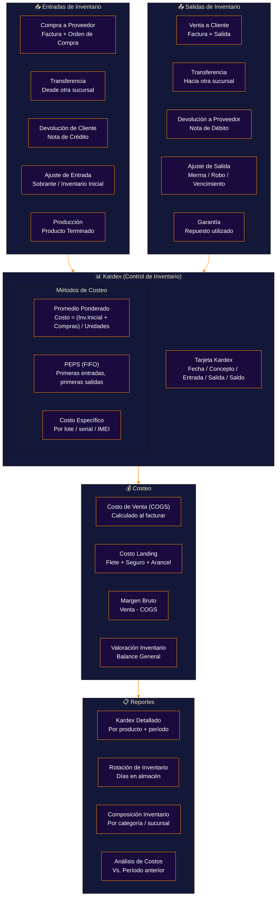
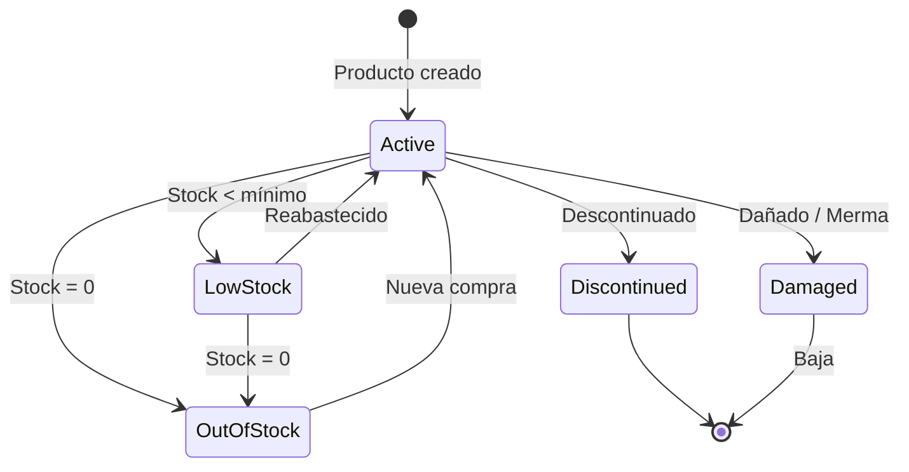
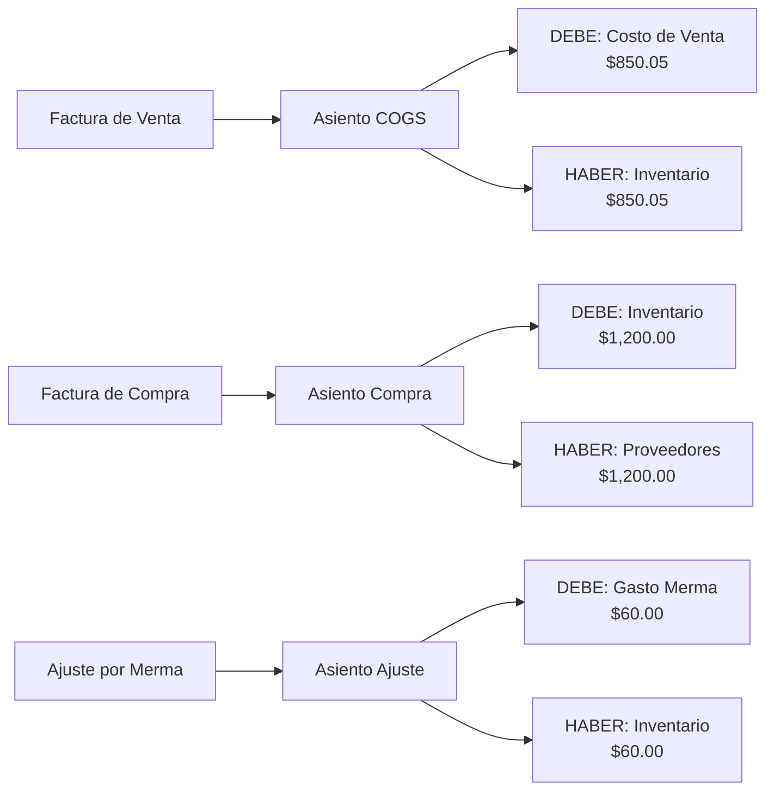

# Kardex y Costeo de Inventario

**Zorvian ERP** — Módulo de Inventario

---

---

## Estados del Producto en Inventario

---

## Ejemplo: Kardex con Promedio Ponderado

| Fecha | Concepto | Entrada Qty | Entrada $ | Salida Qty | Salida $ | Saldo Qty | Saldo $ | Costo Prom. |
|------|----------|:-----------:|:---------:|:----------:|:--------:|:---------:|:-------:|:-----------:|
| 01/06 | Inventario Inicial | 10 | $500.00 | — | — | 10 | $500.00 | $50.00 |
| 05/06 | Compra | 20 | $1,200.00 | — | — | 30 | $1,700.00 | $56.67 |
| 10/06 | Venta | — | — | 15 | $850.05 | 15 | $849.95 | $56.67 |
| 15/06 | Compra | 10 | $650.00 | — | — | 25 | $1,499.95 | $60.00 |
| 20/06 | Venta | — | — | 20 | $1,200.00 | 5 | $299.95 | $60.00 |
| 30/06 | Ajuste (Merma) | — | — | 1 | $60.00 | 4 | $239.95 | $60.00 |

---

## Integración Contable (Asientos Automáticos)

---

## Reglas de Negocio de Inventario

| Regla | Descripción | Automatización |
|-------|-------------|:--------------:|
| Stock Mínimo | Alerta cuando stock < mínimo definido | ✅ Automático |
| Lote Económico | Sugiere cantidad óptima de compra | ✅ IA |
| Vencimiento | Alerta 30 días antes de vencimiento | ✅ Automático |
| Costeo Automático | COGS calculado al momento de la venta | ✅ Automático |
| Transferencia | Cambio de costo si cambia sucursal | ✅ Según método |
| Garantía | Producto en garantía → inventario especial | ✅ Automático |

---

## KPIs del Módulo de Inventario

| KPI | Fórmula | Objetivo |
|-----|---------|:--------:|
| Rotación de Inventario | COGS / Inventario Promedio | > 6x año |
| Días en Almacén | 365 / Rotación | < 60 días |
| Exactitud de Inventario | (Stock Físico / Stock Sistema) × 100 | > 98% |
| Merma | (Valor Merma / COGS) × 100 | < 1% |
| Stockout Rate | Días sin stock / Días del período | < 2% |
| Cobertura de Stock | Stock Actual / Venta Diaria Promedio | 30-60 días |
