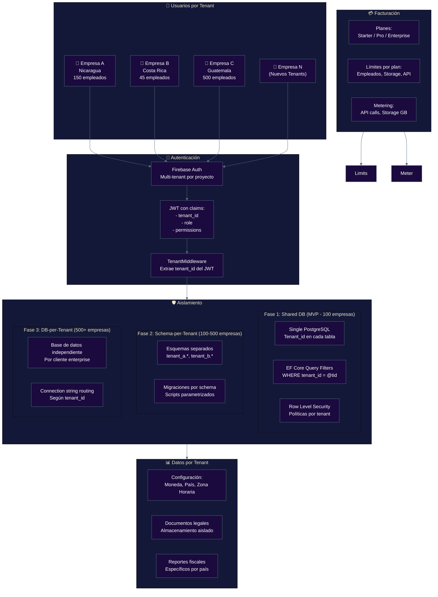

# Arquitectura Multi-Tenant

**Zorvian ERP** — Estrategia de Aislamiento y Escalabilidad

---



---

## Estrategia de Migración

```mermaid
%%{init: {'theme': 'base', 'themeVariables': { 'primaryColor': '#1A0A3E', 'primaryTextColor': '#fff', 'primaryBorderColor': '#546E7A', 'lineColor': '#546E7A'}}}%%

graph LR
    subgraph Now["Hoy: Shared DB"]
        S1["1 Base de Datos<br/>180 tablas con tenant_id"]
        S2["Índices compuestos<br/>(tenant_id + id)"]
        S3["Query Filters EF Core"]
        S4["RLS en PostgreSQL"]
    end
    
    subgraph Next["Próximo: Schema-per-Tenant"]
        N1["N schemas<br/>tenant_a, tenant_b..."]
        N2["Migraciones por schema"]
        N3["Connection pooling<br/>por schema"]
    end
    
    subgraph Future["Futuro: DB-per-Tenant"]
        F1["N bases de datos<br/>PostgreSQL independientes"]
        F2["Router por tenant_id"]
        F3["Aislamiento total"]
    end
    
    S1 --> S2
    S2 --> S3
    S3 --> S4
    S4 --> N1
    N1 --> N2
    N2 --> N3
    N3 --> F1
    F1 --> F2
    F2 --> F3
```



---

## Implementación Actual (Shared Database)

```csharp
// Query Filter en DbContext
protected override void OnModelCreating(ModelBuilder builder)
{
    builder.Entity<Employee>().HasQueryFilter(e =>
        e.TenantId == _tenantContext.TenantId);
    builder.Entity<Product>().HasQueryFilter(p =>
        p.TenantId == _tenantContext.TenantId);
    // Aplica a todas las 180+ entidades
}

// Middleware que inyecta TenantId
public class TenantMiddleware
{
    public async Task InvokeAsync(HttpContext context)
    {
        var tenantId = context.User.FindFirst("tenant_id")?.Value;
        _tenantContext.SetTenantId(tenantId);
        await _next(context);
    }
}
```

---

## Matriz de Aislamiento por Fase

| Aspecto | Shared DB | Schema-per-Tenant | DB-per-Tenant |
|---------|:---------:|:-----------------:|:-------------:|
| Costo operativo | 🟢 Bajo | 🟡 Medio | 🔴 Alto |
| Aislamiento de datos | 🟡 Parcial | 🟢 Bueno | 🟢 Total |
| Complejidad código | 🟢 Baja | 🟡 Media | 🔴 Alta |
| Backup/Restore | 🟡 Masivo | 🟢 Por tenant | 🟢 Por tenant |
| Escalabilidad | 🟡 100 tenants | 🟢 500 tenants | 🟢 Ilimitado |
| Mantenimiento DBA | 🟢 Simple | 🟡 Medio | 🔴 Complejo |
| Cross-tenant queries | 🟢 Fáciles | 🟡 Posibles | 🔴 Imposibles |

---

## Seguridad Multi-Tenant

| Capa | Mecanismo |
|------|-----------|
| **API** | JWT con claim `tenant_id` validado en cada request |
| **Middleware** | `TenantMiddleware` extrae y valida tenant_id |
| **ORM** | EF Core Query Filters globales en todas las queries |
| **Base de Datos** | Row Level Security (RLS) como defensa adicional |
| **Storage** | Buckets/Paths separados por tenant en GCS |
| **Logs** | Todos los audit logs incluyen tenant_id |
| **Cache** | Redis keys con prefijo `tenant:{id}:` |
| **Queues** | RabbitMQ exchanges separados por tenant |
