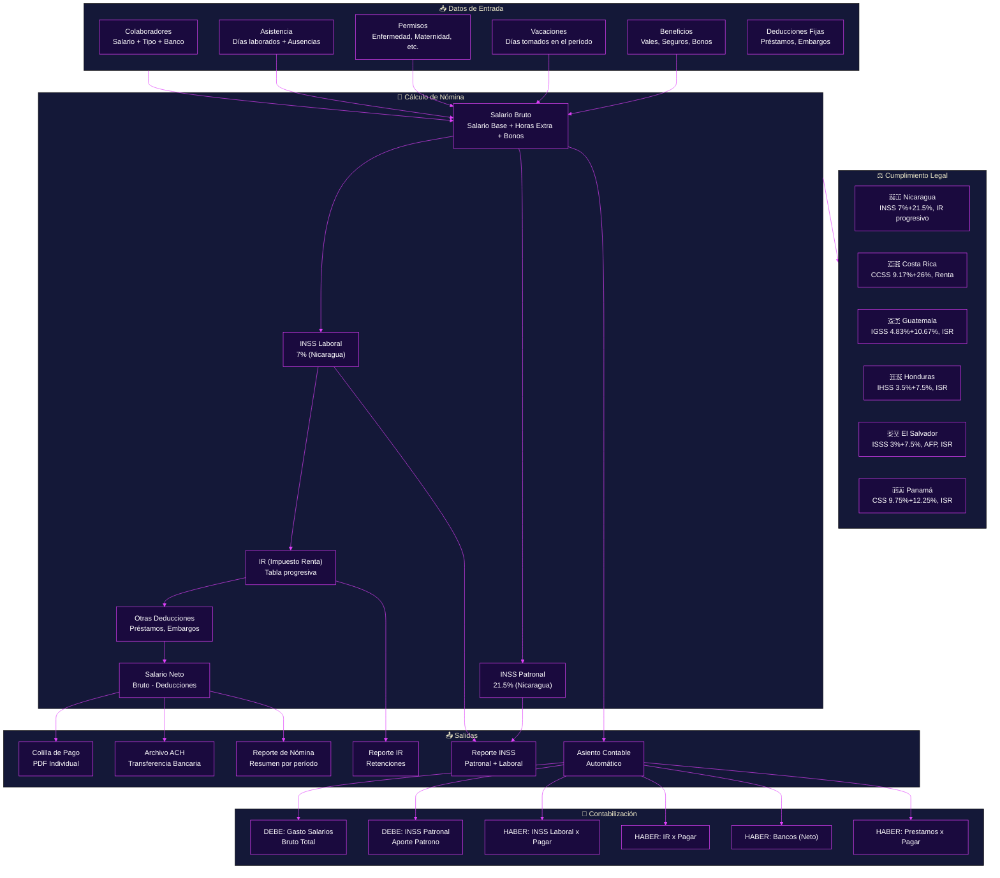
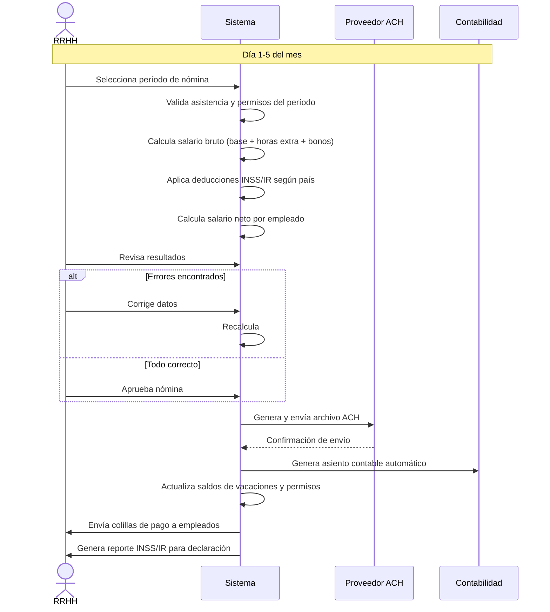
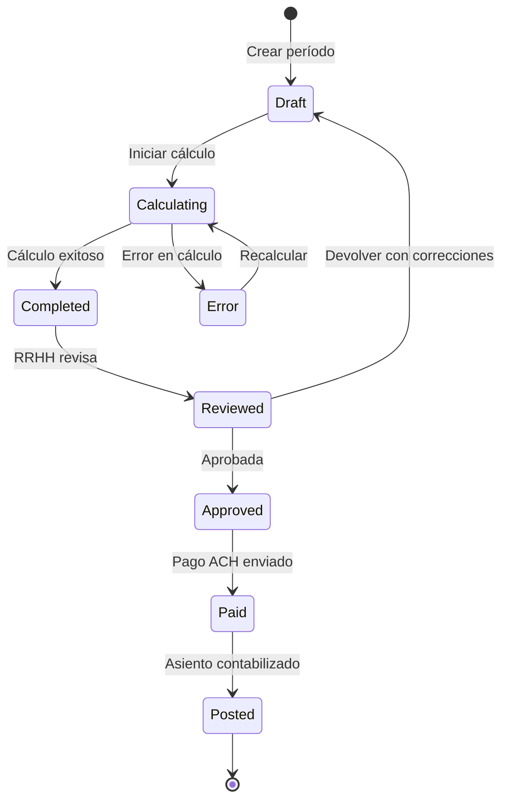

# Flujo de Nómina Completo

**Zorvian ERP** — Módulo de Nómina y Compensaciones

---

---

## Flujo de Cálculo de Nómina (Secuencia)

---

## Estados de la Nómina

---

## Ejemplo: Cálculo de Nómina Nicaragua

| Concepto | Empleado A | Empleado B |
|----------|:----------:|:----------:|
| Salario Base | $1,200.00 | $800.00 |
| Horas Extra | $150.00 | $0.00 |
| Bono | $100.00 | $50.00 |
| **Salario Bruto** | **$1,450.00** | **$850.00** |
| INSS Laboral (7%) | -$101.50 | -$59.50 |
| IR Progresivo | -$164.25 | -$0.00 |
| Préstamo | -$50.00 | -$0.00 |
| **Salario Neto** | **$1,134.25** | **$790.50** |
| INSS Patronal (21.5%) | $311.75 | $182.75 |
| **Costo Total Empresa** | **$1,761.75** | **$1,032.75** |

---

## KPIs del Módulo de Nómina

| KPI | Fórmula | Objetivo |
|-----|---------|:--------:|
| Tiempo de Proceso | Días desde cierre hasta pago | < 3 días |
| Precisión | % nóminas sin correcciones | > 99% |
| Automatización | % de asientos generados automáticamente | 100% |
| Costo por Colilla | Costo operativo / # empleados | < $0.50 |
| Cumplimiento Legal | % de declaraciones a tiempo | 100% |
