```mermaid
%%{init: {'theme': 'base', 'themeVariables': { 'primaryColor': '#1A0A3E', 'primaryTextColor': '#fff', 'primaryBorderColor': '#EF5350', 'lineColor': '#EF5350', 'secondaryColor': '#C62828', 'tertiaryColor': '#141838'}}}%%

graph TB
  subgraph Edge["🛡️ Edge Security"]
    WAF["CloudFlare WAF<br/>OWASP Core Ruleset"]
    DDoS["DDoS Protection<br/>L3/L7 Mitigation"]
    SSL["TLS 1.3<br/>Certificate Management"]
    RATE_LIMIT["Rate Limiting<br/>120 req/min por usuario"]
  end

  subgraph Auth["🔐 Authentication"]
    FA["Firebase Auth<br/>Email + Google + MFA"]
    JWT["JWT Service<br/>Access + Refresh Tokens"]
    MFA["Multi-Factor Auth<br/>TOTP / SMS"]
    SESSION["Session Management<br/>1h access, 7d refresh"]
  end

  subgraph AuthZ["📋 Authorization"]
    RBAC["RBAC Core<br/>5 roles predefinidos"]
    PERMS["Permission System<br/>RequirePermissionAttribute"]
    TENANT["Tenant Isolation<br/>TenantMiddleware"]
    AUDIT["Audit Logging<br/>Todas las acciones"]
  end

  subgraph API["🌐 API Security"]
    CORS["CORS Policy<br/>Orígenes restringidos"]
    VALID["Input Validation<br/>FluentValidation"]
    SANITIZE["XSS Protection<br/>Input sanitization"]
    IDEMP["Idempotency<br/>Safe retry"]
    ENCRYPT["Encryption<br/>AES-256 at rest"]
  end

  subgraph Data["💾 Data Security"]
    RLS["Row Level Security<br/>PostgreSQL RLS"]
    QF["Query Filters<br/>EF Core tenant isolation"]
    ENC_DB["TDE / Column Encryption<br/>Sensitive fields"]
    BACKUP["Backup Encryption<br/>AES-256 backups"]
    RET["Retention Policy<br/>30d backups, 5y audit"]
  end

  subgraph Infra["🔧 Infrastructure Security"]
    SECRETS["Secrets Management<br/>Environment Variables"]
    NETWORK["Network Policy<br/>Internal subnet only"]
    SBOM["SBOM / Dependency Scan<br/>GitHub Dependabot"]
    MONITOR["Security Monitoring<br/>Sentry + Alerts"]
  end

  subgraph Compliance["📜 Compliance"]
    SOC2["SOC 2 Type II<br/>(Fase 2)"]
    ISO27001["ISO 27001<br/>(Fase 2)"]
    GDPR["RGPD / LPD<br/>Datos personales"]
    SOX["SOX Compliance<br/>(Fase 3)"]
  end

  subgraph Incidents["🚨 Incident Response"]
    DETECT["Detection<br/>Anomaly + SIEM"]
    RESPOND["Response Plan<br/>Runbook documentado"]
    FORENSIC["Forensics<br/>Audit trail + logs"]
    RECOVER["Recovery<br/>PITR + DRP"]
  end

  User --> Edge
  Edge --> Auth
  Auth --> AuthZ
  AuthZ --> API
  API --> Data
  API --> Infra
  AuthZ --> Audit
  Data --> Compliance
  Infra --> Incidents
```

# Arquitectura de Seguridad

**Zorvian ERP** — Defensa en Profundidad

---

---

## Matriz de Roles y Permisos

| Permiso | SuperAdmin | CompanyAdmin | RRHH | Supervisor | Empleado |
|---------|:----------:|:------------:|:----:|:----------:|:--------:|
| tenant.configure | ✅ | ✅ | ❌ | ❌ | ❌ |
| employee.create | ✅ | ✅ | ✅ | ❌ | ❌ |
| employee.read.all | ✅ | ✅ | ✅ | ❌ | ❌ |
| employee.read.team | ✅ | ✅ | ✅ | ✅ | ❌ |
| employee.read.self | ✅ | ✅ | ✅ | ✅ | ✅ |
| vacation.approve | ✅ | ✅ | ✅ | ✅ (equipo) | ❌ |
| payroll.process | ✅ | ✅ | ✅ | ❌ | ❌ |
| accounting.post | ✅ | ✅ | ❌ | ❌ | ❌ |
| audit.view | ✅ | ✅ | ❌ | ❌ | ❌ |
| report.export | ✅ | ✅ | ✅ | ✅ (equipo) | ❌ |

---

## Headers de Seguridad HTTP

| Header | Valor | Propósito |
|--------|-------|-----------|
| `Content-Security-Policy` | `default-src 'self'` | Previene XSS y data injection |
| `Strict-Transport-Security` | `max-age=31536000; includeSubDomains` | Fuerza HTTPS |
| `X-Content-Type-Options` | `nosniff` | Previene MIME sniffing |
| `X-Frame-Options` | `DENY` | Previene clickjacking |
| `Referrer-Policy` | `strict-origin-when-cross-origin` | Control de referrer |
| `Permissions-Policy` | `camera=(), microphone=()` | Restringe APIs del navegador |

---

## Plan de Respuesta a Incidentes

| Fase | Acción | Responsable | SLA |
|------|--------|-------------|:---:|
| 1. Detección | Alertas automáticas (Sentry, Uptime) | Sistema | < 5 min |
| 2. Clasificación | Determinar severidad (P0-P3) | DevOps | < 15 min |
| 3. Contención | Aislar servicio afectado, revocar tokens | DevOps | < 30 min |
| 4. Erradicación | Parchear vulnerabilidad, rotar secrets | Dev Team | < 4h |
| 5. Recuperación | Restore desde backup, verificar integridad | DevOps | < 2h |
| 6. Post-mortem | Análisis de causa raíz, actualizar runbook | Todo el equipo | < 48h |
