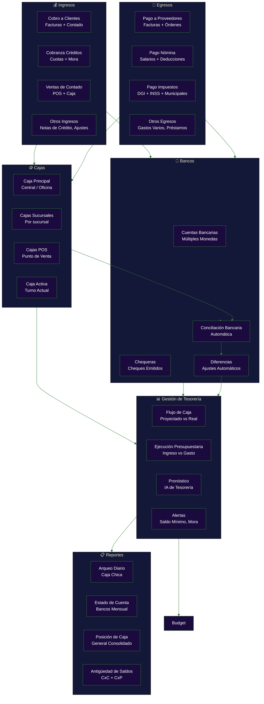
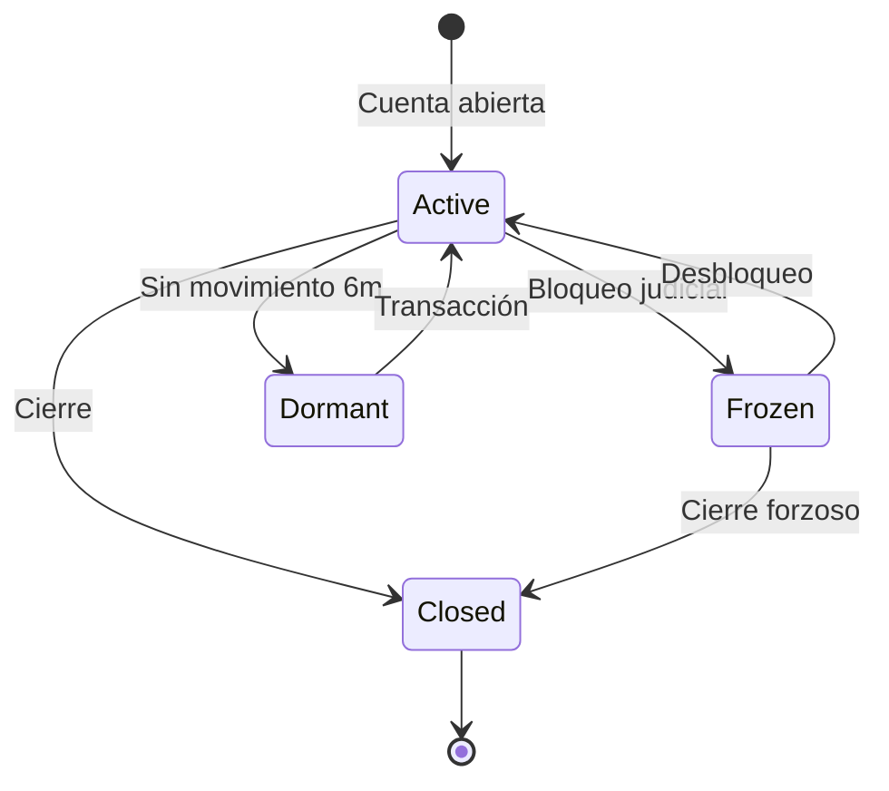
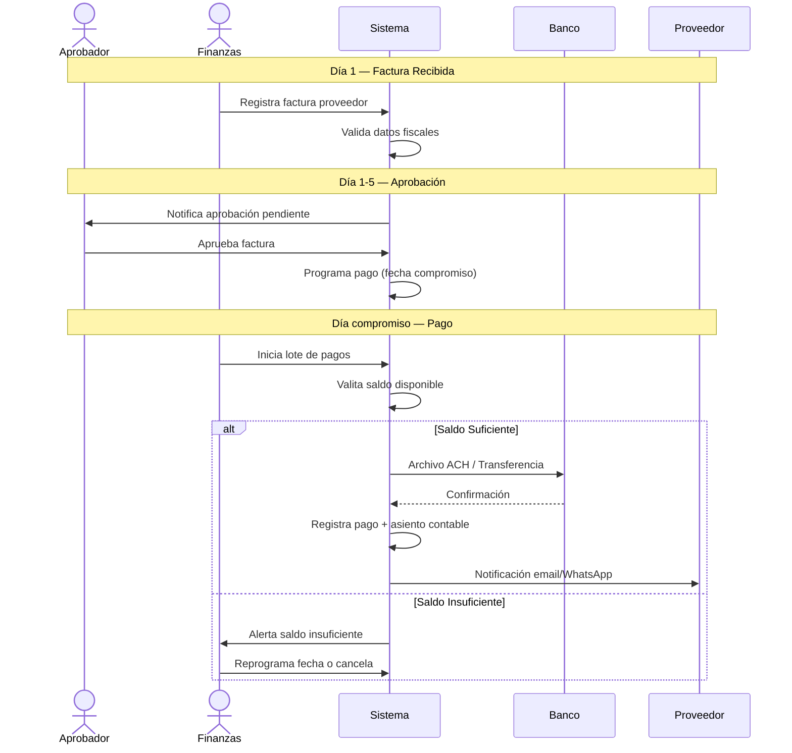

# Flujo de Tesorería y Gestión de Caja

**Zorvian ERP** — Módulo de Tesorería

---

---

## Estados de Cuentas Bancarias

---

## Flujo de Pago a Proveedores

---

## Conciliación Bancaria Automática

| Paso | Descripción | Automatización |
|------|-------------|:--------------:|
| 1 | Exportar movimientos bancarios (CSV/OFX) | ✅ Importación automática |
| 2 | Matching automático: monto + fecha + referencia | ✅ Algoritmo de fuzzy matching |
| 3 | Identificar diferencias (cheques no cobrados, cargos no registrados) | ✅ Automático |
| 4 | Sugerir ajustes automáticos | ✅ IA sugiere asientos |
| 5 | Generar reporte de conciliación | ✅ PDF/Excel automático |
| 6 | Cerrar período conciliado | ✅ Bloqueo de modificaciones |

---

## KPIs del Módulo de Tesorería

| KPI | Fórmula | Objetivo |
|-----|---------|:--------:|
| Días de Cobro (DSO) | (CxC / Ventas) × 30 | < 45 días |
| Días de Pago (DPO) | (CxP / Compras) × 30 | > 30 días |
| Ciclo de Efectivo | DSO - DPO | < 15 días |
| Precisión de Pronóstico | (Pronóstico / Real) × 100 | > 85% |
| Cobertura de Liquidez | (Efectivo + CxC) / (Pasivo Corto Plazo) | > 1.2x |
| % Conciliación Automática | (Match auto / Total transacciones) × 100 | > 90% |
