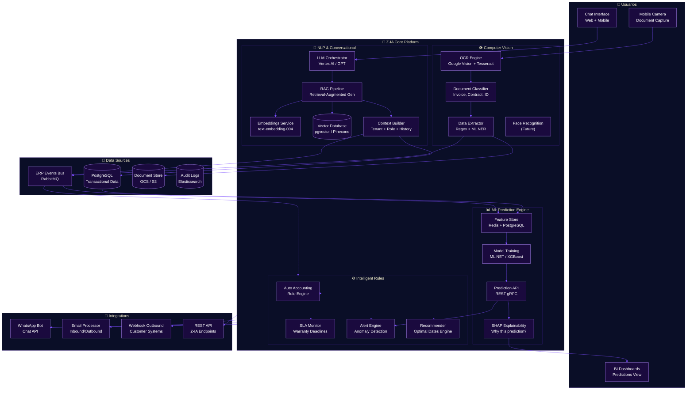
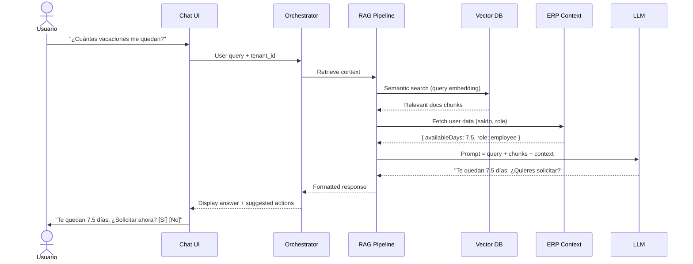
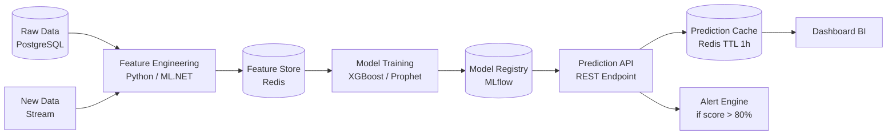

# Z-IA: Arquitectura de Inteligencia Artificial

**Zorvian ERP** — Módulo de IA Empresarial

---

## Visión General

Z-IA es el ecosistema de inteligencia artificial de Zorvian ERP, compuesto por cuatro capacidades principales: **Procesamiento de Lenguaje Natural (RAG)**, **Visión por Computadora (OCR)**, **Machine Learning Predictivo** y **Motor de Reglas Inteligente**.

---

---

## Componentes

### 1. NLP & Conversacional (Chatbot Z-IA)

| Componente | Tecnología | Propósito |
|------------|-----------|-----------|
| LLM Orchestrator | Vertex AI / OpenAI GPT | Orquestación de respuestas con contexto multi-turno |
| Embeddings Service | Google text-embedding-004 | Vectorización de documentos y consultas |
| Vector Database | pgvector (PostgreSQL) | Almacenamiento y búsqueda semántica de embeddings |
| RAG Pipeline | LangChain / Custom C# | Retrieval-Augmented Generation con contexto de tenant |
| Context Builder | ASP.NET Core | Construye contexto empresarial (rol, tenant, historial) |

### 2. Computer Vision (OCR)

| Componente | Tecnología | Propósito |
|------------|-----------|-----------|
| OCR Engine | Google Vision API + Tesseract | Reconocimiento de texto en documentos escaneados |
| Document Classifier | ML.NET Multiclass | Clasifica tipo de documento (factura, cédula, contrato) |
| Data Extractor | Regex + CRF | Extrae campos clave (nombre, monto, fecha, Cédula RUC) |

### 3. ML Predictivo

| Modelo | Algoritmo | Features | Output |
|--------|-----------|----------|--------|
| Predicción Ausentismo | XGBoost | Historial, día, depto, antigüedad | Score 0-100 por empleado |
| Predicción Ventas | Prophet / SARIMA | Historial ventas, estacionalidad, promociones | Proyección semanal/mensual |
| Clasificación Gastos | Random Forest | Categoría, monto, proveedor, departamento | Categoría automática |
| Riesgo Rotación | XGBoost + SHAP | Antigüedad, ausentismo, horas extra, cambios salariales | Score + top 3 factores |

### 4. Motor de Reglas Inteligente

| Regla | Disparador | Acción |
|-------|-----------|--------|
| Auto Accounting | Venta / Nómina / Compra | Genera asiento contable automático |
| SLA Warranty | Registro de garantía | Calcula deadline, alerta antes de vencer |
| Anomaly Detection | Transacción inusual | Alerta a administrador |
| Optimal Dates | Solicitud de vacaciones | Sugiere fechas óptimas según ocupación del equipo |

---

## Flujo de Consulta (RAG)

---

## Arquitectura de Predicción (ML Pipeline)

---

## Stack Tecnológico Z-IA

| Capa | Tecnología | Estado |
|------|-----------|--------|
| LLM Orchestration | Vertex AI (Gemini) / OpenAI | ✅ |
| Embeddings | Google text-embedding-004 | ✅ |
| Vector DB | pgvector (PostgreSQL 16) | 🟡 En progreso |
| OCR | Google Cloud Vision + Tesseract | ✅ |
| ML Training | ML.NET + Python (XGBoost) | ✅ |
| Feature Store | Redis + PostgreSQL | 🟡 En progreso |
| Model Registry | MLflow / Custom | 🟡 En progreso |
| Explainability | SHAP (Python) | 📅 Q4 2026 |
| Chat UI | Flutter (Z-IA Chat Widget) | ✅ |
| WhatsApp Bot | WhatsApp Business API | 📅 Q1 2027 |

---

## KPIs del Módulo Z-IA

| KPI | Objetivo | Actual |
|-----|----------|--------|
| Latencia RAG promedio | < 2s | 1.8s |
| Precisión OCR | > 95% | 93% |
| Precisión predicción ausentismo | > 85% | 82% |
| Tasa de resolución automática chat | > 70% | 65% |
| Tiempo de entrenamiento ML | < 30 min | 25 min |
