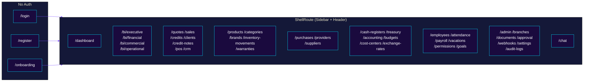
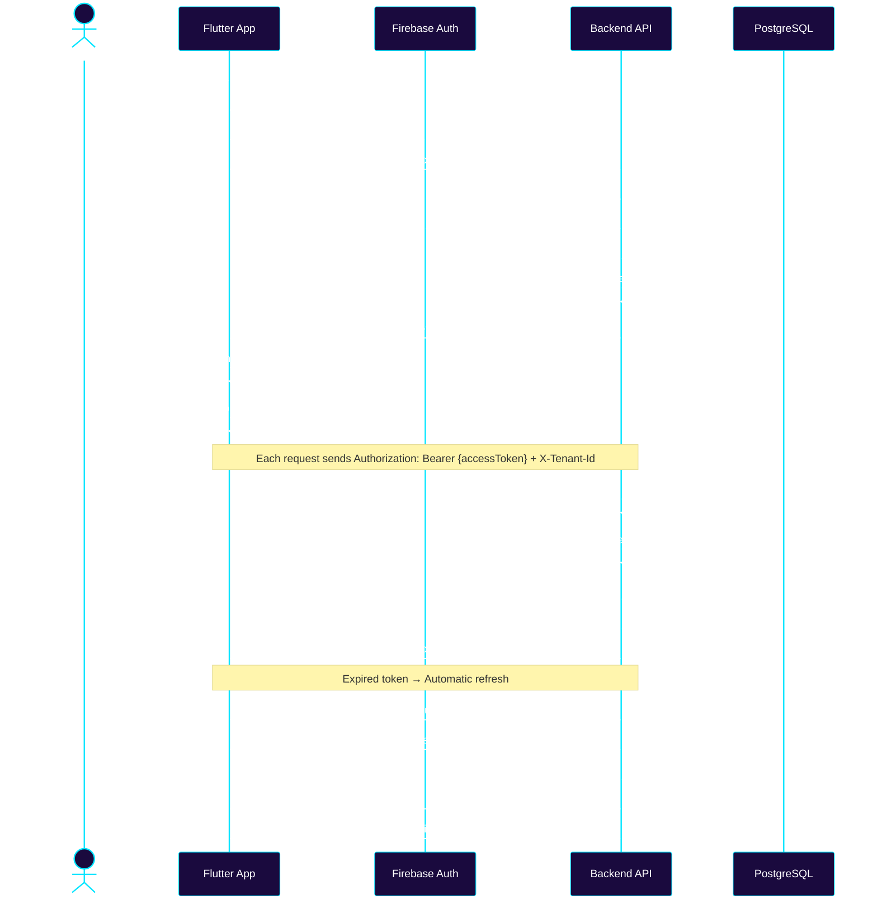
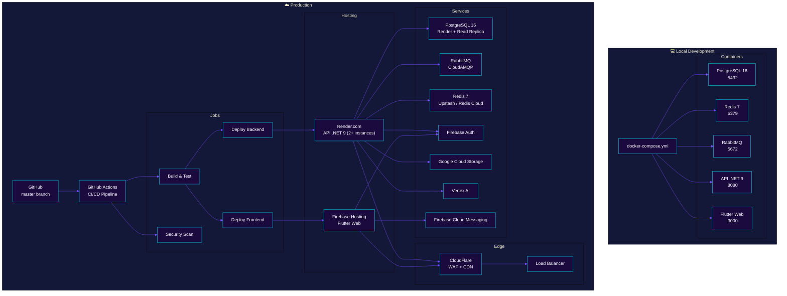

# Zorvian ERP — General Architecture

**Version:** 2.0 — June 2026
**Visual Identity:** Deep Violet-Navy Corporate Premium

---

## Diagram Index

| # | Diagram | File |
|---|---------|------|
| 1 | 🏛️ General Architecture | `docs/en/diagrams/architecture_overview.md` |
| 2 | 🤖 Z-IA (Artificial Intelligence) | `docs/en/diagrams/z_ia_architecture.md` |
| 3 | 💼 Complete CRM Pipeline | `docs/en/diagrams/crm_pipeline.md` |
| 4 | 🧾 Accounting Cycle | `docs/en/diagrams/accounting_cycle.md` |
| 5 | 💰 Treasury Flow | `docs/en/diagrams/treasury_flow.md` |
| 6 | 📦 Kardex and Inventory Costing | `docs/en/diagrams/inventory_costing.md` |
| 7 | 🏢 Multi-Tenant Architecture | `docs/en/diagrams/multi_tenant.md` |
| 8 | 🔐 Authentication Flow | Included here |
| 9 | 🚀 Deployment Diagram | Included here |
| 10 | 🗄️ Database Diagram | Included here |

---

## 1. General Architecture

```mermaid
%%{init: {'theme': 'base', 'themeVariables': { 'primaryColor': '#1A0A3E', 'primaryTextColor': '#fff', 'primaryBorderColor': '#00E5FF', 'lineColor': '#7C4DFF', 'secondaryColor': '#2D1B69', 'tertiaryColor': '#141838', 'clusterBkg': '#0A0E27', 'clusterBorder': '#2D1B69'}}}%%

---
title: Zorvian ERP — General Architecture v2.0
---

graph TB
  subgraph Clients["📱 Clients"]
    WEB["🌐 Web App<br/>Flutter (Firebase Hosting)"]
    MOBILE["📱 Mobile App<br/>Flutter (Android/iOS)"]
    KIOSK["🖥️ Kiosk / POS<br/>Flutter Embedded"]
  end

  subgraph Edge["🛡️ Edge & Security"]
    CF["CloudFlare / WAF<br/>CDN + DDoS + SSL"]
    LB["Load Balancer<br/>HAProxy / AWS ALB"]
    RL["Rate Limiter<br/>120 req/min per user"]
  end

  subgraph Frontend["🎨 Frontend — Flutter (frontend/)"]
    FW["Flutter Framework 3.x<br/>Material 3 + Riverpod"]
    subgraph Core["Core"]
      R["go_router 130+ routes<br/>ShellRoute + Sidebar"]
      AUTH["auth_provider<br/>Firebase Auth + JWT"]
      SIG["SignalR Client<br/>Live Notifications"]
      OFF["Drift SQLite<br/>Offline-first + Sync"]
      DS["Design System<br/>45 Z-* components"]
    end
    subgraph Features["46 Modules (by module color)"]
      V["<span style='color:#00E5FF'>●</span> Sales<br/>(CRM, POS, Quotes)"]
      I["<span style='color:#FF8F00'>●</span> Inventory<br/>(Products, Warranties)"]
      C["<span style='color:#FFB300'>●</span> Purchases<br/>(Orders, Providers)"]
      F["<span style='color:#1B5E20'>●</span> Finance<br/>(Accounting, TES, Cash)"]
      HR["<span style='color:#E040FB'>●</span> Talent<br/>(Payroll, Attendance)"]
      BI["<span style='color:#B388FF'>●</span> BI & IA<br/>(Dashboards, Z-IA)"]
      ADM["<span style='color:#546E7A'>●</span> Admin<br/>(Users, Webhooks)"]
    end
  end

  subgraph Gateway["🚪 API Gateway"]
    GW["YARP / Envoy Proxy<br/>Routing + Throttling"]
    SIG_HUB["SignalR Hub<br/>Scale Out (Redis Backplane)"]
    AGG["Aggregation Layer<br/>BFF Pattern"]
  end

  subgraph Backend["⚙️ Backend — .NET 9 (src/)"]
    direction TB
    subgraph Layers["Clean Architecture"]
      WEB_API["🌐 Zorvian.Web<br/>86 API Controllers<br/>zorvian/v1/*"]
      APP["📦 Zorvian.Application<br/>87 Services<br/>AutoMapper + FluentValidation"]
      INFRA["🔧 Zorvian.Infrastructure<br/>86 Repositories<br/>31 Infrastructure services"]
      CORE["🎯 Zorvian.Core<br/>154 Domain entities<br/>Enums + Interfaces"]
    end
    subgraph Background["Background Jobs (Hangfire)"]
      J1["CheckInReminder 9AM"]
      J2["Backup DB 2AM"]
      J3["Training ML Weekly"]
      J4["VacationAccrual 1st month"]
      J5["WebhookDelivery"]
    end
    WEB_API --> APP
    APP --> CORE
    INFRA --> APP
  end

  subgraph Data["💾 Data"]
    PG[("PostgreSQL 16<br/>180+ tables<br/>Read Replicas")]
    REDIS[("Redis 7<br/>Cache + Rate Limit + Session")]
    RABBIT[("RabbitMQ<br/>Event Bus Cross-Service")]
    ES[("Elasticsearch<br/>Audit Logs + Search")]
    GCS[("Google Cloud Storage<br/>Documents + Files")]
  end

  subgraph AI["🤖 Z-IA Platform"]
    LLM["LLM / Vertex AI"]
    VDB[("pgvector<br/>Embeddings")]
    ML["ML.NET / XGBoost<br/>Predictions"]
    OCR["Google Vision<br/>OCR"]
  end

  subgraph Observability["📊 Observability"]
    PROM["Prometheus"]
    GRAF["Grafana"]
    SENTRY["Sentry"]
    LOGS["Loki / Seq"]
    TRACE["OpenTelemetry"]
  end

  subgraph External["🔌 External Services"]
    FA["Firebase Auth"]
    FCM["Firebase Cloud Messaging"]
    SMTP["SMTP Brevo"]
    WHATSAPP["WhatsApp API"]
  end

  subgraph CI_CD["🚀 CI/CD — GitHub Actions"]
    direction TB
    BUILD["Build & Test"]
    SCAN["Security Scan"]
    DEPLOY_B["Deploy Backend<br/>→ Render / Docker"]
    DEPLOY_F["Deploy Frontend<br/>→ Firebase Hosting"]
    BUILD --> SCAN
    SCAN --> DEPLOY_B
    SCAN --> DEPLOY_F
  end

  %% Connections Client → Edge
  WEB --> CF
  MOBILE --> CF
  KIOSK --> CF
  CF --> LB
  LB --> RL

  %% Connections Edge → Frontend
  RL --> FW
  
  %% Connections Frontend → Gateway
  FW --> GW
  FW --> SIG_HUB

  %% Connections Gateway → Backend
  GW --> WEB_API
  SIG_HUB --> SIG
  AGG --> WEB_API

  %% Connections Backend → Data
  INFRA --> PG
  INFRA --> REDIS
  INFRA --> RABBIT
  INFRA --> ES
  INFRA --> GCS

  %% Connections Backend → AI
  APP --> AI
  INFRA --> AI

  %% Connections Backend → External
  INFRA --> FA
  INFRA --> FCM
  INFRA --> SMTP
  INFRA --> WHATSAPP

  %% Observability
  Backend --> Observability
  Gateway --> Observability
  Data --> Observability

  %% CI/CD
  BUILD --> Frontend
  BUILD --> Backend
```

---

## 2. Route Diagram — Frontend



---

## 3. Database Diagram — Main Modules

```mermaid
%%{init: {'theme': 'base', 'themeVariables': { 'primaryColor': '#1A0A3E', 'primaryTextColor': '#fff', 'primaryBorderColor': '#00E5FF', 'lineColor': '#7C4DFF', 'secondaryColor': '#2D1B69', 'tertiaryColor': '#141838'}}}%%

erDiagram
    Tenant {
        string Id PK
        string Name
    }
    User {
        string Id PK
        string TenantId FK
        string Email
        string FirebaseUid
    }
    Role {
        string Id PK
        string Name "SuperAdmin|CompanyAdmin|Rrhh|Supervisor|Employee"
    }
    UserRole {
        string UserId FK
        string RoleId FK
    }
    Branch {
        string Id PK
        string TenantId FK
        string Name
    }
    Employee {
        string Id PK
        string TenantId FK
        string BranchId FK
        string FirstName
        string LastName
        string Email
    }
    Lead {
        string Id PK
        string TenantId FK
        string FirstName
        string LastName
        string Status "new|contacted|qualified|lost"
        string Source
    }
    Opportunity {
        string Id PK
        string TenantId FK
        string LeadId FK
        string Title
        float ExpectedValue
        string StageId FK
        int Probability
    }
    PipelineStage {
        string Id PK
        string TenantId FK
        string Name
        int Order
        string Color
    }
    Sale {
        string Id PK
        string TenantId FK
        string ClientId FK
        string BranchId FK
        datetime Date
        float Total
        string Status
    }
    SaleDetail {
        string SaleId FK
        string ProductId FK
        int Quantity
        float UnitPrice
    }
    Product {
        string Id PK
        string TenantId FK
        string Name
        string CategoryId FK
        string BrandId FK
        float Price
        int Stock
    }
    Category {
        string Id PK
        string TenantId FK
        string Name
    }
    Brand {
        string Id PK
        string TenantId FK
        string Name
    }
    PayrollRun {
        string Id PK
        string TenantId FK
        string PeriodId FK
        datetime Date
        string Status
    }
    PayrollDetail {
        string PayrollRunId FK
        string EmployeeId FK
        float GrossSalary
        float NetSalary
    }
    AttendanceRecord {
        string Id PK
        string TenantId FK
        string EmployeeId FK
        datetime CheckIn
        datetime CheckOut
    }
    AccountingEntry {
        string Id PK
        string TenantId FK
        string AccountId FK
        float Debit
        float Credit
        datetime Date
    }
    Account {
        string Id PK
        string TenantId FK
        string Code "1-01-001"
        string Name
        string Type "asset|liability|equity|income|expense"
    }
    TreasuryMovement {
        string Id PK
        string TenantId FK
        string AccountId FK
        float Amount
        string Type "income|expense"
        datetime Date
    }
    CheckBook {
        string Id PK
        string TenantId FK
        string BankAccountId FK
        int StartNumber
        int EndNumber
    }

    Tenant ||--o{ User : ""
    Tenant ||--o{ Branch : ""
    Tenant ||--o{ Lead : ""
    Tenant ||--o{ Opportunity : ""
    Tenant ||--o{ PipelineStage : ""
    Tenant ||--o{ Product : ""
    Tenant ||--o{ Account : ""
    Tenant ||--o{ TreasuryMovement : ""
    Tenant ||--o{ CheckBook : ""
    User ||--o{ UserRole : ""
    Role ||--o{ UserRole : ""
    Branch ||--o{ Employee : ""
    Branch ||--o{ Sale : ""
    Lead ||--o{ Opportunity : ""
    PipelineStage ||--o{ Opportunity : ""
    Sale ||--o{ SaleDetail : ""
    Product ||--o{ SaleDetail : ""
    Category ||--o{ Product : ""
    Brand ||--o{ Product : ""
    PayrollRun ||--o{ PayrollDetail : ""
    Employee ||--o{ PayrollDetail : ""
    Employee ||--o{ AttendanceRecord : ""
    PayrollRun ||--o{ PayrollDetail : ""
    Account ||--o{ AccountingEntry : ""
```



---

## 4. Authentication Flow



---

## 5. Deployment Diagram



---

## 6. Legend

| Color | Module | Meaning |
|-------|--------|---------|
| `#1A0A3E` Deep Violet-Navy | Core / Backend | Authority, financial solidity |
| `#00E5FF` Electric Cyan | Frontend / Sales | Technology, speed |
| `#7C4DFF` Medium Violet | CTA / Actions | Digital transformation |
| `#B388FF` Purple Aura | Z-IA (Artificial Intelligence) | Innovation, AI |
| `#00BCD4` CRM Cyan | CRM | Customer relationships |
| `#1B5E20` Forest Green | Finance | Money, stability |
| `#FF8F00` Logistic Amber | Inventory | Movement, warehouse |
| `#E040FB` Talent Magenta | HR | People, growth |
| `#546E7A` Blue Grey | Admin / Infra | Utility, neutral |

---

## 7. Related Diagrams

| Module | Link |
|--------|------|
| 🤖 Z-IA (AI + ML + OCR + Chatbot) | [View diagram →](z_ia_architecture.md) |
| 💼 Complete CRM Pipeline | [View diagram →](crm_pipeline.md) |
| 🧾 Accounting Cycle | [View diagram →](accounting_cycle.md) |
| 💰 Treasury Flow | [View diagram →](treasury_flow.md) |
