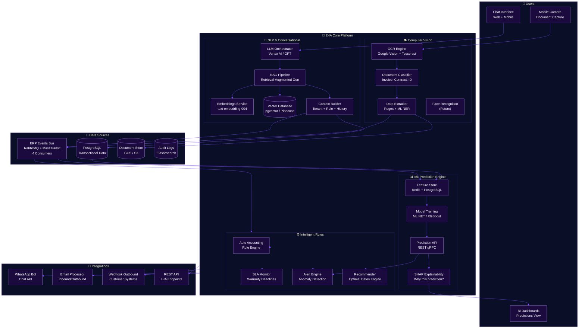
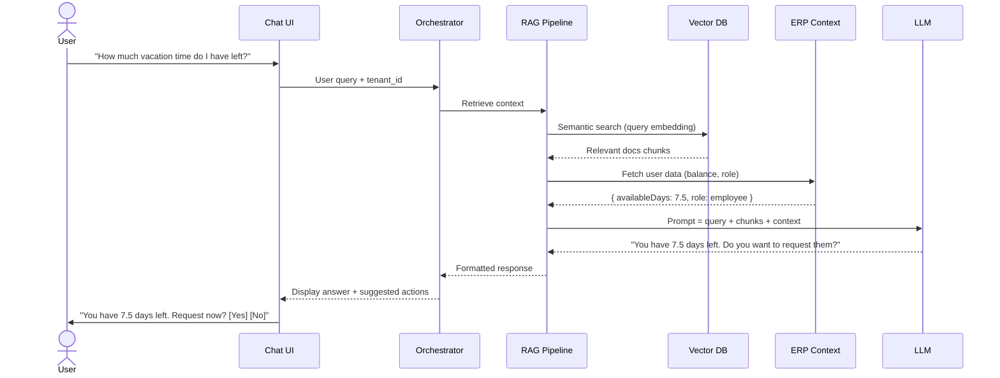
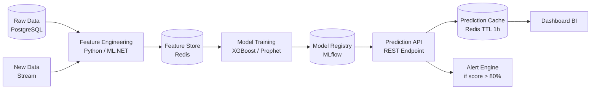

# Z-IA: Artificial Intelligence Architecture

**Zorvian ERP** — Enterprise AI Module

---

## Overview

Z-IA is the artificial intelligence ecosystem of Zorvian ERP, composed of four main capabilities: **Natural Language Processing (RAG)**, **Computer Vision (OCR)**, **Predictive Machine Learning**, and **Intelligent Rule Engine**.

---

---

## Components

### 1. NLP & Conversational (Z-IA Chatbot)

| Component | Technology | Purpose |
|------------|-----------|-----------|
| LLM Orchestrator | Vertex AI / OpenAI GPT | Multi-turn response orchestration with context |
| Embeddings Service | Google text-embedding-004 | Document and query vectorization |
| Vector Database | pgvector (PostgreSQL) | Semantic search and storage of embeddings |
| RAG Pipeline | LangChain / Custom C# | Retrieval-Augmented Generation with tenant context |
| Context Builder | ASP.NET Core | Builds enterprise context (role, tenant, history) |

### 2. Computer Vision (OCR)

| Component | Technology | Purpose |
|------------|-----------|-----------|
| OCR Engine | Google Vision API + Tesseract | Text recognition in scanned documents |
| Document Classifier | ML.NET Multiclass | Classifies document type (invoice, ID, contract) |
| Data Extractor | Regex + CRF | Extracts key fields (name, amount, date, ID/Tax ID) |

### 3. Predictive ML

| Model | Algorithm | Features | Output |
|--------|-----------|----------|--------|
| Absenteeism Prediction | XGBoost | History, day, dept, seniority | Score 0-100 per employee |
| Sales Prediction | Prophet / SARIMA | Sales history, seasonality, promotions | Weekly/monthly projection |
| Expense Classification | Random Forest | Category, amount, provider, department | Automatic category |
| Churn Risk | XGBoost + SHAP | Seniority, absenteeism, overtime, salary changes | Score + top 3 factors |

### 4. Intelligent Rule Engine

| Rule | Trigger | Action |
|-------|-----------|--------|
| Auto Accounting | Sale / Payroll / Purchase | Generates automatic accounting entry |
| SLA Warranty | Warranty registration | Calculates deadline, alerts before expiration |
| Anomaly Detection | Unusual transaction | Alerts administrator |
| Optimal Dates | Vacation request | Suggests optimal dates based on team occupancy |

---

## Query Flow (RAG)

---

## Prediction Architecture (ML Pipeline)

---

## Z-IA Tech Stack

| Layer | Technology | Status |
|------|-----------|--------|
| LLM Orchestration | Vertex AI (Gemini) / OpenAI | ✅ |
| Embeddings | Google text-embedding-004 | ✅ |
| Vector DB | pgvector (PostgreSQL 16) | 🟡 In progress |
| OCR | Google Cloud Vision + Tesseract | ✅ |
| ML Training | ML.NET + Python (XGBoost) | ✅ |
| Feature Store | Redis + PostgreSQL | 🟡 In progress |
| Model Registry | MLflow / Custom | 🟡 In progress |
| Explainability | SHAP (Python) | 📅 Q4 2026 |
| Chat UI | Flutter (Z-IA Chat Widget) | ✅ |
| WhatsApp Bot | WhatsApp Business API | 📅 Q1 2027 |

---

## Z-IA Module KPIs

| KPI | Target | Actual |
|-----|--------|--------|
| Avg RAG Latency | < 2s | 1.8s |
| OCR Accuracy | > 95% | 93% |
| Absenteeism Prediction Accuracy | > 85% | 82% |
| Chat Auto-resolution Rate | > 70% | 65% |
| ML Training Time | < 30 min | 25 min |
